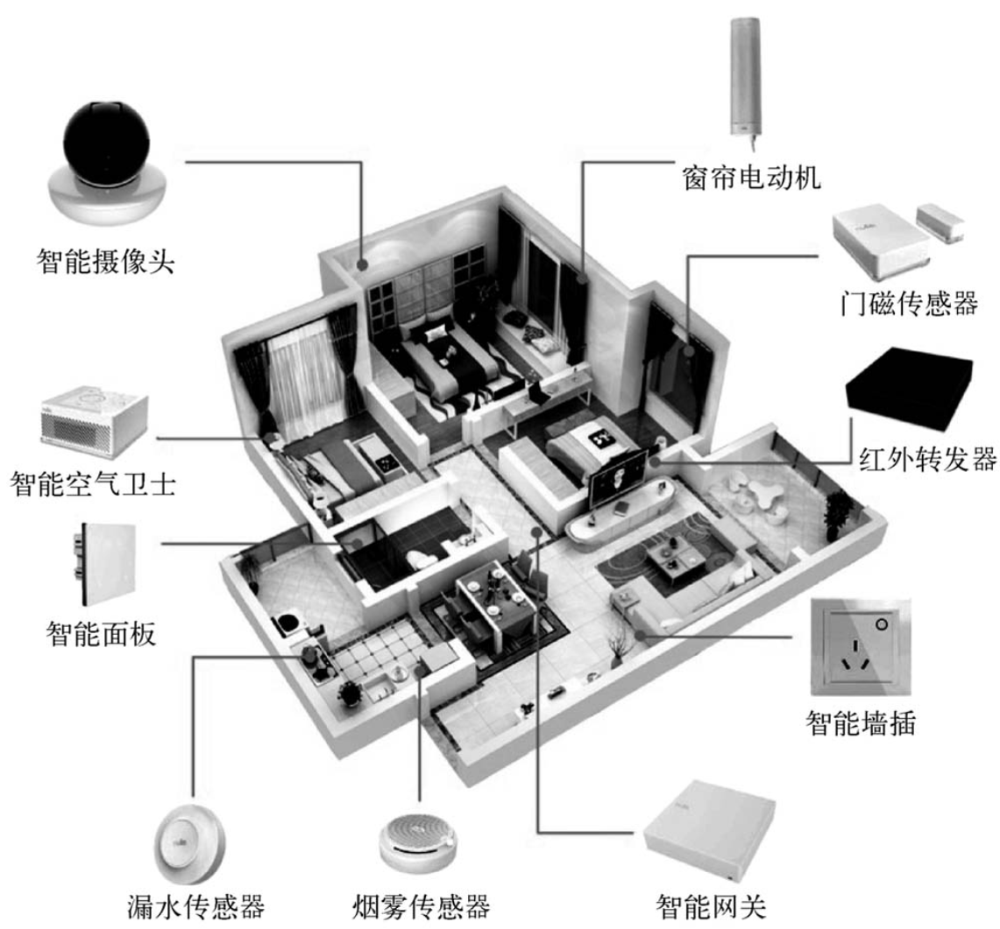
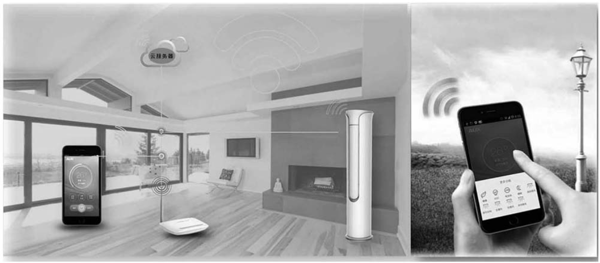
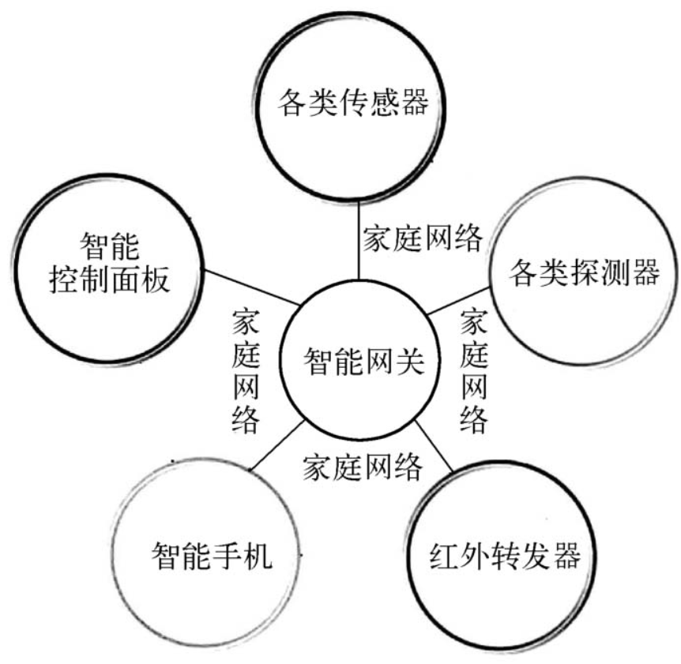
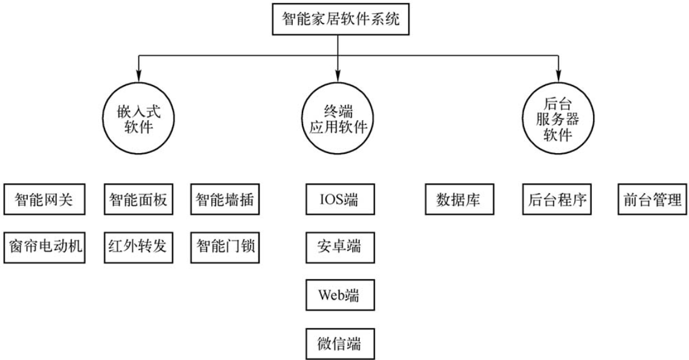
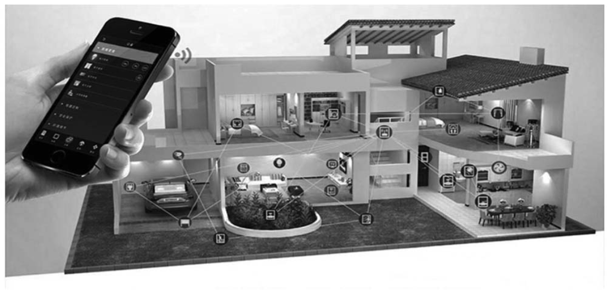

# 1 智能家居概述

## 1.1 智能家居的概念

智能家居是一个以家庭住宅为平台，兼备建筑、网络通信、信息家电、设备自动化，集系统、结构、服务、管理为一体的高效、舒适、安全、便利、环保的居住环境。智能家居通过物联网技术将家中的各种设备（如窗帘、空调、网络家电、音视频设备、照明系统、安防系统、数字影院系统以及三表抄送等）连接到一起，提供家电控制、照明控制、窗帘控制、安防监控、情景模式、远程控制、遥控控制以及可编程定时控制等多种功能和手段。

   

智能家居是一个集成性的系统体系环境，而不是单单一个或一类智能设备的简单组合。智能家居通过先进的计算机技术、网络通信技术、综合布线技术，将与家居生活有关的各种子系统，有机地结合在一起，通过统筹管理，让家居生活更加舒适、安全、有效。与普通家居相比，智能家居不仅具有传统的居住功能，提供舒适安全、高品位且宜人的家庭生活空间，还由原来的被动静止结构转变为具有能动智慧的工具，提供全方位的信息交换功能，实现了人们与家居“对话”的愿望，帮助家庭与外部保持信息交流畅通，优化人们的生活方式，帮助人们有效安排时间，增强家居生活的安全性，节约生活用电、用水等各种能源。

简单地说，智能家居就是通过智能主机将家里的灯光、音箱、电视、空调、电风扇、电水壶、电动门窗、安防监控设备甚至燃气管道等所有声、光、电设备连在一起，并根据用户的生活习惯和实际需求设置成相应的情景模式，无论任何时间、任何地方，都可以通过电话、手机、平板电脑或者个人计算机来操控或者了解家里的一切。如有陌生人进入家中，远在千里之外的手机也会收到家里发出的报警信息。

## 1.2 智能家居与普通家居的区别

智能家居也可以定义为一个过程或者是一个系统，即利用先进的计算机技术、网络通信技术和综合布线技术，将与家居生活有关的各种子系统有机地结合在一起，通过统筹管理，让家居生活更加舒适、安全、有效。

与普通家居相比，智能家居不仅具有传统的居住功能，提供舒适、安全、高品位且宜人的家庭生活空间，而且由原来的被动静止结构转变为具有能动智慧的工具，提供全方位的信息交换功能，帮助家庭与外部保持信息交流畅通，优化人们的生活方式，帮助人们有效地安排时间，增强家居生活的安全性，甚至为各种能源费用节约资金。

传统意义上一般认为智能家居只是带来生活品质的提升，其实物联网型智能家居正在改变这些观点，最显著的变化就是实用、方便、易整合。每一个家庭中都存在着各种电器，不管是号称智能的冰箱、空调，还是传统的电灯、电视，一直以来都是独立工作的，从系统角度来看，它们都是零碎、混乱、无序的，并不是一个有机的可组织的整体，作为家庭面对这些杂乱无章的电器，其消耗的时间成本、管理成本、控制成本通常都是很高的并且是非必要的。

无线物联网技术的出现，给传统的智能电器、智能家居带来了新的产业机会，通过它可以将家中的各种电器通过无线方式非常方便地有机组织起来，形成一个完整的系统，从而实现无缝感知并完整管理。这种以前无法想象并深具挑战性的应用，今天一旦使用无线物联网技术连接，就会变得轻松、方便并且非常有趣。这些应用带来的并不仅仅是生活品质的提高，更大程度上可以看作是现代家庭中最基本的需求。

## 1.3 智能家居的特点

智能家居是人们的一种居住环境，让家庭生活更加安全、节能、智能、便利和舒适。智能家居的特征可归纳为操作方式多样、组网形式任选、设备互联互通、功能不断完善与系统稳定可靠。

### 1.3.1 操作方式多样

智能家居的操作方式有多种多样，如可以用智能触摸屏（嵌墙式、桌面式、手持式等），也可以用情景遥控器或智能音箱，还可以用移动设备，如手机或平板电脑。时间地点任意化，智能家居可在任何时间、任何地点、任何情况下对室内外任何设备均可实现及时、全面的了解和控制。灯光效果个性化，室内的灯光可根据个人需求，设置不同的情景。例如设定一个“起夜灯光”情景，在这个情景中，可以设定卧室壁灯、客厅地灯、卫生间小灯为“开”的状态。情景设好后，在半夜起床时只需按下一个“起夜灯光”情景键，设定的灯便会同时打开。

### 1.3.2 组网形式任选

随着网络化、智能化时代的不断推进，智能家居中的家庭网络形式也呈多样化，供用户选择。家庭网络主要分无线网络与有线网络两种。其中无线网络因采用的技术不同，又分射频技术、Wi-Fi技术、Bluetooth 技术、ZigBee技术与Z-Wave技术等；有线网络也分总线技术与电力线载波技术，总线技术又有KNX总线、LonWorks总线、RS-485总线、CAN总线等。

另外家庭网络始终保持与互联网、物联网、无线宽带网的随时相联，为智能家居控制提供了网络基础与保障。

### 1.3.3 设备互联互通

智能家居中的各种家用电器可通过家庭网络实现互联互通，并可顺延电器的运行时段，避开能源成本高峰期，为用户节省电费。此外，智能家居系统的可监控能耗模式是借助无线通信、计量和控制技术来实现。可以采用的无线通信方式包括 WiFi 或 ZigBee 等。借助 ZigBee 通信，家用电器可通过电表或家庭能源管理系统获取能源价格信号，并发回由控制主机计量电路测得的能源使用情况。

### 1.3.4 功能不断完善

近年来，智能家居市场如火如荼，各类科技巨头纷纷入局，不断推出智能家居新品，智能化也慢慢地渗透到生活的方方面面。在网络化、智能化推动下，人们在居家生活中又提出了新的要求。现在，人们想要的不仅仅是舒适的居家环境，也需要通过科技手段来简化生活，以此来节约更多的时间成本，提高生活品质。具体表现在智能家居的控制主机的软件系统在逐步更新升级，控制功能也在不断完善。除能实现智能灯光控制、电器控制、安防报警、背景音乐、视频共享、门窗控制和远程监控外，还可实现自动浇花扫地、老人小孩防护、宠物喂食、紧急电话求助等。

### 1.3.5 系统稳定可靠

随着智能家居的普及，系统安全性、稳定性和可靠性也引起了人们的高度重视。如百度AIoT安全方案可为智能家居系统供低成本的安全服务，该服务目前已应用在智能电视、智能音箱、智能空调等多个领域。另外，智能家居的控制主机是基于互联网+GSM 移动网双网平台设计，双网设计大大提高了系统的可靠性，即使在某些互联网网速低或不稳定的地方使用也不会影响系统的主要功能。智能家居系统采用ZigBee技术、无线宽带（Wi-Fi）、蓝牙（Bluetooth）、传输控制协议/互联网协议（TCP/IP）等协议进行数据传输，通过无线方式来发送指令。灯光、窗帘、电器控制采用无线方式传输命令，进行集中监视和控制。

## 1.4 智能家居相关技术

智能家居是一个完整的智能化、自动化、网络化的现代家庭，其主要技术包括网络通信技术、安全防范技术、自动控制技术、人工智能技术、物联网技术、环境感知技术和音视频技术。

### 1.4.1 网络通信技术

网络通信技术是指通过计算机、通信网和网络设备对语音、数据、图像等信息进行采集、存储、处理和传输等，使信息资源达到充分共享的技术。

其中通信网按功能与用途不同，一般可分为物理网、业务网和支撑管理网3种。物理网是由用户终端、交换系统、传输系统等通信设备所组成的实体结构，是通信网的物质基础，也称装备网；业务网是疏通电话、电报、传真、数据、图像等各类通信业务的网络，是指通信网的服务功能。按其业务种类，可分为电话网、电报网、数据网等；支撑管理网是为保证业务网正常运行，增强网络功能，提高全网服务质量而形成的网络。在支撑管理网中传递的是相应的控制、监测及信令等信号。按其功能不同，可分为信令网、同步网和管理网。

在异地利用手机对家里的电器设备进行控制就是网络通信技术在智能家居中的应用，如图所示。

   

### 1.4.2 安全防范技术

安全防范技术通常分为3类。

（1）物理技术防范。主要指实体防范技术，如建筑物和实体屏障以及与其匹配的各种实物设施、设备和产品
（如门、窗、柜、锁等）。

（2）电子防范技术。主要是指应用于安全防范的电子、通信、计算机与信息处理及其相关技术，如：电子报警技术、视频监控技术、出入口目标识别与控制技术、计算机网络技术以及其相关的各种软件、系统工程等。

（3）生物统计学防范技术。主要是法庭科学的物证鉴定技术和安全防范技术中的模式识别相结合的产物，是利用人体的生物学特征进行安全技术防范的一种特殊技术门类，应用较广的有指纹、掌纹、眼纹、声纹等识别控制技术。

### 1.4.3 自动控制技术

自动控制技术是20世纪发展最快、影响最大的技术之一，也是21世纪最重要的高新技术之一。当前各项新技术、工农业生产、军事、日常生活等各个领域，都离不开自动控制技术。就定义而言，自动控制技术是控制论的技术实现应用，是通过具有一定控制功能的自动控制系统，来完成某种控制任务，保证某个过程按照预想进行，或者实现某个预设的目标。

从控制的方式看，自动控制系统有闭环和开环两种。

（1）闭环控制。闭环控制也就是反馈控制，系统组成包括传感器、控制装置和执行机构。如智能家居中的门窗控制、安防报警等。

（2）开环控制。开环控制也叫程序控制，这是按照事先确定好的程序，依次发出信号去控制对象。如智能家居中的灯光控制、电器控制、情景控制等。有关智能家居中的控制方式请参看本章1.7节内容。

### 1.4.4 物联网技术

物联网是一种复杂、多样的系统技术，它将“感知、传输、应用”3项技术结合在一起，是一种全新的信息获取和处理技术。因此，从物联网技术体系结构角度解读物联网，可以将支持物联网的技术分为4个层次：感知技术、传输技术、支撑技术、应用技术。

1. 感知技术

   感知技术是指能够用于物联网底层感知信息的技术，它包括射频识别（RFID）技术、传感器技术、无线传感器网络技术、遥感技术、GPS定位技术、多媒体信息采集与处理技术及二维码技术等。

2. 传输技术

   传输技术是指能够汇聚感知数据，并实现物联网数据传输的技术，它包括互联网技术、地面无线传输技术、卫星通信技术以及短距离无线通信技术等。

3. 支撑技术

   支撑技术是物联网应用层的分支，它是指用于物联网数据处理和利用的技术，包括云计算技术、嵌入式技术、人工智能技术、数据库与数据挖掘技术、分布式并行计算和多媒体与虚拟现实等。

4. 应用技术

   应用技术是指用于直接支持物联网应用系统运行的技术，应用层主要是根据行业特点，借助互联网技术手段，开发各类行业应用解决方案，将物联网的优势与行业的生产经营、信息化管理、组织调度结合起来，形成各类物联网解决方案，构建智能化的行业应用。它包括物联网信息共享交互平台技术、物联网数据存储技术以及各种行业物联网应用系统。各种网络技术提供了人们在虚拟环境中的活动情况等数据，搭建了一个互相交流的平台，为大家提供更好的服务，实现管理标准化。

### 1.4.5 环境感知技术

环境感知技术类似于物联网的感知技术，与传感器技术密不可分，主要应用在居住环境与智能家用电器或物体的监测。在智能家居系统中，传感器将感知到的物理量、化学量或者生物量等转化成能够处理的数字信号。有时需要将传感器嵌入到被控制的家用电器中，这样就可以将传感器、信号处理、控制电路、通信接口和电源等部件组成一体化的微型系统，大幅度提高智能家居系统的自动化、智能化和可靠性水平。

在智能家居的系统控制中，环境感知技术还与无线网络技术等相结合，将感知信息处理后再与无线通信技术等结合到一体，形成智能可靠的无线传感器节点。无线传感器节点配备有满足不同应用需求的传感器，如温度传感器、湿度传感器、光照度传感器、红外线感应器、位移传感器、压力传感器等。传感器节点由传感单元、处理单元、无线收发单元和电源单元等几部分组成。

传感单元由传感器和A-D转换模块组成，用于感知、获取监测区域内的信息，并将其转换为数字信号；处理单元由嵌入式系统构成，包括处理器、存储器等，负责控制和协调节点各部分的工作，存储和处理自身采集的数据以及其他节点发来的数据；无线收发单元由无线通信模块组成，负责与其他传感器节点进行通信，交换控制信息和收发采集数据；电源单元能够为传感器节点提供正常工作所必需的能源，通常采用微型电池。

在智能家居的环境感知中，还涉及对物体或人的感知、自动识别与定位。自动识别技术指使用一定的识别装置（如摄像头、指纹识别器等），通过被识别物品和识别装置之间的接近活动，自动地获取被识别物品的相关信息，并提供给后台的计算机处理系统来完成相关后续处理的一种技术。识别技术可以区分被识别的物体（或人），有时还需要定位物体的位置、物体移动的情况等，用以实现更加准确的环境感知。目前智能家居中采用的识别技术有图像识别技术、射频识别技术、GP S定位技术、红外感应技术、声音识别技术、动作识别技术（姿态、手势等）、生物特征识别技术（指纹、虹膜等）等。

### 1.4.6 人工智能技术

人工智能（Artificial Intelligence，AI）是研究、开发用于模拟、延伸和扩展人的智能的理论、方法、技术及应用系统的一门新的技术科学。有关人工智能技术的详细介绍请参看第7章。

### 1.4.7 音视频技术

音视频技术是研究音频信号和视频信号的产生、收集、处理、传输和存储的技术，是传统音箱技术与现代数字声像技术相结合的一门实用技术。智能家居中的背景音乐、家庭影院就是音视频技术的具体应用。

智能家居技术涉及面较广，其目的是通过应用这些技术，真正让人享受轻松、自由、安全的智能生活。今后可靠的无线控制技术将会成为未来智能家居技术的主流，而触摸式、声控式、感应式等更多人性化的控制技术也会得到发展。

## 1.5 智能家居通信与组网技术

智能家居的通信技术负责智能家居之间各种传感器信息、控制指令的传输与交互，也就是把智能家居的各类硬件通过网络连接起来，形成一个互联互通的家庭网络系统。通过这个网络，可以实现智能家居系统中各类信息的传输，进而根据智能家居的应用要求，实现对智能家居的控制。智能家居涉及的通信及组网技术主要分为有线和无线两种方式。有线通信技术包括总线技术和电力载波技术，目前无线通信及组网协议种类较多，且由于智能家居的标准未定，各类新的协议也在不断出现，各种协议并存使用的现象预计会长期存在。

### 1.5.1 总线技术

总线技术是指将所有设备的通信与控制都集中在一条总线上，是一种全分布式智能控制网络技术，其产品模块具有双向通信能力，以及互操作性和互换性，其控制部件都可以编程。典型的总线技术采用双绞线总线结构，各网络节点可以从总线上获得供电（DC 24V），亦通过同一总线实现节点间无极性、无拓扑逻辑限制的互联和通信，信号传输速率和系统容量则分别为10kbit/s和4GB。

总线型技术比较适合于楼宇和小区智能化等大区域范围的控制，现开始部分应用于别墅智能化，但一般设置安装比较复杂，造价较高，工期较长，只适用新装修用户。

在智能家居中采用双绞线为控制总线，以此通信介质的主要有KNX总线、Lon Works总线、RS-485总线、CAN总线等。就总线本身而言，这几种总线的拓扑结构基本是相同的，如图1-12所示，不同的只是通信协议和接口。

1. RS-485总线

   在要求通信距离为几十米到上千米时，广泛采用RS-485串行总线标准。RS-485采用平衡发送和差分接收，因此具有抑制共模干扰的能力。加上总线收发器具有高灵敏度，能检测低至200mV的电压，故传输信号能在千米以外得到恢复。

   RS-485采用半双工工作方式，任何时候只能有一点处于发送状态，因此，发送电路须由使能信号加以控制。RS-485用于多点互联时非常方便，可以省掉许多信号线。使用标准RS-485收发器时，单条通道的最大节点数为32个，传输距离较近（约1.2km），传输速率低（300～9600bit/s）；传输可靠性较差，对于单个节点，电路成本较低，设计容易，实现方便，维护费用较低。

   RS-485总线布线的规范如下。
   
   （1）RS-485信号线不可以和电源线一同走线。
   
   （2）RS-485信号线可以使用屏蔽线作为布线，也可以使用非屏蔽线作为布线，一般可选择普通的超五类屏蔽双绞线即网线作为信号线。
   
   （3）RS-485布线时必须要手牵手的布线，但是可以借助RS-485集线器和RS-485中继器可以任意布设成星形接线与树形接线。
   
   （4）RS-485总线必须要接地。

2. CAN 总线

   CAN总线是一种支持分布式控制和实时控制的对等式现场总线网络。其网络特性使用差分电压传输方式，总线节点数有限，使用标准CAN收发器时，单条通道的最大节点数为110个，传输速率范围是5kbit/s～1Mbit/s，传输介质可以是双绞线和光纤等，任意两个节点之间的传输距离可达10km。对于单个节点，电路成本高于RS-485，设计时需要一定的技术基础。传输可靠性较高，界定故障节点十分方便，维护费用较低。在目前已有的几种现场总线方式中，具有较高的性价比。

   采用总线技术的智能家居产品有Control4总线灯光系统。Control4总线系统是由基于以太网的控制模块、RS-485的总线场景面板、RS-485网关等设备共同组成的新型总线系统。各模块通过网络与主机进行通讯，使用电视界面、触控屏以及移动装置来控制，由调光器、继电器、以太网模块、导轨板等组成一个完整的系统。总线控制模块既可配合总线场景面板，也可配合无线场景面板及无线产品使用，利用Composor完成系统设计可实现多项功能，还可以通过有线按键来控制灯光、音乐、窗帘、安防等，可应用于家庭及商业等多种场合。

### 1.5.2 无线组网技术

无线智能家居网络是指在家庭内部将各种电气设备和电气子系统通过无线电连接起来，采用统一的通信协议，对内实现资源共享，对外通过网关与外部网互联进行信息交换的无线局域网。

无线组网技术是智能家居未来的发展趋势，因为它去掉了烦琐的布线。无线组网技术主要包括 ZigBee、Bluetooth、WiFi、Z-Wave、6LoWPAN等几种无线技术。

1. ZigBee技术

   ZigBee技术是一种近距离、低功耗、低速率、低成本的双向无线通信技术。主要用于距离短、功耗低且传输速率不高的各种电子设备之间进行数据传输以及典型的有周期性数据、间歇性数据和低反应时间数据传输的应用。因此非常适用于智能家居的无线控制指令传输。

   ZigBee采用自组网的方式进行通信，也是无线传感器网领域最为著名的无线通信协议之一。在无线传感器网络中，当某个传感器的信息从某条通信路径无法顺畅地传递出去时，动态路由器会迅速的找出另外一条近距离的信道传输数据，从而保证了信息的可靠传递。

   ZigBee技术的特点如下。

   （1）功耗低。ZigBee网络模块设备工作周期较短、传输数据量很小，且使用了休眠模式（当不需接收数据时处于休眠状态，当需要接收数据时由“协调器”唤醒它们）。因此，ZigBee模块非常省电，2节5号干电池可支持1个模块工作6～24个月，甚至更长。这是ZigBee的突出优势，特别适用于无线传感器网络。

   （2）成本低。由于ZigBee协议栈设计非常简单（不到蓝牙的1/10），所以降低了对通信控制器的要求。普通网络模块硬件只需8位微处理器，4～32KB的ROM，且软件实现也很简单。ZigBee协议是免专利费的，每块芯片的价格低于1美元。

   （3）可靠性高。ZigBee采用了CSMA/CA碰撞避免机制，同时为需要固定带宽的通信业务预留了专用时隙，避免了发送数据时的竞争和冲突。MAC层采用了完全确认的数据传输机制，每个发送的数据包都必须等待接收方的确认信息，所以从根本上保证了数据传输的可靠性，如果传输过程中出现问题可以进行重发。

   （4）延时短。ZigBee技术与蓝牙技术的延时相比，其各项指标值都非常小。通信延时和从休眠状态激活的延时都非常短，典型的搜索设备延时30ms，而蓝牙为3～10s。休眠激活延时为15ms，活动设备信道接入延时为15ms。因此ZigBee技术适用于对延时要求苛刻的无线控制（如工业控制场合等）应用。

   （5）数据传输速率低。ZigBee工作在20～250kbit/s的较低速率，它分别提供20kbit/s（868MHz）、40kbit/s（915MHz）与250kbit/s（2.4GHz）的原始数据吞吐率，满足低速率传输数据的应用需求。

   （6）网络容量大。相比于蓝牙网络只支持7个从设备的连接，一个星型结构的ZigBee网络最多可以容纳一个主设备和254个从设备，一个区域内最多可以同时存在100个ZigBee网络，这样，最多可组成65000个模块的大网，网络容量大，组网灵活。

   （7）安全性好。ZigBee提供了三级安全模式。第一级实际上是无安全方式，对于某种应用，如果安全并不重要或者上层已经提供足够的安全保护，器件就可以选择这种方式来转移数据；对于第二级安全级别，器件可以使用接入控制清单（ACL）来防止非法器件获取数据，在这一级不采取加密措施；第三级安全级别在数据转移中采用属于高级加密标准（AES）的对称密码，AES可以用来保护数据净荷和防止攻击者冒充合法器件，以灵活地确定其安全性。

   （8）有效范围小。ZigBee有效覆盖范围为10～75m，具体依据实际发射功率的大小和各种不同的应用模式而定，基本上能够覆盖普通的家庭或办公室环境。

   （9）兼容性好。ZigBee技术与现有的控制网络标准无缝集成。通过网络协调器自动建立网络，采用载波侦听/冲突检测（CSMACA）方式进行信道接入。为了可靠传递，还提供全握手协议。

3. Bluetooth 技术

   蓝牙（Bluetooth）是一种短距离无线通信技术规范，它将计算机技术与通信技术更紧密地结合在一起，使得现代一些轻易携带的移动通信设备和计算机，不必借助电缆就能联网，随时随地进行信息的交换与传输。除此之外，蓝牙技术还可为数字网络和外设提供通用接口，以组建远离固定网络的个人特别连接设备群。蓝牙技术主要面向网络中各类数据及语音设备（如个人计算机、拨号网络、笔记本电脑、打印机、数字式照相机、移动电话和高品质耳机等），通过无线方式将它们联成一个微微网，多个微微网之间也可以互联形成分布式网络，从而方便、快速地实现各类设备之间的通信。它是实现语音和数据无线传输的开放性规范，是一种低成本、短距离的无线连接技术。

   蓝牙技术具有以下特点。

   （1）低成本，全球范围适用。蓝牙技术使用的是2.4GHz的ISM频段。现有的蓝牙标准定义的工作频段为2.402～2.480GHz，这是一个无须向专门管理部门申请频率使用权的频段。

   （2）便于使用。蓝牙技术的程序写在一个不超过1cm2的微芯片中，并采用微微网与散射网络结构及快调频和短包技术。与其他工作在相同频段的系统相比，蓝牙跳频更快，数据包更短，这使蓝牙技术比其他系统都更稳定。

   （3）安全性高和抗干扰能力强。蓝牙无线收发器采用扩展频谱跳频技术。把2.402～2.480GHz以1MHz划分为79个频点，根据主单元调频序列，采用每秒1600次快速调频。跳频是扩展频谱常用的方法之一，在一次传输过程中，信号从一个频率跳到另一个频率发送，而频率点的排列顺序是伪随机的，这样蓝牙传输不会长时间保持在一个频率上，也就不会受到该频率信号的干扰。

   （4）低功耗。蓝牙设备在通信连接状态下，有4种工作模式：激活模式、呼吸模式、保持模式和休眠模式。激活模式是正常的工作状态，另外3种模式是为了节能所规定的低功耗模式。呼吸模式下的从设备周期性地被激活：保持模式下的从设备停止监听来自主设备的数据分组，但保持其激活成员地址：休眠模式下的主从设备仍保持同步，但从设备不需要保留其激活成员地址。这3种节能模式中，呼吸模式的功耗最高，但对于主设备的响应最快，休眠模式的功耗最低，对于主设备的响应最慢。

   （5）开放的接口标准。蓝牙特别兴趣小组（SIG）为了推广蓝牙技术的使用，将蓝牙的技术标准全部公开，全世界范围内的任何单位和个人都可以进行蓝牙产品的开发，只要最终通过SIG的蓝牙产品兼容性测试，就可以推向市场。这样一来，SIG就可以通过提供技术服务和出售芯片等业务获利，同时大量的蓝牙应用程序也可以得到大规模推广。

   （6）全双工通信和可靠性高。蓝牙技术是采用时分双工通信，实现了全双工通信。采用FSK调制，CRC、FEC和ARQ，保证了通信的可靠性。

   （7）网络特性好。由于蓝牙支持点对点及一对多的通信，利用蓝牙设备也可方便地组成简单的网络（微微网）。

4. WiFi 技术

   WiFi是无线保真（Wireless Fidelity）的缩写，俗称无线宽带。是无线局域网（WLAN）中的一个标准（IEEE 802.11b）。随着技术的发展，以及IEEE802.11a及IEEE 802.11g等标准的出现，现在IEEE802.11这个标准已被统称为WiFi。

   WiFi技术与蓝牙技术一样，同属于在办公室和家庭中使用的短距离无线通信技术。使用的使2.4GHz附近的频段，该频段是无须申请的ISM无线频段。同蓝牙技术相比，它具备更高的传输速率，更远的传播距离，已经广泛应用于笔记本电脑、智能手机、汽车等领域中。

   WiFi是以太网的一种无线扩展，理论上只要用户位于一个接入点四周的一定区域内，就能以最高约11Mbit/s的速率接入全球广域网（Web）。但实际上，如果有多个用户同时通过一个点接入，带宽被多个用户分享，WiFi的连接速度一般将只有几百kbit/s的信号不受墙壁阻隔，在建筑物内的有效传输距离小于户外。

   WiFi 技术具有以下特点。

   （1）无线电波的覆盖范围广。WiFi的半径可达100m，甚至可以覆盖整栋大楼。

   （2）WiFi的传输速率很快。最高可达54Mbit/s，符合个人和社会信息化的需求。在网络覆盖范围内，允许用户在任何时间、任何地点访问网络，随时随地享受诸如网上证券、视频点播（VOD）、远程教育、远程医疗、视频会议、网络游戏等一系列宽带信息增值服务，并实现移动办公。

   （3）无须布线。可以不受现实地理条件的限制，因此非常适合移动办公用户的需要。只要在需要的地方安装无线路由器，并通过高速线路将因特网接入。这样，在无线路由器所发射出的电波的覆盖范围内，用户只要将支持无线局域网的笔记本电脑或平板电脑拿到该区域内，即可高速接入因特网。

   （4）健康安全。IEEE 802.11规定的发射功率不可超过100mW，实际发射功率为60～70mW，而手机的发射功率为200mW～1W，手持式对讲机高达5W。与后者相比，WiFi产品的辐射更小。

5. Z-Wave 技术

   Z-Wave 是一种新兴的基于射频的、低成本、低功耗、高可靠、适于网络的短距离无线通信技术。工作频带为868.42（欧洲）～908.42MHz（美国），采用FSK（BFSK/GFSK）调制方式，数据传输速率为9.6kbit/s，信号的有效覆盖范围在室内是30m，室外可超过100m，适合于窄带宽应用场合。随着通信距离的增大，设备的复杂度、功耗以及系统成本都在增加，相对于现有的各种无线通信技术，Z-Wave技术专门针对窄带宽应用并采用创新的软件解决方案取代成本高的硬件，因此只需花费其他类似技术的一小部分成本就可以组建高质量的无线网络，Z-Wave技术将是最低功耗和最低成本的技术之一，有力地推动着低速率无线个人区域网的发展。

## 1.6 智能家居系统的组成

### 1.6.1 智能家居主要功能

智能家居系统的组成大致可分为硬件设备和软件系统。如果从主要功能上进行划分，智能家居主要包括控制管理、照明控制、家庭安防、环境监控、健康监控、能源管控、自动管家等方面功能。

1. 控制管理

   控制管理是智能家居的控制中心，它接收各种控制方式的信息，如本地控制、遥控控制、情景控制、手机远程控制、触摸感应控制、定时控制等，并将各种控制信息经过处理，发出相对应的指令，对智能家居的设备进行操作控制，完成某种特定功能，如家电控制、灯光控制、窗帘控制、环境（温湿度）控制、节能控制、娱乐控制、安防控制、健康监控、车辆控制和园林灌溉控制等。

2. 照明控制

   智能照明控制是指用多种智能控制方式实现对住宅内所有灯具的开启关闭、亮度调节、全开、全关以及组合控制的形式，实现“回家、离开、会客、用餐、影院”等多种灯光情景效果，从而达到智能照明的节能、环保、舒适、方便的功能。如“会客情景”可设为吊灯亮80%、壁灯亮60%、筒灯亮80%；“影院情景”可设为吊灯亮20%、壁灯亮40%、筒灯亮10%等。系统还具有软启功能，能使灯光渐亮渐暗，给人营造一种温馨、浪漫、幽雅的灯光环境。

3. 家庭安防

   家庭安防是智能家居的重要组成部分，可靠而智能的安防控制能够确保智能家居用户的生命财产安全，及时发现安全隐患并能够及时进行自动处理。安防控制主要实现家庭防盗、防火、煤气泄漏监测与报警、用电安全、用水安全、家电安全、车辆安全等，并能够提供自动报警及自动处理、紧急求助等。家庭安防涉及的传感器包括门磁感应器、红外感应器、玻璃破碎探测器、吸顶式热感探测器、煤气泄漏探测器、烟感探测器、监控摄像头等。将家庭安防控制与智能社区相连接，可以实现更强功能的安防控制。

4. 环境监控

   环境监控主要为居住人员提供一个安全、健康、舒适的生活环境。一般而言，主要对家居中的环境情况，如室内温度、空气湿度、有害气体含量（二氧化碳浓度、甲醛浓度、烟雾、PM2.5、粉尘颗粒浓度等）等情况进行实时监测，并能针对实时监测的情况对环境进行调节，如通过相应的家电设备（换气扇、空气净化器等）的开启与关闭，自动适应居住者的需求。

5. 健康监控

   健康监控主要通过智能穿戴设备（智能手表、智能手环等）、智能马桶（尿液监测）、智能呼吸监测仪、体重计、智能健身器材、智能电冰箱、油烟机等对人的睡眠、饮食、活动、生活习惯、身体体征等进行实时记录、统计和分析，对不健康的生活方式提出预警，对健康的生活方式提供指导。除此之外，健康监测还可以结合其他传感器设备，对老人、病人、小孩等实施健康监测和看护。如果将健康监控与远程医疗看护相连接，在家里使用智能综合测试仪将家人的体温、脉搏、血压、血糖、血氧浓度、心电图、体重等信息定期上传，那么可通过专业医生的反馈指导保证健康的生活。

6. 能源管控

   家庭能源管控是家用电器智能控制的升级。社会经济的快速发展致使人们对电力的需求日益增加，如何节约用电、科学用电、管理用电，有效地控制家庭能耗是智能家居需要研究的课题。如在家庭用电上，可以监测能耗。用电高峰期时，可以有选择性地使用家用电器，优先使用功率较小的家用电器。同样，可以检测何时电费较低，这时可以集中使用家用电器，节约电费。与此同时，家里的用电情况可以随时观测，也可以远程通过计算机、智能手机、平板电脑等进行实时监控。

7. 自动管家

   自动管家是利用人工智能技术和互联网技术以及各类智能硬件（如智能机器人、各种自动智能家电等），协助主人管理整个家庭，如自动清理卫生、自动灌溉草坪、协助安排与提醒各类工作、生活计划的实施、自动叫醒服务等。随着人工智能的发展，自动管家将使得智能家居更加智慧化。

### 1.6.2 智能家居硬件组成

智能家居的硬件部分主要由控制主机（又称智能网关）、传感器、智能控制面板、智能手机及家庭网络等组成，如图所示。

   

1. 控制主机

   控制主机也称智能网关，它是智能家居主要硬件之一，是家庭网络和外界网络沟通的桥梁，是通向互联网的大门。在智能家居中由于使用了不同的通信协议、数据格式或语言，控制主机就是一个翻译器。控制主机对收到的信息要重新打包，以适应不同网络传输的需求。同时，控制主机还可以提供过滤和安全功能。

   控制主机除具有传统路由器的功能外，还具备无线转发、无线接收功能，就是能把外部所有的通信信号转化成无线信号，从而在家里任何一个角落可以接收，同时在家里操作遥控设备或者无线开关时，它能接收到信号，进而控制其他终端设备。

   也可以说控制主机就是智能家居的“指挥部”，所有的输入设备通过室外互联网、GSM网、室内无线网接入到这个控制主机，所有的输出设备的操作都由它通过室内无线网发出指令，完成灯光控制、电器控制、场景设置、安防监控、物业管理等操作，或通过室外互联网、GSM网向远端用户手机或计算机发出家里的安防信息。

2. 传感器

   传感器的作用就像一个人的眼睛（人体红外感应器），鼻子（燃气报警器、烟雾报警器），耳朵（门磁、震动感应器），它能将“看到、闻到、听到”的信息转换为电信号送到控制主机。智能家居一般均安装了温/湿度一体化传感器、可燃气体传感器、烟雾传感器、人体红外传感器、无线门磁传感器、无线幕帘传感器、玻璃破碎传感器等。各种传感器的作用与技术参数将在后面章节中介绍。

3. 智能控制面板

   智能控制面板包括开关面板与插座面板等，如智能灯光面板的主要作用是实现智能灯光的开关控制和亮度调节。它同普通开关一样，用手触摸一下，就能控制灯具的开或关，另一方面可接收控制主机发的指令进行智能灯光控制。

   插座面板在智能家居中可通过计算机/手机客户端、无线电遥控器实现对电器用电负载（如电热水器、电饭煲等）的通断控制，或通过智能主机实现远程控制。还可定时开关电器电源，起到便捷、节能、防用电火灾的作用。

4. 家庭网络

   家庭网络是在家庭范围内（可扩展至邻居，小区）将计算机、电话、家用电器、安防控制系统、照明控制和广域网相连接的一种新技术。家庭网络是一个多子网结构的分别采用不同底层协议的混合网络，与局域网和广域网相比，在系统构成、网络协议及用户群体方面都具有自己的特点，未来的家庭网络实现必须提供完整的系统集成方案、高度的互操作性和灵活易用的网络接口。

   当前在家庭网络所采用的连接技术可以分为“有线”和“无线”两大类。有线方案主要包括：双绞线或同轴电缆连接、电话线连接、电力线连接等；无线方案主要包括：红外线连接、无线电连接、基于RF技术的连接和基于个人计算机的无线连接等。

   在当今信息化时代，家庭网络也必须是与互联网、物联网相连的，因此这样的家庭不仅是网络家庭，更是互联网家庭和物联网家庭。

   智能家居中的控制主机就是通过“有线”或“无线”的家庭网络与外部的互联网、物联网、宽带无线网、有线电视网相连，同时与室内需要控制的设备也是通过“有线”或“无线”的家庭网络相连。

   智能家居系统的家庭网络主要有3种组网方式。

   （1）集中布线技术。也就要布设有线网控制网，即布设弱电控制线来发送控制信号以及接收被控设备的反馈信号，以达到对家电或灯光进行控制的目的。主要应用于楼宇智能化控制，如可视对讲、门禁指纹等。因为是以独立、有线的方式进行信号的收发，所以信号最稳定，比较适合于新建楼宇和别墅智能化，但一般布线比较复杂，造价较高，工期较长，而其只适用新装修用户。

   （2）电力载波传输技术。电力载波传输技术的详细介绍参看前面1.5.2的内容。

   （3）无线网络技术。无线网络技术的详细介绍参看前面1.5.3的内容。

5. 智能手机

   智能手机是在掌上电脑的基础上演变而来的。最早的掌上电脑并不具备手机通话功能，但是随着用户对于掌上电脑的个人信息处理方面功能的依赖的提升，又不习惯于随时都携带手机和掌上电脑两个设备，所以厂商将掌上电脑的系统移植到了手机中，于是才出现了智能手机这个概念。

   智能手机具有独立的操作系统，独立的运行空间，可以由用户自行安装软件、游戏、导航等第三方服务商提供的程序，并可以通过移动通信网络来实现无线网络接入。简而言之智能手机就是一台可以随意安装和卸载应用软件的手机。

   在智能家居系统中先下载厂家的应用软件，将智能手机与控制主机（或称智能网关）绑定，这样智能手机便可控制智能家居中的所有设备。

### 1.6.3 智能家居软件构成

智能家居的软件系统是智能家居实现智能的根本所在，正如一部智能手机，如果没有软件存在，只是一堆堆砌的电子器件而已。智能家居的软件贯穿于智能家居硬件的底层，按软件所在的位置不同，一般分为3部分。一个是智能家居硬件设备上的嵌入式软件，比如智能网关，智能面板，各种传感器等，一般用C语言在Keil中编写实现；另一个是后台服务器上的软件，一般用Java/PHP开发，连接后台MySQL数据库；还有一个是智能手机端的应用软件，因智能手机分安卓和苹果不同的操作系统，需要分别开发对应的应用软件。智能家居软件的构成示意图如图所示。

   

由于智能家居系统正逐步朝着网络化、信息化、智能化、一体化的方向发展，智能家居不再是一个独立的封闭系统。通过智能网关、智能家居操作系统，或者其他智能网络硬件，智能家居可接入互联网，从而获得更强大的功能。比如借助互联网，智能家居可以接入智能小区，甚至智慧城市中去，为智慧城市的最终实现奠定坚实的基础。

特别值得说明的是，由于云计算、大数据和人工智能的发展，智能家居作为物联网的一种具体应用，正在收获这些技术所结的硕果，为智能家居安上一颗更加“智慧的大脑”，实现各种新的软件和信息服务。智能家居不仅能让人们获取数量更多、质量更高的服务体验，最为重要的在于，也许在未来，智能家居能够实现真正的“智能”。

## 1.7 智能家居的控制方式

智能家居在控制方式上有本地控制、远程网络控制、语音控制和一键情景控制 4 种方式。

### 1.7.1 本地控制

本地控制是指在家里通过智能开关、无线遥控器、控制屏、平板电脑及家用电器本身的操作按钮等，对家电及灯具进行的各种操作。

（1）智能开关控制。智能开关控制是指利用前面介绍的智能面板、智能插座对家庭照明的灯具或家用电器进行控制，与传统方式不同的是，可以在家中的多个地点、用多种手段对家电进行控制，包括用一个按键或一个动作同时对多个家电进行控制，即场景控制。

（2）无线电遥控器控制。无线电遥控器控制是指利用前面介绍的无线电遥控器对家庭照明的灯具或家用电器进行简单情景模式控制或对家用电器与灯光进行组合关控制。

无线电遥控器控制还可与红外转发器及控制主机配合，将家中原有的各种红外遥控器的功能学到红外转发器中，并存储在转发器内。这样才能将控制主机发出的无线电信号转换为红外线遥控信号，用一只无线电遥控器去控制室内所有的空调、电视机、DVD影碟机、功率放大器、音箱、有线数字电视机顶盒等红外线遥控产品。

（3）主机控制。主机控制是指智能家居系统的各种控制均由控制主机完成。控制主机是本地控制与远程网络控制的关键设备，它通过室外的互联网、GSM网和室内无线网，对输入的信号进行分析处理后，形成新的输出信号（各种操作指令），再通过室内无线网发出，完成灯光控制、电器控制、场景设置、安防监控、物业管理等操作，在紧急情况下可通过室外互联网、GSM网向远端用户手机或计算机发出家里的安防信息。控制主机相当于智能家居的“指挥部”，所有的控制操作都由它指挥，这种控制方式被称为主机控制。

（4）计算机或平板电脑控制。计算机或平板电脑控制是指利用计算机或平板电脑下载安装控制主机生产厂家提供的专用软件后，再用计算机或平板电脑和控制主机配合，完成所有操作功能。这种控制方式需要通过登录智能控制主机软件才能实现，不同厂家生产的控制主机，其控制软件均不相同。

### 1.7.2 远程网络控制

远程网络控制一般是指在远离住宅的地方，通过电话机、智能手机及外部网络对家电、灯具与门窗等进行的控制操作，如图所示。

   

用智能手机与平板电脑控制智能家居的方式类似，也是先要下载安装控制主机生产厂家提供的专用软件。

### 1.7.3 语音控制

近几年来，语音识别，人工智能应用等高新技术获得很大的突破，得以引入到智能家居行业，为智能家居系统提供了新的控制入口，智能语音控制系统也逐渐走入了人们的视野。

语音识别技术就是让机器通过识别和理解的过程，把语音信号转变为相应的文本或命令。在获得正确的控制命令后，通过服务器和网关将这些命令传达给相应的智能家居产品去执行，这样我们就可以实现对家庭内部设备进行语音控制了。

放眼全球，智能化的语音产品已经多不胜数，国内外大厂都纷纷推出了智能音箱，足以体现出对语音产业的重视，语音识别和智能家居的结合是大势所趋，业内普遍认为语音作为人类信息最自然、最便捷的交互方式，必将成为未来智能家居设备中的重要组成部分。

### 1.7.4 一键情景控制

一键情景控制是指将家中灯光、窗帘、空调和其他家用电器的若干个设备任意组合，形成一个自定义的情景模式，然后按下任一情景模式键，便可按预先设定的情景模式开启灯光、窗帘、空调或其他家用电器。

如用户可以对家中的智能灯光、智能窗帘、智能插座、背景音乐系统等产品进行提前设置，在早上7点钟，唤醒用户起床的就是背景音乐的歌声，伴随着歌声智能窗帘自动打开，通过智能插座，电饭煲或者面包机自动工作，用户在起床洗漱的同时，早餐也准备好了，这样不耽误用户的上班时间，也让用户生活更加方便。

用户早餐之后，离家上班，通过手机App的离家模式，可以实现家中电器一键关闭的功能。这时候窗帘自动关闭、所有电器切断电源，智能安防系统进入布防状态。用户离家的时候无须担心家中的安全，通过提前对智能安防系统的设置，在家中无人的时候，智能安防系统开始工作，家中的一切信息都会通过手机App通知消费者，有效保护家庭安全。
