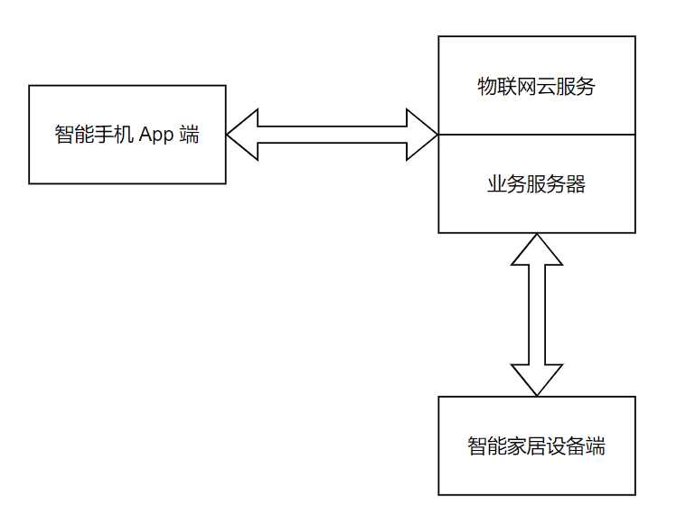

# 物联网项目开发介绍

通过前面两章的介绍，对物联网和智能家居已经有初步的认识。那么如何来开发一个全新的物联网项目呢？之后的章节，将继续介绍如何开发一个物联网项目，并以智能照明应用为例。

在前面的智能家居概述中介绍到，一个完整的智能家居项目的组成部分。这里我们从开发的角度再进行一个分类：

1. 物联网云服务端，为了简化，将物联网云服务和业务服务器看作一个整体
2. 智能手机 App 端
3. 智能物联网设备端

   

图 1-1 智能家居组成部分
  

## 1 物联网云服务

物联网云服务（又称：物联网云平台）端是一个集成了设备管理、数据安全通信和消息管理等功能的一体化平台。根据面向群体和是否开发，物联网云服务可分为公有物联网云服务和私有物联网云服务。

公有物联网云服务，通常指第三方物联网云服务提供商为用户提供的能够使用的物联网云服务，公有物联网云服务一般可通过 Internet 使用，可能是免费或成本低廉的，这种公有物联网云服务可在整个开放的公有网络中提供服务。所有硬件、软件和其他支持性基础结构均为物联网云服务提供商所拥有和管理。这类第三方物联网云服务有：ESP Rainmaker、AWS IOT、Google IOT 等。公有物联网云服务作为一个支撑平台，能够整合上游的服务（如增值业务，广告）提供者和下游最终用户，打造新的价值链和生态系统。

对比，私有物联网云服务是为了一个客户（或企业）单独使用而构建的，因而提供对数据、安全性和服务质量的最有效控制。服务和基础结构始终由客户单独进行维护，硬件和软件专供这个客户使用。客户可以定义云服务的功能以满足业务需求。目前，部分智能家居厂商已经拥有私有物联网云服务，并基于私有物联网云服务开发智能家居应用。公有物联网云服务和私有物联网云服务各有优势，在这里不做详细介绍。

物联网云服务作为智能家居中的中枢，能够连接海量物联网设备，采集物联网设备数据到物联网云服务并处理；也能向业务服务器提供物联网云服务 API，业务服务端可通过调用物联网云服务 API 将智能家居控制指令发送至物联网设备端，实现远程控制。

使用物联网云服务实现设备完整的通信链接，需要完成物联网设备端的嵌入式开发、业务服务器和物联网云服务开发和配置、智能手机 App 开发。针对公有物联网与服务，第三方物联网云服务提供商通常会提供物联网设备端、智能手机 App 端的 SDK，帮助客户快速开发。

物联网云服务支持海量设备连接上云，实现物联网设备与云服务端之间稳定可靠地双向通信。主要有以下功能：物联网设备接入、设备管理、设备影子、运维功能等

1. 物联网设备接入
    
    物联网云服务，需要提供物联网设备接入相关入口，可选择的协议有 MQTT、CoAP、HTTPS、WebSocket 等，同时需要提供设备安全认证的功能防止伪造和非法设备接入，有效降低设备被攻破的安全风险。安全认证的方式通常有“一机一密”和“一型一密”两种设备认证机制。在量产时，需要根据所选择的设备认证机制预分配设备证书，并将设备证书信息烧录到每个设备中。

2. 设备管理

    物联网云服务提供的设备管理，还可以帮助物联网设备厂商了解自己的产品以及设备状态，实时了解设备的激活状态、在线状态。还提供：产品及设备的添加删除、检索功能、设备分组添加、删除功能、OTA 版本及升级管理。

3. 设备影子
    
    物联网云服务可以创建每台物联网设备的持久虚拟版 (或“设备影子”)，它包含设备的最新状态，因此智能手机 App 或其他设备可以读取消息并与此物联网设备进行交互。设备影子保留每台物联网设备的最后上报的状态和期望的未来状态，即便设备处于离线状态，也可以通过 API 获取物联网设备的最后上报的状态或设置期望的未来状态。设备影子提供始终可用的 API，使得构建与您的物联网设备进行交互的智能手机 App 更加轻松，非常适合设备属性动态添加和删除的场景。

4. 运维功能

    运维功能包括三个功能：展示物联网设备和消息的一些统计值；日志管理提供了设备行为、上行消息流、下行消息流、消息内容的查询；设备调试功能提供物联网云服务对设备的调试功能，可以对属性设置及命令下发，查看物联网云服务和设备报文交互。
## 2 智能手机 App 端

智能手机 App 端，基于 Android 和 iOS 系统，实现智能物联网设备端、物联网云服务端的相互打通， 实现了真正的软硬件结合，并依赖于云计算、大数据、物联网等技术。具备设备管理、设备控制、消息通知、产品评测等多功能模块，能够满足用户远程操控智能物联网设备等多种场景，消费者通过登录手机 App 端，APP 接入网络后能够与物联网云服务端直接建立通信。用户通过手机 APP 下达对某一物联网设备的控制指令，控制指令经 APP 到达物联网云服务端，再由物联网云服务端发送至物联网设备，从而实现对物联网设备的远程控制。同时也能够将物联网设备的状态实时反馈到手机 App 上。

功能模块介绍：

1. 账号体系与授权

    支持账号与设备授权、建立你自己的家庭组，并且可以把设备分享给家人，一起享受便捷温馨的智能生活。亲朋好友间共享智慧生活更安全、更方便。

2. 设备控制

    智能手机 App 开发有设备控制的功能，轻松便捷的用手机连接智能物联网设备，通过移动智能手机 APP 随时随地的控制、管理你的智能物联网设备。其实智能物联网设备主要是通过手机 App去 控制操作，这样就可以节省人力的支出，所以设备控制是必须的功能。比如设备功能属性控制、场景控制、时间设定、远程控制、设备联动等。例如定时开关空调，远程关闭空调，打开门锁时玄关灯联动开启，一键开启“影院”模式等。用户可以根据自身情况随时随地发出命令，包括照明、电器、场景等进行控制，让用户的家居生活更加舒适便利。用户根据自身需求的使用场景设置个性化的场景。

3. 消息通知

    将家中的智能物联网设备运行状态的各项数据实时反馈到智能手机 App 上，当出现异常情况时，可远程向智能手机 App 发送报警信息。

4. 售后客服

    智能手机 App 提供有售后客服的服务，客服可以及时为用户解决物联网设备故障和技术操作等相关问题。

5. 特色功能

    为满足不同用户的需求，还可增加一些实用功能如摇一摇、NFC、GPS 等功能，GPS 场景可根据地点、距离来设定场景执行的精度；摇一摇则可通过摇一摇来设定设备或场景所要完成的命令。

## 3 物联网设备端

物联网设备端，基于各类嵌入式硬件平台，实现数据采集、数据处理、与云服务收发消息等多功能模块，能够满足用户远程操控智能物联网设备等多种场景，消费者只需要通过一次设备配网，即可轻松构建智能生活。

功能模块介绍：

1. 用户绑定与初始化配置

    在大多数的智能物联网设备中，用户绑定与初始化配置都在一个用户操作流程中完成。通过配置建立用户和设备之间的关系，并配置设备到用户家庭网络中，例如：Wi-Fi 网络配置。

2. 设备控制

    智能物联网设备通过与物联网云服务建立网络连接，可实现和云端通信，完成设备注册、绑定、控制等功能。并和物联网云服务交互完成智能物联网设备状态查询与操作，接收移动 App 端实时在线查询和操作设备的状态消息并处理。

3. 固件升级

    智能物联网设备还可以根据物联网设备厂商的需求完成固件升级。通过接收云端发来的固件升级指令，并处理实现固件升级和版本控制。通过该功能可不断完善智能物联网设备的功能，提升用户体验。

