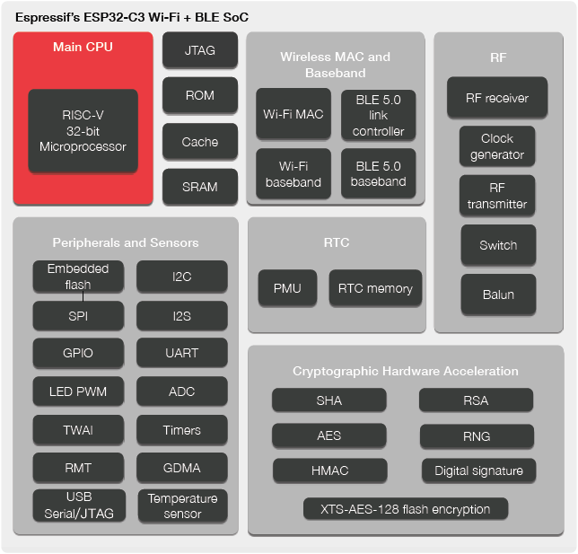

# 第02章、智能照明设备的整体设计

本章将以智能照明应用作为实战开发项目，通过相对完整的工程指导学会使用 ESP32-C3 进行完整的应用开发。内容包括：开发物联网项目驱动、网络连接/配置、云平台交互、固件管理/升级、量产管理、安全配置等。

通过本章内容，读者将看到使用 ESP32-C3 从零到一个智能照明项目量产的完整过程，并能将此作为下一个实际物联网项目参考范例。

# ESP32-C3 基础介绍

ESP32-C3 是一款安全稳定、低功耗、低成本的物联网芯片，搭载 RISC-V 32 位单核处理器，支持 2.4 GHz Wi-Fi 和 Bluetooth 5 (LE)。为物联网产品提供行业领先的射频性能、完善的安全机制和丰富的内存资源。ESP32-C3 对 Wi-Fi 和 Bluetooth 5 (LE) 的双重支持降低了设备配网难度，适用于广泛的物联网应用场景。

## 1 搭载 RISC-V 处理器

ESP32-C3 搭载 RISC-V 32 位单核处理器，时钟频率高达 160 MHz。具有 22 个可编程 GPIO 管脚、内置 400 KB SRAM，支持通过 SPI、Dual SPI、Quad SPI 和 QPI 接口外接多个 flash，满足各类物联网产品功能需求。此外，ESP32-C3 的耐高温特性也使其成为照明和工控领域的理想选择。

   

## 2 行业领先的射频性能

ESP32-C3 集成 2.4 GHz Wi-Fi 和支持长距离的 Bluetooth 5 (LE)，有助于构建覆盖范围更广、射频性能更强的物联网设备。它还支持蓝牙 Mesh (Bluetooth Mesh) 协议和乐鑫 Wi-Fi Mesh，在较高的工作温度下仍能保持卓越的射频性能。

## 3 完善的安全机制

ESP32-C3 支持基于 RSA-3072 算法的安全启动和基于 AES-128-XTS 算法的 flash 加密功能，确保设备安全连接；创新的数字签名模块和 HMAC 模块确保设备身份安全；支持加密算法的硬件加速器确保设备在本地网络和云上安全传输数据。

## 4 成熟的软件支持

ESP32-C3 沿用乐鑫成熟的物联网开发框架 ESP-IDF。ESP-IDF 已成功赋能了数以亿计的物联网设备，并历经了严格的测试和发布周期。开发人员基于其成熟的软件架构，凭借对 API 和工具的熟悉，将更容易构建 ESP32-C3 应用程序或进行程序迁移。ESP32-C3 也支持在从机模式下工作，可通过 ESP-AT 和 ESP-Hosted SDK 为外部主机 MCU 提供 Wi-Fi 与 Bluetooth LE 连接功能。

## 5 高级外设接口和传感器

ESP32-C3 拥有 22 个 GPIO 口、3 × SPI、2 × UART、1 × I2C、6 × LED PWM 控制器通道、

## 6 低功耗管理

ESP32-C3 系列采用了先进的电源管理技术，可以在不同的功耗模式之间切换。ESP32-C3 系列支持的功耗模
式有：

- Active 模式：CPU 和芯片射频处于工作状态。芯片可以接收、发射和侦听信号。
- Modem-sleep 模式：CPU 可运行，时钟频率可配置。Wi-Fi 及Bluetooth LE 的基带和射频关闭，但Wi-Fi
或Bluetooth LE 可保持连接。
- Light-sleep 模式：CPU 暂停运行。任何唤醒事件（MAC、主机、RTC 定时器或外部中断）都会唤醒芯片。
Wi-Fi 或Bluetooth LE 可保持连接。
- Deep-sleep 模式：CPU 和大部分外设都会掉电，只有RTC 存储器处于工作状态。Wi-Fi 连接数据存储在
RTC 中。