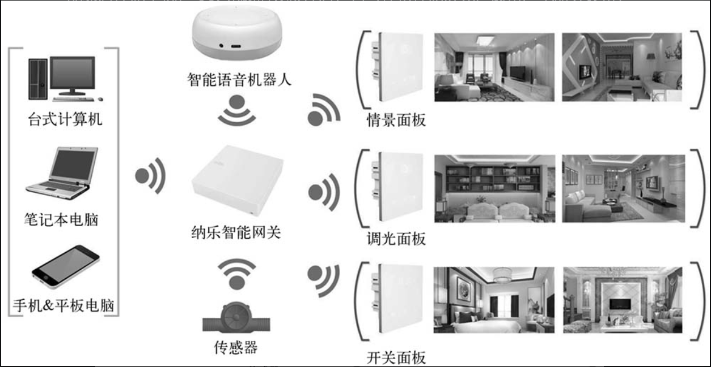
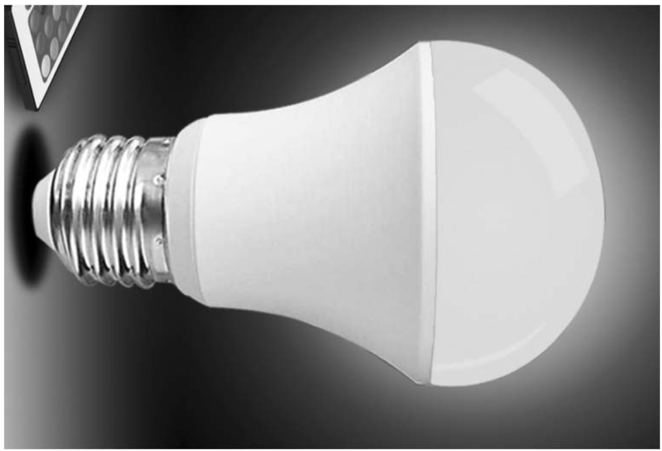

# 智能照明物联网项目介绍

在之后的章节中将以智能照明项目作为实战开发项目，通过相对完整的工程指导，让您学会使用 ESP32-C3 进行完整的物联网应用开发。内容包括：开发物联网应用驱动、网络连接/配置、云平台交互、固件管理/升级、量产管理、安全配置等。

通过本章内容，读者将看到使用 ESP32-C3 从零到一个智能照明项目量产的完整过程，并能将此作为下一个实际物联网项目参考范例。

## 智能照明物联网项目功能

智能照明主要应用在酒店、体育馆、医院、路灯照明等场所，也是智能家居的重要组成部分。智能照明控制是指用智能开关面板直接替换传统的电源开关，用遥控等多种智能控制方式实现对室内所有灯具的开启或关闭、亮度调节、全开、全关以及组合控制的形式，实现“会客、影院”等多种灯光情景效果，从而达到智能照明的节能、环保、舒适、方便的功能。其中控制方式包括触摸面板、遥控器控制、智能手机控制、电话远程控制、定时控制、平板电脑网络控制等。

智能照明主要由智能移动终端（智能手机或平板电脑等）、控制模块、环境光传感器与智能开关等组成。其中控制模块是一款功能精简的智能家居控制主机，安装完成相关软件后，它可轻松控制灯光、窗帘、电器等设备；环境光传感器可以感知室内光线情况，并告知控制模块自动调节室内亮度，降低照明电能消耗；智能开关包括调光面板、情景控制面板与随意贴面板，它们可手动或利用受控制模块控制室内的灯光或不同灯具的组合。

   

本书中将完成的智能照明物联网项目，将有以下功能：

1. 智能照明设备端
    - 设备网络配置、连接等功能
    - LED PWM 控制：颜色、亮度、色温等
    - 自动化或场景功能：定时开关等
    - Flash 加密和安全启动功能
    - 固件升级和版本管理功能
2. 智能移动终端 App
    - 提供设备网络配置、设备绑定功能
    - 智能照明设备控制：开关、亮度、色温等
    - 自动化或场景设置：定时开关等
    - 本地控制和远程控制
    - 用户注册、登录等
    - 控制设备固件升级
3. 物联网云服务（使用 ESP-Rainmaker）
    - 提供智能物联网设备接入
    - 提供智能移动终端 App 可访问的设备操作 API
    - 固件升级和版本控制

## 智能照明控制所需产品

1. 智能照明灯泡

    智能照明灯泡是一种新型灯泡，它的外形与一般乳白色白炽灯泡相同。它由电容降压式稳压电源、无线模组（ESP32-C3 内置）、LED 控制器及红（R）、绿（G）、蓝（B）三基色 LED 发光二极管阵列组成。电源接通后，经电容降压、二极管整流、稳压后输出 15V 直流电压供 LED 控制器和三基色 LED 阵列。LED 控制器能自动按一定的时间间隔发出高低电平，控制三基色 LED 发光二极管的导通（点亮）与关闭（熄灭），便会发出青、黄、绿、紫、蓝、红、白色光。无线模组负责连接 Wi-Fi 路由器，接收和上报智能照明灯泡状态，并发送控制 LED 发光。

    > 注：上述方式并不是唯一智能照明灯泡实现方式。

    

    
    

2. 智能移动终端

    智能移动终端是智能手机或平板电脑等，安装完成相关软件后，可以部署、控制、设置智能照明设备。

3. Wi-Fi 路由器

    Wi-Fi 路由器，通过 Wi-Fi 无线路由器把有线网络信号和移动网络信号转换成无线信号，供支持 Wi-Fi 技术的相关电脑，手机，Pad 等接收。比如家里的 ADSL，小区宽带之类的， 只要接一个 Wi-Fi 路由器，就可以实现 Wi-Fi 设备的无线上网。俗称“无线路由器”，也有人叫它为无线信号发射器，需要配合无线网卡之类的终端设备同时使用。

    Wi-Fi 路由器产品支持的主流协议标准为 IEEE（电气与电子工程师学会） 802.11n，传输速度 300Mbps，最高可达 600Mbps，可向下兼容 802.11b、802.11g。比如TP-Link TL-WR740N ，便有这些功能。

## Rainmaker 云平台

ESP RainMaker® 是一个完整的 AIoT 平台，助力客户降低投入成本，快速开发 AIoT 产品，构建安全稳定且可定制化的 AIoT 解决方案。它打通了底层芯片到上层软件应用全链路，包含所有乐鑫芯片和模组、设备固件、第三方语音助手集成、手机 APP 和云后台，有助于节省客户对云方案的大量投入，从而更专注于创造企业核心价值产品。

使用 ESP RainMaker 构建私有云平台，加速 AIoT 项目落地，低风险的一站式解决方案 (Turnkey Solution)，大大减少研发投入，更专注于产品创新及产品差异化定制，确保企业业务安全稳定地转型升级，缩短开发周期，加速项目进展，通过部署私有云，独立掌握数据和平台管理权。

在本书中的智能照明项目中，也会使用 Rainmaker 云平台进行构建。Rainmaker 将提供完整的解决方案，包括：设备端 SDK 和固件、基于私有云进行设备管理、集成第三方语音服务、开源手机 APP。
