# 第05章、智能照明设备驱动开发

本章将介绍如何进行智能照明设备驱动开发，智能照明设备中主要开发的驱动是 LED 调光驱动。LED 调光驱动的功能主要是完成 LED 灯打开和关闭、亮度调节、颜色调节。

## LED 调光

LED 照明灯具有高光效、长寿命、环保等优点，也是替代传统光源的一个大趋势。LED 的外部调光方式通常分为：直流调光和 PWM 调光。由于 PWM 调光具有光色不变，且低亮度时稳定性好等优势，从而被本技术领域技术人员广为采用。

如图所示：一种利用 PWM 控制器调节色温的 LED 灯，包括:开关信号采样电路，通过检测电路中开关的关断信号，并产生一个时钟信号；主控电路，接收时钟信号并产生 3 路脉冲信号分别输出至 3 个 PWM 控制器；PWM 控制器，根据主控电路传递脉冲信号输出不同的电流信号调节 LED 灯的亮度；用于照明的 LED 灯；主控电路包括一单片机，单片机的输入端与检测开关信号采样电路连接，单片机的三个输出端分别连接至 PWM 控制器。PWM 控制器输出端连接至 LED 灯。LED 灯包括红光、蓝光和绿光。然后由 PWM 控制器分别控制 R、G、B 三种颜色的 LED 的亮度值，使之经混色后得到不同的颜色。LED 灯全部封装在一灯罩内。

    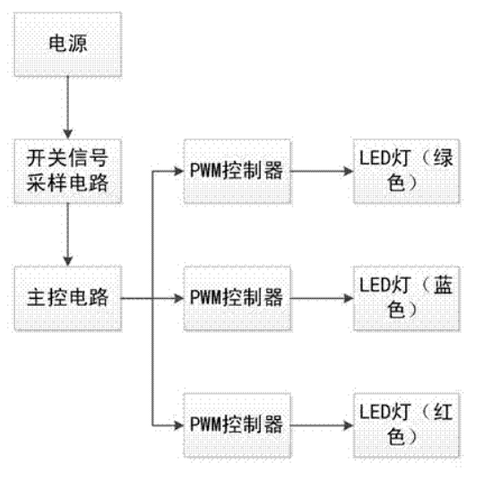

## PWM（Pulse Width Modulation）

脉冲宽度调制（Pulse Width Modulation，PWM），简称脉宽调制。是将模拟信号变为脉冲的一种技术（用数字来控制模拟输出的一种手段）。PWM 可以控制 LED 亮度、控制马达速度、控制直流电动机的速度等。PWM 有一些重要的参数：

1. PWM 的频率

    是指在 1 秒钟内，信号从高电平到低电平再回到高电平的次数，也就是说一秒钟 PWM 有多少个周期，单位 Hz。

2. PWM 的周期

    T=1/f，T是 周期，f 是频率。

    如果频率为 50Hz ，也就是说一个周期是 20ms，那么一秒钟就有 50 次 PWM 周期。

3. 占空比

    是一个脉冲周期内，高电平的时间与整个周期时间的比例，单位是 % (0%-100%)。一个周期的长度，如下图所示。

    

        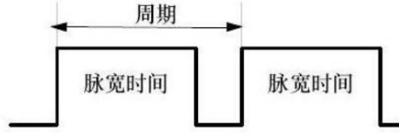
    

    其中，周期是一个脉冲信号的时间，1s 内的周期 T 次数等于频率 f，脉宽时间是指高电平时间。

    上图中，脉宽时间占总周期时间的比例，就是占空比。

    比方说，周期的时间是 10ms，脉宽时间是 8ms，那么占空比是 8/10= 80%，这就是占空比为 80% 的脉冲信号。

    PWM 就是脉冲宽度调制，通过调节占空比就可以调节脉冲宽度。

## PWM 调光

如果控制 LED，亮 1s，然后灭 1s，往复循环，那我们可以看到 LED 在闪烁。如果我们把这个周期缩小到 200ms，亮 100ms，然后灭 100ms，往复循环，可以看到 LED 灯在高频闪烁。这个周期持续缩小，持续缩小，总有一个临界值，我们的人眼分辨不出来 LED 在频闪，而此时 LED 的亮度处在灭与亮之间亮度的中间值，达到了 1/2亮度。

    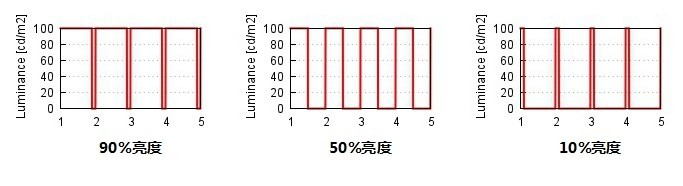

例如 PWM 的控制周期为 100ms，其中 20ms 为高电平，80ms 为低电平，则占空比就是 20/100 = 20%。

当 PWM 控制一个只有一种颜色的 LED 灯时，可以通过调节 PWM 的占空比控制这个 LED 颜色的亮度。当三个 PWM 分别控制一个包含 R、G、B 三种颜色的 LED 灯时，可以由 PWM 控制器分别控制 R、G、B 三种颜色的 LED 的亮度值，使之经混色后得到不同的颜色。

## 颜色空间

许多人都知道在绘画时可以使用红色、黄色和蓝色这三种原色生成不同的颜色，这些颜色就定义了一个色彩空间。我们将品红色的量定义为X 坐标轴、青色的量定义为Y坐标轴、黄色的量定义为Z坐标轴，这样就得到一个三维空间，每种可能的颜色在这个三维空间中都有唯一的一个位置。

但是，这并不是唯一的一个色彩空间。例如，当在计算机监视器上显示颜色的时候，通常使用RGB（红色、绿色、蓝色）色彩空间定义，这是另外一种生成同样颜色的方法，红色、绿色、蓝色被当作X、Y和Z坐标轴。另外一个生成同样颜色的方法是使用色相（X轴）、饱和度（色度）（Y轴）和明度（Z轴）表示，这种方法称为 HSV 色彩空间。另外还有许多其它的色彩空间，许多可以按照这种方法用三维（X、Y、Z）、更多或者更少维表示，但是有些根本不能用这种方法表示。

### RGB 颜色空间

RGB 是我们接触最多的颜色空间，由三个通道表示一幅图像，分别为红色(R)，绿色(G)和蓝色(B)。这三种颜色的不同组合可以形成几乎所有的其他颜色。RGB 颜色空间是图像处理中最基本、最常用、面向硬件的颜色空间，比较容易理解。RGB 颜色空间利用三个颜色分量的线性组合来表示颜色，任何颜色都与这三个分量有关，而且这三个分量是高度相关的，所以连续变换颜色时并不直观，想对灯泡的颜色进行调整需要更改这三个分量才行。

自然环境下获取的图像容易受自然光照、遮挡和阴影等情况的影响，即对亮度比较敏感。而 RGB 颜色空间的三个分量都与亮度密切相关，即只要亮度改变，三个分量都会随之相应地改变，而没有一种更直观的方式来表达。但是人眼对于这三种颜色分量的敏感程度是不一样的，在单色中，人眼对红色最不敏感，蓝色最敏感，所以 RGB 颜色空间是一种均匀性较差的颜色空间。如果颜色的相似性直接用欧氏距离来度量，其结果与人眼视觉会有较大的偏差。对于某一种颜色，我们很难推测出较为精确的三个分量数值来表示。

所以，RGB 颜色空间适合于显示系统，却并不适合于计算机处理。

### HSV 颜色空间

基于上述理由，在计算机处理中使用较多的是 HSV 颜色空间，它比 RGB 更接近人们对彩色的感知经验。非常直观地表达颜色的色调、鲜艳程度和明暗程度，方便进行颜色的对比。

在 HSV 颜色空间下，比 BGR 更容易跟踪某种颜色的物体，常用于分割指定颜色的物体。HSV 表达彩色图像的方式由三个部分组成：

- Hue（色调、色相）
- Saturation（饱和度、色彩纯净度）
- Value（明度）

用下面这个圆柱体来表示 HSV 颜色空间，圆柱体的横截面可以看做是一个极坐标系 ，H 用极坐标的极角表示，S 用极坐标的极轴长度表示，V 用圆柱中轴的高度表示。

    

Hue 用角度度量，取值范围为0～360°，表示色彩信息，即所处的光谱颜色的位置。表示如下：

    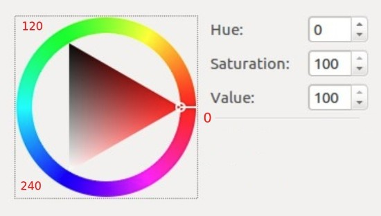

颜色圆环上所有的颜色都是光谱上的颜色，从红色开始按逆时针方向旋转，Hue=0 表示红色，Hue=120 表示绿色，Hue=240 表示蓝色等等。

在 GRB中 颜色由三个值共同决定，比如黄色为即 (255,255,0)；在HSV中，黄色只由一个值决定，Hue=60即可。

HSV 圆柱体的半边横截面（Hue=60）：

    

其中水平方向表示饱和度，饱和度表示颜色接近光谱色的程度。饱和度越高，说明颜色越深，越接近光谱色饱和度越低，说明颜色越浅，越接近白色。饱和度为0表示纯白色。取值范围为0～100%，值越大，颜色越饱和。

竖直方向表示明度，决定颜色空间中颜色的明暗程度，明度越高，表示颜色越明亮，范围是 0-100%。明度为0表示纯黑色（此时颜色最暗）。

可以通俗理解为：

在Hue一定的情况下，饱和度减小，就是往光谱色中添加白色，光谱色所占的比例也在减小，饱和度减为0，表示光谱色所占的比例为零，导致整个颜色呈现白色。

明度减小，就是往光谱色中添加黑色，光谱色所占的比例也在减小，明度减为0，表示光谱色所占的比例为零，导致整个颜色呈现黑色。

HSV 对用户来说是一种比较直观的颜色模型。我们可以很轻松地得到单一颜色，即指定颜色角H，并让V=S=1，然后通过向其中加入黑色和白色来得到我们需要的颜色。增加黑色可以减小V而S不变，同样增加白色可以减小S而V不变。例如，要得到深蓝色，V=0.4 S=1 H=240度。要得到浅蓝色，V=1 S=0.4 H=240度。

HSV 的拉伸对比度增强就是对 S 和 V 两个分量进行归一化(min-max normalize)即可，H 保持不变。

### HSL 颜色空间

HSL 和 HSV 比较类似，这里一起介绍。HSL 也有三个分量，hue（色相）、saturation（饱和度）、lightness（亮度）。HSL 和 HSV 的区别就是最后一个分量不同，HSL 的是 light(亮度)，HSV 的是 value(明度)。HSL 中的 L 分量为亮度，亮度为 100，表示白色，亮度为 0，表示黑色；HSV 中的 V 分量为明度，明度为100，表示光谱色，明度为0，表示黑色。

下面是 HSL 颜色空间圆柱体：

    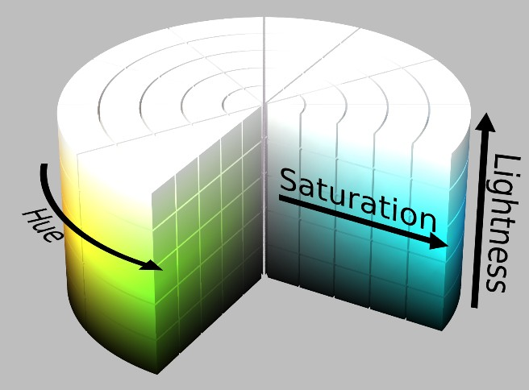

HSL 的 H(hue)分量，代表的是人眼所能感知的颜色范围，这些颜色分布在一个平面的色相环上，取值范围是 0° 到 360° 的圆心角，每个角度可以代表一种颜色。色相值的意义在于，我们可以在不改变光感的情况下，通过旋转色相环来改变颜色。

    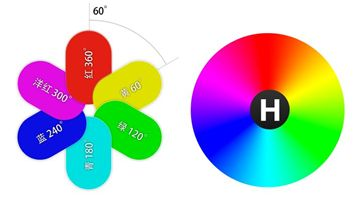

HSL 的 S(saturation)分量，指的是色彩的饱和度，它用 0% 至 100% 的值描述了相同色相、明度下色彩纯度的变化。数值越大，颜色中的灰色越少，颜色越鲜艳，呈现一种从灰度到纯色的变化。

    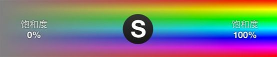

HSL 的 L(lightness)分量，指的是色彩的明度，作用是控制色彩的明暗变化。它同样使用了 0% 至 100% 的取值范围。数值越小，色彩越暗，越接近于黑色；数值越大，色彩越亮，越接近于白色。

    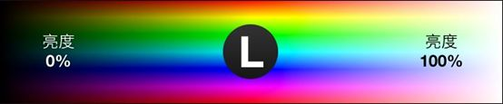

## ESP32-C3 LED PWM 控制器

LED PWM 控制器可以用于生成六路独立的数字波形，具有如下特性：

- 六个独立的 PWM 生成器（即六个通道）
- 四个独立定时器，可实现小数分频
- 占空比自动渐变（即 PWM 信号占空比可逐渐增加或减小，无须处理器干预），渐变完成时产生中断
- PWM 输出信号相位可调节
- Light-sleep 低功耗模式下可输出 PWM 信号
- PWM 最大精度为 14 位

四个定时器具有相同的功能和运行方式，下文将四个定时器统称为定时器 x（x 的范围是0 到3）。六个 PWM 生成器的功能和运行方式也相同，下文将统称为 PWM n（n 的范围是0 到5）。

    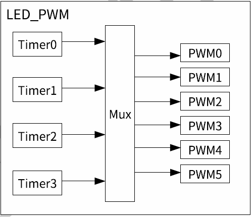

四个定时器可独立配置（可配置时钟分频器和计数器最大值），每个定时器内部有一个时基计数器（即基于基准时钟周期计数的计数器）。每个 PWM 生成器在四个定时器中择一，以该定时器的计数值为基准生成 PWM 信号。

下图时定时器和PWM 生成器的主要功能块。

    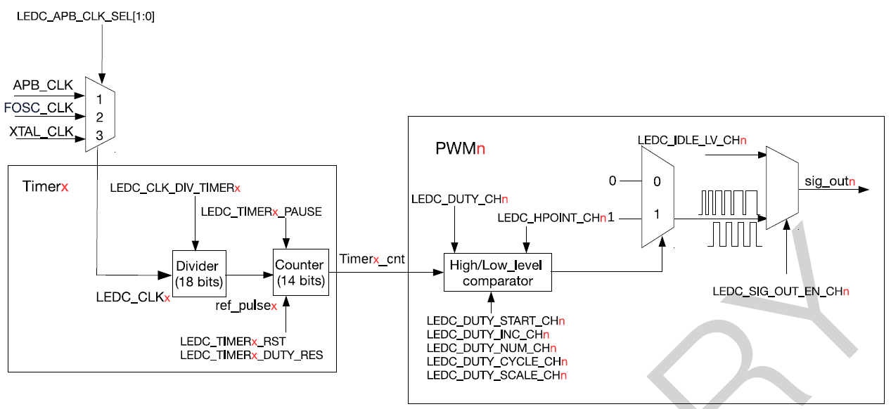

要生成 PWM 信号，PWM 生成器(PWMn) 需选择一个定时器(Timerx)。每个 PWM 生成器均可单独配置，在四个定时器中选择一个输出 PWM 信号。

每个 PWM 生成器主要包括一个高低电平比较器和两个选择器。PWM 生成器将定时器的 14 位计数值(Timerx_cnt) 与高低电平比较器的值 Hpointn 和 Lpointn 比较。如果定时器的计数值等于Hpointn 或 Lpointn，PWM 信号可以输出高低电平：

下图展示了如何使用Hpointn 和Lpointn 生成占空比固定的 PWM 信号。

    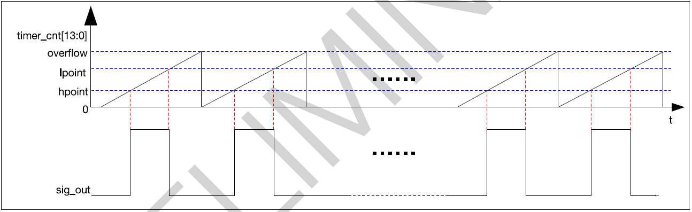

PWM 生成器可以渐变 PWM 输出信号的占空比，即由一种占空比逐渐变为为另一种占空比。如果开启占空比渐变功能，Lpointn 的值会在计数器溢出固定次数后递增或递减。下图展示了占空比渐变功能。

    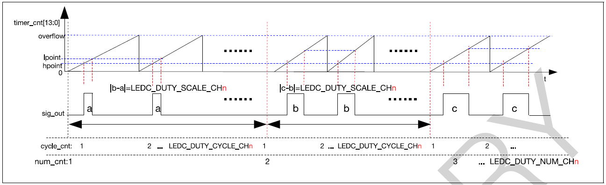

