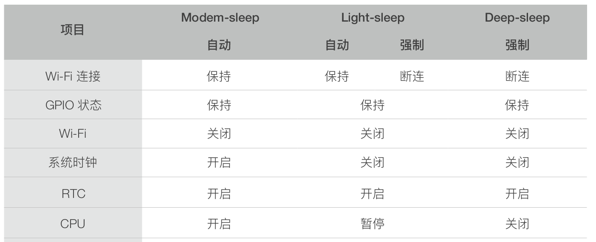
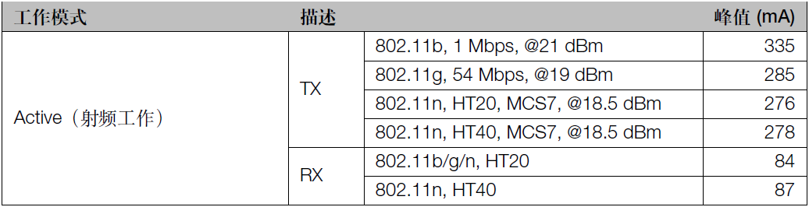
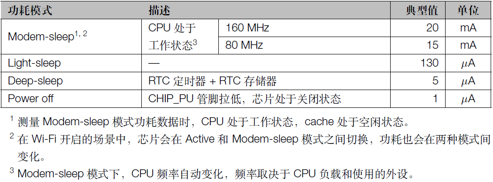
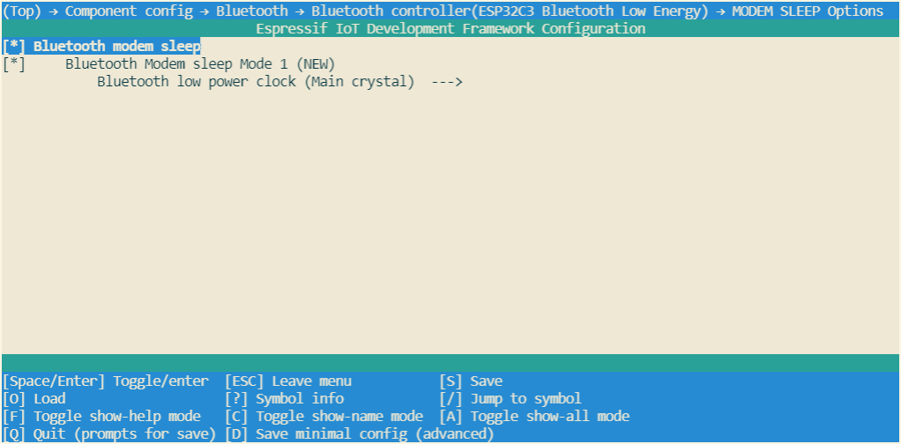
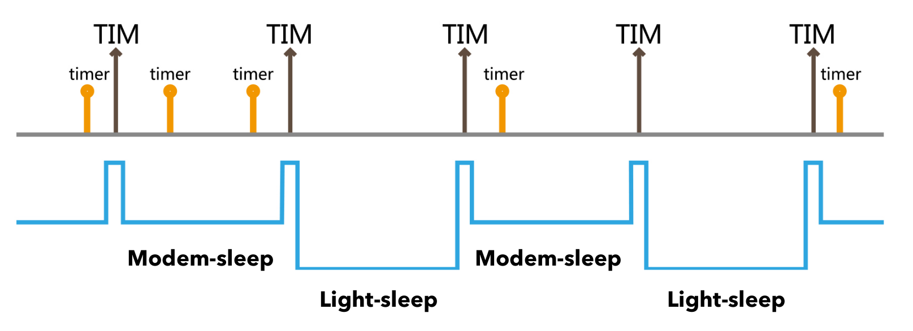
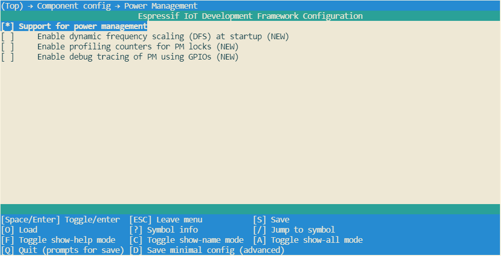
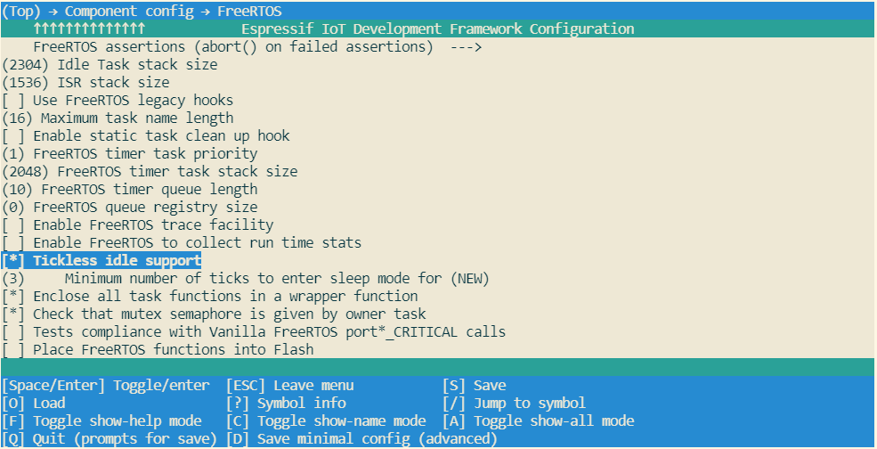

# 第11章、电源管理和低功耗优化方案

随着物联网应用在日常生活中逐渐铺开，人们在生活中可以看到越来越多的物联网相关应用：例如：智能手表、智能插座、智能灯泡、智能音箱等等。在这些各种各样的物联网应用中，一些物联网应用设备，由于使用电池供电或者能耗认证要求等原因，不得不考虑降低物联网设备的功耗。例如：智能灯泡在加州地区能耗认证 CEC Title 20 规范中要求设备待机功耗不能高于 0.2W、智能手表使用电池供电的同时也希望更长的工作时间。在这类的物联网应用开发过程中，开发者就需要在开发时将功耗作为重要的考虑因素，要尽最大可能利用芯片的特性并结合应用逻辑来降低设备的整体功耗。这需要开发者对所用芯片的功耗特性十分了解，并能熟练应用在实际的物联网项目中。在开发过程中，从通讯协议上，可以使用更低功耗的自组网技术，类似 BLE；而从电路实现上，则必须使用创新电路来降低功耗。

ESP32-C3 在低功耗方案上也有对应的硬件支持：电源管理和低功耗模式。

## 11.1 ESP32-C3 电源管理

### 11.1.1 概述

ESP-IDF 中集成的电源管理功能允许系统根据应用程序的需求，调整外围总线 (APB) 频率、CPU 频率，并配置自动 Light-sleep 模式，在空闲时芯片可进入 Light-sleep 模式，尽可能减少运行应用程序的功耗。启用电源管理功能将会增加中断延迟。额外增加的中断延迟与多个因素有关，例如：CPU 频率、是否需要进行频率切换等。应用程序组件可以通过获取/释放电源管理锁来控制功耗。例如：

 - 对于从 APB 获得时钟频率的外设，其驱动可以要求在使用该外设时，将 APB 频率设置为 80 MHz；
 - RTOS 可以要求 CPU 在有任务准备开始运行时以最高配置频率工作；
 - 一些外设可能需要中断才能启用，因此其驱动也会要求禁用 Light-sleep 模式。

因为请求较高的 APB 频率或 CPU 频率，以及禁用 Light-sleep 模式会增加功耗，所以在实际应用中，请将使用的电源管理锁的时间降到最小。

### 11.1.2 动态调频

当启用电源管理功能后，外围总线（APB）频率和 CPU 频率可能会在运行过程中发生改变，这也被称为动态调频（Dynamic frequency scaling，DFS）。启用电源管理后，动态调频也随之启用，APB 频率可在一个 RTOS 滴答周期内多次更改。有些外设不受 APB 频率变更的影响，但有些外设可能会出现问题。例如，Timer Group 外设定时器会继续计数，但定时器计数的速度将随 APB 频率的变更而变更。所以在开发中，读者应该了解哪些外设是受动态调频影响的，哪些外设是不受动态调频影响的。

下面的外设不受动态调频的影响：

 - UART：如果使用 `REF_TICK` 用作时钟源，则 UART 不受动态调频变更影响，使用其他时钟源，将会受动态调频影响。
 - LEDC：如果使用 `REF_TICK` 用作时钟源，则 LEDC 不受动态调频变更影响，使用其他时钟源，将会受动态调频影响。
 - RMT：如果使用 `REF_TICK` 或者 `XTAL` 被用作时钟源，则 RMT 不受动态调频变更影响。

目前以下外设驱动程序不受动态调频影响，驱动程序会在调频期间使用 `ESP_PM_APB_FREQ_MAX` 电源管理锁，无需应用程序获取电源管理锁：

 - SPI master
 - I2C
 - I2S（如果使用 APLL 时钟，I2S 则会获取 `ESP_PM_NO_LIGHT_SLEEP` 电源管理锁）
 - SDMMC

应用程序中如果使用以下驱动程序时，驱动程序会自动获取 `ESP_PM_APB_FREQ_MAX` 电源管理锁：

 - SPI slave：从调用 `spi_slave_initialize()` 至 `spi_slave_free()` 期间。
 - Ethernet：从调用 `esp_eth_driver_install()` 至 `esp_eth_driver_uninstall()` 期间。
 - WiFi：从调用 `esp_wifi_start()` 至 `esp_wifi_stop()` 期间。如果启用了 Wi-Fi Modem-sleep 模式，芯片射频模块关闭时将释放此电源管理锁。
 - TWAI：从调用 `twai_driver_install()` 至 `twai_driver_uninstall()` 期间。
 - Bluetooth：从调用 `esp_bt_controller_enable()` 至 `esp_bt_controller_disable()` 期间。如果启用了 Bluetooth Modem-sleep 模式，芯片射频模块关闭时将释放此电源管理锁。但依然占用 `ESP_PM_NO_LIGHT_SLEEP` 电源管理锁，除非 `CONFIG_BTDM_CTRL_LOW_POWER_CLOCK` 选择的是 “External 32kHz crystal”。

以下外设驱动程序是受动态调频影响的，应用程序需要添加代码完成获取/释放电源管理锁操作：

 - PCNT
 - Sigma-delta
 - Timer group
 - UART：使用除 `REF_TICK` 之外的其他时钟源时
 - LEDC：使用除 `REF_TICK` 之外的其他时钟源时
 - RMT：使用除 `REF_TICK` 和 `XTAL` 之外的其他时钟源时

### 11.1.3 电源管理配置

通常自动 Light-sleep 会与 Modem-sleep 模式以及电源管理功能共同使用。详细配置见《自动 Light-sleep 和电源管理配置说明》。

## 11.2 ESP32-C3 低功耗模式

### 11.2.1 概述

在低功耗方面，ESP32-C3 采用了高效、灵活的功耗管理技术，可以在功耗控制、唤醒延迟和不同唤醒源之间实现最佳平衡。芯片的主处理器支持 4 种功耗模式，可以满足物联网应用的不同场景需求，并成功运用到智能照明等不同的物联网项目中，并能通过严格的功耗认证测试要求。针对这些功耗模式，乐鑫提供了多种低功耗解决方案，用户可以结合具体需求选择功耗模式并进行配置。4 种功耗模式如下:

 - Active 模式：CPU 和芯片射频处于工作状态。芯片可以接收、发射和侦听信号。
 - Modem-sleep 模式：CPU 可运行，系统时钟频率可配置，Wi-Fi 及 Bluetooth LE 的基带和射频关闭，但 Wi-Fi 或 Bluetooth LE 可保持连接。
 - Light-sleep 模式：CPU 暂停运行，Wi-Fi/蓝牙基带和射频关闭， RTC 存储器和 RTC 外设可以工作，MAC、主机、RTC 定时器或外部中断都可以唤醒芯片。在自动 Light-sleep 模式下，Wi-Fi 或 Bluetooth LE 可保持连接。
 - Deep-sleep 模式：CPU 和大部分外设都会掉电，Wi-Fi/蓝牙基带和射频关闭，只有 RTC 存储器和 RTC 外设可以工作。Wi-Fi 和 Bluetooth LE 连接数据存储在 RTC 中。

默认情况下，ESP32 系统复位后将进入 Active 模式，在 Active 模式下，芯片所有功能都正常工作。当 CPU 不需要一直工作时，比如当等待外部活动唤醒时，系统可以进入多种低功耗模式。用户可根据具体功耗、唤醒延迟和可用唤醒源需求，在各种功耗模式中进行选择。除了 Active 模式外其他三种模式都属于低功耗模式，在图 11-1 中列出了这三种低功耗模式的区别：

<div align="center">
    
</div>
<center>图 11-1. 不同低功耗模式对比 </center>

### 11.2.2 不同功耗模式下的功耗

下列功耗数据是基于 3.3 V 电源、25 °C 环境温度，在 RF 接口处完成的测试结果。所有发射数据均基于 100% 的占空比（一直保持工作状态）测得。

下图为 RF 功耗：

<div align="center">
    
</div>
<center>图 11-2. RF 功耗 </center>

下图为不同功耗模式下的功耗：

<div align="center">
    
</div>
<center>图 11-3. 不同功耗模式下的功耗 </center>

### 11.2.3 Modem-sleep 模式

目前 ESP32-C3 的 Modem-sleep 仅工作在 Wi-Fi Station 连接和 Bluetooth LE 连接情况下。在 Wi-Fi Station 连接路由器和 Bluetooth LE 建立连接后，Modem-sleep 模式生效。生效后 ESP32-C3 会周期性在 Active 模式和 Modem-sleep 模式两者之间切换。在 Modem-sleep 模式下，Wi-Fi／Bluetooth LE 基带受时钟门限控制或关闭，芯片射频模块关闭，系统可以自动被唤醒，没有唤醒延迟，并且无需配置唤醒源，从 Modem-sleep 模式唤醒后，芯片射频模块便开始工作，功耗也随之升高，功耗模式变为 Active 模式。

ESP32-C3 通过 Wi-Fi 的 DTIM Beacon 机制与路由器保持连接。在 Modem-sleep 模式下，ESP32-C3 会在两次 DTIM Beacon 间隔时间内，芯片射频模块关闭，达到省电效果，在下次 Beacon 到来前自动唤醒。睡眠时间由路由器的 DTIM Beacon 时间和 ESP32-C3 的 `listen_interval` 参数共同决定。Modem-sleep 模式下与路由器的 Wi-Fi 连接，并通过路由器接收来自手机或者服务器的交互信息。

> DTIM (Delivery Traffic Indication Message): 使用无线路由器时无线发送数据包的频率。一般路由器的 DTIM Beacon 间隔为 100 ms ~ 1,000 ms。

ESP32-C3 通过 Bluetooth LE 的 Connection Event 保持与对端的连接，在 Modem-sleep 模式下，ESP32-C3 会在两次 Connection Event 间隔时间内，芯片射频模块关闭，达到省电效果，在下次 Connection Event 到来前自动唤醒，睡眠时间由 Bluetooth LE 连接参数决定。

Modem-sleep 一般用于 CPU 持续处于工作状态并需要保持 Wi-Fi 或 Bluetooth LE 连接的低功耗应用场景，例如，使用 ESP32-C3 本地语音唤醒功能，CPU 需要持续采集和处理音频数据。

#### Modem-sleep 模式配置说明

1. Wi-Fi Modem-sleep 模式

    在开发中，通过 `esp_wifi_set_ps` 接口配置 Wi-Fi Modem-sleep 模式，`type` 可选参数：

    - `WIFI_PS_NONE`: 不使用 Modem-sleep 模式
    - `WIFI_PS_MIN_MODEM`: ESP32-C3 接收 Beacon 的间隔与路由器的 DTIM 间隔相同，即 1 个路由器间隔
    - `WIFI_PS_MAX_MODEM`: ESP32-C3 接收 Beacon 的间隔可由程序进行配置，间隔周期 `wifi_sta_config_t` 结构体中 `listen_interval` 值决定，单位为 路由器的 Beacon 间隔，默认值为 3（即 3 个路由器 Beacon 间隔）

    ```c
    typedef enum {
        WIFI_PS_NONE,        /**< No power save */
        WIFI_PS_MIN_MODEM,   /**< Minimum modem power saving. In this mode, station wakes up to receive beacon every DTIM period */
        WIFI_PS_MAX_MODEM,   /**< Maximum modem power saving. In this mode, interval to receive beacons is determined by the listen_interval parameter in wifi_sta_config_t */
    } wifi_ps_type_t;

    esp_err_t esp_wifi_set_ps(wifi_ps_type_t type);
    ```

    当 `type` 参数为 `WIFI_PS_MAX_MODEM` ，ESP32-C3 接收 Beacon 的间隔 `listen_interval` 配置方法：

    ```c
    #define LISTEN_INTERVAL 3
    wifi_config_t wifi_config = {
        .sta = {
            .ssid = "SSID",
            .password = "Password",
            .listen_interval = LISTEN_INTERVAL,
        },
    };
    ESP_ERROR_CHECK(esp_wifi_set_mode(WIFI_MODE_STA));
    ESP_ERROR_CHECK(esp_wifi_set_config(ESP_IF_WIFI_STA, &wifi_config));
    ESP_ERROR_CHECK(esp_wifi_start());

    ESP_ERROR_CHECK(esp_wifi_set_ps(WIFI_PS_MAX_MODEM));
    ```

2. Bluetooth LE Modem-sleep 模式

    Bluetooth LE Modem-sleep 模式需要运行 `idf.py menuconfig` 命令打开 Espressif IoT Development Framework Configuration 工具，在 `Component config → Bluetooth → Bluetooth controller(ESP32C3 Bluetooth Low Energy) → MODEM SLEEP Options` 路径下使能 `Bluetooth modem sleep`，`Bluetooth Modem sleep Mode 1` 和 `Bluetooth low power clock` 使用默认配置即可。

    <div align="center">
        
    </div>
    <center>图 11-4. ESP32-C3 Bluetooth LE Modem-sleep 模式 </center>

### 11.2.4 Light-sleep 模式

Light-sleep 的工作方式与 Modem-sleep 相似，不同的是，除了关闭芯片射频模块以外，在 Light-sleep 模式下，数字外设、大部分 RAM 受时钟门限限制并且 CPU 暂停运行，比 Modem-sleep 功耗更低。从 Light-sleep 唤醒后，外设和 CPU 恢复运行，它们的内部状态被保留。Light-sleep 模式唤醒延迟低于 1 ms。有两种方式使 CPU 进入 Light-sleep 模式：

 - 手动 Light-sleep： 通过调用 API 手动进入 Light-sleep 模式，手动进入 Light-sleep 模式后，需要配置 Wi-Fi 唤醒源才能通过路由器接收来自手机或者服务器的交互信息；
 - 自动 Light-sleep： 配置为自动 Light-sleep 后，会在 CPU 和芯片射频模块处于空闲的状态下自动进入 Light-sleep 模式，能通过路由器接收来自手机或者服务器的交互信息。

#### Lighe-sleep 唤醒源

针对手动 Lighe-sleep 需要配置唤醒源的情况，可以使用 定时器、 GPIO、 UART、Wi-Fi 或 Bluetooth LE 唤醒源从 Light-sleep 模式唤醒，支持同时配置一个或多个唤醒源。在这种情况下，当任何一个来源被触发时，芯片将被唤醒。唤醒源可以使用 `esp_sleep_enable_*_wakeup` API 进行配置，也可以使用 `esp_sleep_disable_wakeup_source(esp_sleep_source_t source);` API 禁用某个唤醒源。在进入 Light-sleep 模式之前，可以随时配置唤醒源。在唤醒后，可以通过 `esp_sleep_get_wakeup_cause()` API 检查哪个唤醒源触发了从 Lighe-sleep 模式唤醒。
 
1. GPIO wakeup
    
    在 Light-sleep 模式下可以从外部输入唤醒的方法。通过该唤醒源，每个引脚可以使用 `gpio_wakeup_enable()` 函数单独配置为高电平或低电平唤醒。此唤醒源可用于任何 IO（RTC 或数字）。

    `esp_sleep_enable_gpio_wakeup()` 函数可用于启用此唤醒源。

2. Timer wakeup

    RTC 控制器具有内置定时器，可用于在预定义的时间后唤醒芯片。时间以微秒精度指定，但实际分辨率取决于为 RTC SLOW_CLK 选择的时钟源。

    此唤醒模式不需要在睡眠期间打开 RTC 外设或 RTC 存储器。

    `esp_sleep_enable_timer_wakeup()` 函数可用于启用此唤醒源。

3. UART wakeup

    当 ESP32-C3 从外部设备接收 UART 输入时，通常需要在输入数据可用时唤醒芯片。UART 外设包含一项功能，当看到 RX 引脚上的一定数量的上升沿时，可以将芯片从 Light-sleep 状态唤醒。可以使用 `uart_set_wakeup_threshold()` 函数设置此上升沿数。请注意，唤醒后 UART 不会接收触发唤醒的字符（及其前面的任何字符）。这意味着外部设备通常需要在发送数据之前向 ESP32-C3 发送额外字符以触发唤醒。

    `esp_sleep_enable_uart_wakeup()` 函数可用于启用此唤醒源。

4. Wi-Fi wakeup

    当 ESP32-C3 需要保持 Wi-Fi 连接时，需要使能 Wi-Fi 唤醒源。在每次 AP DTIM Beacon 之前唤醒，打开芯片射频模块，保持 Wi-Fi 连接。

    `esp_sleep_enable_wifi_wakeup()` 函数可用于启用此唤醒源。

#### 手动 Light-sleep

手动 Light-sleep 意味着需要在应用逻辑中需要休眠时候通过调用相应的接口进入 Light-sleep 模式，进入 Light-sleep 模式后，关闭芯片射频模块并暂停 CPU 运行。从 Light-sleep 模式唤醒后，会从程序调用 Light-sleep 接口的位置继续执行程序。手动进入 Light-sleep 模式后，可以通过使能 Wi-Fi 唤醒源保持与路由器的 Wi-Fi 连接，并通过路由器接收来自手机或者服务器的交互信息，如果没有使能 Wi-Fi 唤醒源，可能会出现接收不到网络中的数据包或者断开 Wi-Fi 连接，Bluetooth LE 唤醒源类似。

> 注意：
> 1. 调用手动进入 Light-sleep 接口后，并不会立即进入 Light-sleep 模式，而是等到系统空闲后才进入，
> 2. 手动进入 Light-sleep 模式后，需要使能 Wi-Fi 唤醒源才能保持与路由器的 Wi-Fi 连接并接收网络中发送的数据。

##### 手动 Light-sleep 配置说明

1. 在配置唤醒源后，可通过调用 `esp_light_sleep_start()` 接口手动进入 Light-sleep 模式。在没有配置唤醒源的情况下也可以进入 Light-sleep 模式，在这种情况下，芯片将一直处于 Light-sleep 模式，直到应用外部复位。

```c
#define BUTTON_WAKEUP_LEVEL_DEFAULT 0
#define BUTTON_GPIO_NUM_DEFAULT     9

/* Configure the button GPIO as input, enable wakeup */
const int button_gpio_num = BUTTON_GPIO_NUM_DEFAULT;
const int wakeup_level    = BUTTON_WAKEUP_LEVEL_DEFAULT;
gpio_config_t config = {
        .pin_bit_mask = BIT64(button_gpio_num),
        .mode         = GPIO_MODE_INPUT
};
ESP_ERROR_CHECK(gpio_config(&config));
gpio_wakeup_enable(button_gpio_num, wakeup_level == 0 ? GPIO_INTR_LOW_LEVEL : GPIO_INTR_HIGH_LEVEL);

/* Wake up in 2 seconds, or when button is pressed */
esp_sleep_enable_timer_wakeup(2000000);
esp_sleep_enable_gpio_wakeup();

/* Enter sleep mode */
esp_light_sleep_start();
/* Execution continues here after wakeup */
```

#### 自动 Light-sleep

自动 Light-sleep 的工作原理：在完成自动 Light-sleep 配置后，系统会在空闲且不需要芯片射频模块工作时自动进入 Light-sleep 模式，无需调用 Light-sleep 接口，并能在需要工作（例如：Wi-Fi/Bluetooth LE 保持连接或者接收数据）时自动唤醒，不需要单独配置唤醒源。在配置为自动 Light-sleep 后，可以保持与路由器的 Wi-Fi 连接，并通过路由器接收来自手机或者服务器的交互信息，对用户体验没有影响；Bluetooth LE 连接类似。通常自动 Light-sleep 会与 Modem-sleep 模式以及电源管理功能共同使用。在不需要芯片射频模块时，进入 Modem-sleep 模式，如果同时系统处于空闲状态，将会进入 Light-sleep 模式，进一步降低功耗。

<div align="center">
    
</div>
<center>图 11-5. ESP32-C3 Bluetooth LE Modem-sleep 模式 </center>

自动 Light-sleep 模式可用于需要保持与路由器的连接，可以实时响应路由器发来的数据的场景。并且在未接收到命令时，CPU 可以处于空闲状态。比如 Wi-Fi 开关的应用，大部分时间 CPU 都是空闲的，直到收到控制命令，CPU 才需要进行 GPIO 的操作。

##### 自动 Light-sleep 和电源管理配置说明

通过 `esp_err_t esp_pm_configure(const void* vconfig)` 接口配置电源管理功能，参数 `light_sleep_enable` 为 true 时使能自动 Light-sleep 功能。使能 自动 Light-sleep 功能，需要使能 [CONFIG_FREERTOS_USE_TICKLESS_IDLE](https://docs.espressif.com/projects/esp-idfen/v4.3.1/esp32c3/api-reference/kconfig.html#config-freertos-use-tickless-idle) 和 [CONFIG_PM_ENABLE](https://docs.espressif.com/projects/esp-idf/en/v4.3.1/esp32c3/api-reference/kconfig.html#config-pm-enable)

使能 `CONFIG_PM_ENABLE` 需要运行 `idf.py menuconfig` 命令打开 Espressif IoT Development Framework Configuration 工具，在 `Component config → Power Management` 路径下使能 `Support for power management` 即可。

<div align="center">
    
</div>
<center>图 11-6. ESP32-C3 电源管理功能配置 </center>

应用程序可以通过调用 `esp_pm_configure(const void* vconfig)` API 启用动态调频 (DFS) 功能和自动 Light-sleep 模式。使用 ESP32-C3 芯片时此函数对应的参数为 `esp_pm_config_esp32c3_t`，定义了动态调频的相关设置和自动 Light-sleep 模式控制。在此参数结构中，需要初始化下面三个字段：

 - `max_freq_mhz`：最大 CPU 频率 (MHz)，即获取 `ESP_PM_CPU_FREQ_MAX` 电源管理锁后所使用的频率。该字段通常设置为 `CONFIG_ESP32C3_DEFAULT_CPU_FREQ_MHZ`。
 - `min_freq_mhz`：最小 CPU 频率 (MHz)，即仅获取 `ESP_PM_APB_FREQ_MAX` 电源管理锁后所使用的频率。该字段可设置为晶振 (XTAL) 频率值，或者 XTAL 频率值除以整数。注意，10 MHz 是生成 1 MHz 的 REF_TICK 默认时钟所需的最小频率。
 - `light_sleep_enable`：没有获取任何电源管理锁时，决定系统是否需要自动进入 Light-sleep 状态 (true/false)。

自动 Light-sleep 模式基于 FreeRTOS Tickless Idle 功能，因此如果在 menuconfig 中没有启用 `CONFIG_FREERTOS_USE_TICKLESS_IDLE` 选项，在请求自动 Light-sleep 时，`esp_pm_configure()` 将会返回 `ESP_ERR_NOT_SUPPORTED` 错误。

<div align="center">
    
</div>
<center>图 11-7. ESP32-C3 FreeRTOS Tickless Idle 功能配置 </center>

```c
#if CONFIG_PM_ENABLE
    // Configure dynamic frequency scaling:
    // automatic light sleep is enabled if tickless idle support is enabled.
    esp_pm_config_ESP32-C3_t pm_config = {
            .max_freq_mhz = 160, // Maximum CPU frequency
            .min_freq_mhz = 10,  // Minimum CPU frequency
#if CONFIG_FREERTOS_USE_TICKLESS_IDLE
            .light_sleep_enable = true
#endif
    };
    ESP_ERROR_CHECK( esp_pm_configure(&pm_config) );
#endif // CONFIG_PM_ENABLE
```

### 11.2.5 Deep-sleep 模式

相对于 Light-sleep 模式，系统无法自动进入 Deep-sleep，需要由用户调用接口函数 `esp_deep_sleep_start()` 进入 Deep-sleep 模式。在 Deep-sleep 模式下，会断开所有 Wi-Fi 和 Bluetooth LE 连接与数据连接，进入 Deep-sleep 模式，CPU、大部分 RAM 和所有由 APB_CLK 提供时钟的数字外设都被关闭。仍然可以通电的芯片的是：实时时钟控制器、RTC 外设、RTC 快速内存。从 Deep-sleep 模式唤醒后，CPU 将软件复位重启。

Deep-sleep 可以用于低功耗的传感器应用，或者大部分时间都不需要进行数据传输的情况。设备可以每隔一段时间从 Deep-sleep 状态醒来测量数据并上传，之后继续进入 Deep-sleep。也可以将多个数据存储于 RTC memory(RTC memory 在 Deep-sleep 模式下仍然可以保存数据)，然后一次发送出去。

#### Deep-sleep 唤醒源

针对 Deep-sleep 模式，可以使用 定时器、 GPIO 从 Deep-sleep 模式唤醒，支持同时配置一个或多个唤醒源。在这种情况下，当任何一个来源被触发时，芯片将被唤醒。唤醒源可以使用相应的 API 进行配置，也可以使用 `esp_sleep_disable_wakeup_source(esp_sleep_source_t source);` API 禁用某个唤醒源。在进入 Deep-sleep 模式之前，可以随时配置唤醒源。在唤醒后，可以通过 `esp_sleep_get_wakeup_cause()` API 检查哪个唤醒源触发了从 Deep-sleep 模式唤醒。
 
1. GPIO wakeup
    
    在 Deep-sleep 模式下可以从外部输入唤醒的方法。通过该唤醒源，每个引脚可以使用 `esp_deep_sleep_enable_gpio_wakeup()` 函数单独配置为高电平或低电平唤醒。此唤醒源仅可用于 RTC IO。

    `esp_deep_sleep_enable_gpio_wakeup(uint64_t gpio_pin_mask, esp_deepsleep_gpio_wake_up_mode_t mode)` 函数可用于启用此唤醒源。

2. Timer wakeup

    RTC 控制器具有内置定时器，可用于在预定义的时间后唤醒芯片。时间以微秒精度指定，但实际分辨率取决于为 RTC SLOW_CLK 选择的时钟源。

    此唤醒模式不需要在睡眠期间打开 RTC 外设或 RTC 存储器。

    `esp_sleep_enable_timer_wakeup(uint64_t time_in_us)` 函数可用于启用此唤醒源。

#### Deep-sleep 配置说明

配置唤醒源后，可使用 `esp_deep_sleep_start()` 函数进入 Deep-sleep 模式。在没有配置唤醒源的情况下也可以进入 Deep-sleep 状态，在这种情况下，芯片将无限期地处于 Deep-sleep 模式，直到外部复位。

下面的程序展示了如何配置 Deep-sleep 模式。下面的程序使能了 GPIO 唤醒、定时器唤醒；并配置在 Deep-sleep 模式下 GPIO4 为高电平时唤醒和进入 Deep-sleep 模式后 20s 定时器唤醒。考虑到 GPIO4 选择高电平唤醒，所以在硬件上或者软件配置上需要添加下拉操作，避免误唤醒情况发生。

```c
#define DEFAULT_WAKEUP_PIN      4
#define DEFAULT_WAKEUP_LEVEL    ESP_GPIO_WAKEUP_GPIO_HIGH

const gpio_config_t config = {
    .pin_bit_mask = BIT(DEFAULT_WAKEUP_PIN),
    .mode         = GPIO_MODE_INPUT,
};
ESP_ERROR_CHECK(gpio_config(&config));
ESP_ERROR_CHECK(esp_deep_sleep_enable_gpio_wakeup(BIT(DEFAULT_WAKEUP_PIN), DEFAULT_WAKEUP_LEVEL));
ESP_LOGI("TAG", "Enabling GPIO wakeup on pins GPIO%d\n", DEFAULT_WAKEUP_PIN);

const int wakeup_time_sec = 20;
ESP_LOGI("TAG", "Enabling timer wakeup, %ds\n", wakeup_time_sec);
esp_sleep_enable_timer_wakeup(wakeup_time_sec * 1000000);

/* Enter deep sleep */
esp_deep_sleep_start();
```
