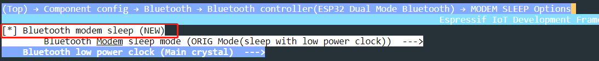
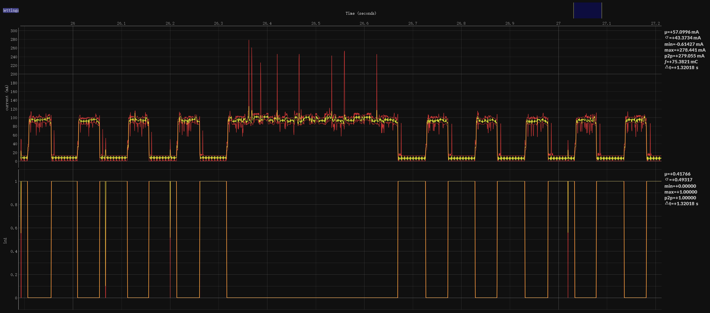
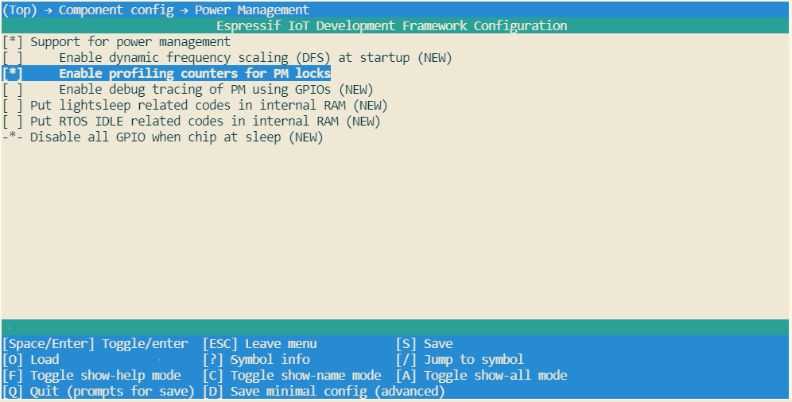
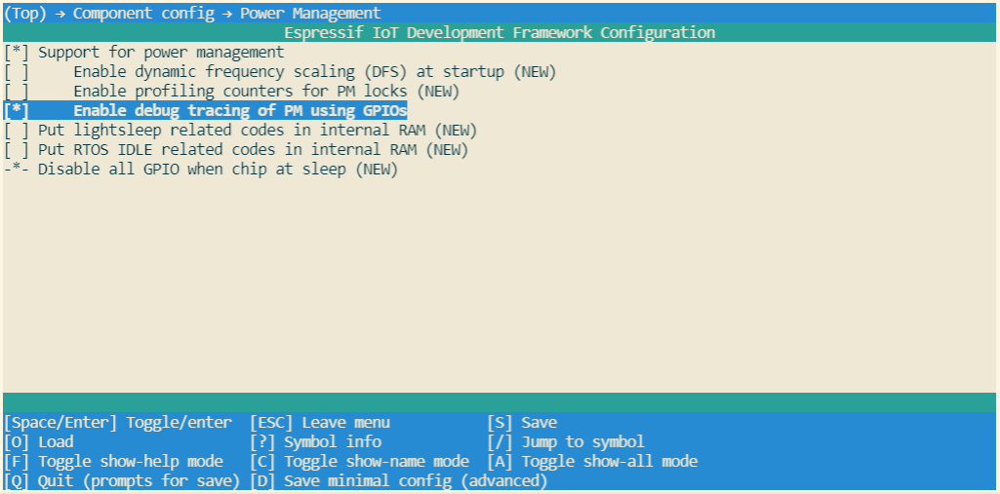

## 11.3 智能照明物联网项目中电源管理方案

在本书要完成的智能照明物联网项目中，该智能照明产品为了通过功耗认证，并且为了实现节约能源，需要尽可能降低芯片运行时功耗。结合在 11.1 和 11.2 章节中介绍的电源管理和低功耗模式，考虑到在 Deep-sleep 模式下，LEDC 无法正常，并且在关灯时，ESP32-C3 可以处于掉电状态而不是 Deep-sleep 模式。所以在该智能照明产品中使用了 Wi-Fi Modem-sleep、Bluetooth LE Modem-sleep、电源管理、自动 Light-sleep 功能，这些低功耗优化方式结合使用能将智能照明产品功耗降至最低。

下面，将介绍如何在智能照明物联网项目中使用这些低功耗优化方式。分为两步：

 - 第一步，配置电源管理功能、自动 Light-sleep、Wi-Fi Modem-sleep 和 Bluetooth LE Modem-sleep；
 - 第二步，在应用程序中完成电源管理锁相关操作，使 LED 驱动正常工作。

### 11.3.1 配置电源管理功能

#### 11.3.1.1 启用电源管理（Power Management）和自动 Light-sleep

启用电源管理功能，首先，需要在 menuconfig 中使能相应的选项，其次，还在应用程序中调用 `esp_pm_configure(const void* vconfig)` API，使用 ESP32-C3 时对应的参数是 `esp_pm_config_esp32c3_t`。

参考《自动 Light-sleep 和电源管理配置说明》章节进行配置。

#### 11.3.1.2 使能 Wi-Fi & Bluetooth LE Modem Sleep

使能 Wi-Fi & Bluetooth LE Modem Sleep，有以下两个步骤：

第一步，配置 Bluetooth LE Modem Sleep，只需要在 menuconfig 中使能这个选项：

<div align="center">
    
</div>
<center>图 11-8. ESP32-C3 Bluetooth LE Modem Sleep 配置 </center>

第二步，配置 Wi-Fi Modem Sleep 模式，需要在 Wi-Fi 初始化后，调用 `esp_wifi_set_ps(wifi_ps_type_t type)` API 完成 Modem Sleep 模式配置，在本书介绍的智能照明物联网项目中的用法如下：

```c
#define LISTEN_INTERVAL 3
wifi_config_t wifi_config = {
    .sta = {
        .ssid = "SSID",
        .password = "Password",
        .listen_interval = LISTEN_INTERVAL,
    },
};
ESP_ERROR_CHECK(esp_wifi_set_mode(WIFI_MODE_STA));
ESP_ERROR_CHECK(esp_wifi_set_config(ESP_IF_WIFI_STA, &wifi_config));
ESP_ERROR_CHECK(esp_wifi_start());

ESP_ERROR_CHECK(esp_wifi_set_ps(WIFI_PS_MAX_MODEM));
```

### 11.3.2 电源管理锁相关操作

从 《11.1.2 动态调频》章节中已经了解到，当 LEDC 使用除 `REF_TICK` 之外的时钟源时，是受动态调频影响的，应用程序需要添加代码完成获取/释放电源管理锁操作，LEDC 才能正常工作。所以，在应用中需要使用电源管理锁来保证在 LEDC 工作时，APB 时钟不发生改变。具体用法为：在 LED 驱动程序初始化时，初始化 ESP_PM_APB_FREQ_MAX 类型的电源管理锁；当 LED 开始工作时（开灯），获取该电影管理锁；在 LED 停止工作时（关灯），释放该电源管理锁。在本书介绍的智能照明物联网项目中的用法如下：

```c
static esp_pm_lock_handle_t s_pm_apb_lock   = NULL;

if (s_pm_apb_lock == NULL) {
    if (esp_pm_lock_create(ESP_PM_APB_FREQ_MAX, 0, "l_apb", &s_pm_apb_lock) != ESP_OK) {
        ESP_LOGE(TAG, "esp pm lock create failed");
    }
}

while (1) {
    ESP_ERROR_CHECK(esp_pm_lock_acquire(s_pm_apb_lock));

    ESP_LOGI(TAG, "light turn on");
    for (ch = 0; ch < LEDC_TEST_CH_NUM; ch++) {
        ledc_set_duty(ledc_channel[ch].speed_mode, ledc_channel[ch].channel, LEDC_TEST_DUTY);
        ledc_update_duty(ledc_channel[ch].speed_mode, ledc_channel[ch].channel);
    }
    vTaskDelay(pdMS_TO_TICKS(5 * 1000));

    ESP_LOGI(TAG, "light turn off");
    for (ch = 0; ch < LEDC_TEST_CH_NUM; ch++) {
        ledc_set_duty(ledc_channel[ch].speed_mode, ledc_channel[ch].channel, 0);
        ledc_update_duty(ledc_channel[ch].speed_mode, ledc_channel[ch].channel);
    }
    ESP_ERROR_CHECK(esp_pm_lock_release(s_pm_apb_lock));
    vTaskDelay(pdMS_TO_TICKS(5 * 1000));
}
```

### 11.3.3 实际功耗表现

在完成电源管理和低功耗优化配置后，可以进一步测试实际功耗表现，了解其是否满足功耗要求。如图所示，

<div align="center">
    
</div>
<center>图 11-9. ESP32-C3 实际功耗 </center>

### 11.3.4 低功耗调试

通过测量实际的功耗，可能会发现在一些时间段里面，功耗时钟保持很高。针对这种长时间高功耗的情况，有以下可能：

1. Wi-Fi 正在接收或者 Bluetooth LE 正在接收数据
2. 应用程序中长时间获取 电源管理锁 未释放
3. 应用程序中存在阻塞现象，并且不是使用操作系统的 API 所导致的阻塞现象
4. 应用程序中有周期非常小的定时器或者非常频繁的触发中断

包括但是不限于上面的可能。当遇到长时间高功耗的情况时，需要分析是什么原因导致的，并针对其进行优化。具体的调试方式有通过日志进行调试和通过 GPIO 进行调试，当然针对 Wi-Fi 和 Bluetooth LE 还可以通过抓取空中包进行分析调试。调试过程可能会反复进行，最终满足实际产品要求。

下面将介绍 ESP-IDF 提供的日志调试 和 GPIO 调试两种方式。

#### 日志调试

通过日志调试，需要在 menuconfig 中使能 [CONFIG_PM_PROFILING](https://docs.espressif.com/projects/esp-idf/en/en/v4.3.1/api-reference/kconfig.html#config-pm-profiling) ，使能后将跟踪每个电源管理锁的保留时间，`esp_pm_dump_locks(FILE* stream)` API 将打印这些信息。此功能可用于分析哪些电源管理锁阻止芯片进入低功耗状态，并查看芯片在每种功耗模式下花费的时间，在完成调试后，读者需要在 menuconfig 中关闭 CONFIG_PM_PROFILING 功能。

使能 `CONFIG_PM_PROFILING` 需要运行 `idf.py menuconfig` 命令打开 Espressif IoT Development Framework Configuration 工具，在 `Component config → Power Management` 路径下使能 `Enable profiling counters for PM locks` 即可。

<div align="center">
    
</div>
<center>图 11-10. ESP32-C3 低功耗日志调试配置 </center>

在应用程序进行自动 Light-sleep 调试时，需要周期性调用 `esp_pm_dump_locks(FILE* stream)` API 打印调试信息用于分析什么原因导致功耗升高。下面提供了部分调试日志信息：

```c
Time: 11879660
Lock stats:
name              type            arg  cnt     times      time      percentage
wifi              APB_FREQ_MAX    0    0        107       1826662   16%
bt                APB_FREQ_MAX    0    1        126       5367607   46%
rtos0             CPU_FREQ_MAX    0    1       8185        809685    7%
Mode stats:
name     HZ        time     percentage
SLEEP     40M      4252037  35%
APB_MIN   40M            0   0%
APB_MAX   80M      6303881  53%
CPU_MAX  160M       823595   6%
```

`esp_pm_dump_locks(FILE* stream);` API 会打印两个类型的调试信息：
- `Lock stats` 列举出了应用程序中使用的所有电源管理锁实时状态。每一行中的内容分别是：名称、电源管理锁类型、参数、当前获取该电源管理锁的次数、获取该电源管理锁总次数、获取该电源管理锁的总时间、获取该电源管理锁的时间占比。
- `Mode stats` 列举出了应用程序中不同的模式的实时状态。每一行中的内容分别是：模式名称、时钟频率、该模式下的总时间、该模式的时间占比。

通过上面的描述，读者可以看出上述的日志中 APB_FREQ_MAX 类型的 wifi 电源管理锁获取的总时间为 1826662us，总共获取了 107 次，当前没有获取，占比为 16%；CPU_FREQ_MAX 类型的 rtos 电源管理锁，获取的总时间为 809685us，总共获取了 8185 次，当前获取一次，占比为 7%；SLEEP 模式下，时钟为 40MHz，处于该模式下的总时间为 4252037us，占比 35%。由此类推可以知道每个电源管理锁的状态和功耗模式状态。

#### GPIO 调试

通过 GPIO 调试，需要在 menuconfig 中使能 [CONFIG_PM_TRACE](https://docs.espressif.com/projects/esp-idf/en/en/v4.3.1/api-reference/kconfig.html#config-pm-trace)，如果使能，某些 GPIO 将用于发出 RTOS 滴答，频率切换，进入/退出空闲状态等事件的信号。有关 GPIO 列表，请参阅 `pm_trace.c` 文件。此功能旨在用于分析/调试电源管理实现的行为时使用，在完成调试后应用程序中应该保持禁用状态。

相关 GPIO 如下所示，每个事件分别有两个 GPIO，对应 CPU0 和 CPU1。由于 ESP32-C3 是单核芯片，所以在进行调试时只关注第一列的 GPIO。开发时，也可以通过修改源码的方式修改所使用的 GPIO。进行调试前，将相应的 GPIO 连接到逻辑分析仪或示波器等仪器。

```c
/* GPIOs to use for tracing of esp_pm events.
 * Two entries in the array for each type, one for each CPU.
 * Feel free to change when debugging.
 */
static const int DRAM_ATTR s_trace_io[] = {
#ifndef CONFIG_IDF_TARGET_ESP32C3
        BIT(4),  BIT(5),  // ESP_PM_TRACE_IDLE
        BIT(16), BIT(17), // ESP_PM_TRACE_TICK
        BIT(18), BIT(18), // ESP_PM_TRACE_FREQ_SWITCH
        BIT(19), BIT(19), // ESP_PM_TRACE_CCOMPARE_UPDATE
        BIT(25), BIT(26), // ESP_PM_TRACE_ISR_HOOK
        BIT(27), BIT(27), // ESP_PM_TRACE_SLEEP
#else
        BIT(2),  BIT(3),  // ESP_PM_TRACE_IDLE
        BIT(4),  BIT(5),  // ESP_PM_TRACE_TICK
        BIT(6),  BIT(6),  // ESP_PM_TRACE_FREQ_SWITCH
        BIT(7),  BIT(7),  // ESP_PM_TRACE_CCOMPARE_UPDATE
        BIT(8),  BIT(9),  // ESP_PM_TRACE_ISR_HOOK
        BIT(18), BIT(18), // ESP_PM_TRACE_SLEEP
#endif
};
```

使能 `CONFIG_PM_PROFILING` 需要运行 `idf.py menuconfig` 命令打开 Espressif IoT Development Framework Configuration 工具，在 `Component config → Power Management` 路径下使能 `Enable debug tracing of PM using GPIOs` 即可。

<div align="center">
    
</div>
<center>图 11-11. ESP32-C3 低功耗 GPIO 调试配置 </center>

在完成这些操作后，就可以开始调试了，通过观察不同的 GPIO 状态了解当前 CPU 所处的状态和相应的功耗模式，进一步了解哪些模式下消耗的功耗多，还可以判断是否还可以进行功耗优化。如图所示，为一个实际的 GPIO 调试波形图,图中上半部分的波形为 ESP32-C3 实时功耗波形，下半部分的波形为 ESP_PM_TRACE_SLEEP 事件对应的 GPIO 波形：

<div align="center">
    
</div>
<center>图 11-12. ESP32-C3 低功耗 GPIO 调试波形图 </center>
