# 第 12 章、增强设备的安全功能

## 12.1 物联网设备数据安全概述
早在 7.4 节我们就学习了如何保证数据传输过程中的安全性，使用 HTTPS 可以保证数据传输过程中的安全性。尽管使用安全的通信协议可以保证数据传输过程中安全性，但数据到达设备端后，其安全性仍旧面临诸多威胁。  

我们希望设备上的数据是“安全”的，但此处的“安全”其确切含义是什么呢？如我们将看到的那样，安全性是丰富多彩的东西；也就是说安全性有很多方面。毫无疑问，安全性应该至少包含以下几个方面。  

- 机密性。仅指定的开发人员能够理解数据的真实内容。  
- 完整性。数据在传输、存储过程中可能被恶意篡改或者因意外产生误码，因此设备要能对使用的数据的内容是否完整进行检查。  
- 合法性。接收数据的设备应该能够鉴别下发数据的设备，并仅使用合法的数据发送方下发的数据。  

设备上的哪些数据是必须重点保护的？  

- 固件数据。固件是设备端运行的二进制可执行文件，负责协调系统内部资源以及内外部的信息交互，其安全性如同如同 PC 上操作系统软件的安全性一样重要，一旦其安全性受到威胁，设备正常功能将受到严重的挑战，因此固件数据是必须重点保护的对象。 在 ESP32 设备上，固件通常指存储在 flash 上的 bootloader 和 app 固件。
- 设备端要使用的关键数据，如设备连接云端的密钥、用户登录设备的密钥等。  

数据的安全保护实在是一个广泛且不断发展的研究课题，本章节的内容仅对数据的安全保护做初步的探索，使我们对“安全”这个话题有基本的认识。在本章的第一部分，我们将讨论物联网设备数据安全面临的威胁，以及数据安全保护的基本框架。在本章的第二部分，我们将介绍用于检查物联网设备固件数据完整性的方案。在本章的第三部分，我们将介绍用于实现物联网设备数据机密性保护的 flash 加密方案和 NVS 加密方案。在本章的第四部分，我们将介绍用于实现物联网设备固件数据的合法性保护的 secure boot 方案。最后，我们将研究同时使用 flash 加密方案、secure boot 方案的方法和效果，并概述如何在量产时使用这些方案。  

### 12.1.1 为什么要保护物联网设备数据的安全

物联网设备数据在传输、存储过程中可能面临诸多安全威胁。图 12-1 描述了一种情况。云端将数据下发到设备端，设备获取数据并将数据存储在设备的 flash 上。为了保护设备端的数据安全，即在满足机密性、完整性和合法性的情况下，设备端得到正确的且可使用的数据。通常使用加密的 HTTPS 传输数据。但是，想要破坏数据安全性的坏家伙们可能潜在地执行下列行为：

- 使用 flash 读取工具，如 esptool.py，读取 flash 上的数据，分析查看该数据的内容。

- 擦除设备 flash 上的数据，重新烧录固件程序或者篡改设备上网证书，破坏设备的功能，或者植入收集用户信息的程序。

- 伪造下发数据的服务器，将非法数据下发到设备端。

<div align="center">
   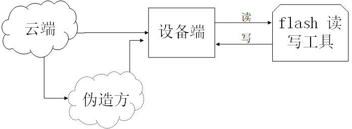
</div>
<center>图 12-1 设备端与云端交互数据时可能面临的安全风险</center>  

如我们将看到的那样，除非采取适当的措施，否则设备端的数据安全将无法获得保障。实际的环境中，存在的真实的威胁远远不只如此，因为物联网设备经常要和其他设备进行通信，并且一些设备工作在无人值守的环境中，容易被坏家伙们直接获取并采用分析仪器分析、篡改数据，使得设备的数据安全需求更加迫切。  

### 12.1.2 物联网设备数据安全的基本要求
保护物联网设备数据安全需要从数据的存储、数据的传输两个方面进行讨论，它们分别对数据的完整性、机密性、合法性保护提出了需求：  

<div align="center">
   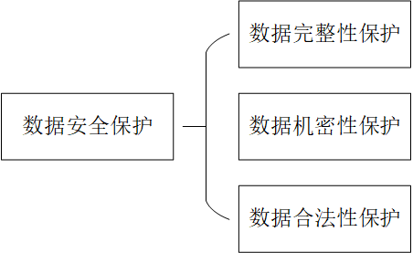
</div>
<center>图 12-2 数据安全的基本组成部分</center>  

数据传输时对安全性的要求主要体现在以下三个方面：  

- 数据完整性：数据传输过程中未被篡改或者产生误码。

- 数据机密性：传输的报文是加密后的报文，攻击者无法监听到数据的真实内容。

- 数据合法性：正在通信的对端设备是一个可信的目标设备。  

数据存储时对安全性的要求主要体现在以下三个方面：  

- 数据完整性：数据存储过程中未被篡改或者损坏。

- 数据机密性：存储的数据被读取后，攻击者无法破解数据的真实内容。

- 数据合法性：正在使用的数据是经过鉴权认证的数据。  

当然，数据的存储、数据的传输两个方面的数据保护并不是绝对独立的，它们也相互补充，共同构成了物联网设备数据安全这个统一的框架。在建立了上述框架，明确了一些概念和物联网设备数据安全的需求后，我们将分步骤地学习如何实现物联网设备数据的保护。  

## 12.2 数据完整性保护

### 12.2.1 完整性校验方法简介

对一段数据进行完整性校验，通常使用到一个称为**校验和**（也叫做摘要、指纹、hash 值、散列值）的概念。校验和是由相应的完整性校验算法生成的具有固定长度的校验数据，该校验数据基本代表了该数据块的唯一性，就如同每个人的指纹或者身份证号可以唯一代表一个人的信息一样。  

<div align="center">
   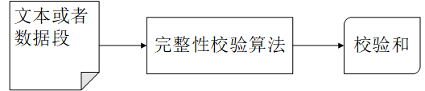
</div>
<center>图 12-3 完整性校验算法</center>  

完整性校验算法具有下列性质：  

- **抗碰撞性**：在算法规定的数据长度内，找不到（或很难找到）任意两个不同的数据段 x 和 y 使得由该算法生成的校验和完全相同。
- **原数据不可计算性**：在已知校验和而未知原始数据段的情况下，很难通过校验和反向推算出原始数据段。

若对完整性校验算法输入不同的数据，并得到相同的校验和，则称该现象为发送了一次“碰撞”。常见的完整性校验算法有 CRC、MD5、sha1和sha256等，它们得到的校验和长度不一样，产生碰撞的概率也不同。比如，CRC32 的校验和长度为 32 字节，理论上能保证 512M 长度范围内的数据不发生碰撞，但超出这个范围的数据发生碰撞的概率将增大。  

对数据块执行完整性校验的常见方法是为待校验的数据块附加校验和。如图 12-4，在数据块的后面追加校验和，在接收到该数据块后或者使用数据前，重新计算该段数据的校验和，对比附加在数据段后面的校验和，若计算得到的校验和 = 附加的校验和则认为数据完整，否则认为数据被篡改或发生误码。

<div align="center">
   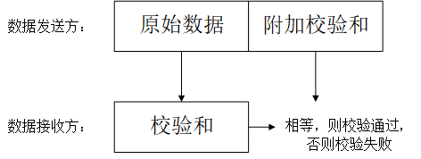
</div>
<center>图 12-4 完整性校验的基本原理</center>  

### 12.2.2 固件数据的完整性校验

我们以 OTA 过程固件数据的完整性校验为例，介绍固件数据的完整性校验是如何设计的。

<div align="center">
   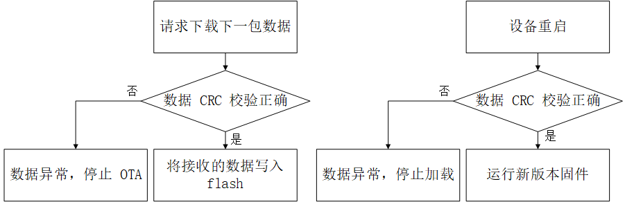
</div>
<center>图 12-5 固件更新时在数据传输、数据应用前执行完整性校验</center>  

在执行 OTA 过程中，若使用 HTTPS 传输数据，则数据发送方在发送数据前会生成数据段的 CRC 校验和，然后数据接收方将重新对接收到的数据计算 CRC 校验和，并执行类似图 12-3 中所示的校验过程。值得注意的时，当我们使用 HTTPS 传输数据时，我们完全不必关心 CRC 校验的过程，HTTPS 协议内部已经自动帮我们做了校验。  

此外，设备在使用存储在 flash 上的固件数据时，也会校验固件的完整性。每次设备重启加载 app 固件数据时，都会通过固件数据附带的 CRC 校验数据做完整性检查。来确保即将运行的 app 固件数据是未损坏的。该过程是自动发生的，我们不必再次手动实现了。  

然而，仅仅对数据的完整性进行检查，对实现数据安全的保护是远远不够的。因为这些完整性校验算法的原理和实现通常都是开源的，那些别有用心的攻击者同样可以使用相同的 CRC 校验算法，对一个自定义的固件附加 CRC 校验和，烧录到设备的 flash 中，从而通过设备的 CRC 校验，并被正常运行。为了避免这种情况，我们需要对数据的来源进行鉴别，这就涉及到了数据的合法性保护的方案-secure boot 方案，我们将在后面的章节中讨论它。  

### 12.2.3 示例

linux 系统下集成了一些用于计算校验和的工具，如 crc32、sha256sum 和 md5sum，我们可以使用这些工具计算指定文件的校验和，并比较修改文件内容前后生成的校验和的变化。如下所示，在终端通过 md5sum 命令计算 hello.c 文件修改前后的校验和：  

```shell
$ md5sum hello.c
87cb921a75d4211a57ba747275e8bbe6 // 原始 hello.c 的 md5 校验和
$ md5sum hello.c
79c3416910f9ea0d65a72cb720368416 //  向 hello.c 文件中添加一行打印语句后的 md5 校验和
```

可见，源文件即便仅仅是修改一句代码，其最终得到的 md5 校验和也将发生较大的变化。  

## 12.3 数据机密性保护

### 12.3.1 数据加密简介

数据加密的目的是使得入侵者无法知道数据的真实含义，同时保证数据的使用者可以正确地解析数据。现在假设要对 flash 上的数据进行加密，以防止别人读取并查看 flash 上的数据。图12-6 说明了一些重要的术语。存储在 flash 上的原始数据被称为**明文数据**，使用**加密算法**，生成的加密数据称为**加密数据**或**密文**，加密数据对任何入侵者看来是不可理解的。加密算法使用到了一个**密钥 Key**，它是一串数字或字符。在下述实例中，加密算法的加密规则是：将原字符串中的每个字符替换为加 1 后字符，即原字符对应的 ASCII 码加 1 得到的字符，其使用密钥是一个整形数字：1。  

<div align="center">
   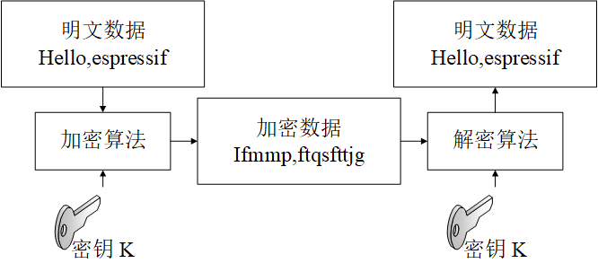
</div>
<center>图 12-6 数据加密的基本原理</center>  

所有数据加密算法都涉及用一组数据替换另一组数据的思想，图 12-6 使用了最简单的单码替换加密算法，实际使用的加密算法比这种简单的加密算法复杂的多，但它们的基本思想都是这样的。  

数据加密算法通常可以分为两类：**对称加密**算法和**非对称加密**算法。  

- 对称加密。顾名思义就是加密和解密使用的密钥是相同的，常见的对称加密算法有 DES、3DES 和 AES 等。图 12-6 所示的加密过程就是对称加密的基本过程，加密和解密使用的密钥是相同的，即都是数字 1。  

- 非对称加密。在非对称加密算法中，需要使用两个不同的密钥：公钥和私钥，它们是具有特定关联关系的一对字符串，其中公钥加密的内容，只有与之配对的私钥才能解密；如果是私钥加密的内容，则只有与之配对的公钥才能解密。  

使用对称加密的一个前提条件是加密者和解密者必须就共享密钥达成一致，即它们必须提前知道密钥的内容。但是，在某些情况下，加密者和解密者之间可能从未见过面，也不会通过网络以外的任何途径进行数据交互。此时，加密者和解密者能够在没有预先商定密钥的条件下进行加/解密吗？非对称加密算法可以在这种场景下满足这种需求。  

图 12-7 为组合使用非对称加密和对称加密传输加密数据的基本过程，其中非对称加密用于传输对称加密要使用的密钥，通信双方获取到对称加密的密钥 KEY 后，使用相对节省资源的对称加密算法保护通信数据的机密性。  

<div align="center">
   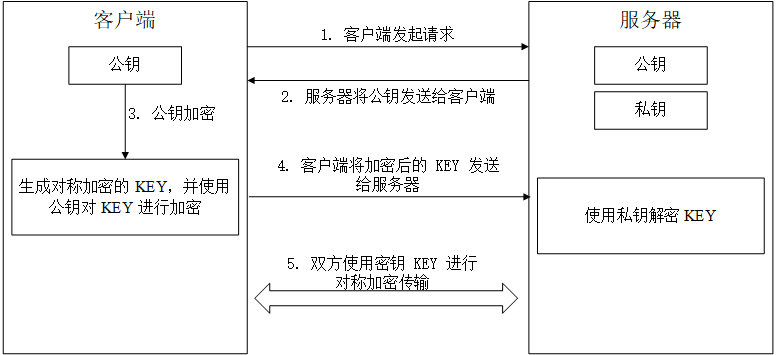
</div>
<center>图 12-7 使用非对称加密传输对称加密的密钥</center>  

常见的非对称加密算法是 RSA 算法。但是，本书并不详细地介绍加密算法的方方面面，在掌握了上述数据加密的集成知识后，我们可以开启下一段新的旅程了。  

### 12.3.2 Flash 加密方案概述

Flash 加密方案用于增强数据安全中数据机密性保护。启用 flash 加密功能后，物理读取的 flash 上的数据便无法识别其原始内容。如前所述，数据机密性保护需要从数据传输、数据存储两个方面进行考虑，flash 加密功能用于保护存储在设备上的数据的机密性，数据传输时的机密性保护需要其他方案，如使用支持加密的传输协议把 HTTPS 来实现。  

#### 12.3.2.1 与 flash 加密方案相关的存储区域

与 flash 加密方案相关的存储介质，有 efuse 和 flash 两种。它们都用于存储数据，但是具有不同的性质与用途：  

| 存储介质 |                         主要存储内容                         |                             特性                             |
| :------: | :----------------------------------------------------------: | :----------------------------------------------------------: |
|  flash   |         bootloaeder.bin、app、nvs 数据和分区表等数据         |                      允许反复擦除和读写                      |
|  efuse   | 芯片版本和 wifi mac 等系统参数，以及与一些系统功能相关的密钥和控制位 | 具有不可逆的写入特性，即每个 bit 位只能从 0 写为 1，且一旦写为 1 将无法重置为 0。特别地，一些 efuse 中的区域在开启读保护后，这些区域的数据仅能通过设备自身的硬件模块访问。 |

Flash 加密方案加密的数据内容是存储在 flash 上的数据，包括：  

- bootloader
- 所有 app 分区存储的 app
- 分区表
- 其他在分区表中标记 “encrypted” 的分区数据  

以下述分区表为例，启用 flash 加密后将加密的分区包括：bootloader 分区、factory 分区、storage 分区和 nvs_key 分区。其中用于存储固件的分区，如 bootloader 分区和 facroty 分区是默认加密的，因此不必对其添加 "encrypted" 标志。  

```
# Name,   Type, SubType, Offset,  Size, Flags
nvs,        data, nvs,      ,  0x6000,
# Extra partition to demonstrate reading/writing of encrypted flash
storage,    data, 0xff,     ,  0x1000, encrypted
factory,    app,  factory,  , 1M,
# nvs_key partition contains the key that encrypts the NVS partition named nvs. The nvs_key partition needs to be encrypted.
nvs_key,    data, nvs_keys, , 0x1000, encrypted,
```

Flash 加密方案用于加密 flash 上的数据，但是该方案的实现还用到了 efuse 存储介质。ESP32C3 的 efuse 中与 flash 加密功能相关的数据域主要是：  

|     efuse 中的区域名称      |                             描述                             | 长度（bit） |
| :-------------------------: | :----------------------------------------------------------: | :---------: |
|         BLOCK_KEYN          |   用于存储 flash 加/解密的密钥，其中 N 的取值范围为[0，4]    |     256     |
| DIS_DOWNLOAD_MANUAL_ENCRYPT |      设置后，在下载引导模式下禁用 flash 加密下载的功能       |      1      |
|     SPI_BOOT_CRYPT_CNT      | 启用/关闭 flash 加密的功能，奇数位个 bit 的值为 1 时启用 flash 加密功能 |      3      |

我们可以使用 espefuse.py 查看 ESP32C3 当前的 efuse 的状态，如使用下述命令，将看到上述 一些 efuse 区域的当前值。  

```shell
$ espefuse.py --port PORT summary // 使用当前设备的 port 口替换示例中的 PORT
```

输出 log 如下，其中 FLASH_CRYPT_CNT 为 0，代表当前未启用 flash 加密:  

```
espefuse.py v2.6-beta1
Connecting........_____.
EFUSE_NAME             Description = [Meaningful Value] [Readable/Writeable] (Hex Value)
----------------------------------------------------------------------------------------
Security fuses:
FLASH_CRYPT_CNT        Flash encryption mode counter                     = 0 R/W (0x0)
FLASH_CRYPT_CONFIG     Flash encryption config (key tweak bits)          = 0 R/W (0x0)
CONSOLE_DEBUG_DISABLE  Disable ROM BASIC interpreter fallback            = 1 R/W (0x1)

Identity fuses:
MAC                    MAC Address                                       
  = 30:ae:a4:c3:86:94 (CRC 99 OK) R/W 
...
```

#### 12.3.2.2 flash 加密方案使用的加密算法

Flash 加密使用对称加密算法 AES-XTS。该算法是一种可调整分组加密算法，在执行加密时，它分块加密明文数据，并依据明文的偏移地址动态地调整密钥执行加密。如图 12-8 所示，64 字节的数据被划分为四块，加密每块数据使用的 key 均是由一个 base_key 派生的 key，将每块加密的数据块组合，就得到 64 字节的加密后的数据。  

<div align="center">
   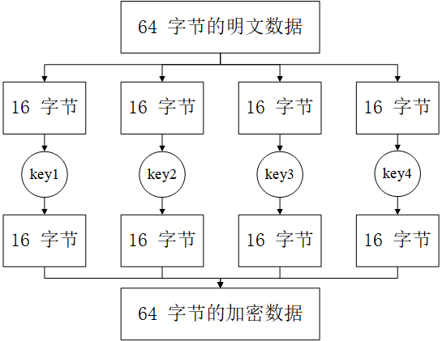
</div>
<center>图 12-8 AES-XTS-128 分组加密的基本原理</center>  

AES-XTS 这种动态地调整加密密钥，然后执行加密的的方法带来的好处是：

1）相同的数据块加密后得到的密文不相同。这使得加密后的数据更不容易被分析破解得到明文数据，因此增加了数据的机密性。

2）不同数据块可以独立加密和解密。一块加密的数据损坏后，并不影响另一块数据的解密，数据块之间的加/解密相对独立。

### 12.3.3 存储 flash 加密的密钥

Flash 加密功能的密钥最终将保存在 efuse 中 BLOCK_KEY 区域中，将密钥导入 efuse 的方式有两种：  

- 手动方式：手动生成密钥并将密钥导入到 efuse 中，这种方式只能在第一次启用 flash 加密前使用。
- 自动方式：首次启用 flash 加密时，设备内部自动生成密钥，并自动将密钥保存在 efuse 中。  

使用手动方式导入密钥时，需预先生成 flash 加密的密钥。  

运行下述命令生成密钥：  

```shell
$ espsecure.py generate_flash_encryption_key my_flash_encryption_key.bin
```

运行下述命令手动将密钥导入 efuse：  

```shell
$ espefuse.py --port PORT burn_key BLOCK my_flash_encryption_key.bin XTS_AES_128_KEY
```

**注意**：由于 efuse 具有不可逆的写入特性，所以手动将密钥导入 efuse 的操作只能执行一次。  

我们可以通过 `menuconfig -> Security features -> Enable flash encryption on boot` 选项使能 flash 加密的功能。若在编译时使能了 flash 加密功能，并且没有预先通过手动方式导入加密密钥，则烧录固件后，设备将启用 flash 加密，然后自动地生成密钥，并将密钥导入到 efuse 中。  

手动方式和自动方式两者之间主要的区别：使用手动方式时，我们是可以知道密钥的内容的，可以使用脚本工具手动加密数据，然后将加密的数据烧录到设备上；自动方式下，efsue 中若开启了对 BLOCK_KEY 的读保护（默认是开启的），由于密钥在设备内产生，并且直接存储在 efuse 内的密钥是读保护的，则外界的所有的开发人员，都无法获取密钥的内容，更不能手动加解密数据。  

手动方式下，我们可以执行下述命令加密 app 固件，然后将加密的 app 固件烧录到设备中运行。  

```shell
$ espsecure.py encrypt_flash_data --aes_xts --keyfile /path/to/key.bin --address 0x10000 --output my-app-ciphertext.bin build/my-app
```

值得一提的是，输入上述 `espsecure.py encrypt_flash_data` 命令加密数据的时候，必须指定要加密的数据块在分区表中的存储地址，示例中要加密的数据是 app，其地址为 0x10000。正如 12.3.2.2 中谈到的内容，Flash 加密使用的算法是可调整分组加密算法 AES-XTS，该算法加密的过程与数据所在的位置相关，如果不指明位置或者直指定的位置是错误的，则将加密后的固件烧录后，设备将会出错。此外，在知道密钥的情况下，脚本工具 espsecure.py 也可以解密加密后的内容，具体的使用方法可以运行命令 `espsecure.py -h`获取帮助信息。  

在量产时推荐使用自动方式导入密钥，因为为每个设备配置不同的密钥，并且密钥从不在设备之外被使用将提高设备的安全性。  

### 12.3.4 flash 加密的工作模式

Flash 加密共有两种工作模式：  

- 开发模式。故名思意，是开发阶段可以使用的工作模式。在开发阶段常需编写不同的明文固件，以及测试 flash 的加密过程。这要求能够根据需求不断地将新固件烧录到设备端。开发模式下可以选择关闭已经启用的 flash 加密功能，并且可以通过命令重新烧录新固件，我们将在 12.3.7 中介绍具体的操作方法。  

- 量产模式。在设备量产时推荐使用的工作模式。在设备量产后，出于安全考虑，串口不应有权限访问 Flash 内容，因此启用该模式后，将默认禁用串口访问 flash 的功能。此外，在该模式下，启用 flash 加密后，不可以关闭 flash 加密功能，且不可以通过串口烧录来更新设备的固件，只能通过 OTA 的方式更新固件。  

两种工作模式的选择，可以通过 menuconfig -> security features -> Enable flash encryption on boot -> Enable usage mode 选项来选择，图 12-9 显示将 flash 加密的功能配置为开发模式：  

<div align="center">
   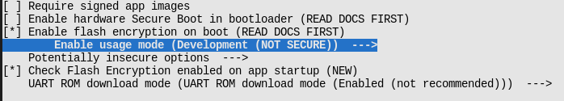
</div>
<center>图 12-9 配置 flash 加密的工作模式</center>  

**注意**：开发模式下可以通过 `espefuse.py --port PORT burn_efuse SPI_BOOT_CRYPT_CNT`命令关闭已经启用的 flash 加密的功能，关闭 flash 加密功能后，请在 menuconfig 中 关闭 flash 加密的功能，然后再使用 `idf.py flash`重新烧录新固件。espefuse.py 的详细用法参考 [espefuse.py](https://github.com/espressif/esptool/wiki/espefuse) 。  

注意，使能 flash 加密后，bootloader 的体积可能增大，可以通过下述两种方法进行调整：  

1）通过 `menucofig -> Partition Table -> Offset of partition table` 调整分区表在 flash 上的偏移地址，如将默认的偏移地址 0x8000 增大到 0xa000，则存储 bootloader 的 flash 空间将增大 8KB。  

2）通过` menuconfig -> Bootloader log verbosity` 更改 bootloader 编译时的 log 级别。将默认的 log 级别 Info 改为 Warning，将减少固件中 log 的数量，从而缩小 bootloader 固件的大小。  

**注意 **： 更多 bootloader size 的说明，请参考 [bootloader size](https://docs.espressif.com/projects/esp-idf/en/latest/esp32c3/api-guides/bootloader.html#bootloader-size) 。

### 12.3.5 flash 加密的一般工作流程

将首次启用 flash 加密功能的**明文固件**烧录到设备上，并启动设备后，将自动启用 flash 加密功能。设备首次启用 flash 加密的基本工作流程是：  

1）bootloader 读取 efuse 中的 SPI_BOOT_CRYPT_CNT 区域的值，若未启用 flash 加密则启用 flash 加密。默认情况下，该区域的值为 0，代表还未启用 flash 加密。  

2）bootloader 检测存储 flash 加密密钥的 efuse 存储块 **BLOCK_KEY** 中是否已经存储密钥数据，若未预先烧录密钥（参考12.3.2.2）则自动生成密钥并写入**BLOCK_KEY**，然后开启该存储块的读/写保护，软件将无法读/写该密钥。  

3）调用 flash 加密模块，加密 flash 中需要加密的数据，包括 bootloader、app 和 其他在分区表中标记 “encrypted” 的分区的数据。  

4）bootloaer 设置 efuse 中的 SPI_BOOT_CRYPT_CNT 区域的值为 1，标识已经启用了 flash 加密。  

5）若启用的 flash 加密为开发模式，efuse 中的 SPI_BOOT_CRYPT_CNT 和 DIS_DOWNLOAD_MANUAL_ENCRYPT 数据块将不被写保护，从而允许关闭 flash 加密的功能和重新烧录加密的固件。  

6）若启用的 flash 加密为量产模式，efuse 中的 SPI_BOOT_CRYPT_CNT 和 DIS_DOWNLOAD_MANUAL_ENCRYPT 数据块将被写保护，从而永久使能 flash 加密的功能并禁止重新烧录固件。  

7）设备自动重启，加载并运行加密后的 bootloader 和 app。  

**注意**：启用 flash 加密后，一些 efuse 标志位将默认被置位，来关闭一些系统功能，如 JTAG。继续保留这些系统功能可能带来安全风险，作为测试，如果需要保留这些标志位，请参考 [Enabling UART Bootloader Encryption/Decryption](https://docs.espressif.com/projects/esp-idf/en/latest/esp32c3/security/flash-encryption.html#enabling-uart-bootloader-encryption-decryption) 。

启用 flash 加密后，设备加载运行加密的 bootloader 和 app 时，将自动通过硬件模块解密对应的数据，然后将解密后的数据加载到设备的 cache 中运行。此外，启用 flash 加密后，一些 API 在读/写 flash 上加密分区的数据时将自动加密/解密数据，主要有：  

- 自动加密数据的 API:  

1）esp_partition_read()  

2）esp_flash_read_encrypted()  

3）bootloader_flash_write()  

- 自动解密数据的 API：  

1）esp_partition_write()   

2）esp_flash_write_encrypted()  

3）bootloader_flash_read()  

特别地，启用 flash 加密后，在执行 OTA 时，设备接收的是明文数据，在将接收到的明文数据写入 flash 时，将调用上述的 esp_partition_write()，自动加密数据，以适应 flash 加密方案的特性。  

**注意**：设备量产后，OTA 功能可以远程更新 app 固件，但无法更新 bootloader 固件，因此启用 flash 加密后，请注意 bootloader 的相关配置，如 log 级别的配置。  

### 12.3.6 NVS 加密方案简介

Flash 加密方案并不直接保护存储在 nvs 分区的数据，存储在 nvs 分区的数据需要 NVS 加密方案来保护其机密性。我们可以通过 `menuconfig -> Component config -> NVS ->Enable NVS encryption` 选项启用 NVS 加密，或者在代码中调用 `nvs_flash_secure_init()` 函数启用它。  

NVS 加密方案的基本原理是：在分区表中定义一块不少于 4KB 大小的子类型为 nvs_key 的分区，在使能 NVS 加密后，NVS 中的数据将使用 nvs_key 分区的密钥加密 NVS 分区的内容。一种典型的支持 NVS 加密的分区表如下所示：  

```
# Name,   Type, SubType, Offset,  Size, Flags
nvs,        data, nvs,      ,  0x6000,
phy_init,   data, phy,		,  0x1000,
factory,    app,  factory,  , 1M,
nvs_key,    data, nvs_keys, , 0x1000, encrypted,
```

与 flash 加密方案有很多类似的地方，包括：  

1）NVS 加密使用的加密算法是对称加密算法  AES-XTS。如前所述，对称加密算法要求其密钥是保密的，这样才能保证加密后的数据不被分析破解。所以 NVS 加密的 key 不能是明文的，因此该方案经常与 flash 加密方案结合使用，其中 flash 加密方案负责保护 nvs_key 的机密性，NVS 加密方案使用 nvs_key 保护 NVS 分区的数据的机密性。  

2）存储 NVS 加密密钥的方式有两种。  

- 手动方式。手动生成一个密钥，并将密钥写入到指定的分区。  
- 自动方式。首次启用 NVS 加密，且对应的 nvs_key 分区的内容为空时，设备内部将自动调用 `nvs_flash_generate_keys()` 函数生成密钥，然后将密钥写入 nvs_key 分区，并使用该密钥完成 NVS 加/解密。  

手动方式存储 NVS 加密密钥的步骤如下：  

首先，生成一个包含密钥的文件:  

```
espsecure.py generate_flash_encryption_key my_nvs_encryption_key.bin
```

然后，编译并烧录分区表：  

```
idf.py -p (PORT) partition_table-flash
```

最后，将密钥烧录到指定的分区：  

```
parttool.py --port /dev/ttyUSB0 --partition-table-offset "nvs_key partition offset" write_partition --partition-name="name of nvs_key partition" --input "nvs_key partition"
```

3）启用 NVS 加密后，以 "nvs_get" 以及 “nvs_set” 开头的 API， 在读/写 NVS 数据时将自动完成数据加/解密。  

**注意**：
启用 flash 加密后，推荐启用 NVS 加密（默认启用），这是因为 WiFi 驱动程序在默认 NVS 分区中存储存储一些重要数据（如SSID和密码）。  
NVS 加密方案支持为多个不同的 NVS 分区使用不同的 nvs_key，在初始化对应的 NVS 分区时，指定其使用的 nvs_key 即可。更多内容可参考 [NVS加密](https://docs.espressif.com/projects/esp-idf/en/latest/esp32c3/api-reference/storage/nvs_flash.html#nvs-encryption)。  

### 12.3.7 示例

ESP-IDF 的 `examples/security/flash_encryption` 下提供了 flash 加密和 NVS 加密的 [示例](https://github.com/espressif/esp-idf/tree/master/examples/security/flash_encryption)。运行该示例，可以观察启用 flash 加密和 nvs 加密后的日志信息。  

如前所述，若启用的 flash 加密模式为开发模式，可以重复烧录固件。我们可以尝试使用下述三条命令烧录固件数据到启用了 flash 加密（开发模式）的设备上：  

命令 1:  

```
idf.py -p PORT flash monitor
```

命令 2:  

```
idf.py -p PORT encrypted-flash monitor
```

命令 3:  

```
idf.py -p PORT encrypted-app-flash monitor
```

上述三条命令执行的情况和结果分别是：  

当使用命令 1 执行烧录时，flash 上最终存储的将是明文数据，从而出现无法加载的错误。  

使用命令 2 将仅烧录加密的 bootloader、app 和分区表，设备可以正常加载运行。  

使用命令 3 将仅烧录加密的 app 固件，若 bootloader 是已经加密的，则设备可以正常加载运行。  


上述三条命令内部实际调用了 esptool.py，它们分别对应的 esptool.py 的命令参数为：  

```
esptool.py esp32c3 -p /dev/ttyUSB0 -b 460800 --before=default_reset --after=no_reset write_flash --flash_mode dio --flash_freq 40m --flash_size 2MB 0x1000 bootloader/bootloader 0x20000 flash_encryption.bin 0xa000 partition_table/partition-table.bin

esptool.py esp32c3 -p /dev/ttyUSB0 -b 460800 --before=default_reset --after=no_reset write_flash --flash_mode dio --flash_freq 40m --flash_size 2MB --encrypt 0x20000 flash_encryption.bin

esptool.py esp32c3 -p /dev/ttyUSB0 -b 460800 --before=default_reset --after=no_reset write_flash --flash_mode dio --flash_freq 40m --flash_size 2MB --encrypt 0x1000 bootloader/bootloader 0x20000 flash_encryption.bin 0xa000 partition_table/partition-table.bin
```

通过对比上述 esptool.py 对应的选项和参数，我们不难得出结论：使用 esptool.py 烧录时，添加选项 --encrypt，将在烧录时，启用 flash 自动加密的功能，将加密的数据写入到 flash 中。  

启用 flash 加密后，几种常见的错误有：  

1）启用 flash 加密后，若烧录明文 bootloader 数据，启动设备后，可能出现下述 log:  

```
rst:0x3 (SW_RESET),boot:0x13 (SPI_FAST_FLASH_BOOT)
invalid header: 0xb414f76b
invalid header: 0xb414f76b
invalid header: 0xb414f76b
invalid header: 0xb414f76b
invalid header: 0xb414f76b
invalid header: 0xb414f76b
invalid header: 0xb414f76b
```

2）启用 flash 加密后，若烧录明文分区表，启动设备后，可能出现下述 log:  

```
rst:0x3 (SW_RESET),boot:0x13 (SPI_FAST_FLASH_BOOT)
configsip: 0, SPIWP:0xee
clk_drv:0x00,q_drv:0x00,d_drv:0x00,cs0_drv:0x00,hd_drv:0x00,wp_drv:0x00
mode:DIO, clock div:2
load:0x3fff0018,len:4
load:0x3fff001c,len:10464
ho 0 tail 12 room 4
load:0x40078000,len:19168
load:0x40080400,len:6664
entry 0x40080764
I (60) boot: ESP-IDF v4.0-dev-763-g2c55fae6c-dirty 2nd stage bootloader
I (60) boot: compile time 19:15:54
I (62) boot: Enabling RNG early entropy source...
I (67) boot: SPI Speed      : 40MHz
I (72) boot: SPI Mode       : DIO
I (76) boot: SPI Flash Size : 4MB
E (80) flash_parts: partition 0 invalid magic number 0x94f6
E (86) boot: Failed to verify partition table
E (91) boot: load partition table error!
```

3）启用 flash 加密后，若烧录明文 app 固件，启动设备后，可能出现下述 log:  

```
rst:0x3 (SW_RESET),boot:0x13 (SPI_FAST_FLASH_BOOT)
configsip: 0, SPIWP:0xee
clk_drv:0x00,q_drv:0x00,d_drv:0x00,cs0_drv:0x00,hd_drv:0x00,wp_drv:0x00
mode:DIO, clock div:2
load:0x3fff0018,len:4
load:0x3fff001c,len:8452
load:0x40078000,len:13616
load:0x40080400,len:6664
entry 0x40080764
I (56) boot: ESP-IDF v4.0-dev-850-gc4447462d-dirty 2nd stage bootloader
I (56) boot: compile time 15:37:14
I (58) boot: Enabling RNG early entropy source...
I (64) boot: SPI Speed      : 40MHz
I (68) boot: SPI Mode       : DIO
I (72) boot: SPI Flash Size : 4MB
I (76) boot: Partition Table:
I (79) boot: ## Label            Usage          Type ST Offset   Length
I (87) boot:  0 nvs              WiFi data        01 02 0000a000 00006000
I (94) boot:  1 phy_init         RF data          01 01 00010000 00001000
I (102) boot:  2 factory          factory app      00 00 00020000 00100000
I (109) boot: End of partition table
E (113) esp_image: image at 0x20000 has invalid magic byte
W (120) esp_image: image at 0x20000 has invalid SPI mode 108
W (126) esp_image: image at 0x20000 has invalid SPI size 11
E (132) boot: Factory app partition is not bootable
E (138) boot: No bootable app partitions in the partition table
```

## 12.4 数据合法性保护

### 12.4.1 数字签名简介

你可能曾经在入学申请、法律文件和信用卡收据上签名，这份签名证明你同意这些文件的内容。在数据安全领域，设备需要识别出一段数据的发送方或者数据内容的制作者，以表明这些数据是未被伪造的、已经授权合法的和可以被安全使用的。数字签名是实现数据合法性检查的一种技术方案。  

数字签名需要考虑两个方面：  

- 签名的不可伪造性。即只有合法的数据发送方可以对数据进行签名，其他的签名是无效的。  
- 签名的可验证性。即数据的使用者必须可以验证签名的有效性。  

常见的数字签名算法有 RSA 算法和 DSA 算法。数字签名验证的基本流程是：  
1）数据发送方生成私钥，通过私钥生成公钥，得到一个私钥/公钥对。注意只有私钥能生成与其匹配的公钥。  
2）将公钥保存到数据使用方的存储系统中。  
3）数据发送方使用私钥对数据进行签名，并将数据及其签名发送给数据使用方。  
4）数据接收方接收到数据后，使用步骤 2 存储的公钥校验步骤 3 发送的签名，若签名正确，则认为此次的数据来源于合法的数据发送方，否则就认为数据是未经授权的数据，不予采用。  

<div align="center">
   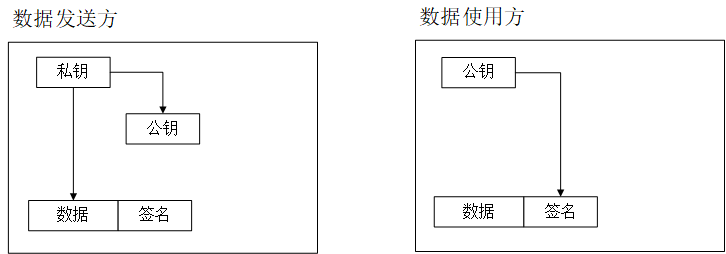
</div>
<center>图 12-10 使用数字签名验证数据合法性的基本原理</center>  

通过这种“私钥颁发公钥，然后私钥签名，公钥验证签名”的机制，就可以认证数据的来源是否正常。但是，你可能注意到了这个方案有效发挥作用的前提条件：  

1）数据发送方的私钥不能泄漏。私钥一旦对外公布，攻击者就可以使用公开的私钥对非法数据进行签名，并把非法数据交付给数据使用方，则这种验证机制就会失效。  

2）数据接收方的公钥不能被随意地移除。假如有攻击者在自己的系统上生成一个私钥/公钥对，并将数据使用方的公钥替换为自己的公钥，则就可以使用攻击者自身的私钥对非法数据进行签名，然后将非法数据发送给数据使用方，数据使用方可能使用已被替换的公钥验证攻击者发送的数据，从而认为数据是合法的。  

在下面的介绍中我们可以看到 secure boot 如何对上面的问题进行设计的，带着问题开启下一小节的旅程吧。  

### 12.4.2 Secure boot 方案概述

Secure boot 方案用于实现固件数据（包括 bootloader、app）的合法性保护，它使用 RSA 数字签名算法，在加载运行新的固件数据前，对固件数据附加的签名进行校验，从而验证即将加载运行的固件数据是否合法。启用 secure boot 方案后，设备将仅加载运行指定私钥签名授权的固件。  

Secure boot 中文释义为“安全引导” 或 “安全启动”，因此，在介绍 secure boot 的实现原理前，我们来简单复习下 ESP32C3 的启动引导流程：  

<div align="center">
   
</div>
<center>图 12-11 esp32c3 启动引导示意图</center>  

设备上电后，系统首先运行 Rom boot，然后从 Rom boot 跳转到 Bootloader，最后 bootloader 运行结束将跳转到 app 程序运行。其中，Rom boot 是固化在片内 Rom 中的一段可执行程序，它不可被更改。因此，secure boot 方案需要保护的数据是可能发生改变的 bootloader 和 app 这两种固件。更改固件数据的方式有两种：  

- 物理烧录。即通过烧录工具，将新的 bootloader 和 app 烧录到设备的 flash 中。  

- OTA 固件更新。这种方式仅能更新 app，不能更新 bootloader。  

那么，如何保证设备使用的固件数据，无论从哪种途径下发到设备上都是合法的呢？带着疑问，我们在下面的两个小节将分别介绍 secure boot 的两种工作模式：  

- Software secure boot  
- Hardware secure boot  

**注意**：secure boot 方案有两个版本，即 V1 和 V2，ESP32C3 仅支持 V2，因此这里的介绍主要适用于 Secure boot V2.  

### 12.4.3 Software secure boot 介绍

Software secure boot，即软件 secure boot（简称：软 secure boot），是一种无硬件（主要是efuse）参与校验的 secure boot 方案。  

在启用软 secure boot 方案前，需要生成 RSA 签名私钥，运行下述命令生成私钥：  

```
espsecure.py generate_signing_key --version 2 secure_boot_signing_key.pem
```

生成的私钥数据将保存在 `secure_boot_signing_key.pem`文件内。  

启用软 secure boot 的方法很简单，在 menuconfig 中，选中 “Require signed app images” 选项，然后编译烧录固件即可。  

<div align="center">
   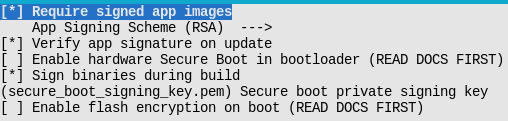
</div>
<center>图 12-12 esp32c3 使能 software secure boot</center>  

启用软 secure boot 后，编译固件时，将在烧录的固件 origin_app 中包含公钥，该公钥将用于验证 OTA 下发的新固件 new_app 的合法性。如图 12 -13 所示，当执行 OTA 时，接收完固件，调用 `esp_ota_end()` 或者 `esp_ota_set_boot_partition()` 函数时，其内部将自动使用 origin_app 中的公钥校验新固件 new_app 中附带的数字签名。  

<div align="center">
   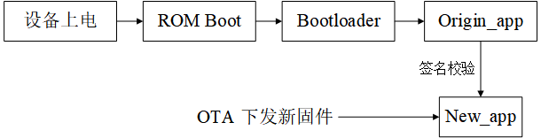
</div>
<center>图 12-13 software secure boot 校验新下发的 app 固件</center>  

启用软 seure boot 后，通过 OTA 的方式下发到设备的 app 固件必须使用私钥进行签名，有两种方式进行签名：  

1）如图 12-12 所示，我们可以通过使能选项 `Sign binaries during build`，并指明私钥文件的目录位置，编译时自动对 app 固件进行签名。  

2）使用命令对 app 固件进行签名：  

```
espsecure.py sign_data --version 2 --keyfile PRIVATE_SIGNING_KEY BINARY_FILE
```

上述命令将直接修改当前文件，并在当前文件中添加校验信息，我们可以使用 `--output` 选项指定添加签名后的文件的名称。使用命令对固件进行签名的方法允许我们将签名的私钥存储在远程服务器上，而不是存储在编译固件的主机上，因此对于设备量产后实现批量签名更加方便。  

启用软 secure boot 后，对 app 的签名将附加在 app 的后面的签名块中，签名块中包含了对固件的签名和验证签名需要的其他数据。对于 esp32c3，最多允许附加三个签名块，每个签名块可以使用不同的私钥对其进行签名，只要其中一个签名有效则校验通过。  

<div align="center">
   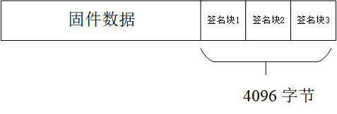
</div>
<center>图 12-14 esp32c3 签名后的 app 格式</center>  

**注意**： 在使用软 secure boot时，仅第一个签名块有效。  

对于验证签名的公钥被编译在当前运行的 app 固件中，我们完全不需要管理它，设备将自动管理公钥。如果想要查看公钥的具体内容，可以使用下述命令手动导出私钥的公钥：  

```
espsecure.py extract_public_key --version 2 --keyfile secure_boot_signing_key.pem pub_key.pem
```

其中 `secure_boot_signing_key.pem` 为私钥，`pub_key.pem` 为私钥生成的公钥。  

从软 secure boot 的实现原理不难看出，软 secure boot 通过 origin_app 校验 OTA 下发的 new_app，从而确保 new_app 的合法性。但是攻击者可能通过物理烧录的方式将未经签名授权的 bootloader 和 origin_app 烧录到设备上，因此软 seucre boot 方案无法应对这种物理攻击。所以，在确保设备部署在不会出现这种物理攻击场景时可以尝试使用 软 secure boot 方案。接下来，让我们探讨 hardware secure boot 方案是如何应对这种物理攻击的。  

**注意**：Software secure boot 的更多介绍见 [Signed App Verification Without Hardware Secure Boot](https://docs.espressif.com/projects/esp-idf/en/latest/esp32c3/security/secure-boot-v2.html#signed-app-verification-without-hardware-secure-boot)。  

### 12.4.4 Hardware secure boot 介绍

Hardware secure boot，即硬件 secure boot（简称：硬 secure boot），是一种添加了硬件校验的 secure boot 方案。  

硬 secure boot 方案中使用 efuse 硬件模块中存储的数据来校验固件数据的合法性，其中涉及的 efuse 中的区域主要有：  

| efuse 中区域的名称 |                             描述                             | 长度（bit） |
| :----------------: | :----------------------------------------------------------: | :---------: |
|   SECURE_BOOT_EN   |              设置后，将永久地使能硬 secure boot              |      1      |
|   KEY_PURPOSE_X    | 其中 X 为自然数，如 KEY_PURPOSE_1 用于标识 BLOCK_KEY1 存储的内容 |      4      |
|     BLOCK_KEYX     | 若对应的 KEY_PURPOSE_X 标识为 SECURE_BOOT_DIGEST1，则该区域用于存储 secure boot 公钥的 sha256 摘要 |     256     |

硬 secure boot 方案包含了 12.4.3 小节中所述的所有软 secure boot 的功能，在软 secure boot 的基础上，它提供了更多的校验，包括对烧录的 bootloader 和 origin_app 的签名校验。在 12.4.3 介绍的生成私钥/公钥对的方法、对 app 签名的方法和 app 签名的格式同样适用于硬 secure boot，这里不再重复介绍。  

使能硬 secure boot 后，除了需要对 app 进行签名外，还需要对使用的 bootloader 进行签名，其签名的方法和格式与 app 签名的方法和格式一致。但是，启用硬 secure boot 后，若需要对 bootloader 重新编译并签名需要单独运行 `idf.py bootloader`命令，并使用命令 `idf.py -p PORT bootloader-flash` 烧录 bootloader 固件，运行 `idf.py flash`命令将仅烧录签名后的 app 固件和分区表，不再自动烧录 bootloader 固件。  

我们可以按照下述步骤使能硬 secure boot：  

1）配置编译选项。如图 12-15，在 menuconfig -> Security features 菜单中，选中 “Enable hardware Secure Boot" 选项。  

2）如果需要在编译时对固件进行签名，请指定签名需要的私钥。如图 12-15，在 menuconfig -> Security features 菜单中，通过选项 "Secure boot private key" 指定签名需要的私钥文件。若还未生成私钥，请参考 12.4.3 中生成私钥的方法导出私钥。此外，我们也可以参考 12.4.3 中介绍的内容，通过 `espsecure.py`命令对固件进行签名。  

3）运行 `idf.py bootloader`，编译 bootloader 固件，然后运行命令 `idf.py -p PORT bootloader-flash` 烧录 bootloader 固件。  

4）运行 `idf.py flash monitor`，烧录 app 固件和分区表。  

5）设备启动后将运行上述编译的 bootloader，自动地将 efuse 中的 SECURE_BOOT_EN 标志位置位，永久使能硬 secure boot，并将 bootloader 的签名块中附带的公钥的摘要写入 efuse 的 BLOCK_KEY。  

<div align="center">
   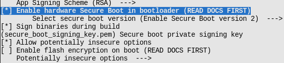
</div>
<center>图 12-15 编译时使能 hardware secure boot</center>  

**注意**：使能硬 secure boot 后，请务必保存好签名的私钥文件，否则可能导致无法将更改的 bootloader 和 app 固件数据下发到设备上。  

**注意**：使能硬 secure boot 后，bootloader 固件的体积将增大，因此可能需要调整分区表或者减小 bootloader 的大小，请参考 12.3.4 中的描述进行调整。  

**注意**：如果在 bootloader 中添加了较多内容，注意使用硬 secure boot 后，bootloader 固件的体积最大不能大于 0x10000，更多信息请参考 [bootloader size](https://docs.espressif.com/projects/esp-idf/en/latest/esp32c3/api-guides/bootloader.html#bootloader-size) 。

**提示**：硬 secure boot 在 efuse 中保存的是公钥的 sha256 摘要，而不是公钥本身。因为公钥本身的数据很多，efuse 的存储空间是受限的。  

使能硬 secure boot 后，设备在后续更新 bootloader 或者 app 时将按照下述步骤执行校验：  

1）公钥校验。设备上电后，Rom boot 检测 efuse，若使能了硬 secure boot，则读取 bootloader 中的公钥，计算公钥的摘要与存储在 efuse 中的公钥的摘要是否相等。若不相等则代表公钥已被篡改或损坏，引导终止。否则，则认为 bootloader 中公钥内容正确，继续向下执行。  

2）验证 bootloader 的签名。Rom boot 使用公钥校验 bootloader 的签名，若校验失败则引导终止。否则继续向下执行。  

3）验证即将加载的 origin_app 的签名。bootloader 使用公钥验证 origin_app 的签名，若校验失败则引导终止。  

4）当设备执行 OTA 时，将执行与软 secure boot 相同的过程，由 origin_app 验证 new_app 的签名。  

<div align="center">
   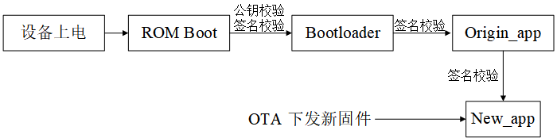
</div>
<center>图 12-16 hardware secure boot 签名校验的基本流程</center>  

**注意**：详细的签名校验过程除校验签名信息外，还会校验固件的摘要等信息，详细校验过程可参考 [Verifying the signature Block](https://docs.espressif.com/projects/esp-idf/en/latest/esp32c3/security/secure-boot-v2.html#verifying-the-signature-block)。  

硬 secure boot 从 Rom boot 开始签名校验，分层次地校验 bootloader、origin_app 和 new_app的签名，从而创建了从 rom boot -> bootloader -> origin_app -> new_app 之间的完整的可信链。  
通过上述硬 secure boot 执行签名校验的基本流程，不难看出 software secure boot 与 hardware secure boot 的区别：  

1）前者没有使用到 efuse，后者使用了 efuse。  

2）前者只能建立从 origin_app 到 new_app 之间的信任链，后者可以建立完整的从 rom boot -> bootloader -> origin_app -> new_app 之间的完整的可信链。  

3）后者从 Rom boot 到执行 origin_app 的过程中，增加了一些校验步骤，因此后者的 bootloader 的代码中需要执行的步骤更多，设备启动时间将变长，并且后者的 bootloader 的大小将略微增加。在设备需要快速启动，或者 bootloader 的大小需要足够小的应用场景，可以尝试使用前者。  

4）前者的私钥/公钥对是可以更换的，因为重新烧录 app 固件即可重新启用新的私钥/公钥对。后者的公钥的摘要已经固化在 efuse 了，因此一旦启用，就不能更换私钥/公钥对。  

5）前者可以重新烧录未使能软 secure boot 的 app 固件关闭软 secure boot 功能，后者一旦启用，将烧录 efuse 中的 SECURE_BOOT_EN 标志位，因此不可以关闭硬 secure boot。  

使能硬 secure boot 后，设备的使用将有一些限制，主要包括：  

1）设备只能运行签名过的 bootloader 和 app，因此烧录更改后的 bootloader 和 app，或者通过 OTA 更新 app 固件均需要使用对应的私钥进行签名。  

2）为了加强系统的安全性，默认情况下使能硬 secure boot 后将关闭 JTAG 调试功能、禁止 efuse 读保护并注销掉 efuse 中未使用的签名槽。测试开发阶段，如需保留这些功能，可通过 menuconfig -> Security features -> Potentially insecure options 菜单保留这些功能。量产时，应当默认关闭这些功能，增强设备的安全性。  

3）启用硬 secure boot 后设备的 UART 下载固件的功能将发生变化，其具体影响取决于 `menuconfig -> security features -> UART ROM download mode` 选项的值。UART ROM download mode 选项的值有三种，它们的介绍如下：  

| UART ROM download mode 的选项 |                             描述                             |
| :---------------------------: | :----------------------------------------------------------: |
|            Enabed             |                保留通过串口读/写 flash 的功能                |
|     Switch to Secure mode     | 仅保留串口读/写 flash 的基本功能，高级的功能如下载加密的固件将被禁止 |
|     Permanently disabled      |                关闭通过串口读/写 flash 的功能                |

我们在这里介绍了硬 secure boot 基本原理和常见的使用方法。硬 secure boot 还有很多高阶的用法，比如使用多个签名或者注销失效的公钥，关于这些内容可参考 ESP-IDF 中 [secure boot V2](https://docs.espressif.com/projects/esp-idf/en/latest/esp32c3/security/secure-boot-v2.html#secure-boot-v2) 查看更多的信息。  

### 12.4.5 示例

Secure boot 方案的功能已经集成在 ESP-IDF 中，我们只需要理解它的实现原理，结合需求在 menuconfig 中配置合适的选项启用它就可以了。硬 secure boot 提供更完整的固件合法性校验，因此我们应该在设备出厂时使用硬 secure boot 来增强设备的安全性。本小节介绍启用硬 secure boot 的一些示例，读者可以仿照示例进行测试。  此外，当向使能了硬 secure boot 的设备中下发新固件出错时，也可以参照下面的 log 进行分析，排查出错的原因。  

按照 12.4.4 中所述的步骤启用硬 secure boot 后，设备上电后将出现首次启用硬 secure boot 的 log:  

```
I (10251) secure_boot_v2: Secure boot V2 is not enabled yet and eFsue digest keys are not set
I (10256) secure_boot_v2: Verifying with RSA-PSS...
I (10254) secure_boot_v2: Signature verified successfully!
I (10272) boot: boot: Loaded app from partition at offset 0X120000
I (10274) secure_boot_v2: Enabling secure boot V2...
```

使能 secure boot 后的设备再次上电的 log:  

```
ESP-ROM:esp32c3-api1-20210207
Build:Feb  7 2021
rst:0x1 (POWERON),boot:0xc (SPI_FAST_FLASH_BOOT)
SPIWP:0xee
mode:DIO, clock div:1
Valid secure boot key blocks: 0
secure boot verification succeeded
load:0x3fcd6268,len:0x2ebc
load:0x403ce000,len:0x928
load:0x403d0000,len:0x4ce4
entry 0x403ce000
I (71) boot: ESP-IDF v4.4-dev-2741-g7c0fa3fc70 2nd stage bootloader
```

向使能了硬 secure boot 的设备烧录未签名的 bootloader 固件，设备启动后将打印提示出错的 log，并终止引导:  

```
ESP-ROM:esp32c3-api1-20210207
Build:Feb  7 2021
rst:0x1 (POWERON),boot:0xc (SPI_FAST_FLASH_BOOT)
SPIWP:0xee
mode:DIO, clock div:1
Valid secure boot key blocks: 0
No signature block magic byte found at signature sector (found 0xcd not 0xe7). Image not V2 signed?
secure boot verification failed
ets_main.c 333 
```

向使能了硬 secure boot 的设备烧录未经签名的 app 固件，设备启动后将打印提示出错的 log，并终止引导:  

```
I (310) esp_image: Verifying image signature...
I (312) secure_boot_v2: Verifying with RSA-PSS...
No signature block magic byte found at signature sector (found 0x41 not 0xe7). Image not V2 signed?
E (326) secure_boot_v2: Secure Boot V2 verification failed.
E (332) esp_image: Secure boot signature verification failed
I (339) esp_image: Calculating simple hash to check for corruption...
W (418) esp_image: image valid, signature bad
```

通过 OTA 向使能了硬 secure boot 的设备发送未经签名的 app 固件，数据传输结束将提示签名校验失败，并停止加载下载的固件:  

```
I (4487) simple_ota_example: Starting OTA example
I (5657) esp_https_ota: Starting OTA...
I (5657) esp_https_ota: Writing to partition subtype 16 at offset 0x120000
I (26557) esp_image: segment 0: paddr=00120020 vaddr=3c0a0020 size=1b488h (111752) map
I (26567) esp_image: segment 1: paddr=0013b4b0 vaddr=3fc8d800 size=02b10h ( 11024) 
I (26567) esp_image: segment 2: paddr=0013dfc8 vaddr=40380000 size=02050h (  8272) 
I (26577) esp_image: segment 3: paddr=00140020 vaddr=42000020 size=9d9ech (645612) map
I (26667) esp_image: segment 4: paddr=001dda14 vaddr=40382050 size=0b60ch ( 46604) 
I (26667) esp_image: segment 5: paddr=001e9028 vaddr=50000000 size=00010h (    16) 
I (26667) esp_image: Verifying image signature...
I (26677) secure_boot_v2: Take trusted digest key(s) from eFuse block(s)
E (26687) esp_image: Secure boot signature verification failed
I (26687) esp_image: Calculating simple hash to check for corruption...
W (26757) esp_image: image valid, signature bad
E (26767) simple_ota_example: Firmware upgrade failed
```

## 12.5 在量产中批量使能安全功能

### 12.5.1 Flash 加密与 secure boot 的关系

Flash 加密方案主要用于保护存储在设备 flash 上数据的机密性。Secure boot 方案主要用于保护设备使用的固件数据的合法性。在量产中同时使用量产模式的 flash 加密和硬 secure boot 将最大程度地提高设备的安全性能。如图 12-17 所示，我们可以在编译固件时同时启用 flash 加密和 secure boot 功能。  

<div align="center">
   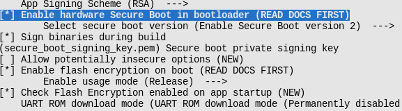
</div>
<center>图 12-17 通过 menuconfig 同时启用 flash 加密和 secure boot</center>  

此外，在使用 flash 加密和 secure boot 时，我们应该注意以下几点，来增强设备的安全性能：  

1）为不同的设备配置不同的 flash 加密的密钥。  

2）通过 `menuconfig -> Security features` 菜单，将 `UART ROM download mode` 切换为 `Secure mode` 或者 `disabled` ，将 UART 下载模式切换为安全模式，或者关闭下载模式。  

3）保护签名的私钥存储在私密的位置，既不能丢失私钥，也不能泄漏私钥的内容，并且仅在安全的主机上执行签名。若导出了 flash 加密的密钥，则同样地保护 flash 加密的密钥存储在私密的位置。  

### 12.5.2 使用量产工具批量使能 flash 加密与 secure boot

在 linux 开发环境中，有一些脚本工具，如 [esptool.py](https://github.com/espressif/esptool)、[espefuse.py](https://github.com/espressif/esptool/wiki/espefuse)、[espsecure.py](https://github.com/espressif/esptool/wiki/espsecure)，用于配置安全功能的一些参数或者烧录固件数据。详细阅读这些脚本工具的使用说明有助于我们更加灵活地使用安全功能。  

在 windows 环境下，[flash 下载工具](https://www.espressif.com/zh-hans/support/download/other-tools) 可以方便地批量烧录固件数据，并使能 secure boot 和 flash 加密功能。如图所示，在 flash 下载工具的目录中打开 `configure/esp32c3/security`, 可以在该文件内配置 secure boot 和 flash 加密功能的相关选项。  

<div align="center">
   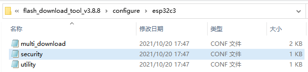
</div>
<center>图 12-18 量产工具的安全功能配置文件</center>  

**注意**：若首次打开该目录时无 security 文件，可以关闭软件后再次打开就可以看到该文件。  

security 文件中安全功能相关参数的默认配置如下：  

```
[SECURE BOOT]
secure_boot_en = False 		// 是否使能 secure boot 功能

[FLASH ENCRYPTION]
flash_encryption_en = False // 是否使能 flash 加密功能
reserved_burn_times = 0		// 开发模式下，是否预留 flash 加密控制位 SPI_BOOT_CRYPT_CNT 的烧录次数

[ENCRYPTION KEYS SAVE]		
keys_save_enable = False    // 配置 flash 加密用的密钥文件是否存放在本地
encrypt_keys_enable = False // 对保存在本地的密钥文件是否加密
encrypt_keys_aeskey_path =  // 存储路径

[DISABLE FUNC]
jtag_disable = False
dl_encrypt_disable = False
dl_decrypt_disable = False
dl_cache_disable = False
```

更多的说明请参考 flash 下载工具的使用说明手册。  

**注意**：量产时对设备使能 flash 加密和 secure boot 时，请使用标准且稳定的供电电源，否则可能破坏设备导致不可逆的损坏。  

## 小结

本章首先介绍了物联网设备数据安全的两个重要重要场景：数据存储、数据传输。它们分别对数据的完整性、机密性和合法性提出了需求。然后我们分别介绍了实现数据完整性保护、机密性保护和合法性保护的相关概念和方案原理，它们包括：  
1）使用完整性校验算法，在加载固件数据或执行 OTA 时检查固件数据的完整性。  
2）使用 flash 加密方案，保护 flash 上数据的机密性。  
3）使用 secure boot 方案，校验固件数据的合法性。  
最后，我们简述了在量产工具中使能 flash 加密 和 secure boot 的方法。  
