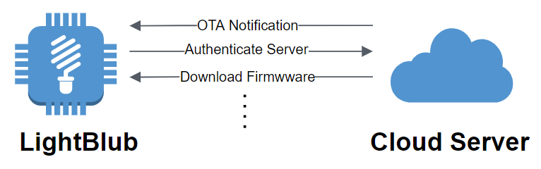
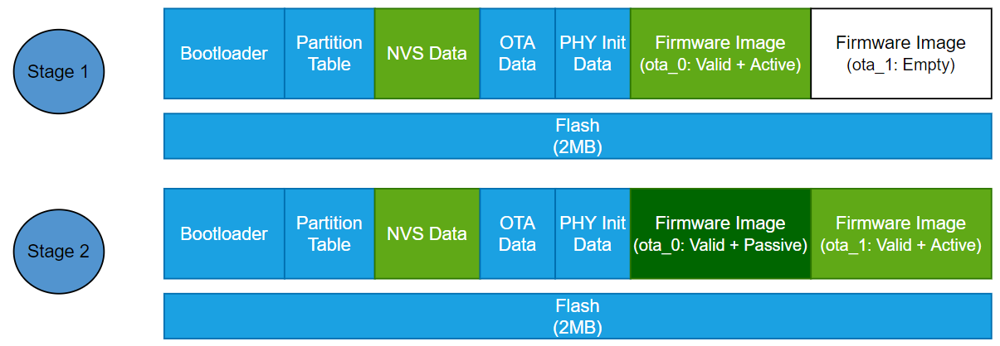

# 第13章、固件版本管理和量产实施方案

在迅速变化和发展的物联网市场，新的产品需求不断涌现，因此对于智能硬件设备的更新需求就变得空前高涨，设备不再像传统设备一样一经出售就不再变更。

随着物联网技术发展，一个技术变得极为重要，即 OTA 空中下载技术。物联网平台支持通过 OTA 方式进行设备固件升级，是智能设备修复系统漏洞、实现系统升级的手段，通过固件升级用户提供更好的服务。OTA 固件升级功能不仅能够更新固件，而且还能重新配置片上硬件资源。同时，设备固件可通过 OTA 固件升级流程获得更新的补丁和更多安全算法防范病毒攻击。

在物联网产品生命周期中，OTA 设备固件是一个非常重要的部分，能够实现升级用户服务、保障系统安全等功能。

## 13.1 OTA 流程概述

OTA 更新机制允许设备在正常运行时接收更高版本的固件数据进行固件更新，并在校验完成后的下一次启动中运行新的固件。

在使用 ESP32-C3 进行 OTA 时，要求在分区表中至少包含两个应用程序分区和一个 OTA 数据分区，OTA 操作会将新的应用程序固件写入当前未运行的应用程序分区，在验证映像后，将更新 OTA 数据分区以指定该应用程序用于下一次启动。

    

图 13-1. OTA 流程 

OTA 大致流程：

1. 服务器向设备推送 OTA 信息
2. 设备对服务器身份进行验证可确保从受信任的服务器下载固件
3. 根据下载的固件中的版本信息，设备可以决定是否执行升级
4. 将整个固件映像写入闪存分区后，设备将对固件进行验证包括固件头信息和完整性相关的检查
5. 如果启用了硬件安全启动，还会对固件进行签名校验
6. 如果启用 Flash 加密情况，详见《第 12 章、增强设备的安全功能》一章

### 13.1.1 固件切换流程

OTA 过程中 Flash 的变化，如下图所示：

1. 在一个从未进行过 OTA 的设备中，当前运行的固件运行在 `ota_0` 分区，`ota_1` 分区没有存放任何信息
2. 收到服务器的 OTA 推送并决定执行升级后，当前运行的固件会将新的固件写入到 `ota_1` 分区
3. 新的固件接收并写入完成后，会根据配置对新的固件进一步校验，校验完成后将标记下一次启动运行  `ota_1` 分区
4. 在下一次启动中，将运行 `ota_1` 分区中的应用程序

    

图 13-2. OTA 固件切换流程 

## 13.2 固件版本信息

在智能硬件设备的整个生命周期不可避免会出现多个版本的固件，如何区分和标记不同的版本显得十分重要。

ESP-IDF 同样提供了相同的功能：

1. 标记固件版本
2. 固件版本回退支持

### 13.2.1 标记固件版本

用于标记固件的信息主要有：

- `secure_version`: 安全版本号，用于防止应用程序回滚到更低安全性的应用程序，在 `menuconfig` 中配置：`Bootloader config -> Enable app rollback support -> Enable app anti-rollback support -> eFuse secure version of app`
- `project_version`: 应用程序版本号，在 `menuconfig` 中配置：`Application manager -> Get the project version from Kconfig -> Project version`
- `project_name`: 应用程序名称，在工程目录下的 `CMakeLists.txt` 文件中进行设置：`project(project_name)`
- `Compile time and date`: 编译时间和日期，在编译时自动赋值
- `idf_ver`: 应用程序使用的 IDF 版本，在编译时自动赋值

> `secure_version` 安全版本号存储在 eFuse 中，最大为 16，所以仅在确认以前的版本存在重大漏洞无法正常使用时，增加安全版本号
>
> `project_version` 和 `project_name` 最大长度为 32个字符

## 13.3 固件版本回退支持

固件版本回退的主要目的是在更新后使设备保持工作状态。如果新的应用程序出现严重错误，此功能使设备可以回退到以前正常工作的应用程序。

使用固件版本回退需要在 `menuconfig` 中配置：`Bootloader config -> Enable app rollback support`

使用固件版本回退并且启动运行 OTA 更新的新版本应用程序后，可能会发生以下三种情况之一：

1. 新版本应用程序运行正常，调用 `esp_ota_mark_app_valid_cancel_rollbac()` 将运行的应用程序标记为有效，可正常使用该应用程序
2. 新版本应用程序存在严重错误，无法进一步正常工作，需要回退到先前的应用程序，调用 `esp_ota_mark_app_invalid_rollback_and_reboot()` 将运行的应用程序标记为无效并重启。Bootloader 将不会选择新版本应用程序启动，并且将启动先前正常运行的应用程序
3. 如果在未调用上述任何一个函数的情况下进行了重启，则该应用程序将回退到先前正常运行的应用程序

### 13.3.1 防止固件回退到低安全版本的固件

在使用固件版本回退并且不希望设备运行在存在重大安全漏洞的时，可以使用 防止固件回退到低安全版本的固件 功能，该功能可防止回退到较低安全版本的固件。

使用 防止固件回退到低安全版本的固件 功能：

1. 在 `menuconfig` 中配置：`Bootloader config -> Enable app rollback support -> Enable app anti-rollback support`
2. 在修复重大安全漏洞并确认以前的版本存在重大漏洞无法正常使用时，增加安全版本号：`Bootloader config -> Enable app rollback support -> Enable app anti-rollback support -> eFuse secure version of app`
