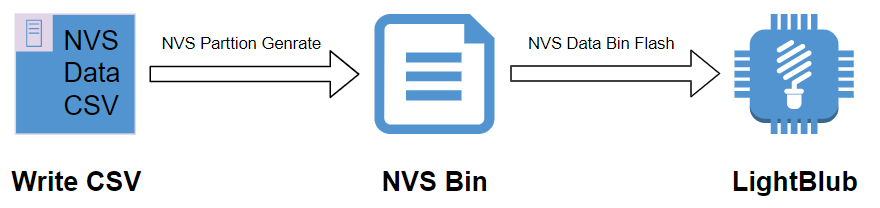
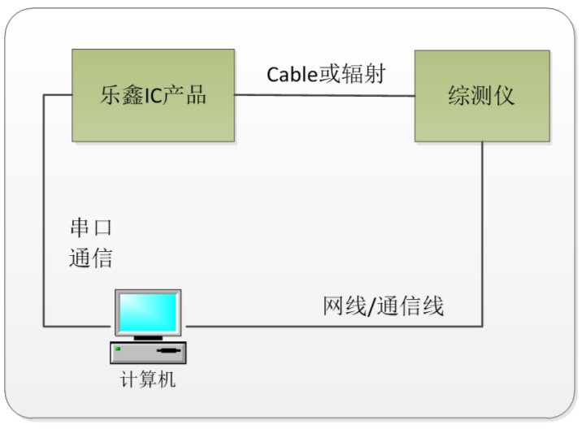
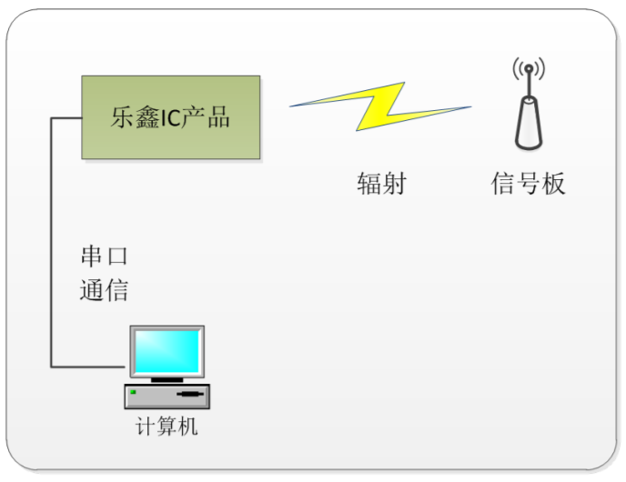
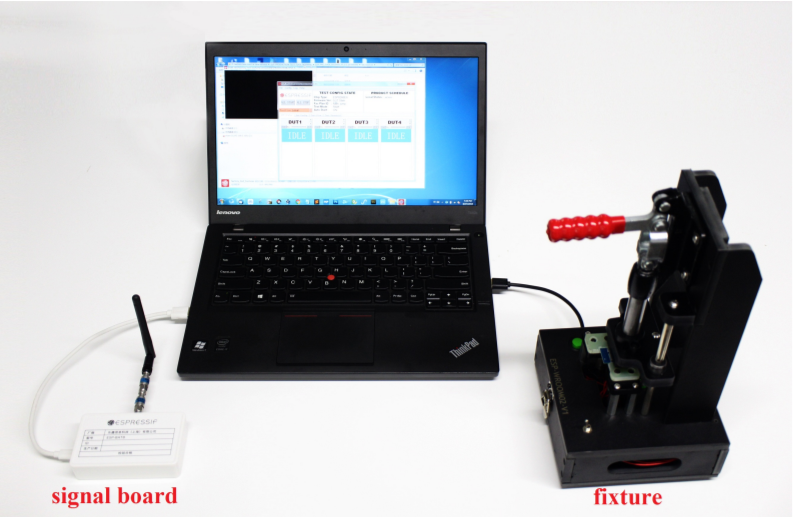

## 13.4 量产实施方案

### 13.4.1 量产数据

市场上销售的智能产品，为了识别每一个设备，并能与用户建立绑定关系，通常需要在每个设备中存储一些唯一性信息，这些信息在每个产品中都是不同的。

例如，设备为了有效的连接到厂商的云平台，需要为每个产品生成唯一的认证信息（设备证书、ID、密码等），这些认证信息会存储在每个产品中。在连接和认证服务器的时候会用到这些唯一信息。在开发过程中，我们可以很方便的将这些信息存储在设备中，例如：定义常量存储在固件中、将这些信息写入 Flash 中。如果在量产时，这些方式显得非常的笨拙、低效。所以在实际产品中需要更方便的量产数据实施方案。

#### 13.4.1.1 Non-volatile storage library

在 ESP-IDF 中提供了 [NVS（Non-volatile storage library）](https://docs.espressif.com/projects/esp-idf/en/latest/esp32/api-reference/storage/nvs_flash.html) 用于在 Flash 上存储键值对。由于 NVS 存储是永久性的，因此即便设备重启或断电，这些信息也不会丢失。NVS 在 flash 中有一个专门的分区来储存这些信息，NVS 支持存储多种数据类型，比如整型、以 NULL 结尾的字符串和二进制数据（BLOB）等。NVS 经过专门设计，不但可以防止设备断电带来的数据损坏影响，而且还可以通过将写入的内容分布到整个 NVS 分中以处理 flash 磨损的问题。

在量产时，可以考虑使用 NVS 存储产品的唯一性的量产数据，也可以存储任何与应用程序相关的任何用户数据。用户数据在使用过程中通常需要修改和读取等操作并在恢复出厂设置的时候通常会擦除清空，而唯一的量产数据仅仅存在读取操作。在考虑到这些量产数据有别于用户数据之后，可以针对 量产数据 和 用户数据 分别存储在不用的命名空间，例如：`mass_prod` 和 `user_data`。这样在恢复出厂设置时，可以直接对用户数据空间进行擦除以清空用户数据。除了将其分别存储在不同的命名空间，也可以将其存储在不同的分区上。

```c
// Initialize NVS Flash Storage
nvs_flash_init_partition(partition_label);

// Open non-volatile storage with mass_prod namespace
nvs_open("mass_prod", NVS_READONLY, &mass_prod_handle);

// Open non-volatile storage with user_data namespace
nvs_open("user_data", NVS_READWRITE, &user_data_handle);

// read operation in mass_prod namespace
nvs_get_i32(mass_prod_handle, "user_id", &user_id);

// read operation in user_data namespace
nvs_get_str(user_data_handle, "ssid", &ssid);
// write operation in user_data namespace
nvs_set_str(user_data_handle, "ssid", &ssid);

// Erase user_date namespace when reset to factory
nvs_erase_all(user_data_handle);
```

#### 13.4.1.2 生成量产数据

我们已经知道了如何存储量产数据，但是这些量产数据在烧录到设备中前，还需要转换成规定的格式，生成量产数据的流程如下：

1. 按照规定的格式写 CSV 文件（用于存储键值对数据）；
2. 使用 `nvs_partition_gen.py` 程序将 CSV 文件转为规定格式的 bin 文件；

<div align="center">
    
</div>
<center>图 13-1. 生成量产数据 </center>

CSV 文件储存键值对信息，将量产时需要存储在设备中的数据写入到 CSV 文件中。量产时将生成此 CSV 文件对应的 NVS 分区二进制文件并写入到设备中。每生产一台设备，就将一个唯一的 NVS 分区二进制文件写入设备。

```nvs
key,			type,		encoding,	value
mass_prod,		namespace,	,
ProductID,		data,		string,		12345
DeviceSecret,	data,		string,		12345678901234567890123456789012
DeviceName,		data,		string,		123456789012
```

使用 `components/nvs_flash/nvs_partition_generator/nvs_partition_gen.py` 程序在开发主机上生成 NVS 分区二进制文件：

```python
$ python $IDF_PATH/components/nvs_flash/nvs_partition_generator/nvs_partition_gen.py --input mass_prod.csv --output mass_prod.bin --size NVS_PARTITION_SIZE
```

> 注意替换其中的 `NVS_PARTITION_SIZE` 参数，实际值为分区表中对应 NVS 分区的大小

`mass_prod.bin` 文件就是 NVS 分区数据，现在可以烧录到设备中。使用以下命令将此 NVS 分区二进制文件写入设备的 Flash：

```python
$ python $IDF_PATH/components/esptool_py/esptool/esptool.py --port $ESPPORT write_flash NVS_PARTITION_ADDRESS mass_prod.bin
```

> 注意替换其中的 `NVS_PARTITION_ADDRESS` 参数，实际值为分区表中对应 NVS 分区的地址

量产时，需要烧录的二进制文件包含：

- 经过严格测试的量产设备固件
- 量产数据 NVS 二进制文件

需要保证每个设备烧录唯一的量产数据 NVS 二进制文件，设备固件通常每个设备都是相同的。为了实现这个目的，可以通过程序读取每个设备的 MAC 地址并生成唯一的量产数据 NVS 二进制文件并和设备固件一同写入到设备中。这样也可以建立设备 MAC 地址和量产数据的对应表，便于之后查询、调试、追溯。

#### 13.4.1.3 智能照明项目量产数据实施方案

本书中介绍的智能照明项目，也有为了识别每一个设备而需要在每个设备中存储一些唯一性信息、设备运行时的重要参数等信息，这些信息在每个产品中都是不同的，所以需要一个适合的量产数据实施方案，以加快量产速度。

> Todo

### 13.4.2 量产测试

在生成量产固件前，需要试产一大批的产品用于产品的功能和在不同产品中的性能表现等，通常需要测试：

1. RF 性能产测
2. 可靠性老化测试等

#### 13.4.2.1 RF 性能产测

无线产品一般测试的领域有电磁兼容EMC测试、RF射频测试，安规Safety测试，安全测试SAR测试等等，其中RF射频测试是其中一个重要的测试领域，也是测试量比较大的一个领域。

RF 性能测试的目的是验证产品的 RF 性能是否达到预期的设计要求，是否满足相关标准要求。RF 性能测试包括两个部分：发射机的性能测试和接收机的性能测试。

本节主要介绍乐鑫 IC 平台相关 Wi-Fi 产品（Wi-Fi 模组/Chip Onboard）的⽣产测试⽅案，为客户在进⾏ Wi-Fi 产品⽣产时，提供⽣产测试⽅案的相关参考。详细文档可以参考乐鑫官网《产测指南》。

基于乐鑫 IC 平台的 Wi-Fi 产品⽣产测试⽅案，针对 RF 性能产测部分，通常有如下两类：

 - RF 综测仪测试⽅案（⾏业通⽤标准）
 - 信号板⽅案（ESP 企业标准）

1. RF 综测仪测试⽅案

    仪器测试⽅案为 Wi-Fi 射频产品通⽤⽅案，由乐鑫提供串⼝命令及测试固件来完成产品的性能测试。测试过程简介（测试系统框架如下图）：

    <div align="center">
        
    </div>
    <center>图 13-1. RF 综测仪测试⽅案框架 </center>

2. 信号板⽅案

    乐鑫信号板产测⽅案是乐鑫⾃主研发的产测⽅案，可以对量产 Wi-Fi 产品的 RF 性能进⾏有效测试，确保量产产品的 RF 品质达标，该⽅案具有环境搭建成本低，⼯⼚产测环境易部署的优势。

    信号板测试⽅案系统框架如下所示，信号板在产测过程中，可作为标准设备，与待测设备进⾏数据通讯，通过对通讯过程的数据进⾏判断，达到对待测设备进⾏测试的作⽤。

    <div align="center">
        
    </div>
    <center>图 13-2. 信号板⽅案框架 </center>

    <div align="center">
        
    </div>
    <center>图 13-3. 信号板⽅案的实物连接 </center>

#### 13.4.2.2 可靠性老化测试

可靠性老化测试是为了评估产品在规定的寿命期间内，在预期使用、运输或储存等所有环境下，保持功能可靠性而进行的活动。是将产品暴露在自然的或人工的环境条件下经受其作用，以评估产品在实际使用、运输和存储的环境条件下的性能，并分析研究环境因素的影响程度及其作用机理。

通过进行可靠性老化测试，可以确定产品在各种环境条件下工作或存储时的可靠性特征量，为设计、生产和使用提供有用的数据。也可以暴露产品在设计、原材料和工艺流程等方面存在的问题。

气候环境的变化是电子产品可靠性中不可忽视的重要因素，而气候环境试验主要检测产品对各种环境的适应能力，在高温、低温、连续温度变化、或温度循环变化、臭氧、气体腐蚀等气候条件下使用或存储的适应性，因为它会直接或者间接的影响产品的可靠性，所以产品是否可靠还需进行气候环境试验来验证。

气候环境需测试的项目主要有以下几种：
1. 高温测试
2. 低温测试
3. 温湿度测试
4. 恒定温热测试
5. 冷热冲击测试
6. 快速温变测试
7. 低气压测试
8. 光老化测试
9. 腐蚀试验测试等

在实际的测试当中，会因产品各自属性的差异、使用环境也会有所差异，这时，可根据产品特性、及特定的使用环境和使用方法，适当选取或增加一些项目来测试，以便验证产品是否能够长期有效的进行工作。
