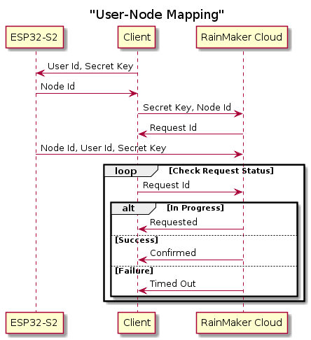
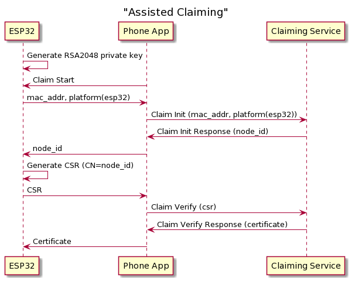

## 第 14 章、ESP-Rainmaker 的介绍及使用

<!--
本章节内容源自:https://rainmaker.espressif.com/docs/get-started.html
该页面内容与本章所要讲述的内容高度重合，故精简后直接使用，修改了部分叙述
与章节结构以更好的描述，并增加了一些 rainmaker 新支持的内容。
-->

### 14.1 ESP-RainMaker 介绍

#### 14.1.1 概述

`ESP-RainMaker` 是乐鑫提供的一套端到端的解决方案，无需在云端进行任何配置，即可对基于 `Espressif` 的产品进行远程控制和监控， 该解决方案的主要组成部分是：

- `Claiming Service` 用于获取证书
- `RainMaker Agent` 用于开发固件
- `RainMaker Cloud ` 云后端，提供远程连接
- `RainMaker Phone App/CLI` 用于远程访问的客户端

`ESP-RainMaker` 的主要特点是：

1. 能够在固件中定义自己的任何类型的设备和参数。
2. 终端用户不需要对云进行任何配置。
3. 根据设备信息动态呈现 `UI` 的手机应用程序。

#### 14.1.2 基础概念

在开始使用 `ESP-RainMaker` 之前先了解几个基础念：

- 节点

  一个节点是一个基于 `ESP32-C3` 的产品，节点与一组证书绑定，并从证书中获取唯一的关联标识符 `Node id`，用户可以为节点设置名称、类型及添加节点属性，一个节点允许拥有多个设备，这意味着节点可以当做网关使用。

- 节点属性

  节点属性用来更好的描述与定义节点的功能，`ESP-RainMaker` 针对节点已经设置了默认的元数据：版本，型号，同时 `ESP-RainMaker` 允许为节点添加其他自定义元数据。

- 设备

  设备是用户可控制的逻辑实体，如开关、灯泡、温度传感器、风扇等。一个简单的节点通常只由一个设备构成，用户可以为设备设置名称、类型及添加设备属性，设备类型用于区分不同品类的设备，在多设备的场合，每个设备必须确定唯一的名称。

- 设备属性

  与节点属性类似，这些元数据用来更好的描述与定义设备的功能。

- 参数

  参数用来实现设备的功能，如灯的电源状态、亮度、颜色。所有参数在设备中必须有唯一的名称，用户可以为这些参数添加额外的字段，如类型、数据范围、`UI` 信息、标志位等。

  - 参数值类型可以是布尔值、整数、浮点、字符串、`JSON` 数组或 `JSON` 对象。
  - 数据范围定义了一组区间，可以设置最大值、最小值及步进区间
  - `UI` 信息标识了该参数是否需要要于特定 `UI` 绑定，具体 `UI` 信息请查看章节`14.3. X`
  - 标志位则规范了数据的某些行为，如是否允许云侧读写、是否需要由固件侧存储、是否需要携带时间戳。

- 服务

  就结构而言，服务是一个与设备非常相似的实体，主要区别在于它用于不需要用户可见的操作，如 `OTA` 升级，它拥有 `url`、状态等参数，这些参数不需要由用户操作与管理。除了 `OTA` 升级服务，`ESP-RainMaker` 提供的服务还有计划、时间服务、场景、系统管理服务、加密的本地控制。

#### 14.1.3 节点-云端通信

节点和云之间的所有通信都通过 `MQTT` 进行，使用 `TLS` 进行保护，基于 `X.509` 证书进行相互认证。节点只能订阅或发布带有特定前缀的主题 `node/<node_id>/*`。 `ESP-RainMaker` 当前使用下述几个主题完成对节点的配置及控制，这里已 `led_light` 为例。

- 节点配置信息上报

  与节点有关的所有信息，如节点 `ID`、属性、设备、参数等，都被构造在一个 `json` 格式的节点配置中，这是节点连接 `MQTT` 后向 `ESP-RainMaker Cloud` 报告的第一条消息。

  - 主题：`node/<node_id>/config`
  - 操作：`publish`
  - 示例：

    ```json
    {
      "node_id": "xxxxxxxxxx",
      "config_version": "2020-03-20",
      "info": {
        "name": "ESP RainMaker Device",
        "fw_version": "1.0",
        "type": "Lightbulb",
        "model": "led_light"
      },
      "devices": [
        {
          "name": "Light",
          "type": "esp.device.lightbulb",
          "primary": "Power",
          "params": [
            {
              "name": "Name",
              "type": "esp.param.name",
              "data_type": "string",
              "properties": ["read", "write"]
            },
            {
              "name": "Power",
              "type": "esp.param.power",
              "data_type": "bool",
              "properties": ["read", "write"],
              "ui_type": "esp.ui.toggle"
            },
            {
              "name": "Brightness",
              "type": "esp.param.brightness",
              "data_type": "int",
              "properties": ["read", "write"],
              "bounds": {
                "min": 0,
                "max": 100,
                "step": 1
              },
              "ui_type": "esp.ui.slider"
            },
            {
              "name": "Hue",
              "type": "esp.param.hue",
              "data_type": "int",
              "properties": ["read", "write"],
              "bounds": {
                "min": 0,
                "max": 360,
                "step": 1
              },
              "ui_type": "esp.ui.hue-slider"
            },
            {
              "name": "Saturation",
              "type": "esp.param.saturation",
              "data_type": "int",
              "properties": ["read", "write"],
              "bounds": {
                "min": 0,
                "max": 100,
                "step": 1
              },
              "ui_type": "esp.ui.slider"
            }
          ]
        }
      ],
      "services": [
        {
          "name": "OTA",
          "type": "esp.service.ota",
          "params": [
            {
              "name": "Status",
              "type": "esp.param.ota_status",
              "data_type": "string",
              "properties": ["read"]
            },
            {
              "name": "Info",
              "type": "esp.param.ota_info",
              "data_type": "string",
              "properties": ["read"]
            },
            {
              "name": "URL",
              "type": "esp.param.ota_url",
              "data_type": "string",
              "properties": ["write"]
            }
          ]
        },
        {
          "name": "Time",
          "type": "esp.service.time",
          "params": [
            {
              "name": "TZ",
              "type": "esp.param.tz",
              "data_type": "string",
              "properties": ["read", "write"]
            },
            {
              "name": "TZ-POSIX",
              "type": "esp.param.tz_posix",
              "data_type": "string",
              "properties": ["read", "write"]
            }
          ]
        },
        {
          "name": "Schedule",
          "type": "esp.service.schedule",
          "params": [
            {
              "name": "Schedules",
              "type": "esp.param.schedules",
              "data_type": "array",
              "properties": ["read", "write"],
              "bounds": {
                "max": 10
              }
            }
          ]
        }
      ]
    }
    ```

    > 这截取 `led_light` 中一部分配置信息

    - `node_id`：节点`ID`，字符串类型
    - `config_version`：配置版本，字符串类型
    - `info`：详细信息，`JSON` 对象

      - `name`:名称，字符串类型
      - `fw_version`：固件版本，字符串类型
      - `type`：节点类型，字符串类型
      - ``

    - `attributes`：节点属性，`JSON`数组

      - `name`：名称（键），字符串类型
      - `value`：值，字符串类型

    - `devices`：设备列表，`JSON`数组

      - `name`：设备名称，字符串类型
      - `primary`：设备主参数，字符串类型
      - `attributes`：设备属性，`JSON`数组

        - `name`：名称（键），字符串类型
        - `value`：值，字符串类型

      - `params`：设备参数，`JSON`数组

        - `name`：参数名称，字符串类型
        - `data_type`：参数数据的类型，字符串类型
        - `type`：参数的类型，字符串类型
        - `properties`：参数特性（标志），字符串类型或`JSON`数组
        - `ui_type`：参数 `UI` 的类型，字符串类型
        - `bounds`：参数范围，`JSON`对象

          - `min`：最小值，整型数字
          - `max`：最大值，整型数字
          - `step`：步进值，整型数

    - `services`：服务列表，`JSON`数组

      - `name`：服务名称，字符串类型
      - `params`：服务参数，`JSON`数组

- 初始状态上报

  每次节点启动都需要上报初始数据。

  - 主题：`node/<node_id>/params/local/init`
  - 操作：`publish`
  - 示例：

    ```json
    {
      "Light": {
        "Name": "Light",
        "Power": true,
        "Brightness": 25,
        "Hue": 180,
        "Saturation": 100
      },
      "OTA": {
        "Status": "",
        "Info": "",
        "URL": ""
      },
      "Time": {
        "TZ": "Asia/Shanghai",
        "TZ-POSIX": "CST-8"
      },
      "Schedule": {
        "Schedules": []
      }
    }
    ```

- 后续状态报告

  在此主题上报告节点上的任何后续更改，无论是远程控制还是本地更改。

  - 主题：`node/<node_id>/params/local`
  - 操作：`publish`
  - 示例

    ```json
    {
      "Light": {
        "Power": false
      }
    }
    ```

- 下行控制数据

  节点必须始终订阅此主题，侦听由客户端（如手机应用程序或 CLI）触发的更新。同时使用 `后续状态报告` 来上报当前节点的修改。

  - 主题：`node/<node_id>/params/remote`
  - 操作：`subscribe`
  - 示例

    ```json
    {
      "Light": {
        "Power": false
      }
    }
    ```

- 用户节点映射

  当一个节点未与任何用户关联时，应首先将节点映射到一个用户，以便只有该用户才有访问它的权限。这发生在 `Wi-Fi` 配置阶段，节点将自己的 `node_id` 发送给客户端，客户端将 `user_id` 和 `secret_key` 发送给节点， 一旦节点连接到 `RainMaker Cloud`，节点就会发送映射请求。

  - 主题：`node/<node_id>/user/mapping`
  - 操作：`publish`
  - 示例

    ```json
    {
      "node_id": "112233AABBCC",
      "user_id": "02e95749-8d9d-4b8e-972c-43325ad27c63",
      "secret_key": "9140ef1d-72be-48d5-a6a1-455a27d77dee"
    }
    ```

- ota 升级

  ota 升级采用 3 组 topic，用于处理设备与服务器的交互。

  - 主题：`node/<node_id>/otaurl`
  - 操作：`subscribe`
  - 示例

    ```json
    {
      "url": "<ota_image_url>",
      "ota_job_id": "<ota_job_id>",
      "file_size": "<num_bytes>"
    }
    ```

  - 主题：`node/<node_id>/otafetch`
  - 操作：`publish`
  - 示例

    ```json
    {
      "node_id": "<node_id>",
      "fw_version": "<fw_version>"
    }
    ```

  - 主题：`node/<node_id>/otastatus`
  - 操作：`publish`
  - 示例

    ```json
    {
      "ota_job_id": "<ota_job_id>",
      "status": "<in-progress/success/fail>",
      "additional_info": "<additional_info>"
    }
    ```

- 时间序列数据

  时间序列数据是一组带有本地时间戳的数据，这些带有本地时间戳的数据有助于进行数据分析。

  - 主题：`node/<node_id>/tsdata`
  - 操作：`publish`
  - 示例

    ```json
    {
      "ts_data_version": "2021-09-13",
      "ts_data": [
        {
          "name": "Light.Saturation",
          "dt": "int",
          "records": [
            {
              "t": 1636544779,
              "v": 73
            }
          ]
        }
      ]
    }
    ```

- 警报数据

  警报数据是一种带有推送性质的数据， `RainMaker App` 收到消息后推送至手机通知栏。

  - 主题：`node/<node_id>/alert`
  - 操作：`publish`
  - 示例

        ```json
        {
          "esp.alert.str":"alert"
        }
        ```

    > `RainMaker App` 收到 `RainMaker Cloud` 的数据都带有推送性质，使用该主题的数据被显式的标记为需要 `RainMaker App` 主动推送至手机系统的通知栏

#### 14.1.4 客户端-云端通信

客户端（应用程序、CLI 等）和 `ESP RainMaker` 云之间的所有通信都通过 `HTTP REST API` 进行。可以在 `Swagger` 文档中找到 `REST API` 详细信息，或查看第 x 章节。以下是 `API` 的简要摘要。

- 用户管理

  - 使用电子邮件地址、密码及一次性验证码进行注册。
  - 使用电子邮件地址、密码或第三方 ID 提供商（如 `Google` 和 `GitHub`）登录
  - 更改密码
  - 忘记密码

- 节点管理

  - 添加用户 - 节点映射
  - 检查用户状态 - 节点映射
  - 获取映射节点列表
  - 获取节点配置
  - 获取节点连接状态
  - 获取/设置节点参数

#### 14.1.5 用户-节点映射

当设备首次上电并进行网络配置时，设备将自动执行映射操作，以便只有该用户才具有访问它的权限。

下面的流程图将有助于理解这些步骤。



以下是步骤

1. 在 Wi-Fi 配置阶段，客户端将`user id` 和随机生成的 `Secret key` 发送到 `ESP32-C3`。`ESP32-C3` 回复当前`node id` 作为该消息的响应。

2. 客户端通过安全的会话将`node id`和`Secret key`发送到 `RainMaker Cloud`。

3. `ESP32-C3` 通过安全的 MQTT 将 `user id`、`node id` 和`Secret key`发送到 `RainMaker Cloud`。

> 步骤 2 和 3 的顺序不会影响工作流程。

4. 客户端根据请求 id 不断检查请求的状态。以下是可能的回应

   - Confirmed：如果 RainMaker Cloud 从客户端和 ESP32-C3 获得相同的信息，则认为映射成功。
   - Timed Out：如果自发出请求以来已过去 1 分钟，但未从另一端收到匹配信息。
   - Requested：映射仍在进行中。继续检查。

#### 14.1.7 Claiming Service

节点和 `RainMaker Cloud` 服务之间的 MQTT 通信使用基于 X.509 证书的相互认证的 TLS 连接。在 ESP RainMaker 的中，`Claiming` 是 `ESP32-C3` 从 `ESP RainMaker Claiming Service`（以下简称 `Claiming Service`）获取此证书的过程。`RainMaker Agent` SDK 中支持三种类型的
`Claiming`，`Self Claiming`、`Host Driven Claiming`、`Assisted Claiming`，它们的区别在于 `Host Self Claiming` 仅能用于 ESP32-S2，`Host Driven Claiming` 需要借助 `CLI`，`Assisted Claiming` 需要借助蓝牙完成。

ESP32-C3 默认使用 `Assisted Claiming`，下面的流程图将有助于理解这些步骤。



#### 14.1.8 用户角色

ESP RainMaker 有两类用户，管理员用户与终端用户

- 管理员用户

  拥有给定节点的 MQTT 证书的用户是该节点的管理员用户。因此，使用 `Host Driven Claiming` 或 `Assisted Claiming` 的用户将成为给定节点的管理员用户。这样的用户可以通过 `ESP RainMaker` 仪表板访问节点，也可以使用 `MQTT OTA`主题推送固件。

- 终端用户

  终端用户可以有两种类型

  - 主要用户

  使用节点执行用户-节点映射工作流的用户将成为该节点的主要用户。主要用户可以访问节点配置并读/写节点参数，主要用户还可以添加/删除/查看其他次要用户。

  - 次要用户

  任何通过节点共享访问节点的用户都将成为该节点的次要用户。次要用户可以访问节点配置并读/写节点参数。但是，次要用户不能添加/删除/查看其他次要用户。

### 14.2 基础服务

#### 14.2.1 时间同步

时间是任何物联网设备的重要概念，尤其是设备使用 `Scheduling` 功能时，这里面有两个重要的概念：

1. 网络时间（即当前 UTC 时间）

   网络时间通常使用 `SNTP` 获取。`RainMaker Agent` 在 `esp-idf sntp` 组件上提供了一个抽象层。

   - 初始化时间同步。
     - `esp_err_t esp_rmaker_time_sync_init(esp_rmaker_time_config_t *config)`
   - 检查时间是否同步。
     - `bool esp_rmaker_time_check(void)`
   - 等待时间同步。
     - `esp_err_t esp_rmaker_time_wait_for_sync(uint32_t ticks_to_wait)`

2. 时区（提供与 UTC 的偏移量以及有关夏令时的信息）

   `esp-idf` 提供了使用 `TZ` 变量和 `tz_set()` 设置时区的工具。有关 `TZ` 变量的信息，请参阅此 `GNU libc` 文档。`RainMaker Agent` 在此之上提供了一个抽象层，并提供了多种设置时区的方法。

   1. C API

      - `C API` 将时区存储在 `NVS` 中。因此，即使在重新启动后，当调用 `esp_rmaker_time_sync_init()` 时，时区也会自动设置。

      - 使用时区区域字符串设置时区。`esp_err_t esp_rmaker_time_set_timezone(const char *tz)`;

      - 使用 `POSIX` 格式设置时区。`esp_err_t esp_rmaker_time_set_timezone_posix(const char *tz_posix)`

   2. menuconfig 选项

      `CONFIG_ESP_RMAKER_DEF_TIMEZONE`: 设置时区区域字符串。默认为空，即 `UTC`。

   3. RainMaker 服务

      提供了一个可选的 RainMaker 服务，允许从客户端设置时区。调用 ` esp_err_t esp_rmaker_timezone_service_enable(void);` 可启用该服务

#### 14.2.2 Scheduling

当设备连接到网络时可以很轻松的与客户端进行实时交互，在日常生活中经常存在一些重复性的操作，例如，每周晚上 6 点开灯，早上 10 点关灯，为了支持此类操作，`ESP RainMaker` 添加了`Scheduling` 功能，该功能独立运行在设备端，这意味设备在离线时依旧能够正确执行 `Schedule`。
`Schedule`由一个单一参数组成，该参数是一个对象数组。它在节点配置中显示如下：

```json
....
  "services": [{
      "name": "Schedule",
      "params": [{
          "bounds": {
              "max": 5
          },
          "data_type": "array",
          "name": "Schedules",
          "properties": [
              "read",
              "write"
          ],
          "type": "esp.param.schedules"
      }],
      "type": "esp.service.schedule"
  }]
....
```

`schedules` 参数默认是一个空数组。`max` 标识当前最大可支持的个数。`ESP RainMaker` 客户端可对 `schedule` 进行添加、删除、编辑、启用/禁用操作。

- 添加新的 `schedule`

  `ESP RainMaker` 客户端可以通过传递下述的值来添加新计划

  ```json
  {
    "Schedule": {
      "Schedules": [
        {
          "name": "Evening",
          "id": "8D36",
          "operation": "add",
          "flags": 0,
          "info": "",
          "triggers": [
            {
              "d": 31,
              "m": 1110
            }
          ],
          "action": {
            "Light": {
              "power": true
            }
          }
        }
      ]
    }
  }
  ```

  - `name` : 日程表名称
  - `id`: 唯一标识
  - `operation`：要执行的操作，目前支持添加、删除、编辑、启用和禁用。
  - `flags`：标志位，可以根据需求随意设置，`RainMaker` 不解析该字段，例如，标记为此条消息为倒计时。
  - `info`：信息，可以根据需求随意设置，`RainMaker` 不解析该字段，例如，存储额外信息。
  - `triggers`：触发的日期和时间

    - `d`：使用 `bit` 标识星期，`bit 0` 标识周一，例如。`0b00011111 (31)` 表示所有工作日（周一-周五），零值意味着只触发一次。
    - `m`：从`0点`开始的分钟数。例如，下午 `6:30 = 18 \* 60 + 30 = 1110`。

  - `action` : 在触发时间所要执行的实际操作。

  成功添加计划后，获取参数将报告类似的值，如下所示：

  ```json
  {
    "Schedule": {
      "Schedules": [
        {
          "name": "Evening",
          "id": "8D36",
          "enabled": true,
          "triggers": [
            {
              "d": 31,
              "m": 1110
            }
          ],
          "action": {
            "Light": {
              "power": true
            }
          }
        }
      ]
    }
  }
  ```

  `schedule` 使用 `sntp` 同步时间，默认每隔小时同步一次，时间触发最小度量为 `1min`，当需要更准确的触发时间时，可以在 `triggers` 中使用 `rsec` 字段，如下：

  ```json
    ...
  		"triggers": [{
  			"rsec": 500
  		}]
    ...
  ```

  `rsec` 字段使用相对时间的概念，当设备收到 `schedule` 时将以收到的时刻计算触发时间，例如，`"rsec": 500` 将在 `500s` 后触发 `action`。

- 编辑一组 `schedule`

  要编辑 `schedule` 需要将 `operation` 设置为 `edit`，设备端将匹配 `id` 进行操作。如果需要更改 `action` 需要传递 `action` 中全部的内容，例如。如果当前动作是`"action":{"Light": {"power": true, "brightness":90}}`，并且您需要将亮度更改为 100，则您应该通过`"action":{"Light": {"power": true, "brightness":100}}` 而不仅仅是` "action":{"Light": {"brightness":100}}`

  ```json
  {
    "Schedule": {
      "Schedules": [
        {
          "id": "8D36",
          "operation": "edit"
          ...
          ...
        }
      ]
    }
  }
  ```

- 删除一组 `schedule`

  要删除现有 schedule，只需传递其 ID 将 `operation` 设置为 `remove`。

  ```json
  {
    "Schedule": {
      "Schedules": [
        {
          "id": "8D36",
          "operation": "remove"
        }
      ]
    }
  }
  ```

- 启用/禁用一组 schedule

  要更改现有 schedule 状态，只需传递其 ID 将 `operation` 设置为 `disable` 或 `enable`。

  ```json
  {
    "Schedule": {
      "Schedules": [
        {
          "id": "8D36",
          "operation": "disable"
        }
      ]
    }
  }
  ```

  > 注意：一次性计划在执行后会自动禁用。

- 在固件中启用该功能

  `ESP RainMaker` 公开了一个 API 来启用调度

  ```
  esp_err_t esp_rmaker_schedule_enable(void);
  ```

- 在手机应用中启用该功能

  `ESP RainMaker App`为各种 `schedule` 操作提供了一个非常简单的用户界面。

#### 14.2.3 Scene

`Scene` 是针对特定时间日期与操作以唯一名称保存的智能家居控件的组合，对于单个设备来说，与`schedule` 类似，都是执行一组预设好的动作，从结构上来看都是由一个单一参数组成，该参数是一个对象数组。它在节点配置中显示如下：

```json
{
  "Services": [
    {
      "name": "Scenes",
      "params": [
        {
          "bounds": {
            "max": 10
          },
          "data_type": "array",
          "name": "Scenes",
          "properties": ["read", "write"],
          "type": "esp.param.scenes"
        }
      ],
      "type": "esp.service.scenes"
    }
  ]
}
```

`Scene` 参数默认是一个空数组。`max` 标识当前最大可支持的个数。`ESP RainMaker` 客户端可对 `Scene` 进行添加、删除、编辑、启用/禁用操作。

- 添加新的 scene

  ```json
  {
    "Scene": {
      "Scenes": [
        {
          "name": "Evening",
          "id": "8D36",
          "operation": "add",
          "action": {
            "Light": {
              "Power": true
            }
          }
        }
      ]
    }
  }
  ```

  - `name` : 日程表名称
  - `id`: 唯一标识
  - `operation`：要执行的操作，目前支持添加、删除、编辑、启用和禁用。
  - `action`: 所要执行的实际操作。

- 编辑场景

  要编辑 `scene` 需要将 `operation` 设置为 `edit`，设备端将匹配 `id` 进行操作。如果需要更改 `action` 需要传递 `action` 中全部的内容，例如。如果当前动作是`"action":{"Light": {"power": true, "brightness":90}}`，并且您需要将亮度更改为 100，则您应该通过`"action":{"Light": {"power": true, "brightness":100}}` 而不仅仅是` "action":{"Light": {"brightness":100}}`

- 删除场景

  要删除现有 `scene` 将 `operation` 设置为 `remove`。

  ```json
  {
    "Schedule": {
      "Schedules": [
        {
          "id": "8D36",
          "operation": "remove"
        }
      ]
    }
  }
  ```

- 触发场景

  要触发现有 `scene` 将 `operation` 设置为 `trigger`。

  ```json
  {
    "Schedule": {
      "Schedules": [
        {
          "id": "8D36",
          "operation": "trigger"
        }
      ]
    }
  }
  ```

- 在固件中启用该功能

  `ESP RainMaker` 公开了一个 API 来启用调度

  ```
  esp_err_t esp_rmaker_scenes_enable(void);
  ```

#### 14.2.4 OTA

`ESP RainMaker OTA` 服务提供了一个简单的界面来远程升级固件。只需要将固件映像上传到某个安全 Web 服务器 (https) 并提供节点的 url。ESP RainMaker 还提供固件映像托管服务以及网络仪表板，以简化流程。

- 启用该功能

  `ESP RainMaker Agent`提供了一个简单的 API 来启用 OTA 升级功能，有 2 种形式。

  1. 使用参数 OTA

     这是终端用户使用 OTA 功能升级固件最简单方法，可以从 RainMaker CLI 触发。

     ```c
     esp_rmaker_ota_config_t ota_config = {
         .server_cert = ESP_RMAKER_OTA_DEFAULT_SERVER_CERT,
     };
     esp_rmaker_ota_enable(&ota_config, OTA_USING_PARAMS);
     ```

  2. 使用 MQTT 主题 OTA

     这是更高级方法，可供管理员用户使用，并且可以从 `RainMaker` 仪表板触发。

     ```c
     esp_rmaker_ota_config_t ota_config = {
         .server_cert = ESP_RMAKER_OTA_DEFAULT_SERVER_CERT,
     };
     esp_rmaker_ota_enable(&ota_config, OTA_USING_TOPICS);
     ```

- 设置 OTA 升级映像

  像往常一样编译 ota 升级固件映像，但请确保以下几点：

  - 项目名称应与节点上已刷入固件所使用的名称相同。
  - 固件版本应该与节点已有的版本不同（查看 set(PROJECT_VER "1.0")示例的 CMakeLists.txt）。

  可以通过修改宏定义跳过检查：

  ```shell
  CONFIG_ESP_RMAKER_SKIP_VERSION_CHECK=y
  CONFIG_ESP_RMAKER_SKIP_PROJECT_NAME_CHECK=y
  ```

- 升级固件

  1. 使用参数 OTA

     对于使用参数 OTA，您将需要 RainMaker CLI 来升级固件。请按照此处的说明进行设置。完成后，请按照以下步骤操作：

     ```s
     $ cd /path/to/esp-rainmaker/cli
     $ ./rainmaker.py login # Use the same credentials used in phone app for setting up the node
     $ ./rainmaker.py getnodes # Just to verify that you see the node that you want to upgrade
     $ ./rainmaker.py otaupgrade <node_id> <path_to_ota_fw_image>
     ```

     固件升级开始时，您将看到如下进度：

     ```s
     $ ./rainmaker.py otaupgrade 7CDFA1XXXXXX ../examples/switch/switch-2.0.bin
     Uploading OTA Firmware Image...
     Checking esp.service.ota in node config...
     Setting the OTA URL parameter...
     OTA Upgrade Started. This may take time.
     Getting OTA Status...
     [19:49:50] in-progress : Downloading Firmware Image
     [19:49:58] in-progress : Downloading Firmware Image
     [19:50:07] in-progress : Downloading Firmware Image
     [19:50:16] in-progress : Downloading Firmware Image
     [19:50:25] in-progress : Downloading Firmware Image
     [19:50:34] in-progress : Downloading Firmware Image
     [19:50:43] success : OTA Upgrade finished successfully
     ```

  2. 使用主题 OTA

     - 上传 OTA 升级镜像

       1. 转到仪表板侧栏中的固件映像部分，点击添加新的固件
       2. 在弹出的窗口中填写详细信息，也可以跳过填写，那么它们将直接从二进制文件中读取。
       3. 选择刚刚编译好的升级镜像并添加。
       4. 该图像现在应该在固件图像列表中可见。

     - 启动 OTA 任务

       1. 在 OTA 固件列表中选择要用于 OTA 升级的 OTA 固件。
       2. 点击该固件的 `开始 OTA` 按钮。
       3. 填写 OTA 任务的一些信息，并选择要升级的节点。

     出于测试目的，请选择强制推送选项，以便节点可以立即收到 ota 消息。否则，节点将根据定义的 OTA 升级策略（启动期间检查、定期检查等）获取 OTA URL，这可能会延迟实际升级。

     - 监控 OTA 作业

       - 启动 OTA 后，如果成功，可以在任务的详细信息查看 OTA 任务的状态。
       - OTA 任务状态页面将提供整体情况，可查看各个节点的状态。
       - 可以中途取消 OTA 任务，但已经获得 URL 的节点将继续升级。

     - 运作流程

       1. 当节点连接到 RainMaker Cloud 时，它订阅主题 `node/<node_id>/otaurl`
       2. 每当从仪表板触发 OTA（使用强制推送选项）时，云服务都会将此信息发送到节点 `node/<node_id>/otaurl`

          ```json
          {
            "url": "<ota_image_url>",
            "ota_job_id": "<ota_job_id>",
            "file_size": "<num_bytes>"
          }
          ```

       3. 然后节点开始从 `url` 中下载固件并通过 `node/<node_id>/otastatus` 发布进度：

          ```json
          {
            "ota_job_id": "<ota_job_id>",
            "status": "<in-progress/success/fail>",
            "additional_info": "<additional_info>"
          }
          ```

       4. 当所有节点都报告成功或失败时，OTA 作业结束。

     - 自动获取配置

       大多数场景 OTA 消息需要以交错的方式发送到节点，以免服务器同时处理过多的固件下载请求。此外，在云发布消息时，节点也有可能处于离线状态，因此需要一些逻辑来再次获取升级信息。当 `CONFIG_ESP_RMAKER_OTA_AUTOFETCH=y` 被设置时，该节点将以 `CONFIG_ESP_RMAKER_OTA_AUTOFETCH_PERIOD`的时间间隔主动发布数据发布到 `node/<node_id>/otafetch`：

       ```json
       {
         "node_id": "<node_id>",
         "fw_version": "<fw_version>"
       }
       ```

       如果云服务发现该节点有任何挂起的 OTA 作业，那么云将向设备发送 url 消息。

- 服务器验证

  在通过 `esp_rmaker_ota_enable` 启用 OTA 时需要配置服务器证书，这用于验证服务器并防止 DNS 欺骗攻击。默认证书 `ESP_RMAKER_OTA_DEFAULT_SERVER_CERT` 用于验证 `ESP RainMaker Firmware Image` 托管服务器。如果打算使用自己的服务器（仅对 OTA_USING_PARAMS 有效），可以将证书文件复制到示例的 `main/` 文件夹中，并使用 `cmakelists` 命令将其嵌入到二进制文件中。

  ```c
  target_add_binary_data(${COMPONENT_TARGET} "server.crt" TEXT)
  ```

  可以在代码中访问

  ```c
  extern const uint8_t ota_server_cert[] asm("_binary_server_crt_start");

  {
  ...
  esp_rmaker_ota_config_t ota_config = {
      .server_cert = (char *)ota_server_cert,
  };
  esp_rmaker_ota_enable(&ota_config, OTA_USING_PARAMS);
  ...
  ```

  如果想跳过服务器认证，或者使用 HTTP 服务器而不是 HTTPS，可通过 `CONFIG_OTA_ALLOW_HTTP=y`配置。

#### 14.2.6 本地控制

`ESP RainMaker` 不仅提供了节点远程连接能力，在节点与客户端在同一 WiFi 网络下还可通过本地进行控制，这使得整个控制响应更快、更可靠。`ESP IDF` 已经提供了一个名为 `ESP Local Control` 的组件，它使用基于 mDNS 的发现和基于 HTTP 的控制。这现已集成到 `ESP RainMaker` 中，由于这里不再有云，因此即使没有互联网也可以工作，可通过设置 `CONFIG_ESP_RMAKER_LOCAL_CTRL_ENABLE=y` 启用该功能，同时，为了确保数据的安全，`ESP RainMaker`还提供了更为安全的数据传输服务，设置 `ESP_RMAKER_LOCAL_CTRL_SECURITY = ESP_RMAKER_LOCAL_CTRL_SECURITY_1`可启用该功能。该功能将创建一个服务，在节点配置中：

```json
"services":[
        {
            "name":"Local Control",
            "type":"esp.service.local_control",
            "params":[
                {
                    "name":"POP",
                    "type":"esp.param.local_control_pop",
                    "data_type":"string",
                    "properties":[
                        "read"
                    ]
                },
                {
                    "name":"Type",
                    "type":"esp.param.local_control_type",
                    "data_type":"int",
                    "properties":[
                        "read"
                    ]
                }
            ]
        }
    ]
```

在节点连接到云时，将上报一组 pop，App 需要通过该 pop 对本地控制的数据进行加密，设备端也会通过该 pop 进行解密。

```json
{
  "Local Control": { "POP": "ce34eb50", "Type": 1 }
}
```

#### 14.2.7 系统服务

`ESP RainMaker` 预制了一组系统服务，恢复工程模式、擦除 WiFi 信息、远程重启设备，App 可通过主动下发来擦除设备端的配网信息，并解除该用户与设备的关联，该功能将创建一个服务，在节点配置中：

```json
"services":[
        {
            "name":"System",
            "type":"esp.service.system",
            "params":[
                {
                    "name":"Reboot",
                    "type":"esp.param.reboot",
                    "data_type":"bool",
                    "properties":[
                        "read",
                        "write"
                    ]
                },
                {
                    "name":"Factory-Reset",
                    "type":"esp.param.factory-reset",
                    "data_type":"bool",
                    "properties":[
                        "read",
                        "write"
                    ]
                },
                {
                    "name":"Wi-Fi-Reset",
                    "type":"esp.param.wifi-reset",
                    "data_type":"bool",
                    "properties":[
                        "read",
                        "write"
                    ]
                }
            ]
        }
    ]
```

<!--
#### 14.2.7 ESP Insights

#### 14.2.8网络配网

#### 14.2.9 自定义服务

-->

### 14.3 固件开发

`ESP RainMaker` 代理构建在 `ESP IDF` 之上，并提供简单的 API 来构建基于 `ESP RainMaker` 规范的应用程序。

- 简单示例

  要了解 ESP RainMaker 固件，让我们看一下简单的 Led 示例（esp-rainmaker/examples/switch/main/app_main.c） 。相关代码片段如下

  ```c
  /* LED Light Example

     This example code is in the Public Domain (or CC0 licensed, at your option.)

     Unless required by applicable law or agreed to in writing, this
     software is distributed on an "AS IS" BASIS, WITHOUT WARRANTIES OR
     CONDITIONS OF ANY KIND, either express or implied.
  */

  #include <string.h>
  #include <freertos/FreeRTOS.h>
  #include <freertos/task.h>
  #include <esp_log.h>
  #include <nvs_flash.h>

  #include <esp_rmaker_core.h>
  #include <esp_rmaker_standard_params.h>
  #include <esp_rmaker_standard_devices.h>
  #include <esp_rmaker_ota.h>
  #include <esp_rmaker_schedule.h>

  #include <app_wifi.h>
  #include <app_insights.h>

  #include "app_priv.h"

  static const char *TAG = "app_main";

  esp_rmaker_device_t *light_device;

  extern const char ota_server_cert[] asm("_binary_server_crt_start");

  /* Callback to handle commands received from the RainMaker cloud */
  static esp_err_t write_cb(const esp_rmaker_device_t *device, const esp_rmaker_param_t *param,
              const esp_rmaker_param_val_t val, void *priv_data, esp_rmaker_write_ctx_t *ctx)
  {
      if (ctx) {
          ESP_LOGI(TAG, "Received write request via : %s", esp_rmaker_device_cb_src_to_str(ctx->src));
      }
      const char *device_name = esp_rmaker_device_get_name(device);
      const char *param_name = esp_rmaker_param_get_name(param);
      if (strcmp(param_name, ESP_RMAKER_DEF_POWER_NAME) == 0) {
          ESP_LOGI(TAG, "Received value = %s for %s - %s",
                  val.val.b? "true" : "false", device_name, param_name);
          app_light_set_power(val.val.b);
      } else if (strcmp(param_name, ESP_RMAKER_DEF_BRIGHTNESS_NAME) == 0) {
          ESP_LOGI(TAG, "Received value = %d for %s - %s",
                  val.val.i, device_name, param_name);
          app_light_set_brightness(val.val.i);
      } else if (strcmp(param_name, ESP_RMAKER_DEF_HUE_NAME) == 0) {
          ESP_LOGI(TAG, "Received value = %d for %s - %s",
                  val.val.i, device_name, param_name);
          app_light_set_hue(val.val.i);
      } else if (strcmp(param_name, ESP_RMAKER_DEF_SATURATION_NAME) == 0) {
          ESP_LOGI(TAG, "Received value = %d for %s - %s",
                  val.val.i, device_name, param_name);
          app_light_set_saturation(val.val.i);
      } else {
          /* Silently ignoring invalid params */
          return ESP_OK;
      }
      esp_rmaker_param_update_and_report(param, val);
      return ESP_OK;
  }

  void app_main()
  {
      /* Initialize Application specific hardware drivers and
       * set initial state.
       */
      app_driver_init();

      /* Initialize NVS. */
      esp_err_t err = nvs_flash_init();
      if (err == ESP_ERR_NVS_NO_FREE_PAGES || err == ESP_ERR_NVS_NEW_VERSION_FOUND) {
          ESP_ERROR_CHECK(nvs_flash_erase());
          err = nvs_flash_init();
      }
      ESP_ERROR_CHECK( err );

      /* Initialize Wi-Fi. Note that, this should be called before esp_rmaker_node_init()
       */
      app_wifi_init();

      /* Initialize the ESP RainMaker Agent.
       * Note that this should be called after app_wifi_init() but before app_wifi_start()
       * */
      esp_rmaker_config_t rainmaker_cfg = {
          .enable_time_sync = false,
      };
      esp_rmaker_node_t *node = esp_rmaker_node_init(&rainmaker_cfg, "ESP RainMaker Device", "Lightbulb");
      if (!node) {
          ESP_LOGE(TAG, "Could not initialise node. Aborting!!!");
          vTaskDelay(5000/portTICK_PERIOD_MS);
          abort();
      }

      /* Create a device and add the relevant parameters to it */
      light_device = esp_rmaker_lightbulb_device_create("Light", NULL, DEFAULT_POWER);
      esp_rmaker_device_add_cb(light_device, write_cb, NULL);

      esp_rmaker_device_add_param(light_device, esp_rmaker_brightness_param_create    (ESP_RMAKER_DEF_BRIGHTNESS_NAME, DEFAULT_BRIGHTNESS));
      esp_rmaker_device_add_param(light_device, esp_rmaker_hue_param_create(ESP_RMAKER_DEF_HUE_NAME,  DEFAULT_HUE));
      esp_rmaker_device_add_param(light_device, esp_rmaker_saturation_param_create    (ESP_RMAKER_DEF_SATURATION_NAME, DEFAULT_SATURATION));

      esp_rmaker_node_add_device(node, light_device);

      /* Enable OTA */
      esp_rmaker_ota_config_t ota_config = {
          .server_cert = ota_server_cert,
      };
      esp_rmaker_ota_enable(&ota_config, OTA_USING_PARAMS);

      /* Enable timezone service which will be require for setting appropriate timezone
       * from the phone apps for scheduling to work correctly.
       * For more information on the various ways of setting timezone, please check
       * https://rainmaker.espressif.com/docs/time-service.html.
       */
      esp_rmaker_timezone_service_enable();

      /* Enable scheduling. */
      esp_rmaker_schedule_enable();

      /* Enable Insights. Requires CONFIG_ESP_INSIGHTS_ENABLED=y */
      app_insights_enable();

      /* Start the ESP RainMaker Agent */
      esp_rmaker_start();

      /* Start the Wi-Fi.
       * If the node is provisioned, it will start connection attempts,
       * else, it will start Wi-Fi provisioning. The function will return
       * after a connection has been successfully established
       */
      err = app_wifi_start(POP_TYPE_RANDOM);
      if (err != ESP_OK) {
          ESP_LOGE(TAG, "Could not start Wifi. Aborting!!!");
          vTaskDelay(5000/portTICK_PERIOD_MS);
          abort();
      }
  }
  ```

  1. 通过 `app_wifi_init()` 初始化 Wi-Fi，同时会初始化 MAC 地址，该地址将作为 ESP32-C3 `Self Claiming` 的节点标识符 (node_id)。
  2. 通过 `esp_rmaker_node_init()` 初始化节点，可以传递此节点的名称及类型。
  3. 通过 `esp_rmaker_device_create()` 创建设备，在此示例中，我们创建了一个名为`lightblub`的设备，通过`esp_rmaker_lightbulb_device_create`我为其提供了写回调，如果收到对 `lightblub` 设备下的任何参数的写请求，就会调用该回调。
  4. 通过 `esp_rmaker_device_add_param()` 添加参数及元数据，`lightblub` 的设备至少具有色相、饱和度及亮度。
  5. 通过 `esp_rmaker_node_add_device()` 将设备添加到节点。
  6. 根据需求开启调度、OTA 功能、时区功能。
  7. 通过 `esp_rmaker_start()` 启动 RainMaker 核心任务，它将等待 Wi-Fi 连接。
  8. 通过 `app_wifi_start()` 启动 Wi-Fi。

- 标准类型

  创建设备通常需要多次调用。例如，创建一个具有名称、功率和亮度的灯泡需要：

  ```c
  esp_rmaker_device_t *device = esp_rmaker_device_create("Light", NULL, NULL);

  esp_rmaker_device_add_param(device, esp_rmaker_param_create("name", NULL,   esp_rmaker_str("Light"),
              PROP_FLAG_READ | PROP_FLAG_WRITE | PROP_FLAG_PERSIST));

  esp_rmaker_param_t *power_param = esp_rmaker_param_create("power", NULL,    esp_rmaker_bool(true), PROP_FLAG_READ | PROP_FLAG_WRITE);
  esp_rmaker_param_add_ui_type(power_param, ESP_RMAKER_UI_TOGGLE);
  esp_rmaker_device_add_param(device, power_param);
  esp_rmaker_device_assign_primary_param(device, power_param);

  esp_rmaker_param_t *brightness_param = esp_rmaker_param_create("brightness", NULL,  esp_rmaker_int(100), PROP_FLAG_READ | PROP_FLAG_WRITE);
  esp_rmaker_param_add_ui_type(brightness_param, ESP_RMAKER_UI_SLIDER);
  esp_rmaker_param_add_bounds(brightness_param, esp_rmaker_int(0), esp_rmaker_int (100), esp_rmaker_int(1));
  esp_rmaker_device_add_param(device, brightness_param);
  ```

  这种灵活性很有用，因为它允许您定义任何类型的设备。但是，为了简化一些常见用例，我们定义了一些标准类型并为它们添加了辅助 API。使用标准类型，上面的代码将简化为：

  ```c
  light_device = esp_rmaker_lightbulb_device_create("Light", NULL, true);
  esp_rmaker_device_add_cb(light_device, write_cb, NULL);

  esp_rmaker_device_add_param(light_device, esp_rmaker_brightness_param_create("brightness", 100));
  ```

  这些标准类型对于在手机应用程序或其他第三方应用程序（如 Alexa 或 Google 语音助手）中定义一些特殊处理也很有用。
<!--
  - 标准参数
  - 标准服务
  - 标准 UI
-->
- 调试开发

  - CLI 工具

        设置 ESP RainMaker 命令行实用程序,RainMaker CLI 可以直接从 esp-rainmaker-cli 文件夹中使用，如下所示：
        ```
        $ ./rainmaker.py <cmd>
        ```

    > 使用此实用程序需要在您的主机上设置 ESP IDF，且正确安全 python3，及所需依赖包，需要的依赖包在 esp-rainmaker-cli/requirements.txt

  - 交互式 shell 调试

    在应用层中添加 `esp_rmaker_console_init()` 即可

### 14.4 第三方集成

如果没有第三方集成，如今的任何物联网系统都是不完整的。考虑到这一点，我们在 ESP RainMaker 中添加了 Alexa 和 Google 语音助手 (GVA) 集成。ESP RainMaker 有设备和参数的概念，并且有一些标准类型预定义用于常见用例，如开关和灯泡。我们现在已经创建了一个中间层，它将这些参数映射为 Alexa 和 GVA 可以理解的格式。因此，RainMaker 中的设备类型（如灯、开关等）映射为 Alexa 和 GVA 中类似的设备类型，以及它们的参数，如功率、亮度、色调、饱和度、强度等也将被映射到相应的能力/特征。如果您只有功率和亮度参数，您将获得可调节亮度的灯。如果您包含色调、饱和度和强度，您将在 Alexa 和 GVA 中获得设置彩色光的能力。
