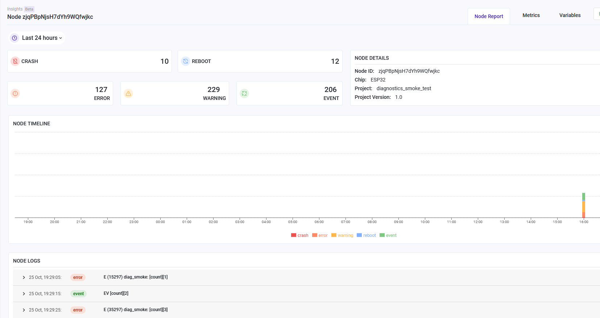
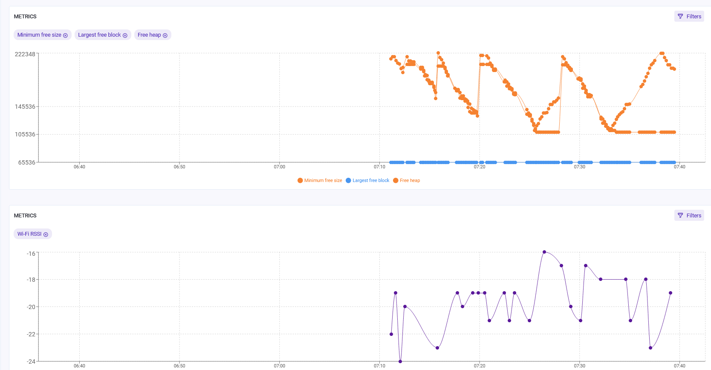
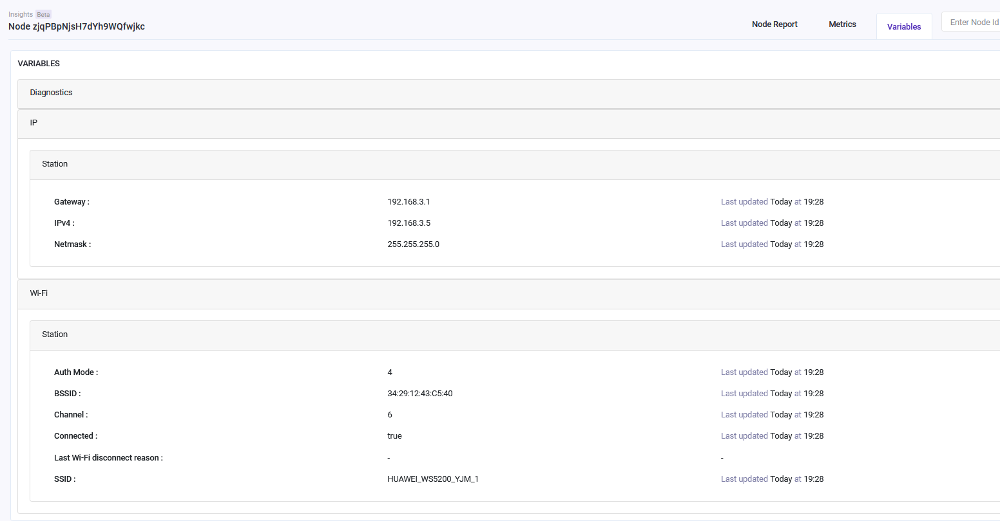

## 15.2 ESP-Insight 的功能介绍

[ESP Insights](https://github.com/espressif/esp-insights) 是一种远程诊断解决方案，允许用户远程监控 ESP 设备的健康状况，包括告警和错误日志、设备运行参数指标、设备 Coredump 信息和用户自定义数据与事件。

ESP Insights 包括一个固件代理（Insights 代理），它在运行期间从设备捕获一些重要的诊断信息，并定期将它们上传到 ESP Insights 云。然后云处理设备上报的诊断数据并可视化。开发人员可以登录基于 Web 的仪表板，查看他们的设备报告的健康状况和问题。目前云上处理诊断数据和报告显示，只支持 Rainmaker 云，其他云平台的支持会在后续版本中提供。下图截取了设备报告可视化示例。

   

图 15-1 Rainmaker 云平台概览报告 

   

图 15-2 Rainmaker 云平台指标报告 

   

图 15-3 Rainmaker 云平台变量报告 

目前，我们可以从基于 Web 的仪表板监控以下信息：

- 错误日志：组件或者用户应用程序调用日志打印函数 `ESP_LOGE` 输出到串口的内容
- 警告日志：组件或者用户应用程序调用日志打印函数 `ESP_LOGW` 输出到串口的内容
- 自定义事件：用户应用程序调用函数 `ESP_DIAG_EVENT` 输出到串口的内容，该部分可以用于用户自定义的数据
- 复位原因：设备复位的原因（上电、软件复位、掉电等）
- Coredump 摘要：在发生崩溃的情况下，寄存器内容以及违规线程的堆栈回溯
- 指标：随时间变化的数据，例如空闲堆大小、一段时间内绘制的 Wi-Fi 信号强度等
- 变量：变量值，如设备 IP 地址，网关地址，Wi-Fi 连接信息

**ESP-Insight 功能**

- 查看设备属性（如名称、ID、固件版本等）和设备状态（如内存使用情况、最大空闲块、空闲堆值、Wi-Fi 信号强度等）；
- 查看设备固件运行期间生成的日志：故障和告警等级的日志、固件崩溃时的回溯信息、重启和其他自定义事件；
- 查看设备上报的当前数据，并按照时间线生成数据图表；
- 支持自定义添加感兴趣的指标和变量。

**ESP-Insight 优势**

1. 加速软件产品的开发与发布 

    软件产品通常要在正式发布前进行 Beta 测试。测试期内，用户们会将产品在真实使用场景下出现的性能、稳定性、可靠性等问题反馈给开发人员，并由他们进行处理和修复。在此过程中，开发人员往往需要花费大量的时间和精力定位问题并分析原因。而使用 ESP Insights，他们能够远程查看设备的运行情况，并及时获取异常事件的详细信息，大大节省了处理问题的时间，加快了软件开发和发布进程。ESP Insights 还会保存设备固件在崩溃前发生的异常事件，并在设备重启后将数据上传至云端，避免异常信息丢失。

2. 及时解决各类固件问题

    - 开发人员能够使用 ESP Insights 查看设备状态（如可用内存空间、最大空闲块、Wi-Fi 信号强度等），分析得出设备各指标的峰值，并在未来的固件版本中进行优化。
    - ESP Insights 控制台的日志中会记录所有异常事件的详细信息。开发人员能够在用户发现异常之前就及时处理问题，避免设备异常对用户的实际使用造成影响。

3. 数据传输轻量简洁且安全可靠

    ESP Insights 与云连接共享 MQTT + TLS 加密通道传输设备数据，保证用户设备信息安全的同时，大大减少了用户设备内存的开销。设备与云间传输的数据通过 CBOR 编码进行了优化，大大节省了数据传输带宽。后续 ESP Insights 还将把设备数据与来自云服务的命令和控制数据整合到同一 MQTT 消息中，通过减少 MQTT 消息的数量进一步节省成本。
