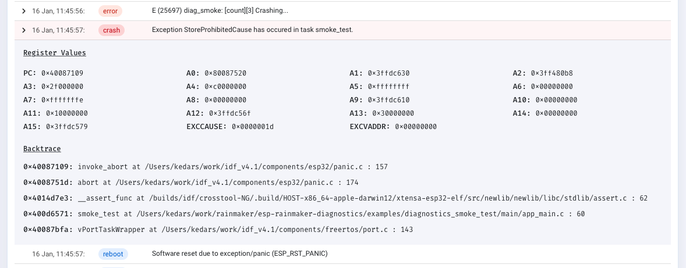
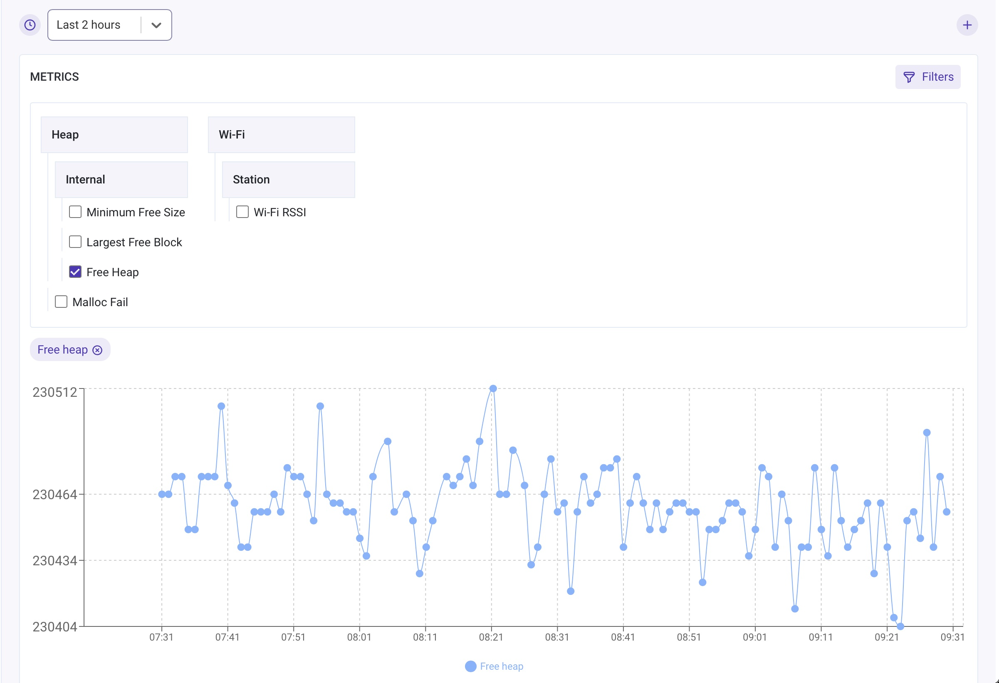
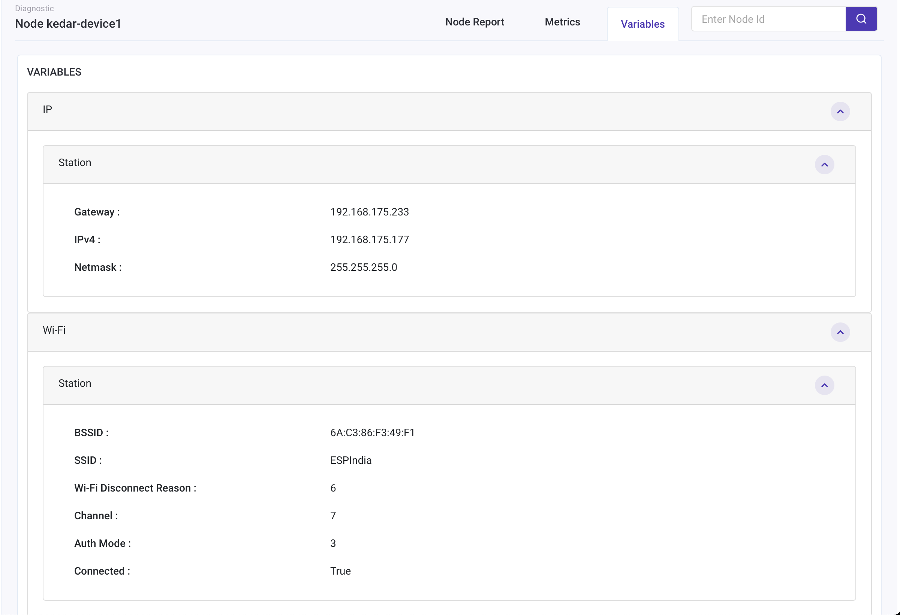

### 15.3 ESP-Insight 组件使用

#### 15.3.1 如何在 ESP-Rainmaker 项目中使用 ESP-Insight 功能

**1. 下载最新的 esp-rainmaker**

按照第 14 章 Rainmaker 的介绍，拉取 Rainmaker 工程代码，`esp-insight` 以 submodule 形式存在于该工程目录 `esp-rainmaker/components` 下。

```
git clone --recursive https://github.com/espressif/esp-rainmaker.git
```

**2. 修改 esp-rainmaker CMakeLists.txt**

将 `esp-insight` 作为 component 添加进 `esp-rainmaker` 工程，保证在 `esp-rainmaker` 工程代码下可以调用 `esp-insight` 函数。在工程编译的当前目录，修改 `CMakeLists.txt`

```
set(EXTRA_COMPONENT_DIRS ${RMAKER_PATH}/components ${RMAKER_PATH}/examples/common)
```

修改为

```
set(EXTRA_COMPONENT_DIRS ${RMAKER_PATH}/components ${RMAKER_PATH}/examples/common ${RMAKER_PATH}/components/esp-insights/components)
```

**3. 使能 esp-insight 功能**

ESP-Insight 相关代码已经由 `examples/common/app_insights` 组件封装好了，用户只需要在代码里包含 `app_insights.h`，并且在 `esp_rmaker_start()` 之前调用 API `app_insights_enable()` 即可。但是该功能由宏 `CONFIG_ESP_INSIGHTS_ENABLED` 控制，默认是关闭的，可以通过默认配置打开或者图像配置界面打开（idf.py menuconfig -> Component config -> ESP Insights -> Enable ESP Insights）。

**4. 编译烧录运行**

执行如下命令进行烧录编译

```
idf.py build flash monitor
```

编译完成时会看到如下编译日志，会在 `build` 目录下生成压缩文件 `led_light-v1.0.zip`，该文件会在后续使用

```
===================== Generating insights firmware package build/led_light-v1.0.zip ======================
led_light-v1.0
led_light-v1.0/led_light.bin
led_light-v1.0/sdkconfig
led_light-v1.0/partition_table
led_light-v1.0/partition_table/partition-table.bin
led_light-v1.0/bootloader
led_light-v1.0/bootloader/bootloader.bin
led_light-v1.0/partitions.csv
led_light-v1.0/project_build_config.json
led_light-v1.0/led_light.map
led_light-v1.0/led_light.elf
led_light-v1.0/project_description.json
```

**5. ESP-Rainmaker Claim**

要访问 ESP-Insight，你需要对节点具有管理员访问权限，因此，必须需要 Claim。具体 Claim 细节可以参考第 14 章。

**6. 登录 ESP-Rainmaker Dashboard 界面**

当固件和 Claim 都完成后，设备连上云平台，就可以登录 [Rainmaker 云平台界面](https://dashboard.rainmaker.espressif.com/)查看了。登录后找到设备对应的节点点击后就会进入该节点的 Insight 界面了。

**7. 上传生成的压缩文件**

为了更好地了解诊断信息，还需要在 Rainmaker 云平台界面左侧导航栏 `Firmware Images` 下上传之前生成的压缩文件，其中包含二进制、elf、映射文件和其他对分析有用的信息。

`idf.py build`、`idf.py flash` 等命令即使代码没有变化也会重新编译生成新固件，一定要确保设备运行的固件和平台上传的压缩文件包是对应的，否则平台在处理分析设备上报的信息时可能会出现错误。

#### 15.3.2 如何在 ESP-Insight 项目中运行示例 `diagnostics_smoke_test`

**1. 下载 esp-insight**

下载 `esp-insight` 工程代码

```
git clone --recursive https://github.com/espressif/esp-insights.git
```

**2. 配置 ESP-IDF**

ESP-Insight 当前支持 `master`，`v4.3`，`v4.2.2`，`v4.1.1` 发行版本。对于版本 `v4.3` 需要按照如下命令打 patch

```
cd $IDF_PATH
git apply -v <path/to/esp-insights>/idf-patches/Diagnostics-support-in-esp-idf-tag-v4.3.patch
```

对于版本 `v4.2.2` 和 `v4.1.1` 需要按照如下命令打 patch

```
cd $IDF_PATH
git apply -v <path/to/esp-insights>/idf-patches/Diagnostics-support-in-esp-idf-tag-v4.1.1-and-tag-v4.2.2.patch
```

**3. 编译烧录运行**

按照之前 4,5,6,7 的步骤进行操作。

#### 15.3.3 如何上报 Core Dump 信息

在固件崩溃的情况下，Insights 代理将崩溃产生的核心信息存储到 Flash 中，并在后续启动时将其报告给 ESP-Insights 云。 这使你可以查看设备生成的所有崩溃日志。

崩溃的整个堆栈 backtrace 也被捕获和报告。 为了优化设备-云通信，固件仅发送核心摘要信息。摘要包含如程序计数器、异常原因、异常地址、通用寄存器和回溯。

<div align="center">
   
</div>
<center>图 15-4 Core Dump 信息 </center>

该功能需要使能如下配置，你可以将如下配置添加至你工程的默认配置文件（sdkconfig.defaults）里。

```
CONFIG_ESP32_ENABLE_COREDUMP=y
CONFIG_ESP32_ENABLE_COREDUMP_TO_FLASH=y
CONFIG_ESP32_COREDUMP_DATA_FORMAT_ELF=y
CONFIG_ESP32_COREDUMP_CHECKSUM_CRC32=y
CONFIG_ESP32_CORE_DUMP_MAX_TASKS_NUM=64
```

为了将崩溃产生的核心信息存储到 Flash 中，需要额外的分区用于存储。将下行添加到项目的分区表文件（partitions.csv）中。

```
coredump, data, coredump, , 64K
```

#### 15.3.4 如何定制感兴趣的日志

`esp_log` 是 `esp-idf` 中的默认日志组件。 通常 `ESP_LOGE` 和 `ESP_LOGW` 用于记录固件中的错误和警告。 使用 `esp_log` 组件记录的所有日志都由 Insights 代理跟踪并报告给 ESP Insights 云。 这允许你通过 ESP Insights Dashboard 查看这些错误，为你提供有关可能发生的情况的详细信息。

你可以通过 API `esp_diag_log_hook_enable()` 和 `esp_diag_log_hook_disable()` 配置上报的日志等级。

```
/* enable tracking error logs */
esp_diag_log_hook_enable(ESP_DIAG_LOG_TYPE_ERROR);

/* enable tracking all log levels */
esp_diag_log_hook_enable(ESP_DIAG_LOG_TYPE_ERROR | ESP_DIAG_LOG_TYPE_WARNING | ESP_DIAG_LOG_TYPE_EVENT);

/* disable tracking custom events */
esp_diag_log_hook_disable(ESP_DIAG_LOG_TYPE_EVENT);
```

通常情况下，当设备发生崩溃之前都会打印一些错误或者告警等级的日志，这个时候往往可能无法将日志上报至云端，ESP-Insights 提供了一种方法来保持该日志，并且在下次上电重启时，将日志上报给平台。大多数 ESP32 SoC 都配备了 RTC 内存，Insights 代理使用此内存来存储系统上发生的严重错误。在重新上电时，Insights 代理都将检查 RTC 内存是否存在任何未报告的错误，并将其报告给 Insights 云。

#### 15.3.5 如何上报设备重启原因

Insights 代理默认支持上报设备重启的原因。Insights 代理会在每次启动到云时报告记录在 RTC 内存的重启原因。这使你可以识别设备是否因崩溃、看门狗触发、软重置或终端用户的电源重置而引起的设备重启。

#### 15.3.6 如何上报自定义的指标值

Insights 代理支持向云端上报指标。 然后可以通过 Insights 仪表板查看图表，这些图表绘制了这些指标在一段时间内的变化情况。使能 `CONFIG_DIAG_ENABLE_METRICS=y` 配置选项来开启该功能。Insights 代理支持原先定义好的指标，比如内存和 WIFI 信号强度等，另外也支持用户自定义的指标。

<div align="center">
   
</div>
<center>图 15-5 指标信息 </center>

**内存指标**

Insights 代理支持报告当前可用内存、最大可用块和峰值内存。这些参数记录的是内部 RAM 以及外部 RAM（如果设备具有 PSRAM）的内存情况。它还支持记录内存分配失败的情况，不过需要在 `esp-idf` 版本 v4.2 及更高版本才支持。

使能 `CONFIG_DIAG_ENABLE_HEAP_METRICS=y` 配置选项来支持该功能。

**WiFi 指标**

Insights 代理还支持 Wi-Fi 指标。它记录 Wi-Fi 信号强度 (RSSI) 和最低的 Wi-Fi 信号强度信息。RSSI 每 30 秒统计一次，如果之前统计的和当前统计的相差 5dB，就会上报至云端。从 `esp-idf` v4.3 版本开始，当 RSSI 值低于预先配置的阈值时，还会记录最小的 RSSI。可以使用 `esp_wifi_set_rssi_threshold()` API 配置阈值。还有一个 API 可以在任何给定时间点收集和报告 wifi 指标。

```
/* Reports RSSI to cloud and also prints to console */
esp_diag_wifi_metrics_dump();
```

**自定义指标**

你可以通过如下 API 函数添加自定义指标

```
/* Register a metrics to track room temperature */
esp_diag_metrics_register("temp", "temp1", "Room temperature", "room", ESP_DIAG_DATA_TYPE_UINT);

/* Record a data point for room temperature */
uint32_t room_temp = get_room_temperature();
esp_diag_metrics_add_uint("temp1", &room_temp);
```

函数 `esp_diag_metrics_register` 原型如下：

```
esp_err_t esp_diag_metrics_register(const char *tag,
                                    const char *key,
                                    const char *label,
                                    const char *path,
                                    esp_diag_data_type_t type);
```

每个参数定义如下：

- tag：代表该指标的标签，用户可以自行定义
- key：代表该指标的唯一标识，用于查找，设置该指标值的标识
- label：显示在 Rainmaker 仪表盘的标签
- path：对 key 的分层路径，必须用“.”分隔。例如：“wifi”、“heap.internal”、“heap.external”
- type：数据类型，类型支持如下枚举值

```
typedef enum {
    ESP_DIAG_DATA_TYPE_BOOL,     /*!< Data type boolean */
    ESP_DIAG_DATA_TYPE_INT,      /*!< Data type integer */
    ESP_DIAG_DATA_TYPE_UINT,     /*!< Data type unsigned integer */
    ESP_DIAG_DATA_TYPE_FLOAT,    /*!< Data type float */
    ESP_DIAG_DATA_TYPE_STR,      /*!< Data type string */
    ESP_DIAG_DATA_TYPE_IPv4,     /*!< Data type IPv4 address */
    ESP_DIAG_DATA_TYPE_MAC,      /*!< Data type MAC address */
} esp_diag_data_type_t;
```

**变量**

变量与指标类似，一般都不需要统计一段时间内变量的变化，因为变量一般表示设备的信息，比如设备的 IP 地址。使能 `CONFIG_DIAG_ENABLE_VARIABLES=y` 配置选项以支持该功能。和指标一样，除了支持原先定义好的变量，如 IP，WIFI 相关信息，也支持用户自定义变量。

<div align="center">
   
</div>
<center>图 15-6 变量信息 </center>

**网络变量**

如上图，目前支持 WIFI 和 IP 地址

- WIFI：BSSID，SSID，WIFI 断开连接的原因，当前信道，WIFI 连接认证模式和连接状态
- IP：网关地址，IPv4 地址和子网掩码

**自定义变量**

你可以通过如下 API 函数添加自定义变量

```
/* Register a variable to track stations associated with ESP32 AP */
esp_diag_variable_register("wifi", "sta_cnt", "STAs associated", "wifi.sta", ESP_DIAG_DATA_TYPE_UINT);

/* Assuming WIFI_EVENT_AP_STACONNECTED and WIFI_EVENT_AP_STADISCONNECTED events track the number of associated stations */
esp_diag_variable_add_uint("sta_cnt", &sta_cnt);
```

函数 `esp_diag_variable_register` 原型如下：

```
esp_err_t esp_diag_variable_register(const char *tag,
                                     const char *key,
                                     const char *label,
                                     const char *path,
                                     esp_diag_data_type_t type);
```

每个参数定义和 `esp_diag_metrics_register指标` 一样。
