## 4.2 ESP-IDF 开发环境安装

ESP-IDF 开发环境已支持 `Windows`, `Linux`, `macOS` 等主流操作系统，本节将一一介绍在各操作系统上的环境安装过程。我们推荐在 `Linux` 平台上进行 `ESP32-C3` 开发，这里将做详细介绍，由于不同平台开发工具有极大相似性，部分说明在其它平台上将不再赘述，因此推荐您仔细阅读以下小节内容。

> 注：本节涉及的指令，读者可以打开在线文档进行复制 https://docs.espressif.com/projects/esp-idf/en/latest/esp32c3/get-started

### 4.2.1 Linux 系统环境安装

Linux 系统原生自带 ESP-IDF 开发环境需要的 GNU 开发和调试工具，命令行终端也更加强大易用，因此在该系统上开发 ESP32-C3 将获得最佳的编译速度和开发体验。您可以选择一个喜欢的 Linux 发行版本，我们这里推荐使用 `Ubuntu` 或其它 `Debian` 系统。本小节将以 `Ubuntu 20.04` 为例进行介绍。

**1. 安装依赖软件包**

请打开一个新的终端，执行下面一行指令安装所有必要软件包，系统已经安装的软件包将被跳过。TODO: 检查指令是否显示全

```
sudo apt-get install git wget flex bison gperf python3 python3-pip python3-setuptools cmake ninja-build ccache libffi-dev libssl-dev dfu-util libusb-1.0-0
```

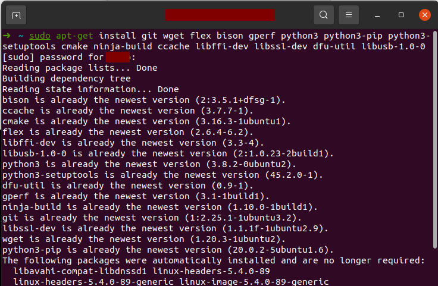


> 注：指令执行时需要管理员账户密码，输入密码时，默认不显示任何信息，输入后回车即可。

**软件包介绍：**

`git` 是 ESP-IDF 中关键的代码管理工具，环境安装成功以后，您可以使用 `git log` 指令查看 ESP-IDF 创建以来的每一次代码变更，除此以外 ESP-IDF 还使用 `git` 工具确认版本信息，用于正确的安装对应版本的工具链。

除此之外重要的系统工具还有 `Python`，因为 ESP-IDF 中包含了大量使用 Python 语言编写自动化脚本。`cmake` `ninja-build` 和 `ccache` 等工具在以 C/C++ 为主的工程中被广泛使用，也是 ESP-IDF 默认使用的软件编译和构建工具。`libusb-1.0-0` 和 `dfu-util` 作为主要驱动，被用于 USB 串口通信和固件烧录。

您也可以在安装完成后使用 `apt show <package_name>` 查询各个软件包详细描述，例如我们使用 `apt show git` 打印了信息将包含了以下内容：

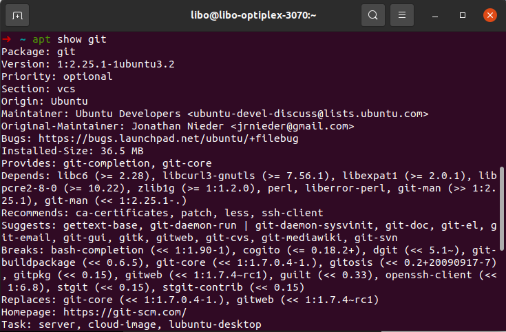

**问题处理：**

**软件包下载速度太慢？**：您可将 Ubuntu 的源切换为国内的服务器，请在打开 `软件&更新 (Software & Updates)`，将下载服务器改为 `中国的服务器 （Server for China）`

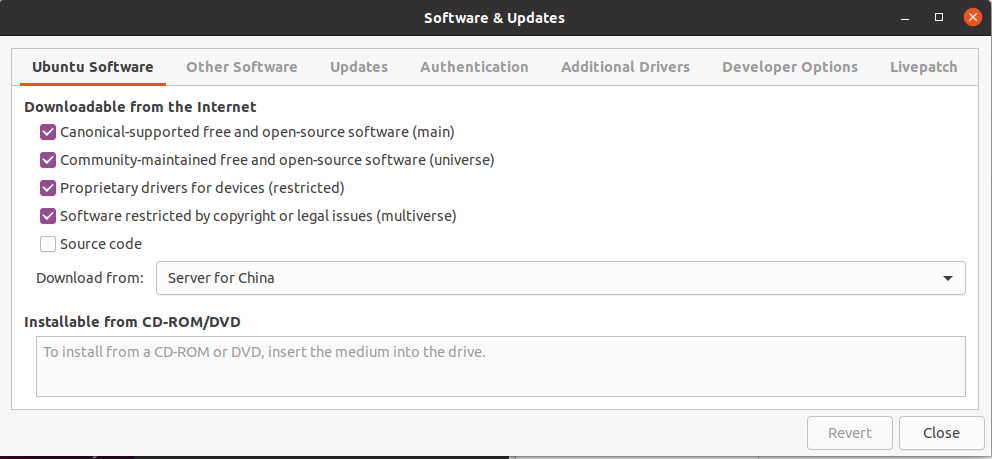

**Python 版本不受支持？**：ESP-IDF v4.3 版本要求 Python 版本不低于 v3.6。 对于老版本的 Ubuntu 系统，请手动下载并安装更高版本的 Python，并将 Python3 设置为系统默认 Python 环境。详细过程可以以 `update-alternatives python` 为关键词进行检索

**2. 下载 ESP-IDF 仓库代码**

* 请打开一个终端，使用 `mkdir` 指令，在用户主目录创建一个名称为 `esp` 的文件夹（当然你也可以起其它名字）

    ```
    mkdir -p ~/esp
    ```

* 使用 `cd` 指令，进入刚刚创建的 `esp` 文件

    ```
    cd ~/esp
    ```

* 使用 `git clone` 指令，下载 ESP-IDF 仓库代码。参数 `-b v4.3.1` 表示将下载并切换到 `v4.3.1` 版本，参数 `--recursive` 表示在主仓库下载完成后，将递归的下载 `ESP-IDF` 所有的子仓库，子仓库信息可在 `.gitmodules` 文件中查询。

    ```
    git clone -b v4.3.1 --recursive https://github.com/espressif/esp-idf.git
    ```

**问题处理：**

**代码下载速度太慢？**：由于 Github 服务器访问速度较慢，您也可以使用国内 Gitee 仓库加速下载。

* 使用 `git clone` 指令，从 Gitee 上下载 ESP-IDF 主仓库代码。参数 `-b v4.3.1` 表示将下载并切换到 `v4.3.1` 版本，注意这里不再添加参数 `--recursive`，因为 ESP-IDF 子仓库使用 Github 相对路径索引，Gitee 上可能没有对应的子仓库地址。 

    ```
    git clone -b v4.3.1 https://gitee.com/EspressifSystems/esp-idf.git
    ```

* 为了下载子仓库，我们先下载 `esp-gitee-tools` 工具

    ```
    git clone https://gitee.com/EspressifSystems/esp-gitee-tools.git
    ```

* 进入 `esp-gitee-tools` 目录，添加工具所在路径，方便后期使用

    ```
    cd esp-gitee-tools
    export EGT_PATH=$(pwd)
    ```

* 返回到 `esp-idf` 目录下载子仓库代码

    ```
    cd ~/esp/esp-idf
    $EGT_PATH/submodule-update.sh
    ```

**3. 安装 ESP-IDF 开发工具集**

乐鑫提供自动化脚本 `install.sh` 自动完成工具链下载和安装，该脚本首先会检查当前 ESP-IDF 版本和操作系统环境，之后将下载并安装对应版本的 Python 工具包和编译工具链，工具链默认安装路径为 `~/.espressif`。

* 先进入 `esp-idf` 目录，之后运行 `install.sh` 即可

    ```
    cd ~/esp/esp-idf
    ./install.sh
    ```

成功安装后，终端将显示 `All done!`， 以上便完成了 ESP-IDF 开放环境的安装工作

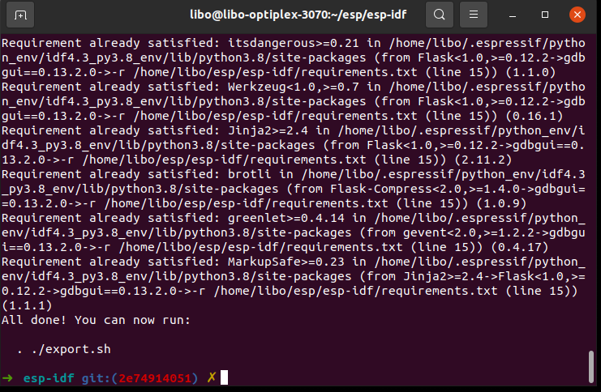

**问题处理：**

**工具集下载速度太慢？**：首先因为 `pip` 具默认从原始服务器下载 `Python` 工具包，芯片工具链也默认从 `Github` 服务器下载，这两个服务器都在国外，所以国内访问速度比较慢。

* 重定向 pip 下载：您可以选择在执行 `./install.sh` 之前，执行以下指令，将 pip 服务器修改为国内阿里云

    ```
    pip --version
    pip config set global.index-url http://mirrors.aliyun.com/pypi/simple
    pip config set global.trusted-host mirrors.aliyun.com
    ```

* 重定向编译工具链下载：您可以选择在执行 `./install.sh` 之前，执行以下指令，该指令将会把下载服务器改为乐鑫官方服务器

    ```
    export IDF_GITHUB_ASSETS="dl.espressif.com/github_assets"
    ```

### 4.2.2 Windows 系统环境安装

**1. 下载 ESP-IDF 安装工具**

我们推荐使用 `Windows 10` 及以上版本安装开发环境，您可以在 https://dl.espressif.com/dl/esp-idf/ 下载安装包，安装包下载界面如图 X-X 所示。安装工具本身也是一个开源软件，您可以访问 https://github.com/espressif/idf-installer 查看源代码。

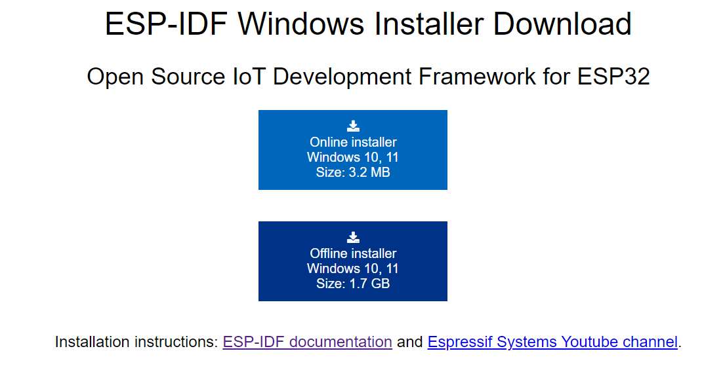

* 在线安装工具：在线安装工具安装包比较小，只有 3.2 MB，其它软件包和代码在安装过程中进行下载。优点是可以在安装过程中按需下载，并且有更多的版本选择，也可以安装 Github 最新分支的代码（例如 master 分支），缺点是安装过程中需要联网，可能因为网络问题导致安装失败。
* 离线安装工具：离线安装工具安装包较大，有 1.7 GB，包含了所有环境安装需要的软件包和代码，主要优点是可以安装在无法访问互联网的机器上，且安装成功率比较高，需要注意的是，离线安装工具只能安装以 `vA.B` 或 `vA.B.C` 版本标识的最新稳定发布版本。

**2. 运行安装工具**

这里演示了如何使用离线安装工具进行 ESP-IDF 稳定版本 v4.3 的环境安装。

**1. 双击 exe 文件进入 ESP-IDF 安装界面**

* 你可以在下拉列表选择使用的语言，这里选择 `简体中文`

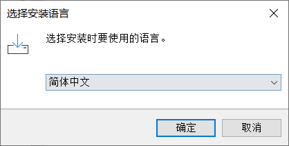

* 仔细阅读安装许可协议，选择是否同意，并点击下一步


* 检查系统配置项，这里主要检查 Windows 版本信息和已安装的杀毒软件信息，检查完成后，点击下一步。如果系统配置项异常，请点击查看 `完整日志`，根据关键项检索相关解决方案，或提交日志信息到 `https://github.com/espressif/idf-installer` 仓库寻求帮助

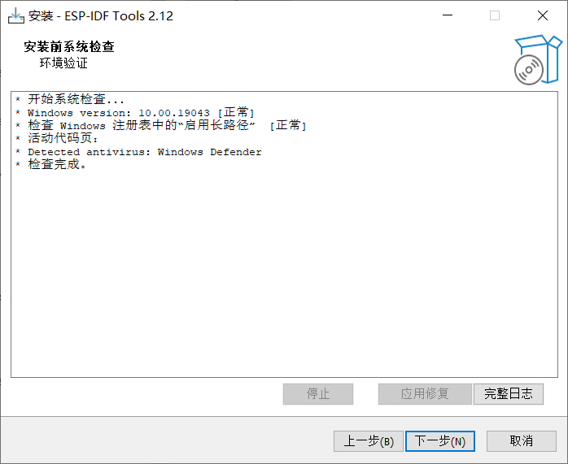

* 选择需要安装的版本，我们这里选择 `v4.3.1`，您可根据上一小节 `4.1.2 选择一个合适的版本` 确定需要安装的版本，如果您需要安装的版本不在此列表内，或想要体验 `master` 分支新功能，请选择在线安装工具进行安装
* 同时需要选择一个 ESP-IDF 仓库代码的安装路径，我们这里选择 `D:\esp-idf`，并点击下一步

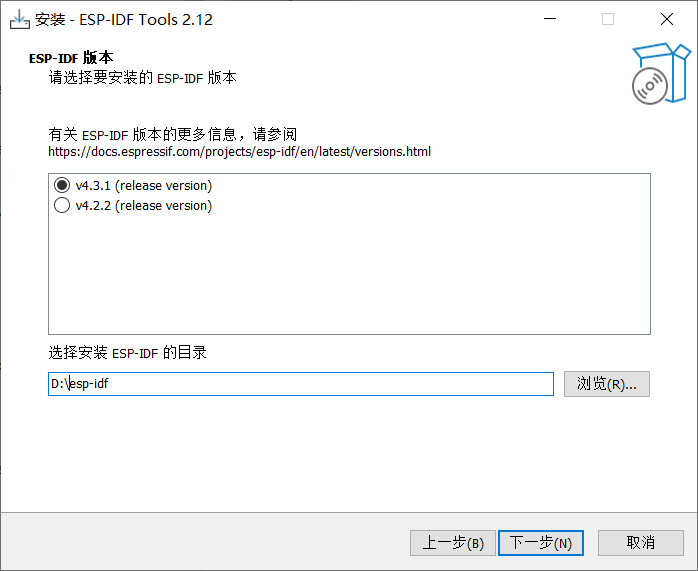

* 选择 ESP-IDF 开发工具和编译工具链的安装目录，我们这里选择 `D:\.espressif`，并点击下一步。请注意这里的 `.espressif` 是一个隐藏目录，您可在安装完成后，打开文件管理器的 `显示隐藏的项目` 查看该文件夹内的具体内容。

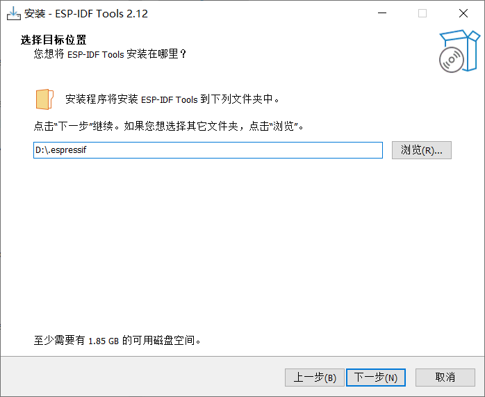

* 之后可以勾选本次安装的组件，这里建议使用默认选项 `完全安装` ，然后点击下一步

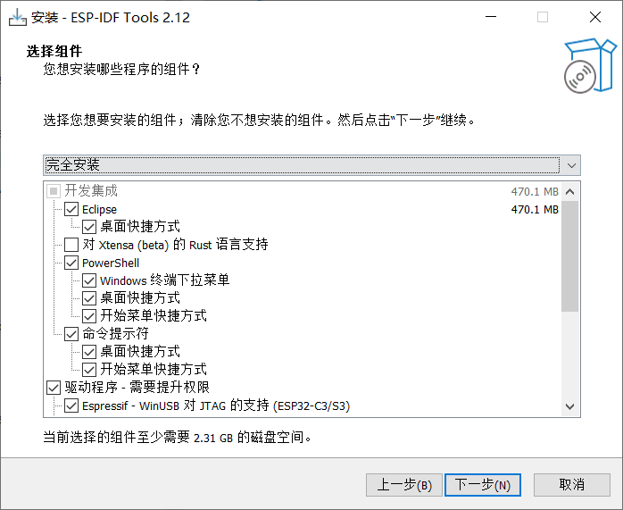

* 确定准备安装的组件，点击 `安装` 开始自动化安装过程，安装过程可能持续数十分钟，请耐心等待

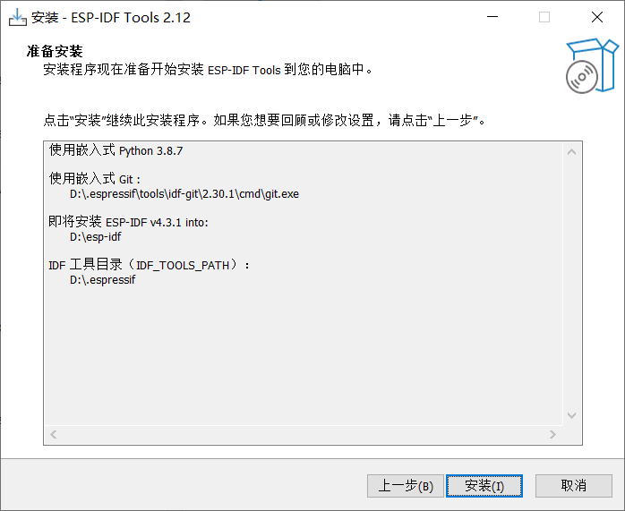

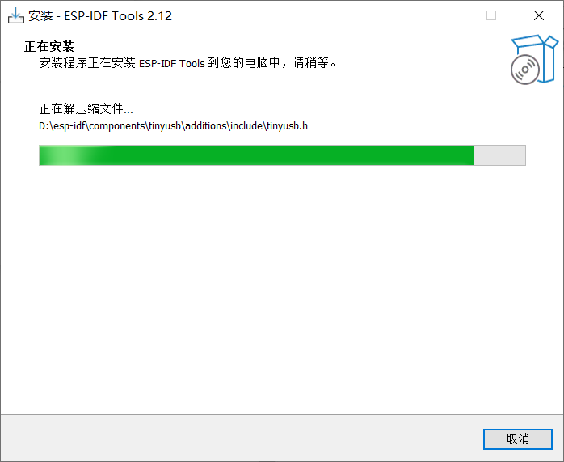

* 安装完成，这里建议勾选 `将 ESP-IDF 工具的可执行文件注册为 Windows Defender 的排除项`，避免杀毒软件误删文件，同时加入排除项将跳过杀毒软件的频繁扫描，大大提高 `Windows` 平台上的代码编译效率。
* 点击 `安装完成` 完成开发环境安装。您也可以选择勾选 `运行 ESP-IDF ... 环境` 在安装完后直接运行编译窗口，确保环境已经能够正常运行。

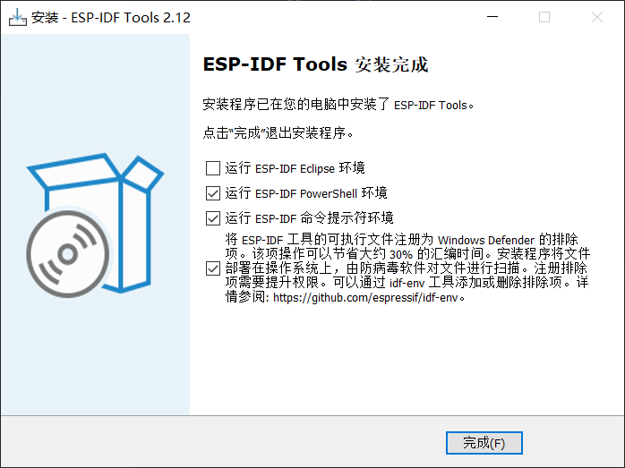

* 您可以在程序列表中快速打开刚刚安装的开发环境（`CMD` 或 `PowerShell` 终端任选其一），终端运行时 ESP-IDF 的环境变量将会自动添加，之后您即可使用 `idf.py` 指令进行操作，

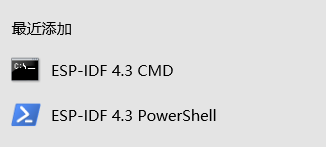

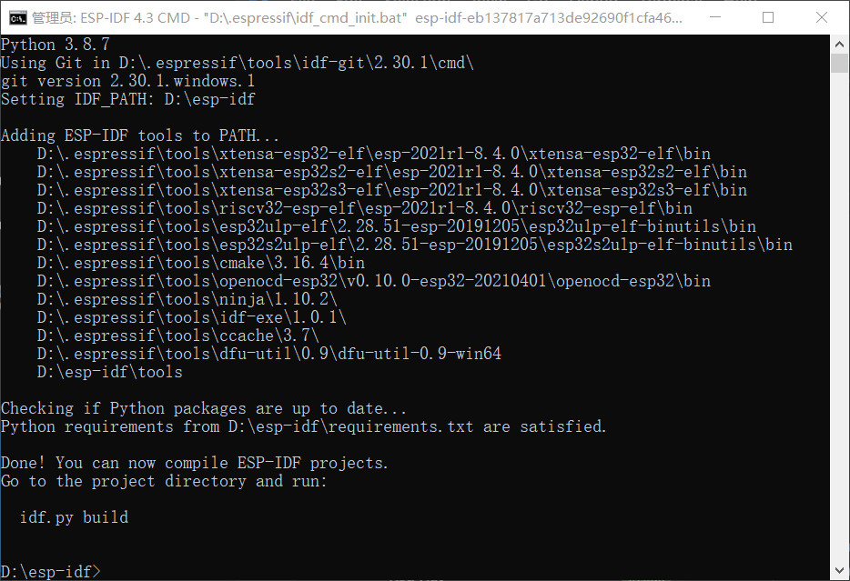


### 4.2.3 macOS 系统环境安装

macOS 的环境安装流程和 Linux 过程一致，仓库代码下载和工具集安装指令也完全相同，只是安装依赖软件包的指令略不相同。

**1. 安装依赖软件包**

* 打开终端，安装 pip 工具。pip 作为 Python 包管理工具，将用于后续 Python 软件包的安装

    ```
    sudo easy_install pip
    ```

* 安装包管理工具 `HomeBrew`，该包管理工具用于安装其它依赖软件。

    ```
    /bin/bash -c "$(curl -fsSL https://raw.githubusercontent.com/Homebrew/install/HEAD/install.sh)"
    ```

* 安装包依赖软件包，请输入以下指令

    ```
    brew python3 install cmake ninja ccache dfu-util
    ```

**2. 下载 ESP-IDF 仓库代码**

该部分请参考 4.2.1，Linux 系统下载 ESP-IDF 仓库代码方法

**3. 安装 ESP-IDF 开发工具集**

该部分请参考 4.2.1，Linux 系统安装 ESP-IDF 开发工具集方法

### 4.2.4 VSCode 代码编辑工具安装

ESP-IDF SDK 默认不附带代码编辑工具（最新 Windows 版本安装工具可选择安装 ESP-IDF Eclipse），你可使用任何文本编辑工具进行代码编辑，代码编辑完成您可在终端控制台使用命令进行代码编译。

VSCode（Visual Studio Code） 是一个免费的代码编辑工具，借助丰富且易用的插件功能，支持代码跳转和高亮，支持 Git 版本管理，支持终端集成等等，另外乐鑫也为 VSCode 开发了专用插件 `Espressif IDF`，方便工程配置和调试。

本书推荐使用 VSCode 进行 ESP32-C3 代码的开发，您可以在 `https://code.visualstudio.com/` 下载最新 VSCode 安装工具进行安装。

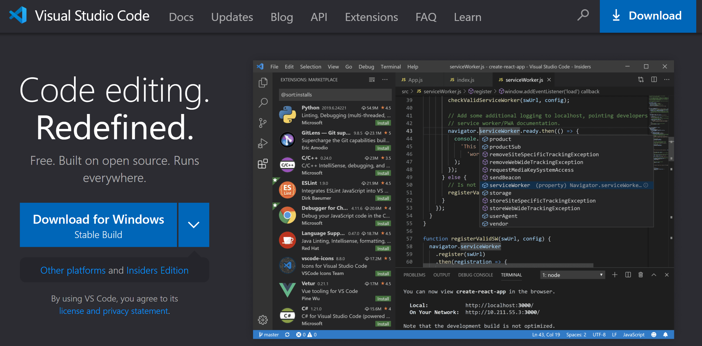

您可以在命令行中输入使用 `code .` 将当前文件夹在 VSCode 中快速打开，您可以使用 `CTRL`+`~` 在 VSCode 中打开系统默认的终端控制台。

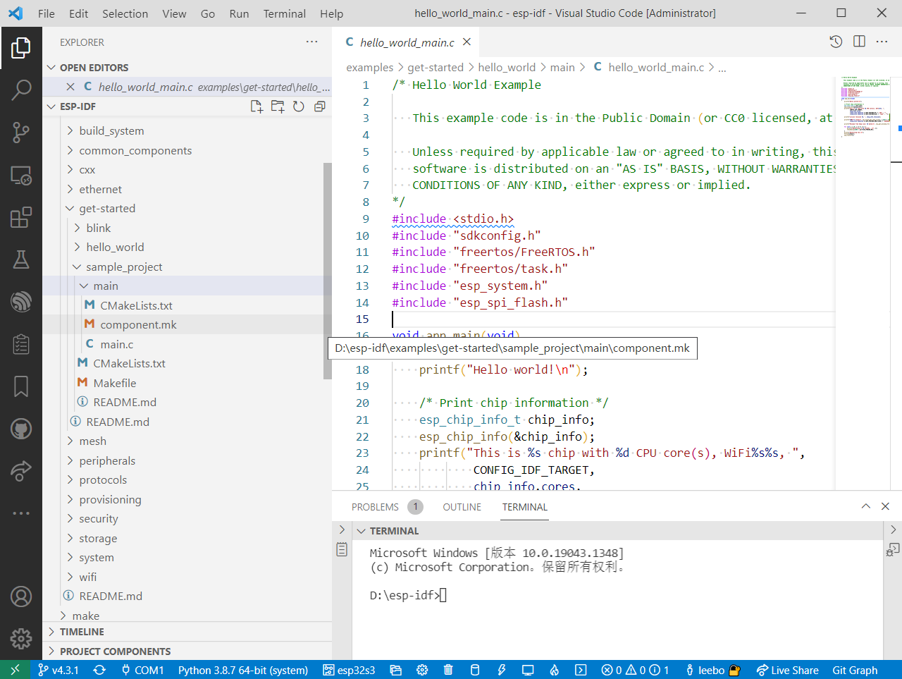
