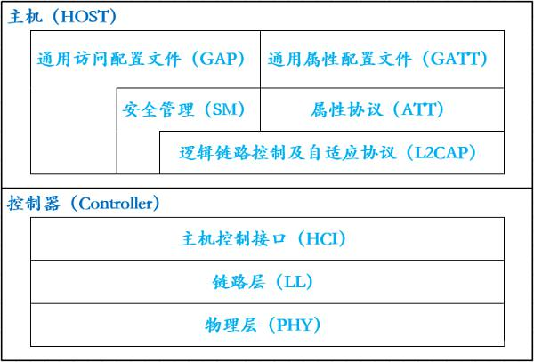

# 6.1 概述

近年来，整个世界逐渐走向移动化。因此，传统的连网方式已经无法应付新形式所带来的挑战。如果非得通过实体线缆才能够连上网络，使用者的活动范围势必大幅缩小。无线网络便无此限制，使用者可以享有较宽广的活动空问。因此，无线技术正逐渐侵蚀传统「固定式」 (fixed)或「有线式」(wired)网络所占有的领域。这种改变对每天开车的人来说分外明显， 因为边开车边使用移动电话的驾驶行径，已经让他们随时都得面对攸关生死的挑战。

## 6.1.1 Wi-Fi 基础知识介绍

### 6.1.1.1 什么是 Wi-Fi?

Wi-Fi，英文全称为 wireless fidelity，即无线保真技术。它是一种可以将个人电脑、手持设备等终端以无线方式互相连接的技术。

### 6.1.1.2 国际传输协议标准

表 6-1 描述了 Wi-Fi 协议标准的变更：

| 协议 | 频率范围(GHz) | 信道带宽(MHz) | 速度(Mbps) | 调制技术 |
|-----------|----------|-------|-------|-------|
|    802.11a    |    5   |  20 | 50 | OFDM |
|    802.11b    |    2.4   |  22  | 11 | CCK/DSSS|
|    802.11g    |    2.4   |  20  | 54 | CCK/DSSS|
|    802.11n    |    2.4/5   |  20/40  | 600 | OFDM |
|    802.11ac    |    5   |  20/40/80/160  | 1000 | OFDM |

表 6-1 Wi-Fi 协议标准
 

### 6.1.1.3 Wi-Fi 优势和场景

- 优势
	- 范围广

	无线电波的覆盖范围广，基于蓝牙技术的电波覆盖范围非常小，半径大约只有 50 英尺左右约合 15 米，而 Wi-Fi 的半径则可达 300 英尺左右, 约合 100 米，办公室自不用说，就是在整栋大楼中也可使用。
	
	- 速度快

	虽然由 Wi-Fi 技术传输的无线通信质量不是很好，数据安全性能比蓝牙差一些，传输质量也有待改进，但传输速度非常快，可以达到 11mbps，符合个人和社会信息化的需求。
	
	- 成本低

	厂商进入该领域的门槛比较低。厂商只要在机场、车站、咖啡店、图书馆等人员较密集的地方设置“热点”，并通过高速线路将因特网接入上述场所。这样，由于“热点”所发射出的电波可以达到距接入点半径数十米至 100米的地方，用户只要将支持无线 LAN 的笔记本电脑或 PDA 拿到该区域内，即可高速接入因特网。也就是说，厂商不用耗费资金来进行网络布线接入，从而节省了大量的成本。
	
	- 无须布线

	Wi-Fi 最主要的优势在于不需要布线，可以不受布线条件的限制，因此非常适合移动办公用户的需要，具有广阔市场前景。目前它已经从传统的医疗保健、库存控制和管理服务等特殊行业向更多行业拓展开去，甚至开始进入家庭以及教育机构等领域。
	
	- 组建方便

	一般架设无线网络的基本配备就是无线网卡及一台 AP，如此便能以无线的模式，配合既有的有线架构来分享网络资源，架设费用和复杂程序远远低于传统的有线网络。如果只是几台电脑的对等网，也可不要 AP，只需要每台电脑配备无线网卡。
	
- 场景
	-  智能安防

	无论传统模拟监控还是新兴的网络监控领域，有线传输一直占据着主导地位，但随着网络的发展，监控范围/场景等需求越发复杂，Wi-Fi 无线传输模式以其自身不可替代的优势在安防行业发挥着越来越重要的作用，弥补着有线传输方式的不足。
	
	- 智能家居

	智能音响系统，智能窗户系统，智能空调系统等家具家电的控制都可以通过 Wi-Fi 通信方式来控制。

### 6.1.1.4 Wi-Fi 相关术语

- 工作站(Station)
	
	配置网络的目的，是为了在工作站间传送数据。所谓的工作站(station)，是指配备无线
网络界面的计算设备。通常，工作站是以电池供电的膝上型(laptop)或手持式(handheld)电脑。然而，工作站不见得就是携带型(portable)计算设备。有时候，使用无线网络之目的是为了省去拉线的麻烦，桌上型(desktop)电脑一样可以使用无线局域网络。较宽广的开放空问也可以受惠于无线网络，例如生产线可以使用无线局域网络来连接彼此。

- 基站(Access Point)

	802.11 网络所使用的帧必须经过转换，方能被传递至其他不同类型的网络。具备无线至有线(wireless-to-wired)桥接功能的设备称为基站(access point，简称 AP);基站的功能不仅于此，但桥接(bridging)最为重要。起初，厂商倾向于将基站的所有功能置于单一设备，不过一些较新的产品则是将 802.11 协议切割为两部分: “精简型”基站(thin AP)与基站控制器 (AP controller)。

- 无线介质(Wireless medium)

	802.11 标准以无线介质(Wireless medium)在工作站之间传递帧。其所定义的物理层不只一种;这种架构允许多种物理层同时支持 802.11 MAC - 802.11 最初标准化了两种射频(radio frequency，简称 RF)物理层以及一种红外线(infrared)物理层，然而事后证明 RF 物理层较受欢迎。此外，一些其他的射频物理层也已经标准化了。

- 传输系统(Distribution system)

	当几部基站串连以覆盖较大区域时，彼此之间必须相互通信，才能够掌握移动式工作站的 行踪。而传输系统(distribution system)属于 802.11 的逻辑元件，负责将帧(frame)转送至目的地。802.11 并未规范传输系统的技术细节。大多数商用产品，是以桥接引擎(bridging engine) 和传输系统介质(distribution system medium)共同组成传输系统。传输系统是基站间转送帧的骨干网络，通常就称为骨干网络(backbone network)。所有在商业上获得成功的产品，几乎都是以 Ethernet 为骨干网络。

## 6.1.2 蓝牙基础知识介绍

### 6.1.2.1 什么是蓝牙?

蓝牙，是一种支持设备短距离通信（一般 10m 内）的无线电技术。能在包括移动电话、PDA、无线耳机、笔记本电脑、相关外设等众多设备之间进行无线信息交换。利用“蓝牙”技术，能够有效地简化移动通信终端设备之间的通信，也能够成功地简化设备与因特网Internet 之间的通信，从而数据传输变得更加迅速高效，为无线通信拓宽道路。蓝牙采用分散式网络结构以及快跳频和短包技术，支持点对点及点对多点通信，工作在全球通用的2.4GHz ISM（即工业、科学、医学）频段。其数据速率为 1Mbps。采用时分双工传输方案实现全双工传输。分为经典蓝牙和低功耗蓝牙。

- 经典蓝牙

	经典蓝牙（classic Bluetooth），简称 BT。泛指支持蓝牙协议在 4.0 以下的模块，一般用于数据量比较大的传输，如：语音、音乐等较高数据量传输。

- 低功耗蓝牙

	低功耗蓝牙（Bluetooth Low Energy），简称 BLE。蓝牙低能耗无线技术利用许多智能手段最大限度地降低功耗。 

### 6.1.2.2 蓝牙协议版本

总体来看蓝牙协议版本有两个分支，分别是传统蓝牙和低功耗蓝牙 BLE，其中蓝牙 1.1、1.2、2.0、2.1、3.0 版本属于传统蓝牙，而 4.0 以后的蓝牙版本属于低功耗蓝牙。传统蓝牙主要用于传输音频、传输文件等场景，功耗较高；而低功耗蓝牙则用于设备匹配、数据同步、定位等场景，功耗和延迟极低。表 6-2 描述了不同蓝牙协议版本的变更：

| 蓝牙版本 | 发布时间 | 最大传输速度| 传输距离（米）| 
|-----------|----------|-------|-------|
|    蓝牙 5.3    |    2021   |  48 Mbit/s | 300 |
|    蓝牙 5.2    |    2020   |  48 Mbit/s | 300 |
|    蓝牙 5.1    |    2019   |  48 Mbit/s | 300 |
|    蓝牙 5.0    |    2016   |  48 Mbit/s | 300 |
|    蓝牙 4.2    |    2014   |  24 Mbit/s | 50 |
|    蓝牙 4.1    |    2013   |  24 Mbit/s | 50 |
|    蓝牙 4.0    |    2010   |  24 Mbit/s | 50 |
|    蓝牙 3.0 + HS    |    2009   |  24 Mbit/s | 10 |
|    蓝牙 2.1 + EDR    |    2007   |  3 Mbit/s | 10 |
|    蓝牙 2.0 + EDR    |    2004   |  2.1 Mbit/s | 10 |
|    蓝牙 1.2    |    2003   |  1 Mbit/s | 10 |
|    蓝牙 1.1    |    2002   |  810 Kbit/s  | 10 |

表 6-2 蓝牙协议版本
 

### 6.1.2.3 蓝牙优势和场景

- 优势
	- 易于使用

		当用户设备处于一定范围的时候，支持蓝牙的设备将自动互相识别，完成同步等工作。
		
	- 无缝的互操作性

		设备应用程序的自动发现提供智能的按需访问。通过标准的高层次协议子集（Profiles）进行应用程序连接，消除了设备和操作系统的依赖性。
		
	- 快速

		2.4 GHz 无线电发送，提供 1 Mbiffs 的流量。
		
	- 安全

		蓝牙基带部分在物理层为用户提供保护和信息保密机制。鉴权是蓝牙系统中的关键部分，它允许用户为个人的蓝牙设备建立一个信任域。
		
		加密被用来保护连接中的个人信息。密钥有程序的高层来管理。网络传送协议和应用程序为用户提供一个较强的安全机制。鉴权和加密机制保证个人通信的绝对安全。	
	- 连接范围

		在开放空间里，客户端之间的连接可跨越 10m。客户端与接入点之间的距离可长达 100m。
		
	- 语音和数据支持

		每个设备支持多达 3 个语音通道，7 个数据连接，实现多功能连接。
		
	- 被广泛采纳

		蓝牙技术被 1800 多家公司所采纳，这意味着不断地会有大量支持蓝牙无线技术的应用和设备。
		
	- 价格合理

		这种价格合理的选择使广泛地部署和使用成为可能。
		
	- 节能

		低功耗使众多的设备可以使用这种无线技术，如手机、手持电脑等。
 
- 场景
	- 智慧医疗

		当前的健康医疗设备通常是可穿戴产品或其他小物件。通过蓝牙模块，由健康医疗设备的传感器实时收集的健康数据将传输到蓝牙模块的计算机。MCU会校正收集到的数据的值。正确的值可以通过相应的接口传输到文件，病人的健康数据可以通过蓝牙模块传输到屏幕上。还可以通过APP负责接收和分析接收到的健康数据，起到对数据实时监控的作用。
	
	- 蓝牙 Mesh 智能照明

		蓝牙 Mesh 模块构建网络并使用单个控制设备与云进行同步，从而简化并有效地控制智能家居系统中的所有功能。在蓝牙Mesh智能照明方案中，用户通过手机连接Mesh网络中的任何一个LED灯，就可以控制Mesh网络中任意一个或一组灯，并对Mesh网络LED灯管进行分组，调光，颜色调整，场景设置，蓝牙Mesh的体系结构可以扩展以满足办公室，工厂，工业环境甚至城市的需求，并且可以连接数百万个节点而不会出现故障。
		
	- 智能穿戴

		由于低功耗蓝牙（BLE）的低功耗已广泛应用于智能可穿戴终端，很多智能设备都依靠蓝牙技术和进行无线连接和数据交换，最常见例如：智能手环、智能项链等，由于蓝牙低功耗技术可以实现短距离通信的最低功耗，从而大大延长了可穿戴设备的运行时间。
		
	- 智能门锁

		在智能门锁的应用场景中，利用蓝牙技术可以满足不同用户和权限的需求，同时确保机密性。将门锁内安装蓝牙模块，人们可以通过APP实时读取智能锁的蓝牙信息，然后进行配对，向服务器发送解锁请求，服务器将解锁命令发送给手机，手机接收到解锁信息后，通过门锁里面的蓝牙模块把指令发送给智能锁门，然后开锁。非常方便、快捷、安全
		 
### 6.1.2.4 蓝牙相关术语

图 6-1 描述了蓝牙协议栈的层次：

图 6-1 蓝牙协议栈层次
 

Host 层就是我们常说的 BLE 协议栈，用来管理设备之间的通信协议，包含逻辑链路控制和适配协议（L2CAP）、属性协议（Attribute Protocol)、安全管理器协议（Security Manager Protocol ）、通用属性规范（GATT）、通用访问规范（GAP）以及主机控制器接口（HCI）的上半部。

Controller 层主要对上层过来的数据进行打包和发送，接收端则负责信号的接收和解包。其中包含两个重要的部分，即 Link layer 和 physical layer。以发送端为例，Link layer 主要是为数据包进行打包，physical layer 则是负责将信号调制到载波然后经射频发出。

- 物理层（Physical Layer，简写 PHY）

	PHY 层用来指定 BLE 所用的无线频段，调制解调方式和方法等。是 1Mbps 自适应跳频的 GFSK 射频，工作于免许可证的 2.4GHz ISM（工业、科学与医疗）频段。PHY 层做得好不好，直接决定整个 BLE 芯片的功耗，灵敏度以及 selectivity 等射频指标。

- 链路层（Link Layer，简写 LL）

	LL 层是整个 BLE 协议栈的核心，也是 BLE 协议栈的难点和重点。LL 层要做的事情非常多，比如具体选择哪程度 个射频通道进行通信，怎么识别空中数据包，具体在哪个时间点把数据包发送出去，怎么保证数据的完整性，ACK 如何接收，如何进行重传，以及如何对链路进行管理和控制等等。LL 层只负责把数据发出去或者收回来，对数据进行怎样的解析则交给上面的 GAP 或者 ATT。
	
- 主机控制接口层（Host Controller Interface，简写 HCI）

	HCI 是可选的，HCI 主要用于 2 颗芯片实现 BLE 协议栈的场合，用来规范两者之间的通信协议和通信命令等。

- 通用访问配置文件层（Generic access profile，简写 GAP）

	GAP 是对 LL 层 payload（有效数据包）如何进行解析的两种方式中的一种，而且是最简单的那一种。GAP 简单的对 LL payload 进行一些规范和定义，因此 GAP 能实现的功能极其有限。GAP 目前主要用来进行广播，扫描和发起连接等。
	
- 逻辑链路控制及自适应协议层（Logical Link Control and Adaptation Protocol，简写 L2CAP）

	L2CAP 对 LL 进行了一次简单封装，LL 只关心传输的数据本身，L2CAP 就要区分是加密通道还是普通通道，同时还要对连接间隔进行管理。

- 安全管理层（Security Manager，简写 SM）

	SMP 用来管理BLE连接的加密和安全的，如何保证连接的安全性，同时不影响用户的体验，这些都是 SMP 要考虑的工作。
	
- 属性协议层（Attribute protocol，简写 ATT）

	简单来说，ATT 层用来定义用户命令及命令操作的数据，比如读取某个数据或者写某个数据。BLE 协议栈中，开发者接触最多的就是 ATT。BLE 引入了 attribute 概念，用来描述一条一条的数据。Attribute 除了定义数据，同时定义该数据可以使用的 ATT 命令，因此这一层被称为 ATT 层。
	
- 通用属性配置文件层（Generic Attribute profile，简写 GATT）

	GATT 用来规范 attribute 中的数据内容，并运用 group（分组）的概念对 attribute 进行分类管理。没有 GATT，BLE 协议栈也能跑，但互联互通就会出问题，也正是因为有了 GATT 和各种各样的应用 profile，BLE 摆脱了 ZigBee 等无线协议的兼容性困境，成了出货量最大的 2.4G 无线通信产品。