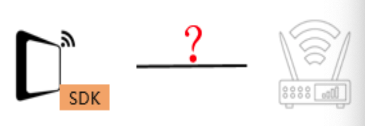
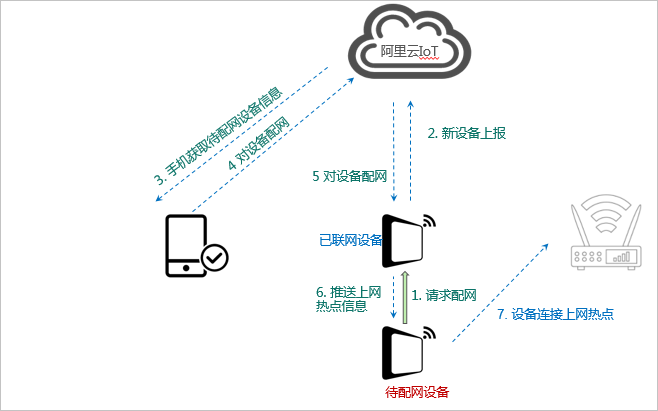
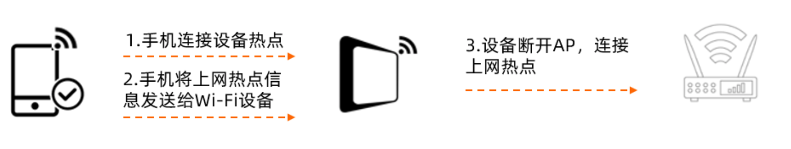
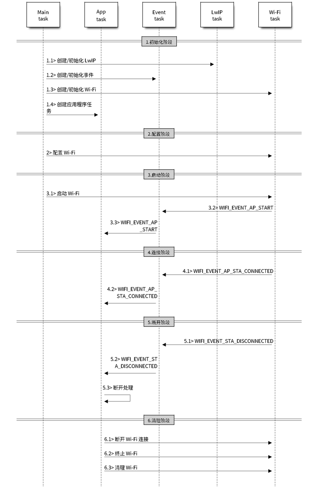
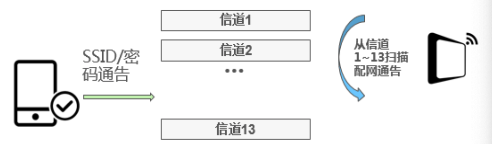
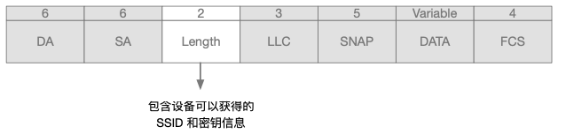
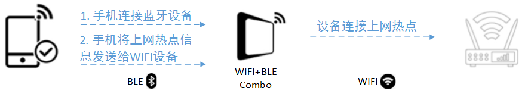
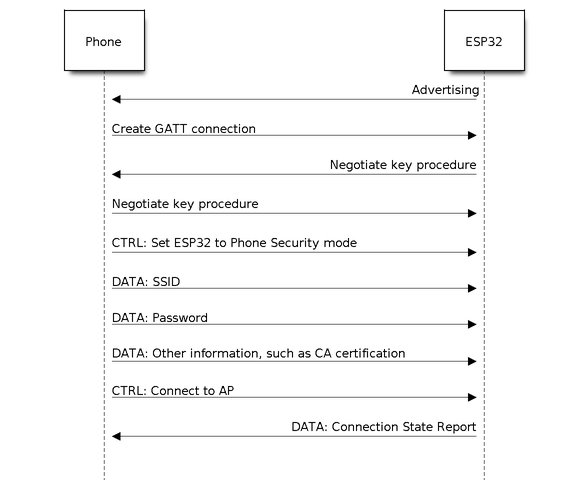

# 6.2 Wi-Fi 配网

随着物联网、智能家居等行业的发展，催生了大批需要联网的设备。Wi-Fi 由于传输能力强，可以直连互联网，占据了物联网设备中相当部分的份额。

这类 Wi-Fi 物联网设备，不同于一般的智能手机、平板电脑等设备，有丰富的人机交互界面，可以方便的实现配网。通常这类设备仅仅具备 Wi-Fi 模块，所以这类设备如何连接到互联网上或是其他局域网络上，也一直是 Wi-Fi 模块特性的一个基本话题，本节介绍了一些主流的配网方式，重点描述了乐鑫在这些配网方式方面的实现。

## 6.2.1 Wi-Fi 配网概述

“配网”指的是，外部向 Wi-Fi 模块提供 SSID 和密码，以便 Wi-Fi 模块可以连接指定的热点或路由器并加入后者所建立的相关 Wi-Fi 网络。

Wi-Fi 配网，核心其实就是通过各种方法，将要连接的 AP 或者路由器 SSID 和密码发送给需要联网设备上的 Wi-Fi 模块，然后 Wi-Fi 模块去连接指定的 Wi-Fi 网络，达到接入局域网或者互联网的目的。图 6-2 描述了Wi-Fi 配网的基本过程：

<div align="center">

</div>
<center>图 6-2 Wi-Fi 配网的基本过程</center> 

待配网的物联网设备，除了连接到网络，一般还需要与某账号进行关联，所以就有了如下几个概念：

- 狭义配网：Wi-Fi 设备获取路由器信息（SSID，password 等）并连接路由器的过程。
- 绑定：用户手机 APP 账号与被配网设备关联的过程。
- 广义配网：狭义配网+绑定。

本节主要描述狭义配网，关于绑定的不做介绍。

目前主流的 Wi-Fi 配网方式有：直接配网、手机热点配网、路由器配网、零配 Zeroconfig、设备热点配网、一键配网、蓝牙配网等。

## 6.2.2 直接配网

所谓直接配网，就是通过 UART 串口、SPI 口、SDIO 口、I2C 等主机接口，按照一定的通信协议，将 SSID 和密码，直接传递给 Wi-Fi 模块，所以这种方式也可以称为有线配网。Wi-Fi 模块在收到 SSID 和密码后去连接热点或路由器，并将连接的结果从主机接口返回。

另外，有些设备在出场时会含烧录固定 Wi-Fi 信息（SSID 和密码），在指定的 Wi-Fi 环境下启动就可以自动连接相应路由器或者 AP，这种一般在大规模组网、工厂测试或者工业场景下应用较多。

- 优点：

	直接配网方式软件方案实现简单，但需要铺设其他的通信线路，比较适合于板载 Wi-Fi 模块，或有其他协议传输线连接的设备间。

- 缺点：

	对于环境要求比较高，需要在系统间有其它的通信链路存在。

## 6.2.3 手机热点配网

将手机设置成一个特定名字和密码的 Wi-Fi 热点，然后让设备自己连接手机，再发送和接受配网绑定信息。

- 优点：
	
	- 设备无需支持热点模式，设备端开发工作量较低；
	- 可与一键配网共存（同时使能），常用来做备用配网方案。

- 缺点：
	
	用户体验不佳，实际应用过程，很多用户不知道怎么设置自己手机热点名字，甚至都不知道怎么打开手机 Wi-Fi 热点，所以不适合消费类大规模推广。尤其在 ios 设备上 APP 无法自动创建热点，需要用户跳转设置界面手动改设备名称并手动打开热点。
	
## 6.2.4 路由器配网

路由器中 WPS 是由 Wi-Fi 联盟所推出的全新 Wi-Fi 安全防护设定（Wi-Fi Protected Setup）标准，该标准推出的主要原因是为了解决长久以来无线网络加密认证设定的步骤过于繁杂艰难之弊病。WPS 用于简化 Wi-Fi 无线的安全设置和网络管理。它支持两种模式：个人识别码（PIN）模式和按钮（PBC）模式。

- 优点：

	配网操作比较简单
	
- 缺点：

	该方式要求路由器和设备同时支持 WPS 。使用者往往会因为步骤太过麻烦，以致干脆不做任何加密安全设定，因而引发许多安全上的问题。
	
	因为安全性的缘故，近几年已经逐步被放弃，越来越多的路由器开始放弃或者自动关闭对这种方式的支持。
	
## 6.2.5 零配 Zeroconfig

零配是一种比较特殊的配网方式，特殊之处在于整个环节中，把智能手机这个角色用别的设备替换掉了（智能音箱）。本质上是用一台配过网的设备，帮忙另外一台设备配网。

Wi-Fi 设备进入配网状态的时候，会将自己的 MAC 地址通过 Sniffer 报文的方式发送出去，这个时候路由器下面支持零配的设备（例如天猫精灵），就可以获取到需要配网设备的 MAC 地址，同时天猫精灵会将自己保存的路由器名字和密码通过 Sniffer 报文发给设备。同时等待设备连接上网络，进行外网绑定。图 6-3 描述了零配的配网流程：

<div align="center">

</div>
<center>图 6-3 零配的配网流程</center> 

- 优点：
	
	用户体验好，成功率高，如智能音响对智能设备配网即可使用此方式。这个方式由于零配设备自己保存了路由器的名字和密码，所以减少了用户输入路由器密码的步骤。
	
- 缺点：
	- 应用面窄，需要满足路由器下存在已经配网的同方案设备的要求。
	- 由于手机 APP 权限问题，无法通过第三方程序组装或者接收 Wi-Fi 管理帧，限制了其在手机上的应用（手机不能当主配），也就使得其只能成为一种辅助或者特定领域的配网方式。

## 6.2.6 设备热点配网
### 6.2.6.1 设备热点配网介绍

设备热点配网，又被称为传统配网。待配网的 Wi-Fi 设备会建立一个 Wi-Fi 热点，用户将手机或其它可以具备人机交互功能的设备（平板电脑等）连接到这个热点，然后将要连接的 Wi-Fi 信息发送给待配网的 Wi-Fi 设备。待配网的 Wi-Fi 设备收到信息后，找到对应的路由器主动去连接路由器，完成配网。图 6-4 描述了设备热点配网的基本步骤：

<div align="center">

</div>
<center>图 6-4 设备热点配网的基本步骤</center>  

- 优点：

	成功率高，AP 配网是局域网直连模式，没有路由器参与。由于没有路由器兼容性问题，所以配网成功率相比一键配网要高。
	
- 缺点：

	AP 配网相对复杂，需要手动切换 Wi-Fi ：如需要手机先连接上设备的 AP 热点，用户需要先进入 Wi-Fi 列表页面然后手动切换到设备的 AP 热点，连接成功操作上云有需要切换到路由器的热点，有的手机也不能自动切换热点，比如苹果 iOS11.0 系统以下的手机，无法自动切换热点，需要用户进入 Wi-Fi 列表页面，选择新热点等。

	AP 配网是局域网模式，所以无法判断是否连上路由器，需要借助设备上云或局域网设备发现协议等来判断，过于复杂。

### 6.2.6.2 如何使用 IDF 组件启用设备热点配网

图 6-5 描述了 ESP32C3 在 AP 模式下的宏观场景，其中包含了不同阶段的具体描述：

<div align="center">

</div>
<center>图 6-5 设备热点配网的宏观场景</center>  

更详细的介绍，会在改良 Wi-Fi 连接时，作进一步的描述，此处先不据此展开。

## 6.2.7 一键配网

### 6.2.7.1 一键配网介绍

所谓一键配网，就是使用 Wi-Fi 设备本身自带的 Wi-Fi 信号，在 MAC 层将 SSID 和密码按照一定的协议格式填充在 MAC 包中不加密的包头部分，采用广播和抓包方式，从手机等设备将 SSID 和密码分段多次传递给 Wi-Fi 模块。

目前市面上常见的多种 SmartConfig/SmartConnection 技术，虽然各个 Wi-Fi 芯片方案会取不同的英文名字，但是基本原理则基本相同，只是填充的数据协议格式稍有区别。表 6-3 描述了主流厂商的实现方案：

| 厂商 | 芯片方案 | 技术名称 | 发包方式 |
|-----------|----------|-------|-------|
|    TI    |    CC3200  |  SmartConfig | 往某一固定 IP 发 UDP 包 |
|    高通   |    QCA4004/QCA4002   |  SmartConnection  | 组播地址编码 |
|    MTK   |    MTK7681   |  SmartConnection  | 组播地址编码 |
|    Marvell    |    MW300  |  Easyconnect | 组播地址编码 |
|    Reltek    |    AMEBA  |  Simpleconfig | 组播地址编码 |
|    乐鑫    |    ESP32C3  |  SmartConfig  | 组播，通过长度编码 |
|    新岸线    |    NL6621  |  SmartConfig | 组播地址编码 |
|    微信    |    多家   |  Airkiss  | 全网广播，通过长度编码 |

<center>表 6-3 主流厂商一键配网方案</center>

一键配网一般需要在发送 SSID 和密码的设备（例如手机）上安装一个APP，该 APP 实现了和 Wi-Fi 模块之间的协议交互（发送 SSID 和密码）。图 6-6 描述了设备一键配网的基本步骤：

<div align="center">

</div>
<center>图 6-6 设备一键配网的基本步骤</center>  

接收端进入一键配置功能后，Wi-Fi 设备从信道 1 开始监听路由上的数据，如当前监听信道有符合规则的数据包，就停止信道切换，停留在当前信道接收完全部数据。否则就依次切换至信道 2.3.4.... 直到信道 13 后又从信道 1 开始继续监听依次循环。

由于无线数据传播必定是广播的，所以必然可以被监听到。如果 AP 没有加密的话，UDP 直接可以把相关的信息发送出来。但是路由器 AP 一般都是加密的，而且加密方式不固定，Wi-Fi 模块无法直接解析出数据包。

从 802.11 的 MAC 层帧格式中可以看到, 链路层载荷数据（即网络层头部及网络层数）在数据帧中是清晰可辨的, 只要接收到 802.11 帧就可以立刻提取出载荷数据, 计算载荷数据的长度自不用说, 而这里的载荷数据, 通常就是密文。图 6-7 描述了一键配网的数据包结构：

<div align="center">

</div>
<center>图 6-7 设备一键配网的数据包结构</center> 

- SNAP：格式数据包
- DA:目标MAC地址
- SA:源MAC地址
- LENGTH:表示后面数据的长度
- LLC:表示LLC头
- SNAP:表示3byte的厂商代码和2byte的协议类型表示
- DATA:载荷数据
- FCS:帧检验序列

在发送端，通常采用如下 2 种不同的编码发送方式：

- UDP 广播：

	从 802.11 帧格式分析中获知，无线信号监听方的角度来说，不管无线信道有没有加密，DA、SA、LENGTH、LLC、SNAP、FCS 字段总是暴露的，因此信号监听方可以从这 6 个字段获取有效信息。从发送方讲，由于操作系统的限制，如果采用广播，只剩下 LENGTH 。发送方可通过改变其所需要发送数据包的长度进行控制。所以只要指定出一套利用长度编码的通讯协议，就可利用数据包的 Length 字段进行数据传递；
- UDP 组播：

	组播地址是保留的 D 类地址从 224.0.0.0-239.255.255.255，IP地址与 MAC 地址映射关系为：将 MAC 地址的前 25 位设定为 01.00.5e，而 MAC 地址的后 23 位对应 IP 地址的位；故发送端可以将数据编码在组播 ip 的后 23bit 中,通过组播包发送，接收端进行解码即可。

- 优点：

	用户操作简单，体验好（成功时）。
	
- 缺点：

	对手机，路由器都有严格的兼容性要求，比如有些路由器默认关闭广播/组播报文转发使得设备收不到路由器转发的报文；手机以 5G 频段连接到路由器，2.4G 的设备压根收不到包等，诸如此类不可控因素导致整体兼容性差，配网成功率低。

### 6.2.7.2 如何使用 IDF 组件启用一键配网

乐鑫作为物联网的积极倡导者，在 ESP32C3 上提供了完整的解决方案，如 ESP-TOUCH 和 ESP-TOUCH V2 等。

- API 接口说明

	关于一键配网的 API 都定义在 “esp_smartconfig.h” 中，表 6-4 描述了相关的 API 接口：
	
	| 序号 | 函数名 | 说明 |
	|-----------|----------|-------|
	|    1    |    esp*_*smartconfig*_*get*_*version   |  获取当前 Smartconfig 的版本 |
	|    2    |    esp*_*smartconfig*_*start   |  开始  SmartConfig  |
	|    3    |    esp*_*smartconfig*_*stop   |  停止  SmartConfig  |
	|    4    |    esp*_*esptouch*_*set*_*timeout   |  设置 SmartConfig 进程超时  |	
	|    5    |    esp*_*smartconfig*_*set*_*type   |  设置 SmartConfig 的协议类型  |
	|    6    |    esp*_*smartconfig*_*fast*_*mode   |  设置 SmartConfig 模式  | 
	|    7    |    esp*_*smartconfig*_*get*_*rvd*_*data   |  获取 Touchv2 预留数据 |
	
	<center>表 6-4 设备一键配网 API 接口</center>

- 示例结构
	- 事件处理 
		- 按照收到的一键配网请求作相应的处理，主要负责 config 信息的获取及设置；
		- Wi-Fi 的连接、断开重连、扫描；
		- 获取网络IP地址，完成 IP 接口搭建（默认IO口）；

		```
		
		static void event_handler(void* arg, esp_event_base_t event_base,
		                                int32_t event_id, void* event_data)
		{
		    if (event_base == WIFI_EVENT && event_id == WIFI_EVENT_STA_START) {
		        xTaskCreate(smartconfig_example_task, "smartconfig_example_task", 4096, NULL, 3, NULL);
		    } else if (event_base == WIFI_EVENT && event_id == WIFI_EVENT_STA_DISCONNECTED) {
		        esp_wifi_connect();
		        xEventGroupClearBits(s_wifi_event_group, CONNECTED_BIT);
		    } else if (event_base == IP_EVENT && event_id == IP_EVENT_STA_GOT_IP) {
		        xEventGroupSetBits(s_wifi_event_group, CONNECTED_BIT);
		    } else if (event_base == SC_EVENT && event_id == SC_EVENT_SCAN_DONE) {
		        ESP_LOGI(TAG, "Scan done");
		    } else if (event_base == SC_EVENT && event_id == SC_EVENT_FOUND_CHANNEL) {
		        ESP_LOGI(TAG, "Found channel");
		    } else if (event_base == SC_EVENT && event_id == SC_EVENT_GOT_SSID_PSWD) {
		        ESP_LOGI(TAG, "Got SSID and password");
		
		        smartconfig_event_got_ssid_pswd_t *evt = (smartconfig_event_got_ssid_pswd_t *)event_data;
		        wifi_config_t wifi_config;
		        uint8_t ssid[33] = { 0 };
		        uint8_t password[65] = { 0 };
		        uint8_t rvd_data[33] = { 0 };
		
		        bzero(&wifi_config, sizeof(wifi_config_t));
		        memcpy(wifi_config.sta.ssid, evt->ssid, sizeof(wifi_config.sta.ssid));
		        memcpy(wifi_config.sta.password, evt->password, sizeof(wifi_config.sta.password));
		        wifi_config.sta.bssid_set = evt->bssid_set;
		        if (wifi_config.sta.bssid_set == true) {
		            memcpy(wifi_config.sta.bssid, evt->bssid, sizeof(wifi_config.sta.bssid));
		        }
		
		        memcpy(ssid, evt->ssid, sizeof(evt->ssid));
		        memcpy(password, evt->password, sizeof(evt->password));
		        ESP_LOGI(TAG, "SSID:%s", ssid);
		        ESP_LOGI(TAG, "PASSWORD:%s", password);
		        if (evt->type == SC_TYPE_ESPTOUCH_V2) {
		            ESP_ERROR_CHECK( esp_smartconfig_get_rvd_data(rvd_data, sizeof(rvd_data)) );
		            ESP_LOGI(TAG, "RVD_DATA:");
		            for (int i=0; i<33; i++) {
		                printf("%02x ", rvd_data[i]);
		            }
		            printf("\n");
		        }
		
		        ESP_ERROR_CHECK( esp_wifi_disconnect() );
		        ESP_ERROR_CHECK( esp_wifi_set_config(WIFI_IF_STA, &wifi_config) );
		        esp_wifi_connect();
		    } else if (event_base == SC_EVENT && event_id == SC_EVENT_SEND_ACK_DONE) {
		        xEventGroupSetBits(s_wifi_event_group, ESPTOUCH_DONE_BIT);
		    }
		}
	
		```

- 任务处理

	主要负责一键配网中类型设置、启动、停止等处理。
	
	```
	static void smartconfig_example_task(void * parm)
	{
	    EventBits_t uxBits;
	    ESP_ERROR_CHECK( esp_smartconfig_set_type(SC_TYPE_ESPTOUCH) );
	    smartconfig_start_config_t cfg = SMARTCONFIG_START_CONFIG_DEFAULT();
	    ESP_ERROR_CHECK( esp_smartconfig_start(&cfg) );
	    while (1) {
	        uxBits = xEventGroupWaitBits(s_wifi_event_group, CONNECTED_BIT | ESPTOUCH_DONE_BIT, true, false, portMAX_DELAY);
	        if(uxBits & CONNECTED_BIT) {
	            ESP_LOGI(TAG, "WiFi Connected to ap");
	        }
	        if(uxBits & ESPTOUCH_DONE_BIT) {
	            ESP_LOGI(TAG, "smartconfig over");
	            esp_smartconfig_stop();
	            vTaskDelete(NULL);
	        }
	    }
	}
	```

- 主程序
	- 初始化 Wi-Fi

	```
	void app_main(void)
	{
	    ESP_ERROR_CHECK( nvs_flash_init() );
	    initialise_wifi();
	}
	```

## 6.2.8  蓝牙配网

### 6.2.8.1 蓝牙配网介绍

待配网的 Wi-Fi 设备如果有蓝牙模块，那可以通过蓝牙通道来向其发送配网绑定信息，从而实现配网。

其原理和 AP 配网类似，只不过传输 Wi-Fi 信息的通讯方式由 Wi-Fi（AP 模式）变成了蓝牙。待配网的 Wi-Fi 设备会通过蓝牙模块建立一个 profile，用户将手机或其它可以具备人机交互功能的设备（平板电脑等）通过蓝牙通道连接到设备，然后将要连接的 Wi-Fi 信息发送给待配网的 Wi-Fi 设备。待配网的 Wi-Fi 设备收到信息后，找到对应的路由器主动去连接路由器，完成配网。图 6-8 描述了蓝牙配网的基本步骤：

<div align="center">

</div>
<center>图 6-8 蓝牙配网的基本步骤</center> 

- 优点：
	- 成功率高，没有路由器兼容性问题；
	- 可以直接发现和连接设备，省去了去开启设备以及连接AP的步骤，配网更简单。
- 缺点：
	- 蓝牙模块和手机的兼容性可能影响配网成功率；
	- 蓝牙模块会增加一定的成本。

### 6.2.8.2 如何使用 IDF 组件启用蓝牙配网

乐鑫在 ESP32C3 上提供了一个完整的解决方案：BluFi 配网，图 6-9 描述了其配网步骤：
		
<div align="center">

</div>
<center>图 6-9 Blufi 配网步骤</center>

- API 接口说明

	关于 BluFi 配网的 API 都定义在“esp**_**blufi**_**api.h”中，表 6-5 描述了相关的 API 接口：
	
	| 序号 | 函数名 | 说明 |
	|-----------|----------|-------|
	|    1    |    esp**_**blufi**_**register**_**callbacks   |  注册 blufi 回调事件 |
	|    2    |    esp**_**blufi**_**profile**_**init   |  初始化 blufi  profile  |
	|    3    |    esp**_**blufi**_**profile**_**deinit   |  停止 SmartConfig  |
	|    4    |    esp**_**blufi**_**send**_**wifi**_**conn**_**report   |  发送 Wi-Fi 连接报告  |	
	|    5    |    esp**_**blufi**_**send**_**wifi**_**list   |  发送 Wi-Fi 列表  |
	|    6    |    esp**_**blufi**_**get**_**version   |  获取当前 Boufi profile 的版本  | 
	|    7    |    esp**_**blufi**_**close   |  获取 Touchv2 预留数据 |
	|    8    |    esp**_**blufi**_**send**_**error**_**info   |  发送 Blufi 错误信息  | 
	|    9    |    esp**_**blufi**_**send**_**custom**_**data   |  发送自定义数据 |
	
<center>表 6-5 BluFi 配网 API 接口</center>
	
- 示例结构

	- 四个事件处理
		- Wi-Fi 部分事件处理
	
		主要负责 Wi-Fi 的**连接**、**断开重连**、**扫描**
		
		```
		
		static void wifi_event_handler(void* arg, esp_event_base_t event_base,
		                                int32_t event_id, void* event_data)
		{
		    wifi_event_sta_connected_t *event;
		    wifi_mode_t mode;
		
		    switch (event_id) {
		    case WIFI_EVENT_STA_START:
		        esp_wifi_connect();
		        break;
		    case WIFI_EVENT_STA_CONNECTED:
		        gl_sta_connected = true;
		        event = (wifi_event_sta_connected_t*) event_data;
		        memcpy(gl_sta_bssid, event->bssid, 6);
		        memcpy(gl_sta_ssid, event->ssid, event->ssid_len);
		        gl_sta_ssid_len = event->ssid_len;
		        break;
		    case WIFI_EVENT_STA_DISCONNECTED:
		        /* This is a workaround as ESP32 WiFi libs don't currently
		           auto-reassociate. */
		        gl_sta_connected = false;
		        memset(gl_sta_ssid, 0, 32);
		        memset(gl_sta_bssid, 0, 6);
		        gl_sta_ssid_len = 0;
		        esp_wifi_connect();
		        xEventGroupClearBits(wifi_event_group, CONNECTED_BIT);
		        break;
		    case WIFI_EVENT_AP_START:
		        esp_wifi_get_mode(&mode);
		
		        /* TODO: get config or information of softap, then set to report extra_info */
		        if (ble_is_connected == true) {
		            if (gl_sta_connected) {
		                esp_blufi_send_wifi_conn_report(mode, ESP_BLUFI_STA_CONN_SUCCESS, 0, NULL);
		            } else {
		                esp_blufi_send_wifi_conn_report(mode, ESP_BLUFI_STA_CONN_FAIL, 0, NULL);
		            }
		        } else {
		            BLUFI_INFO("BLUFI BLE is not connected yet\n");
		        }
		        break;
		    case WIFI_EVENT_SCAN_DONE: {
		        uint16_t apCount = 0;
		        esp_wifi_scan_get_ap_num(&apCount);
		        if (apCount == 0) {
		            BLUFI_INFO("Nothing AP found");
		            break;
		        }
		        wifi_ap_record_t *ap_list = (wifi_ap_record_t *)malloc(sizeof(wifi_ap_record_t) * apCount);
		        if (!ap_list) {
		            BLUFI_ERROR("malloc error, ap_list is NULL");
		            break;
		        }
		        ESP_ERROR_CHECK(esp_wifi_scan_get_ap_records(&apCount, ap_list));
		        esp_blufi_ap_record_t * blufi_ap_list = (esp_blufi_ap_record_t *)malloc(apCount * sizeof(esp_blufi_ap_record_t));
		        if (!blufi_ap_list) {
		            if (ap_list) {
		                free(ap_list);
		            }
		            BLUFI_ERROR("malloc error, blufi_ap_list is NULL");
		            break;
		        }
		        for (int i = 0; i < apCount; ++i)
		        {
		            blufi_ap_list[i].rssi = ap_list[i].rssi;
		            memcpy(blufi_ap_list[i].ssid, ap_list[i].ssid, sizeof(ap_list[i].ssid));
		        }
		
		        if (ble_is_connected == true) {
		            esp_blufi_send_wifi_list(apCount, blufi_ap_list);
		        } else {
		            BLUFI_INFO("BLUFI BLE is not connected yet\n");
		        }
		
		        esp_wifi_scan_stop();
		        free(ap_list);
		        free(blufi_ap_list);
		        break;
		    }
		    default:
		        break;
		    }
		    return;
		}
		
		```
		- NETIF 部分事件处理
		
			获取网络IP地址，完成IP接口搭建（默认IO口）；
		
			```
			static void ip_event_handler(void* arg, esp_event_base_t event_base,
			                                int32_t event_id, void* event_data)
			{
			    wifi_mode_t mode;
			
			    switch (event_id) {
			    case IP_EVENT_STA_GOT_IP: {
			        esp_blufi_extra_info_t info;
			
			        xEventGroupSetBits(wifi_event_group, CONNECTED_BIT);
			        esp_wifi_get_mode(&mode);
			
			        memset(&info, 0, sizeof(esp_blufi_extra_info_t));
			        memcpy(info.sta_bssid, gl_sta_bssid, 6);
			        info.sta_bssid_set = true;
			        info.sta_ssid = gl_sta_ssid;
			        info.sta_ssid_len = gl_sta_ssid_len;
			        if (ble_is_connected == true) {
			            esp_blufi_send_wifi_conn_report(mode, ESP_BLUFI_STA_CONN_SUCCESS, 0, &info);
			        } else {
			            BLUFI_INFO("BLUFI BLE is not connected yet\n");
			        }
			        break;
			    }
			    default:
			        break;
			    }
			    return;
			}
			```
		
		- BluFi 配网部分事件处理
	
			此过程事件的处理均按照收到的请求作相应的功能处理。
			
			```
			static void example_event_callback(esp_blufi_cb_event_t event, esp_blufi_cb_param_t *param)
			{
			    /* actually, should post to blufi_task handle the procedure,
			     * now, as a example, we do it more simply */
			    switch (event) {
			    case ESP_BLUFI_EVENT_INIT_FINISH:
			        BLUFI_INFO("BLUFI init finish\n");
			
			        esp_ble_gap_set_device_name(BLUFI_DEVICE_NAME);
			        esp_ble_gap_config_adv_data(&example_adv_data);
			        break;
			    case ESP_BLUFI_EVENT_DEINIT_FINISH:
			        BLUFI_INFO("BLUFI deinit finish\n");
			        break;
			    case ESP_BLUFI_EVENT_BLE_CONNECT:
			        BLUFI_INFO("BLUFI ble connect\n");
			        ble_is_connected = true;
			        server_if = param->connect.server_if;
			        conn_id = param->connect.conn_id;
			        esp_ble_gap_stop_advertising();
			        blufi_security_init();
			        break;
			    case ESP_BLUFI_EVENT_BLE_DISCONNECT:
			        BLUFI_INFO("BLUFI ble disconnect\n");
			        ble_is_connected = false;
			        blufi_security_deinit();
			        esp_ble_gap_start_advertising(&example_adv_params);
			        break;
			    case ESP_BLUFI_EVENT_SET_WIFI_OPMODE:
			        BLUFI_INFO("BLUFI Set WIFI opmode %d\n", param->wifi_mode.op_mode);
			        ESP_ERROR_CHECK( esp_wifi_set_mode(param->wifi_mode.op_mode) );
			        break;
			    case ESP_BLUFI_EVENT_REQ_CONNECT_TO_AP:
			        BLUFI_INFO("BLUFI requset wifi connect to AP\n");
			        /* there is no wifi callback when the device has already connected to this wifi
			        so disconnect wifi before connection.
			        */
			        esp_wifi_disconnect();
			        esp_wifi_connect();
			        break;
			    case ESP_BLUFI_EVENT_REQ_DISCONNECT_FROM_AP:
			        BLUFI_INFO("BLUFI requset wifi disconnect from AP\n");
			        esp_wifi_disconnect();
			        break;
			    case ESP_BLUFI_EVENT_REPORT_ERROR:
			        BLUFI_ERROR("BLUFI report error, error code %d\n", param->report_error.state);
			        esp_blufi_send_error_info(param->report_error.state);
			        break;
			    case ESP_BLUFI_EVENT_GET_WIFI_STATUS: {
			        wifi_mode_t mode;
			        esp_blufi_extra_info_t info;
			
			        esp_wifi_get_mode(&mode);
			
			        if (gl_sta_connected) {
			            memset(&info, 0, sizeof(esp_blufi_extra_info_t));
			            memcpy(info.sta_bssid, gl_sta_bssid, 6);
			            info.sta_bssid_set = true;
			            info.sta_ssid = gl_sta_ssid;
			            info.sta_ssid_len = gl_sta_ssid_len;
			            esp_blufi_send_wifi_conn_report(mode, ESP_BLUFI_STA_CONN_SUCCESS, 0, &info);
			        } else {
			            esp_blufi_send_wifi_conn_report(mode, ESP_BLUFI_STA_CONN_FAIL, 0, NULL);
			        }
			        BLUFI_INFO("BLUFI get wifi status from AP\n");
			
			        break;
			    }
			    case ESP_BLUFI_EVENT_RECV_SLAVE_DISCONNECT_BLE:
			        BLUFI_INFO("blufi close a gatt connection");
			        esp_blufi_close(server_if, conn_id);
			        break;
			    case ESP_BLUFI_EVENT_DEAUTHENTICATE_STA:
			        /* TODO */
			        break;
				case ESP_BLUFI_EVENT_RECV_STA_BSSID:
			        memcpy(sta_config.sta.bssid, param->sta_bssid.bssid, 6);
			        sta_config.sta.bssid_set = 1;
			        esp_wifi_set_config(WIFI_IF_STA, &sta_config);
			        BLUFI_INFO("Recv STA BSSID %s\n", sta_config.sta.ssid);
			        break;
				case ESP_BLUFI_EVENT_RECV_STA_SSID:
			        strncpy((char *)sta_config.sta.ssid, (char *)param->sta_ssid.ssid, param->sta_ssid.ssid_len);
			        sta_config.sta.ssid[param->sta_ssid.ssid_len] = '\0';
			        esp_wifi_set_config(WIFI_IF_STA, &sta_config);
			        BLUFI_INFO("Recv STA SSID %s\n", sta_config.sta.ssid);
			        break;
				case ESP_BLUFI_EVENT_RECV_STA_PASSWD:
			        strncpy((char *)sta_config.sta.password, (char *)param->sta_passwd.passwd, param->sta_passwd.passwd_len);
			        sta_config.sta.password[param->sta_passwd.passwd_len] = '\0';
			        esp_wifi_set_config(WIFI_IF_STA, &sta_config);
			        BLUFI_INFO("Recv STA PASSWORD %s\n", sta_config.sta.password);
			        break;
				case ESP_BLUFI_EVENT_RECV_SOFTAP_SSID:
			        strncpy((char *)ap_config.ap.ssid, (char *)param->softap_ssid.ssid, param->softap_ssid.ssid_len);
			        ap_config.ap.ssid[param->softap_ssid.ssid_len] = '\0';
			        ap_config.ap.ssid_len = param->softap_ssid.ssid_len;
			        esp_wifi_set_config(WIFI_IF_AP, &ap_config);
			        BLUFI_INFO("Recv SOFTAP SSID %s, ssid len %d\n", ap_config.ap.ssid, ap_config.ap.ssid_len);
			        break;
				case ESP_BLUFI_EVENT_RECV_SOFTAP_PASSWD:
			        strncpy((char *)ap_config.ap.password, (char *)param->softap_passwd.passwd, param->softap_passwd.passwd_len);
			        ap_config.ap.password[param->softap_passwd.passwd_len] = '\0';
			        esp_wifi_set_config(WIFI_IF_AP, &ap_config);
			        BLUFI_INFO("Recv SOFTAP PASSWORD %s len = %d\n", ap_config.ap.password, param->softap_passwd.passwd_len);
			        break;
				case ESP_BLUFI_EVENT_RECV_SOFTAP_MAX_CONN_NUM:
			        if (param->softap_max_conn_num.max_conn_num > 4) {
			            return;
			        }
			        ap_config.ap.max_connection = param->softap_max_conn_num.max_conn_num;
			        esp_wifi_set_config(WIFI_IF_AP, &ap_config);
			        BLUFI_INFO("Recv SOFTAP MAX CONN NUM %d\n", ap_config.ap.max_connection);
			        break;
				case ESP_BLUFI_EVENT_RECV_SOFTAP_AUTH_MODE:
			        if (param->softap_auth_mode.auth_mode >= WIFI_AUTH_MAX) {
			            return;
			        }
			        ap_config.ap.authmode = param->softap_auth_mode.auth_mode;
			        esp_wifi_set_config(WIFI_IF_AP, &ap_config);
			        BLUFI_INFO("Recv SOFTAP AUTH MODE %d\n", ap_config.ap.authmode);
			        break;
				case ESP_BLUFI_EVENT_RECV_SOFTAP_CHANNEL:
			        if (param->softap_channel.channel > 13) {
			            return;
			        }
			        ap_config.ap.channel = param->softap_channel.channel;
			        esp_wifi_set_config(WIFI_IF_AP, &ap_config);
			        BLUFI_INFO("Recv SOFTAP CHANNEL %d\n", ap_config.ap.channel);
			        break;
			    case ESP_BLUFI_EVENT_GET_WIFI_LIST:{
			        wifi_scan_config_t scanConf = {
			            .ssid = NULL,
			            .bssid = NULL,
			            .channel = 0,
			            .show_hidden = false
			        };
			        esp_wifi_scan_start(&scanConf, true);
			        break;
			    }
			    case ESP_BLUFI_EVENT_RECV_CUSTOM_DATA:
			        BLUFI_INFO("Recv Custom Data %d\n", param->custom_data.data_len);
			        esp_log_buffer_hex("Custom Data", param->custom_data.data, param->custom_data.data_len);
			        break;
				case ESP_BLUFI_EVENT_RECV_USERNAME:
			        /* Not handle currently */
			        break;
				case ESP_BLUFI_EVENT_RECV_CA_CERT:
			        /* Not handle currently */
			        break;
				case ESP_BLUFI_EVENT_RECV_CLIENT_CERT:
			        /* Not handle currently */
			        break;
				case ESP_BLUFI_EVENT_RECV_SERVER_CERT:
			        /* Not handle currently */
			        break;
				case ESP_BLUFI_EVENT_RECV_CLIENT_PRIV_KEY:
			        /* Not handle currently */
			        break;;
				case ESP_BLUFI_EVENT_RECV_SERVER_PRIV_KEY:
			        /* Not handle currently */
			        break;
			    default:
			        break;
			    }
			}

			```
			
		- GAP 广播部分事件处理
	
			用于当 adv data 数据报组装完成以后发送 adv data 广播。
			
			```
			static void example_gap_event_handler(esp_gap_ble_cb_event_t event, esp_ble_gap_cb_param_t *param)
			{
			    switch (event) {
			    case ESP_GAP_BLE_ADV_DATA_SET_COMPLETE_EVT:
			        esp_ble_gap_start_advertising(&example_adv_params);
			        break;
			    default:
			        break;
			    }
			}
			```
	- 主程序
		- 初始化 Wi-Fi；
		- 初始化蓝牙控制器；
		- 使能蓝牙控制器；
		- 初始化 bluedroid；
		- 使能 bludroid；
		- 获取蓝牙地址；
		- 获取 blufi 版本号；
		- 创建蓝牙 GAP 处理事件；
		- 创建 blufi 事件；
	
		```
		void app_main(void)
		{
		    esp_err_t ret;
		
		    // Initialize NVS
		    ret = nvs_flash_init();
		    if (ret == ESP_ERR_NVS_NO_FREE_PAGES || ret == ESP_ERR_NVS_NEW_VERSION_FOUND) {
		        ESP_ERROR_CHECK(nvs_flash_erase());
		        ret = nvs_flash_init();
		    }
		    ESP_ERROR_CHECK( ret );
		
		    initialise_wifi();
		
		    ESP_ERROR_CHECK(esp_bt_controller_mem_release(ESP_BT_MODE_CLASSIC_BT));
		
		    esp_bt_controller_config_t bt_cfg = BT_CONTROLLER_INIT_CONFIG_DEFAULT();
		    ret = esp_bt_controller_init(&bt_cfg);
		    if (ret) {
		        BLUFI_ERROR("%s initialize bt controller failed: %s\n", __func__, esp_err_to_name(ret));
		    }
		
		    ret = esp_bt_controller_enable(ESP_BT_MODE_BLE);
		    if (ret) {
		        BLUFI_ERROR("%s enable bt controller failed: %s\n", __func__, esp_err_to_name(ret));
		        return;
		    }
		
		    ret = esp_bluedroid_init();
		    if (ret) {
		        BLUFI_ERROR("%s init bluedroid failed: %s\n", __func__, esp_err_to_name(ret));
		        return;
		    }
		
		    ret = esp_bluedroid_enable();
		    if (ret) {
		        BLUFI_ERROR("%s init bluedroid failed: %s\n", __func__, esp_err_to_name(ret));
		        return;
		    }
		
		    BLUFI_INFO("BD ADDR: "ESP_BD_ADDR_STR"\n", ESP_BD_ADDR_HEX(esp_bt_dev_get_address()));
		
		    BLUFI_INFO("BLUFI VERSION %04x\n", esp_blufi_get_version());
		
		    ret = esp_ble_gap_register_callback(example_gap_event_handler);
		    if(ret){
		        BLUFI_ERROR("%s gap register failed, error code = %x\n", __func__, ret);
		        return;
		    }
		
		    ret = esp_blufi_register_callbacks(&example_callbacks);
		    if(ret){
		        BLUFI_ERROR("%s blufi register failed, error code = %x\n", __func__, ret);
		        return;
		    }
		
		    esp_blufi_profile_init();
		}
		```