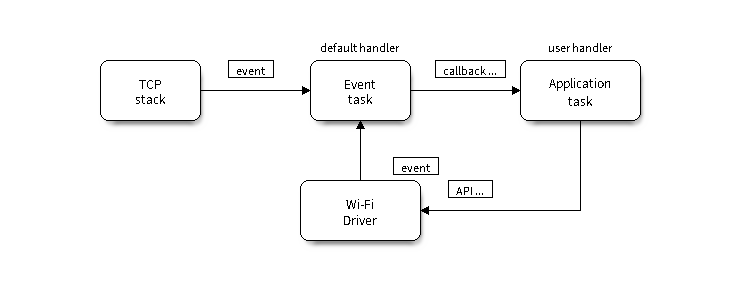
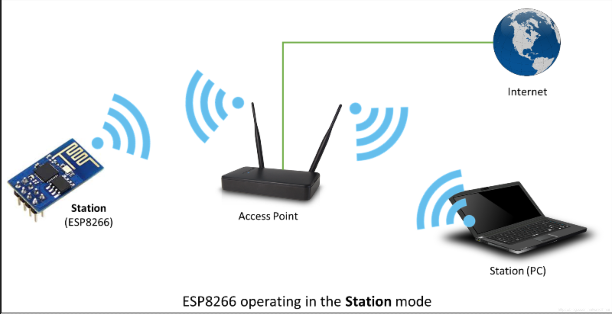
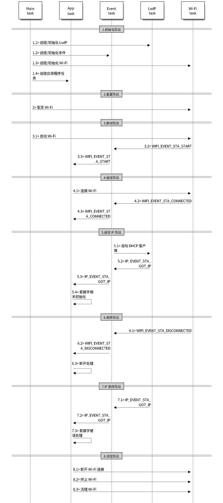

# 6.3 Wi-Fi 连接

本节重点描述了使用 Wi-Fi API 的原则、如何创建一个 Wi-Fi station 连接场景以及针对该连接场景的优化改良。

一般来说，要编写自己的 Wi-Fi 应用程序，最高效的方式是先选择一个相似的应用程序示例，然后将其中可用的部分移植到自己的项目中。如果您希望编写一个强健的 Wi-Fi 应用程序，强烈建议您在开始之前先阅读本文。

## 6.3.1 IDF 中的 Wi-Fi 组件

### 6.3.1.1 功能概述

Wi-Fi 库支持配置及监控 ESP32C3 Wi-Fi 连网功能。

支持配置：

- 基站模式（即 STA 模式或 Wi-Fi 客户端模式），此时 ESP32C3 连接到接入点 (AP)。
- AP 模式（即 Soft-AP 模式或接入点模式），此时基站连接到 ESP32C3。
- AP-STA 共存模式（ESP32C3 既是接入点，同时又作为基站连接到另外一个接入点）。
- 上述模式的各种安全模式（WPA、WPA2 及 WEP 等）。
- 扫描接入点（包括主动扫描及被动扫描）。
- 使用混杂模式监控 IEEE802.11 Wi-Fi 数据包。

### 6.3.1.2 API 介绍

关于 Wi-Fi 组件的 API 都定义在 “esp_wifi.h” 中。表 6-6 描述了相关的 API 接口：

| 序号 | 函数名 | 说明 |
|-----------|----------|-------|
|    01    |    esp*_*wifi*_*init   |  为 Wi-Fi 驱动程序初始化 Wi-Fi Alloc 资源，如 Wi-Fi 控制结构、Wi-Fi 任务等 |
|    02    |    esp*_*wifi*_*deinit   |  释放 Wi-Fi 驱动程序初始化时的资源并停止 Wi-Fi 任务 |
|    03    |    esp*_*wifi*_*set*_*mode   |  设置 Wi-Fi 操作模式  |
|    04    |    esp*_*wifi*_*get*_*mode   |  获取 Wi-Fi 操作模式  |
|    05    |    esp*_*wifi*_*start   |  根据当前配置启动 Wi-Fi  |
|    06    |    esp*_*wifi*_*stop   |  根据当前配置停止 Wi-Fi  |
|    07    |    esp*_*wifi*_*connect   |  将 ESP32C3 连接到 AP  |
|    08    |    esp*_*wifi*_*disconnect   |  断开 ESP32C3 Wi-Fi 站点于 AP 的连接  | 
|    09    |    esp*_*wifi*_*scan*_*start   |  扫描所有可用的 AP |
|    10    |    esp*_*wifi*_*scan*_*stop   |  停止扫描处理 |
|    11    |    esp*_*wifi*_*scan*_*get*_*ap*_*num   |  获取扫描的 AP 数量 |
|    12    |    esp*_*wifi*_*scan*_*get*_*ap*_*records   |  获取扫描的 AP 信息 |
|    13    |    esp*_*wifi*_*set*_*config   |  设置指定接口的配置 |
|    14    |    esp*_*wifi*_*get*_*config   |  获取指定接口的配置 |

<center>表 6-6 Wi-Fi 组件 API 接口</center>

### 6.3.1.3 编程模型

ESP32C3 Wi-Fi 编程模型如图 6-10 所示：

<div align="center">

</div>
<center>图 6-10 Wi-Fi 编程模型</center> 

Wi-Fi 驱动程序可以看作是一个无法感知上层代码（如 TCP/IP 堆栈、应用程序任务、事件任务等）的黑匣子。通常，应用程序任务（代码）负责调用 Wi-Fi 驱动程序 APIs 来初始化 Wi-Fi，并在必要时处理 Wi-Fi 事件。然后，Wi-Fi 驱动程序接收并处理 API 数据，并在应用程序中插入事件。

Wi-Fi 事件处理是在 esp*_*event 库的基础上进行的。Wi-Fi 驱动程序将事件发送至默认事件循环，应用程序便可以使用 esp*_*event*_*handler*_*register() 中的回调函数处理这些事件。除此之外，esp*_*netif 组件也负责处理 Wi-Fi 事件，并产生一系列默认行为。例如，当 Wi-Fi station 连接至一个 AP 时，esp*_*netif 将自动开启 DHCP 客户端服务（系统默认）等。

## 6.3.2 初始 Wi-Fi 连接

### 6.3.2.1 设定 STA 模式，连接到 Wi-Fi

Station（简称为“STA”）模式又叫做站点工作模式，类似于无线终端。

处于 STA 模式下的 ESP32C3，可以连接到 AP（Wi-Fi 路由器）。通过 STA 模式，ESP32C3 作为客户端连接到路由的 Wi-Fi 信号。

基于 AP 组建的基础无线网络（Infra）：由 AP 创建，众多 STA 加入所组成的无线网络，这种类型的网络的特点是 AP 是整个网络的中心，网络中所有的通信都通过 AP 来转发完成。

在此模式下设备可以通过 AP 分配的 IP 地址直接访问外网和内网，图 6-11 描述了 Wi-Fi 基站模式：

<div align="center">

</div>
<center>图 6-11 Wi-Fi 基站模式</center> 

### 6.3.2.2 如何使用 IDF 组件连接到 Wi-Fi

图 6-12 描述了 ESP32C3 在 STA 模式下的宏观场景，其中包含了不同阶段的具体描述：

<div align="center">

</div>
<center>图 6-12 ESP32C3 STA 模式下宏观场景</center> 

- Wi-Fi/LwIP 初始阶段

	如图 6-12 中 1.1\1.2\1.3\1.4 所示，分别

	- 初始化 LwIP

		创建 LwIP 核心任务并初始化与 LwIP 相关的工作。

		```
		ESP_ERROR_CHECK(esp_netif_init());
		```

	- 初始化 Wi-Fi 事件处理

		Wi-Fi 事件处理基于 esp*_*event 库。Wi-Fi 驱动程序会将事件发送到默认事件循环。应用程序可以在使用进行注册的回调中处理这些事件esp*_*event*_*handler*_*register()。esp*_*netif 组件还处理 Wi-Fi 事件，以提供一组默认行为。例如，当 Wi-Fi 站连接到 AP 时，esp*_*netif 将自动启动 DHCP 客户端（默认情况下）。
	
		```
		ESP_ERROR_CHECK(esp_event_loop_create_default());
	    esp_netif_create_default_wifi_sta();
	
	    esp_event_handler_instance_t instance_any_id;
	    esp_event_handler_instance_t instance_got_ip;
	    ESP_ERROR_CHECK(esp_event_handler_instance_register(WIFI_EVENT,
	                                                        ESP_EVENT_ANY_ID,
	                                                        &event_handler,
	                                                        NULL,
	                                                        &instance_any_id));
	    ESP_ERROR_CHECK(esp_event_handler_instance_register(IP_EVENT,
	                                                        IP_EVENT_STA_GOT_IP,
	                                                        &event_handler,
	                                                        NULL,
	                                                        &instance_got_ip));
		```
	
	- 初始化 Wi-Fi

		创建 Wi-Fi 驱动程序任务，并初始化 Wi-Fi 驱动程序。

		```
		wifi_init_config_t cfg = WIFI_INIT_CONFIG_DEFAULT();
	    ESP_ERROR_CHECK(esp_wifi_init(&cfg));
		```
- Wi-Fi配置阶段

	Wi-Fi 驱动程序初始化成功后，可以进入到配置阶段。该场景下，Wi-Fi 驱动程序处于 station 模式。因此，首先您需调用函数 esp*_*wifi*_*set*_*mode() (WIFI*_*MODE*_*STA) 将 Wi-Fi 模式配置为 station 模式。
	
	```
		wifi_config_t wifi_config = {
	        .sta = {
	            .ssid = EXAMPLE_ESP_WIFI_SSID,
	            .password = EXAMPLE_ESP_WIFI_PASS,
	            /* Setting a password implies station will connect to all security modes including WEP/WPA.
	             * However these modes are deprecated and not advisable to be used. Incase your Access point
	             * doesn't support WPA2, these mode can be enabled by commenting below line */
		     .threshold.authmode = WIFI_AUTH_WPA2_PSK,
	
	            .pmf_cfg = {
	                .capable = true,
	                .required = false
	            },
	        },
	    };
	    ESP_ERROR_CHECK(esp_wifi_set_mode(WIFI_MODE_STA) );
	    ESP_ERROR_CHECK(esp_wifi_set_config(WIFI_IF_STA, &wifi_config) );
	```

- Wi-Fi 启动阶段

	调用 esp*_*wifi*_*start() 以启动 Wi-Fi 驱动程序。
	
	Wi-Fi 驱动程序将 WIFI*_*EVENT*_*STA*_*START 发布到事件任务；然后，事件任务将执行一些常规操作，并将调用应用程序事件回调函数。
	
	应用程序事件回调函数将 WIFI*_*EVENT*_*STA*_*START 中继到应用程序任务。此时调用 esp*_*wifi*_*connect()。
	
	```
	ESP_ERROR_CHECK(esp_wifi_start() );
	```

- Wi-Fi 连接阶段

	一旦 esp*_*wifi*_*connect() 被调用，Wi-Fi 驱动程序将开始内部扫描/连接过程。
	
	如果内部扫描/连接过程成功，将生成 WIFI*_*EVENT*_*STA*_*CONNECTED。在事件任务中，它将启动 DHCP 客户端，该客户端最终将触发 DHCP 进程。
	
	```
	static void event_handler(void* arg, esp_event_base_t event_base,
	                                int32_t event_id, void* event_data)
	{
	    if (event_base == WIFI_EVENT && event_id == WIFI_EVENT_STA_START) {
	        esp_wifi_connect();
	    } else if (event_base == WIFI_EVENT && event_id == WIFI_EVENT_STA_DISCONNECTED) {
	        if (s_retry_num < EXAMPLE_ESP_MAXIMUM_RETRY) {
	            esp_wifi_connect();
	            s_retry_num++;
	            ESP_LOGI(TAG, "retry to connect to the AP");
	        } else {
	            xEventGroupSetBits(s_wifi_event_group, WIFI_FAIL_BIT);
	        }
	        ESP_LOGI(TAG,"connect to the AP fail");
	    } else if (event_base == IP_EVENT && event_id == IP_EVENT_STA_GOT_IP) {
	        ip_event_got_ip_t* event = (ip_event_got_ip_t*) event_data;
	        ESP_LOGI(TAG, "got ip:" IPSTR, IP2STR(&event->ip_info.ip));
	        s_retry_num = 0;
	        xEventGroupSetBits(s_wifi_event_group, WIFI_CONNECTED_BIT);
	    }
	}
	```

- Wi-Fi 获取 IP 阶段

	初始化 DHCP 客户端后，将开始 IP 阶段。如果从 DHCP 服务器成功接收到 IP 地址，则将出现IP*_*EVENT*_*STA*_*GOT*_*IP，并且事件任务将执行常规处理。
	
	在应用程序事件回调中，IP*_*EVENT*_*STA*_*GOT*_*IP 被中继到应用程序任务。对于基于 LwIP 的应用程序，此事件非常特殊，这意味着该应用程序已准备就绪，可以开始其任务，例如创建 TCP / UDP 套接字等。一个非常常见的错误是在收到 IP*_*EVENT*_*STA*_*GOT*_*IP 之前初始化套接字。接收 IP 之前，请勿开始与套接字相关的工作。

- Wi-Fi 连接断开阶段

	由于主动断开连接、密码错误找不到 AP 等原因，Wi-Fi 连接可能会失败。在这种情况下，会出现 WIFI*_*EVENT*_*STA*_*DISCONNECTED 并提供这种失败的原因。
	
	```
	ESP_ERROR_CHECK(esp_wifi_disconnect());
	```

- Wi-Fi IP 更改阶段

	如果 IP 地址发生更改，将引发 IP*_*EVENT*_*STA*_*GOT*_*IP 事件，其中 “ip_change” 被置为 “true”。

- Wi-Fi 清理阶段

	断开 Wi-Fi 连接，终止 Wi-Fi 驱动程序，清理 Wi-Fi 驱动程序等。
	
	```
		ESP_ERROR_CHECK(esp_event_handler_instance_unregister(IP_EVENT, IP_EVENT_STA_GOT_IP, instance_got_ip));
	    ESP_ERROR_CHECK(esp_event_handler_instance_unregister(WIFI_EVENT, ESP_EVENT_ANY_ID, instance_any_id));
	    ESP_ERROR_CHECK(esp_wifi_stop());
	    ESP_ERROR_CHECK(esp_wifi_deinit());
	    ESP_ERROR_CHECK(esp_wifi_clear_default_wifi_driver_and_handlers(station_netif));
	    esp_netif_destroy(station_netif);
	```

## 6.3.3 改良 Wi-Fi 连接

### 6.3.3.1 如何使用 IDF Provisioning 组件改良 Wi-Fi 连接

乐鑫在 ESP32C3 上 提供的 Wi-Fi Provisioning 组件支持将 Wi-Fi 热点的 SSID/密码通过 SoftAP 或 BLE 传输接收和配置。然后用获取到的 SSID/密码去连接 Wi-Fi 热点。

- API 接口说明

	关于 Wi-Fi Provisioning 组件的 API 都定义在 “wifi_provisioning/manager.h” 中，表 6-7 描述了相关的 API 接口：
	
| 序号 | 函数名 | 说明 |
|-----------|----------|-------|
|    01    |    wifi*_*prov*_*mgr*_*init   |  根据当前配置初始化 provisioning 管理器接口|
|    02    |    wifi*_*prov*_*mgr*_*deinit   |  释放 provisioning 管理器接口 |
|    03    |    wifi*_*prov*_*mgr*_*is*_*provisioned   |  检查 ESP32C3 的 provisioning 状态  |
|    04    |    wifi*_*prov*_*mgr*_*start*_*provisioning   |  开始 provisioning 服务  |
|    05    |    wifi*_*prov*_*mgr*_*stop_provisioning   |  停止 provisioning 服务  |
|    06    |    wifi*_*prov*_*mgr*_*wait   |  等待 provisioning 服务结束  |
|    07    |    wifi*_*prov*_*mgr*_*disable_auto_stop   |  禁用自动停止 provisioning 服务  |
|    09    |    wifi*_*prov*_*mgr*_*endpoint_create   |  创建一个 endpoint 并为其分配内部资源 |
|    10    |    wifi*_*prov*_*mgr*_*endpoint*_*register   |  为创建的 endpoint 注册句柄 |
|    11    |    wifi*_*prov*_*mgr*_*endpoint*_*unregister   |  为创建的 endpoint 取消句柄注册 |
|    13    |    wifi*_*prov*_*mgr*_*get*_*wifi*_*state   |  获取 provisioning 时 Wi-Fi 的状态 |
|    14    |    wifi*_*prov*_*mgr*_*get*_*wifi*_*disconnect*_*reason   | 获取 provisioning 时 Wi-Fi 断开的原因  |

<center>表 6-7 Wi-Fi provisioning 组件 API 接口</center>

- 程序结构
	- 初始化
	
		```
		wifi_prov_mgr_config_t config = {
		    .scheme = wifi_prov_scheme_softap,
		    .scheme_event_handler = WIFI_PROV_EVENT_HANDLER_NONE
		};
		
		ESP_ERR_CHECK( wifi_prov_mgr_init(config) );
		``` 
	
	- 检查 provisioning 状态

		```
		bool provisioned = false;
		ESP_ERROR_CHECK(wifi_prov_mgr_is_provisioned(&provisioned));
		```
		
	- 开始 provisioning 
		
		```
		const char *service_name = "my_device";
		const char *service_key  = "password";
		
		wifi_prov_security_t security = WIFI_PROV_SECURITY_1;
		const char *pop = "abcd1234";
		
		ESP_ERR_CHECK( wifi_prov_mgr_start_provisioning(security, pop, service_name, service_key) );
		```
	
	- 释放 provisioning 资源
		
		主应用程序在等待 provisioning 结束后，将会在释放 provisioning 相关的资源后开始执行应用逻辑。有两种方式可以实现这一点，最简单的方法是使用 wifi*_*prov*_*mgr*_*wait 的阻塞调用：
		
		```
		// Start provisioning service
		ESP_ERR_CHECK( wifi_prov_mgr_start_provisioning(security, pop, service_name, service_key) );
		
		// Wait for service to complete
		wifi_prov_mgr_wait();
		
		// Finally de-initialize the manager
		wifi_prov_mgr_deinit();
		```
		或者在事件的回调函数中进行处理：
		```
		static void event_handler(void* arg, esp_event_base_t event_base,
		                          int event_id, void* event_data)
		{
		    if (event_base == WIFI_PROV_EVENT && event_id == WIFI_PROV_END) {
		        /* De-initialize manager once provisioning is finished */
		        wifi_prov_mgr_deinit();
		    }
		}
		```

### 6.3.3.2 使用脚本验证 Provisioning 功能

- 设备上电

	请确认输出的 LOG 中携带 “PROV_” 开头的信息，这对每一个设备是独一无二的，PC 端会通过该信息加入到热点中。
	
	- 设备 LOG ：
	
		```
		I (1034) wifi_prov_mgr: Provisioning started with service name : PROV_80657C
		I (1044) app: Provisioning started
		I (1044) app: Scan this QR code from the provisioning application for Provisioning.
		I (1054) QRCODE: Encoding below text with ECC LVL 0 & QR Code Version 10
		I (1064) QRCODE: {"ver":"v1","name":"PROV_80657C","pop":"abcd1234","transport":"softap"}
		
		  █▀▀▀▀▀█ ▀▄▄▀▀█   ▀▀▄ █▄ █ █▀▀▀▀▀█
		  █ ███ █   ▀ ██▄ ▀▄█ ▄██ ▀ █ ███ █
		  █ ▀▀▀ █  ▀▄▀▄▄▀ ▀█▄▀ ▀▀▄█ █ ▀▀▀ █
		  ▀▀▀▀▀▀▀ █ █▄▀▄█▄█ ▀ █ █ █ ▀▀▀▀▀▀▀
		  ▀▀ ▀▀▄▀  █▀▀▄▄ ▄▀▀▀█  ▀█▄ ▀▄▄ ▄▄▀
		  ▀█▄▄▄ ▀▀ ▄██▄▀▀▀▄▄█   ▀▀ █  ▄█▄█▀
		  ▄▄▀ ▀▄▀  █ ▀▀▄██▄ ▀▀▀▀   ▄▀█ ▀▄▄▀
		    ▄  ▀▀▀▀▀ █▀ ▄█▄▀▀█▄ ▀▄▀▄▄█  ▄
		   █▀  ▀▀▄▄█▄▄█▀▄█▀▄▀▄▀ ▄█  ███▄ ██
		  █▀▀███▀▀   ▀ ▄▀██▀▄▀█ ▀█ █▀▀ ▀▄▄▀
		  ▄▀▄  ▄▀▄▀▄ █ ▄█▄▀▀█▄█▄█▀▀█ ▀▄ ▄▀
		  █  ██▄▀█ ▄▄▀█▀▄▀█▄█▄▀▀█▀█ ▄█ ▀▄▄█
		  ▀▀▀▀  ▀▀▄▀▄██▄▄██▄█▀█ ▀██▀▀▀█▄▄▀
		  █▀▀▀▀▀█  ▄█ █ ███ ▄▀▄ █▄█ ▀ █ ▄▄
		  █ ███ █ █▀▀▀ ▀▄█▀▄█▄▄ ▀██▀▀▀▀▄▄▀▀
		  █ ▀▀▀ █ ▄▀▀▀▄█▄▀█ █▀ ▀▀███▄▀█ █▄█
		  ▀▀▀▀▀▀▀ ▀▀▀ ▀ ▀▀ ▀     ▀▀▀▀▀▀
		
		
		I (1274) app: If QR code is not visible, copy paste the below URL in a browser.
		https://espressif.github.io/esp-jumpstart/qrcode.html?data={"ver":"v1","name":"PROV_80657C","pop":"abcd1234","transport":"softap"}
		```

- 脚本验证

	- 当 PC 接入 “PROV_” 开头的热点后，在新的终端中输入如下命令： 
	
		```
		python3 $IDF_PATH/tools/esp_prov/esp_prov.py --transport softap --sec_ver 1 --pop abcd1234 --ssid myssid --passphrase mypassword
		```
	
	- 上述命令将会开始配置步骤，同时在终端中输出如下信息：
	
		```
		Connecting to 192.168.4.1:80
		
		==== Starting Session ====
		==== Session Established ====
		
		==== Sending Wi-Fi credential to esp32 ====
		==== Wi-Fi Credentials sent successfully ====
		
		==== Applying config to esp32 ====
		==== Apply config sent successfully ====
		
		==== Wi-Fi connection state  ====
		++++ WiFi state: connected ++++
		==== Provisioning was successful ====
		```

	- 设备串口输出如下信息：

		```
		I (139471) app: Received Wi-Fi credentials
		SSID     : myssid
		Password : mypassword
		.
		.
		.
		I (144091) app: Connected with IP Address:192.168.50.31
	I (144091) esp_netif_handlers: sta ip: 192.168.50.31, mask: 255.255.255.0, gw: 192.168.50.1
	I (144091) wifi_prov_mgr: STA Got IP
	I (144101) app: Provisioning successful
	I (144101) app: Hello World!
	I (145101) app: Hello World!
		.
		.
		.
		I (146091) wifi_prov_mgr: Provisioning stopped
	I (146101) app: Hello World!
	I (147101) app: Hello World!
	I (148101) app: Hello World!
		```