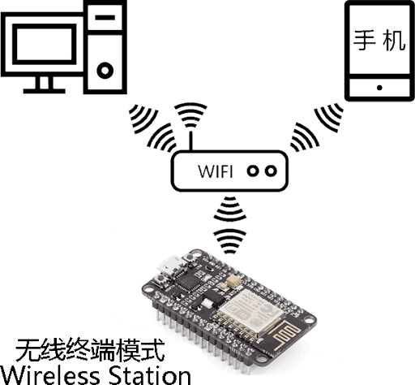

# 第七部分、如何实现设备的本地控制

## 7.1 概述

本章主要介绍如何基于 ESP32-C3 实现本地控制功能。我们的目的是帮助读者了解什么是本地控制以及本地控制的流程与所使用的协议，最终指导读者如何基于智能照明灯开发一套本地控制框架。

### 7.1.1 本地控制的介绍

本地控制，顾名思义是指在受控设备附近，通过设备硬件开关，触摸按键，红外遥控设备，手机电脑网络设备等对受控设备进行操作的行为。我们常见的本地控制有：空调遥控器通过红外调整空调运行参数，人的话音控制一些声控设备，家用开关打开照明设备等等。

对于物联网项目，每个物联网设备都需要进行通信来传输控制指令，所以常见的本地通信的方法有：

   - 使用 Wi-Fi 或者以太网来进行数据通信，Wi-Fi 和以太网原生运行 TCP/IP 协议栈，这样大大降低数据本身的协议适配与开发，一般本地通信的时候会搭配网关路由器
   - 使用 Zigbee 这种短距离，低速率和低功耗下的无线通信技术进行设备之间的数据传输
   - 使用蓝牙和 BLE 这种短距离，低功耗的无线通信技术进行设备之间的数据传输

本章介绍的本地控制主要是局域网内通过 WI-Fi 控制。它的网络拓扑图如下图所示， 受控设备（下面以智能照明灯为例）与控制命令发送设备（手机或者 PC）处于同一个局域网。

   

图 7-1 本地控制拓扑 

### 7.1.2 本地控制的使用条件

按照上图的拓扑结构我们可以看出，搭建一个本地控制框架需要一个 Wi-Fi 路由器，一个控制设备和一个智能照明灯。控制设备可以是手机，也可以是电脑等等可以运行 TCP/IP 协议栈的设备。其中控制设备和智能照明灯都需要连接到同一个 Wi-Fi 路由器上，保证彼此在同一个局域网内，便于后续进行数据通信。

### 7.1.3 本地控制的使用场景

本地控制相对于远程控制而言，本地控制的数据不需要通过路由器传输到互联网上，所以路由器可以不需要连接到互联网，当路由器断网了，我们依然可以通过手机或者电脑等设备对智能照明灯进行控制。设想一下，当你躺在床上，想通过手机打开智能照明灯，此时路由器刚好断网了，无法通过远程控制打开智能照明灯，如果你的受控设备支持本地控制，你完全可以通过本地控制通信，将开灯的指令通过 Wi-Fi 发送给智能照明灯设备。当然，上述条件成立的前提是你的手机和智能照明灯连接到同一个路由器上，处于同一个局域网内。

### 7.1.4 本地控制的优势

上述章节里我们了解到，本地控制的数据只是在局域网进行传输，并不会传输到互联网上。所以，本地控制天然的具有延时短，节省互联网带宽的优点。而且本地控制不受路由器断网的影响，只要智能照明灯和手机处于同一个局域网，手机依然可以控制智能照明灯。

### 7.1.5 手机如何发现智能照明灯

我们所介绍的本地控制是基于 Wi-Fi 无线传输介质，数据运行在 TCP/IP 协议栈上的。所以，这就会涉及到两个问题：

   - 手机如何找到要控制的智能照明灯设备
   - 手机如何与智能照明灯设备进行数据通信

对于手机如何找到要控制的智能照明灯设备，也就是手机如何知道要控制的智能照明灯设备的 IP 地址。因为所有的数据通信是基于 IP 层进行传输，获取到智能照明灯设备的 IP 地址是后续数据通信的前提。也许有人会说，我登录到路由器界面，直接在路由器界面查看智能灯设备的 IP 地址不就可以了。是的，没错，你完全可以按照这种方式获取 IP 地址，但是这种人工手动查询 IP 地址的方式完全背离了物联网技术给人们带来便利的初衷了。所以我们需要有一种技术来自动发现智能照明灯设备。这一部分内容我们会在 7.2 章节详细介绍。

### 7.1.6 手机如何与智能照明灯设备进行数据通信

这也就是上述我们谈到的第二个问题，手机如何与智能照明灯设备进行数据通信。当获取到智能照明灯设备的 IP 地址后，我们就可以通过 TCP/UDP 传输协议与智能照明灯设备进行数据通信了。一般，对于本地控制，智能照明灯作为接收方，接收由手机发送的控制数据，而手机作为发送方，将控制数据发送给智能照明灯。所以，对于智能照明灯而言，它扮演的是一个服务端的角色，手机扮演的是一个客户端的角色。我们可以有多个客户端来向服务端发送控制数据。这一部分内容我们会在 7.3 章节详细介绍。
