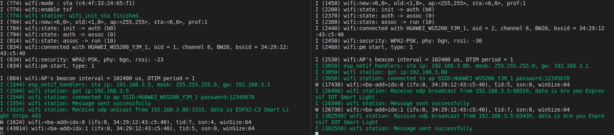
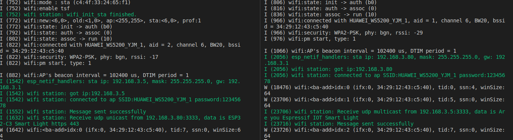

## 7.2 常见的本地发现方法

局域网中，在不知道对端的 MAC 地址和 IP 地址的情况下，如何与对端交互来获取对端的 IP 地址是一个值得研究的问题。我们知道，IP 地址可以分为如下 3 种： 单播（unicast）、组播（multicast）和广播（broadcast）。单播的情况是需要知道对端的 IP 地址，所以不适合本地发现的场景。组播和广播并不需要知道对端的 IP 地址，它们会向特定地址发送数据，对端只要监听该地址就可以收到数据。所以说，组播和广播适合局域网内的设备发现。

### 7.2.1 广播

什么是广播？广播是指将报文发送到网络中的所有可能的接收者。所以它的用途主要有两个：

   - 在本地网络中定位一个主机
   - 在本地网络中减少分组流通，一个报文就可以通知本地网络中的所有主机

常见的广播应用报文有很多：

   - ARP（Address Resolution Protocol，地址解析协议），它的用途是在本地网络中广播一个 ARP 请求说 “IP 地址为 a.b.c.d 的设备，你的硬件 MAC 地址是多少，请告诉我”。ARP 的广播属于二层链路层广播，而不是 IP 层广播。
   - DHCP（Dynamic Host Configuration Protocol，动态主机配置协议），在本地网络中有 DHCP 服务器主机的前提下，DHCP 客户端发送目的 IP 地址 （通常的 255.255.255.255）的 DHCP 请求，在同一网络中的 DHCP 服务器就可以收到该请求并回复分配的 IP 地址。

广播应用主要应用于 UDP 协议（第 7.3.3 章节），不适用于 TCP 协议（第 7.3.1 章节），TCP 适用于单播应用。

#### 7.2.1.1 广播地址

对于广播地址，可以分为二层链路层广播地址（ff:ff:ff:ff:ff:ff）和三层网络层广播地址（255.255.255.255）。本章节主要介绍的是网络层广播，一般情况下，网络层 IP 地址为 255.255.255.255，链路层目的地址为 ff:ff:ff:ff:ff:ff。大家可以想一下为什么。因为 IP 地址为全 255，代表该本地网络的设备都会收到该报文，如果链路层的 mac 地址不是全 ff，该报文就会在二层被丢弃，因为目的 mac 既不是全 ff 也不是本机的 mac 地址，本地网络中最多只有一个主机可以收到该报文，完全违背了广播的定义。

IPv4 地址可以由子网 ID + 主机 ID 构成。除了子网 ID 和 主机 ID 全为 255 的情况下是广播地址，只有主机 ID 是 255 的情况下也是广播地址。比如我们有一个 192.168.1/24 的子网，那么 192.168.1.255 就是该子网的广播地址。那么有人会问，全 255 的和这个有啥区别呢？全 255 的广播范围比特定子网的广播范围要大。比如路由器有两个子网 192.168.1/24 和 192.168.2/24，在子网 192.168.1/24 里的一个主机 192.168.1.2 向目的地址 192.168.1.255 发送报文，路由器只会将该报文转给 192.168.1/24 子网里的主机，并不会转发给 192.168.2/24 子网里的主机；如果该主机向目的地址 255.255.255.255 发送报文，路由器会将该报文转发给两个子网里的主机。所以这种主机 ID 是 255 的广播地址也叫做子网定向广播地址。子网定向广播地址可以指定子网发送，防止局域网中其他不需要接收的子网也收到该报文，导致网络资源浪费。

#### 7.2.1.2 如何使用 socket 实现广播发送端

```c
esp_err_t esp_send_broadcast(void)
{
   int opt_val = 1;
   esp_err_t err = ESP_FAIL;
   struct sockaddr_in from_addr = {0};
   socklen_t from_addr_len      = sizeof(struct sockaddr_in);
   char udp_recv_buf[64 + 1] = {0};

   /* 创建 IPv4 UDP 套接字 */
   int sockfd = socket(AF_INET, SOCK_DGRAM, 0);
   if (sockfd == -1) {
      ESP_LOGE(TAG, "Create UDP socket fail");
      return err;
   }

   /* 设置 SO_BROADCAST 套接字选项， 使能该套接字支持广播发送 */
   int ret = setsockopt(sockfd, SOL_SOCKET, SO_BROADCAST, &opt_val, sizeof(int));
   if (ret < 0) {
      ESP_LOGE(TAG, "Set SO_BROADCAST option fail");
      goto exit;
   }

   /* 设置广播目的地址和端口 */
   struct sockaddr_in dest_addr = {
      .sin_family      = AF_INET,
      .sin_port        = htons(3333),
      .sin_addr.s_addr = htonl(INADDR_BROADCAST),
   };

   char *broadcast_msg_buf = "Are you Espressif IOT Smart Light";

   /* 调用 sendto 接口发送广播数据 */
   ret = sendto(sockfd, broadcast_msg_buf, strlen(broadcast_msg_buf), 0, (struct sockaddr *)&dest_addr, sizeof(struct sockaddr));
   if (ret < 0) {
      ESP_LOGE(TAG, "Error occurred during sending: errno %d", errno);
   } else {
      ESP_LOGI(TAG, "Message sent successfully");
      ret = recvfrom(sockfd, udp_recv_buf, sizeof(udp_recv_buf) - 1, 0, (struct sockaddr *)&from_addr, (socklen_t *)&from_addr_len);
      if (ret > 0) {
         ESP_LOGI(TAG, "Receive udp unicast from %s:%d, data is %s", inet_ntoa(((struct sockaddr_in *)&from_addr)->sin_addr), ntohs(((struct sockaddr_in *)&from_addr)->sin_port), udp_recv_buf);
         err = ESP_OK;
      }
   }
exit:
   close(sockfd);
   return err;
}
```

#### 7.2.1.3 如何使用 socket 实现广播接收端

```c
esp_err_t esp_receive_broadcast(void)
{
   esp_err_t err = ESP_FAIL;
   struct sockaddr_in from_addr = {0};
   socklen_t from_addr_len      = sizeof(struct sockaddr_in);
   char udp_server_buf[64 + 1] = {0};
   char *udp_server_send_buf = "ESP32-C3 Smart Light https 443";

   /* 创建 IPv4 UDP 套接字 */
   int sockfd = socket(AF_INET, SOCK_DGRAM, 0);
   if (sockfd == -1) {
      ESP_LOGE(TAG, "Create UDP socket fail");
      return err;
   }

   /* 设置广播目的地址和端口 */
   struct sockaddr_in server_addr = {
      .sin_family      = AF_INET,
      .sin_port        = htons(3333),
      .sin_addr.s_addr = htonl(INADDR_ANY),
   };

   int ret = bind(sockfd, (struct sockaddr *)&server_addr, sizeof(server_addr));
   if (ret < 0) {
      ESP_LOGE(TAG, "Bind socket fail");
      goto exit;
   }

   /* 调用 recvfrom 接口接收广播数据 */
   while (1) {
      ret = recvfrom(sockfd, udp_server_buf, sizeof(udp_server_buf) - 1, 0, (struct sockaddr *)&from_addr, (socklen_t *)&from_addr_len);
      if (ret > 0) {
         ESP_LOGI(TAG, "Receive udp broadcast from %s:%d, data is %s", inet_ntoa(((struct sockaddr_in *)&from_addr)->sin_addr), ntohs(((struct sockaddr_in *)&from_addr)->sin_port), udp_server_buf);
         /* 如果收到广播请求数据，单播发送对端数据通信应用端口 */
         if (!strcmp(udp_server_buf, "Are you Espressif IOT Smart Light")) {
            ret = sendto(sockfd, udp_server_send_buf, strlen(udp_server_send_buf), 0, (struct sockaddr *)&from_addr, from_addr_len);
            if (ret < 0) {
               ESP_LOGE(TAG, "Error occurred during sending: errno %d", errno);
            } else {
               ESP_LOGI(TAG, "Message sent successfully");
            }
         }
      }
   }
exit:
   close(sockfd);
   return err;
}
```

#### 7.2.1.4 运行结果

在 Wi-Fi station 示例里添加发送端和接收端代码，保证它们连接至同一个路由器上。

<div align="center">
   
</div>
<center>图 7-2 广播发送与接收日志 </center>

上图左边部分表示发送端发送携带 `Are you Espressif IOT Smart Light` 数据的 UDP 广播包，右边部分表示接收端监听本地网络的广播包，并对携带 `Are you Espressif IOT Smart Light` 的数据包回复 `ESP32-C3 Smart Light https 443` 数据的单播包。这样一个过程就完成了本地设备发现的功能。发送端收到接收端的单播回复，就可以确认对端的 IP 地址，并且从携带的信息里可以知道后续数据通信的应用协议以及应用端口。

#### 7.2.1.5 小结

本地网络的广播协议可以完成设备的发现功能。但是为了发现设备将发现请求广播至本地网络的所有设备上，会对本地网络和本地主机造成一定的负担。所以，广播发现设备并不是一个很好的选择。

### 7.2.2 组播

什么是组播？组播也叫多播，是指将报文发送给那些感兴趣的接收方。相比于单播和广播寻址方案的两个极端（要么单个要么全部），组播技术则是提供了折衷的方案。组播组播，它主要强调一个组的概念。也就是说，一个主机往一个组地址发送报文，那么所有加入这个组的主机都可以收到报文。这个有点类似子网定向广播，但是比子网定向广播更加灵活，因为一个主机可以随时加入或者离开这个组，这样就可以减轻本地网络与主机的负担。

IGMP（Internet Group Management Protocol，互联网组管理协议）是负责 IP 组播成员管理的协议，用来在 IP 主机和与其直接相邻的组播路由器之间建立、维护组播组成员关系。所以对于组播功能，需要路由器支持 IGMP 协议。

#### 7.2.2.1 组播地址

组播报文目的地址使用 D 类 IP 地址，第一个字节以 `1110` 开始，其范围是：224.0.0.0 ～ 239.255.255.255。由于组播 IP 地址标识了一组主机，因此组播 IP 地址只能作为目标地址，不能作为源地址，源地址总是为单播地址。

组播组可以是永久的也可以是临时的。组播组地址中，由官方分配的组播 IP 地址称为永久组播组。那些既不是保留的地址也不是永久组播地址的称为临时组播组。永久和临时组播组内的主机数量都是动态的，甚至可以为零。

组播地址分类如下：

   -  224.0.0.0 ～ 224.0.0.255 为预留的组播地址（永久组地址），地址 224.0.0.0 保留不做分配，其它地址供路由协议使用；
   - 224.0.1.0 ～ 224.0.1.255 是公用组播地址，可以用于 Internet；
   - 224.0.2.0 ～ 238.255.255.255 为用户可用的组播地址（临时组地址），全网范围内有效；
   - 239.0.0.0 ～ 239.255.255.255 为本地管理组播地址，仅在特定的本地范围内有效。

#### 7.2.2.2 如何使用 socket 实现组播发送端

```c
#define MULTICAST_IPV4_ADDR "232.10.11.12"
int esp_join_multicast_group(int sockfd)
{
   struct ip_mreq imreq = { 0 };
   struct in_addr iaddr = { 0 };
   int err = 0;
   
   /* 配置组播报文发送的接口 */
   esp_netif_ip_info_t ip_info = { 0 };
   err = esp_netif_get_ip_info(esp_netif_get_handle_from_ifkey("WIFI_STA_DEF"), &ip_info);
   if (err != ESP_OK) {
      ESP_LOGE(TAG, "Failed to get IP address info. Error 0x%x", err);
      goto err;
   }
   inet_addr_from_ip4addr(&iaddr, &ip_info.ip);
   err = setsockopt(sockfd, IPPROTO_IP, IP_MULTICAST_IF, &iaddr,
                     sizeof(struct in_addr));
   if (err < 0) {
      ESP_LOGE(TAG, "Failed to set IP_MULTICAST_IF. Error %d", errno);
      goto err;
   }

   /* 配置监听的组播组地址 */
   inet_aton(MULTICAST_IPV4_ADDR, &imreq.imr_multiaddr.s_addr);

   /* 配置套接字加入组播组 */
   err = setsockopt(sockfd, IPPROTO_IP, IP_ADD_MEMBERSHIP,
                        &imreq, sizeof(struct ip_mreq));
   if (err < 0) {
      ESP_LOGE(TAG, "Failed to set IP_ADD_MEMBERSHIP. Error %d", errno);
   }

err:
   return err;
}

esp_err_t esp_send_multicast(void)
{
   esp_err_t err = ESP_FAIL;
   struct sockaddr_in saddr = {0};
   struct sockaddr_in from_addr = {0};
   socklen_t from_addr_len      = sizeof(struct sockaddr_in);
   char udp_recv_buf[64 + 1] = {0};

   /* 创建 IPv4 UDP 套接字 */
   int sockfd = socket(AF_INET, SOCK_DGRAM, 0);
   if (sockfd == -1) {
      ESP_LOGE(TAG, "Create UDP socket fail");
      return err;
   }

   /* 绑定套接字 */
   saddr.sin_family = PF_INET;
   saddr.sin_port = htons(3333);
   saddr.sin_addr.s_addr = htonl(INADDR_ANY);
   int ret = bind(sockfd, (struct sockaddr *)&saddr, sizeof(struct sockaddr_in));
   if (ret < 0) {
      ESP_LOGE(TAG, "Failed to bind socket. Error %d", errno);
      goto exit;
   }

   /* 设置组播 TTL 为 1，表示该组播包只能经由一个路由 */
   uint8_t ttl = 1;
   ret = setsockopt(sockfd, IPPROTO_IP, IP_MULTICAST_TTL, &ttl, sizeof(uint8_t));
   if (ret < 0) {
      ESP_LOGE(TAG, "Failed to set IP_MULTICAST_TTL. Error %d", errno);
      goto exit;
   }

   /* 加入组播组 */
   ret = esp_join_multicast_group(sockfd);
   if (ret < 0) {
      ESP_LOGE(TAG, "Failed to join multicast group");
      goto exit;
   }

   /* 设置组播目的地址和端口 */
   struct sockaddr_in dest_addr = {
      .sin_family = AF_INET,
      .sin_port = htons(3333),
   };
   inet_aton(MULTICAST_IPV4_ADDR, &dest_addr.sin_addr.s_addr);

   char *multicast_msg_buf = "Are you Espressif IOT Smart Light";

   /* 调用 sendto 接口发送组播数据 */
   ret = sendto(sockfd, multicast_msg_buf, strlen(multicast_msg_buf), 0, (struct sockaddr *)&dest_addr, sizeof(struct sockaddr));
   if (ret < 0) {
      ESP_LOGE(TAG, "Error occurred during sending: errno %d", errno);
   } else {
      ESP_LOGI(TAG, "Message sent successfully");
      ret = recvfrom(sockfd, udp_recv_buf, sizeof(udp_recv_buf) - 1, 0, (struct sockaddr *)&from_addr, (socklen_t *)&from_addr_len);
      if (ret > 0) {
         ESP_LOGI(TAG, "Receive udp unicast from %s:%d, data is %s", inet_ntoa(((struct sockaddr_in *)&from_addr)->sin_addr), ntohs(((struct sockaddr_in *)&from_addr)->sin_port), udp_recv_buf);
         err = ESP_OK;
      }
   }

exit:
   close(sockfd);
   return err;
}
```

#### 7.2.2.3 如何使用 socket 实现组播接收端

```c
esp_err_t esp_recv_multicast(void)
{
   esp_err_t err = ESP_FAIL;
   struct sockaddr_in saddr = {0};
   struct sockaddr_in from_addr = {0};
   socklen_t from_addr_len      = sizeof(struct sockaddr_in);
   char udp_server_buf[64 + 1] = {0};
   char *udp_server_send_buf = "ESP32-C3 Smart Light https 443";

   /* 创建 IPv4 UDP 套接字 */
   int sockfd = socket(AF_INET, SOCK_DGRAM, 0);
   if (sockfd == -1) {
      ESP_LOGE(TAG, "Create UDP socket fail");
      return err;
   }

   /* 绑定套接字 */
   saddr.sin_family = PF_INET;
   saddr.sin_port = htons(3333);
   saddr.sin_addr.s_addr = htonl(INADDR_ANY);
   int ret = bind(sockfd, (struct sockaddr *)&saddr, sizeof(struct sockaddr_in));
   if (ret < 0) {
      ESP_LOGE(TAG, "Failed to bind socket. Error %d", errno);
      goto exit;
   }

   /* 设置组播 TTL 为 1，表示该组播包只能经由一个路由 */
   uint8_t ttl = 1;
   ret = setsockopt(sockfd, IPPROTO_IP, IP_MULTICAST_TTL, &ttl, sizeof(uint8_t));
   if (ret < 0) {
      ESP_LOGE(TAG, "Failed to set IP_MULTICAST_TTL. Error %d", errno);
      goto exit;
   }

   /* 加入组播组 */
   ret = esp_join_multicast_group(sockfd);
   if (ret < 0) {
      ESP_LOGE(TAG, "Failed to join multicast group");
      goto exit;
   }

   /* 调用 recvfrom 接口接收组播数据 */
   while (1) {
      ret = recvfrom(sockfd, udp_server_buf, sizeof(udp_server_buf) - 1, 0, (struct sockaddr *)&from_addr, (socklen_t *)&from_addr_len);
      if (ret > 0) {
         ESP_LOGI(TAG, "Receive udp multicast from %s:%d, data is %s", inet_ntoa(((struct sockaddr_in *)&from_addr)->sin_addr), ntohs(((struct sockaddr_in *)&from_addr)->sin_port), udp_server_buf);
         /* 如果收到组播请求数据，单播发送对端数据通信应用端口 */
         if (!strcmp(udp_server_buf, "Are you Espressif IOT Smart Light")) {
            ret = sendto(sockfd, udp_server_send_buf, strlen(udp_server_send_buf), 0, (struct sockaddr *)&from_addr, from_addr_len);
            if (ret < 0) {
               ESP_LOGE(TAG, "Error occurred during sending: errno %d", errno);
            } else {
               ESP_LOGI(TAG, "Message sent successfully");
            }
         }
      }
   }

exit:
   close(sockfd);
   return err;
}
```
#### 7.2.2.4 运行结果

在 Wi-Fi station 示例里添加发送端和接收端代码，保证它们连接至同一个路由器上。

<div align="center">
   
</div>
<center>图 7-3 组播发送与接收日志 </center>

和广播包的日志一样，发送端发送特定数据的报文，接收端告知发送端数据通信的应用协议与端口。

#### 7.2.3 广播与组播对比

|  | 广播 | 组播 |
| :----: | :----: | :----: |
| 基本 | 数据包被传输到所有连接到网络的主机 | 数据包仅传输给网络中的预期接收者 |
| 传播 | 一对所有 | 一对多 |
| 管理 | 不需要组管理 | 需要组管理 |
| 网络 | 可能造成网络带宽浪费与拥塞 | 网络带宽可控 |
| 速率 | 慢 | 快 |

#### 7.2.4 本地发现之组播应用协议 mDNS

在计算机网络中，多播 DNS（Multicast DNS）协议将主机名解析为不包含本地名称服务器的小型网络中的 IP 地址。它是一种零配置的服务器，与传统域名解析服务（DNS）有着基本相同的编程接口，数据包格式和操作方式。

多播 DNS 于 2000 年由 Bill Woodcock 和 Bill Manning 在 IETF 中首次提出，十三年后最终由 Stuart Cheshire 和 Marc Krochmal 作为标准协议发布在 RFC 6762，并由 Apple Bonjour 和开源 Avahi 软件包实现，包含在大多数 Linux 发行版中。

##### 7.2.4.1 mDNS 协议介绍

mDNS 是本地网络的域名解析协议，使用 5353 端口，组播地址是 224.0.0.251，运行于 UDP 之上的应用协议。它不同于传统 DNS 协议，mDNS 域名解析不需要 DNS 服务器进行域名解析，节省了本地网络的域名服务器配置。

启用了 mDNS 服务的主机加入到局域网后，会首先向局域网的组播地址 224.0.0.251 组播一个消息，我是谁，我的 IP 地址是多少，我提供的服务和端口号是多少。然后局域网的其他启用 mDNS 服务的主机收到消息后会记录该消息数据，然后响应它是谁，它的 IP 地址是多少，它提供的服务和端口号是多少。如果一台主机想要查询 mDNS 域名，它会先查询自己的缓存信息，如果没有查询到，会向局域网组播查询该域名的 IP 是多少，提供的服务和端口是多少。

如果主机查询一个域名，怎么区分该域名是 DNS 域名还是 mDNS 域名呢？ mDNS 的域名与 DNS 的域名是通过后缀 .local 区分开来的。

##### 7.2.4.2 基于 IDF 如何使用 mDNS

ESP-IDF 提供了 [mDNS 的组件](https://github.com/espressif/esp-idf/tree/master/components/mdns)，方便用户进行应用开发。另外，相关的接口使用说明可以参考 ESP-IDF 编程指南中 [mDNS 服务](https://docs.espressif.com/projects/esp-idf/zh_CN/v4.3.1/esp32/api-reference/protocols/mdns.html)。

本章节介绍如何使用 mDNS 组件开发被发现设备的代码逻辑。

```c
esp_err_t esp_mdns_discovery_start(void)
{
   char *host_name = "my_smart_light";
   char *instance_name = "esp32c3_smart_light";

   /* 初始化 mdns 组件 */
   if (mdns_init() != ESP_OK) {
      ESP_LOGE(TAG, "mdns_init fail");
      return ESP_FAIL;
   }

   /* 设置主机名，用于其他主机查询的 DNS 域名标识 */
   if (mdns_hostname_set(host_name) != ESP_OK) {
      ESP_LOGE(TAG, "mdns_hostname_set fail");
      goto err;
   }

   ESP_LOGI(TAG, "mdns hostname set to: [%s]", host_name);

   /* 设置 mDNS 实例名，用于 mDNS 局域网发现 */
   if (mdns_instance_name_set(instance_name) != ESP_OK) {
      ESP_LOGE(TAG, "mdns_instance_name_set fail");
      goto err;
   }

   /* 设置服务 TXT 字段数据 （可选的）*/
   mdns_txt_item_t serviceTxtData[1] = {
      {"board", "esp32c3"}
   };

   /* 添加 http 服务，端口号 80 到 mDNS 服务 */
   /* 第二个参数代表应用层协议， 第三个参数代表传输层协议，需要对应 */
   if (mdns_service_add(instance_name, "_http", "_tcp", 80, serviceTxtData, 1) != ESP_OK) {
      ESP_LOGE(TAG, "mdns_instance_name_set fail");
      goto err;
   }

   /* 设置服务 TXT 字段数据 */
   if (mdns_service_txt_item_set("_http", "_tcp", "path", "/foobar") != ESP_OK) {
      ESP_LOGE(TAG, "mdns_service_txt_item_set fail");
      goto err;
   }
   return ESP_OK;
err:
   mdns_free();
   return ESP_FAIL;
}
```

上述代码实现了域名为 `my_smart_light`，mDNS 设备发现节点为 `esp32c3_smart_light` 的 mDNS 服务。用户的其他主机可以通过 mDNS 查询节点 `esp32c3_smart_light`，智能灯主机会回复自己的域名（`my_smart_light`）与对应的 IP 地址，提供的服务（`http`）与对应的服务端口（`80`）和 TXT 节点字段（`path=/foobar board=esp32c3`）。

可以使用 Windows 命令 `dns-sd -L esp32c3_smart_light _http` 查询局域网内该主机的信息

```
c:\Users>dns-sd -L esp32c3_smart_light _http
Lookup esp32c3_smart_light._http._tcp.local
14:25:09.682  esp32c3_smart_light._http._tcp.local. can be reached at my_smart_light.local.:80 (interface 6)
 path=/foobar board=esp32c3
```

可以使用 Linux 命令 `avahi-browse -a --resolve` 查询局域网内所有 mDNS 主机服务信息

```
root@test:# avahi-browse -a --resolve
= enp1s0 IPv4 esp32c3_smart_light                           Web Site             local
   hostname = [my_smart_light.local]
   address = [192.168.3.5]
   port = [80]
   txt = ["board=esp32c3" "path=/foobar"]
```
