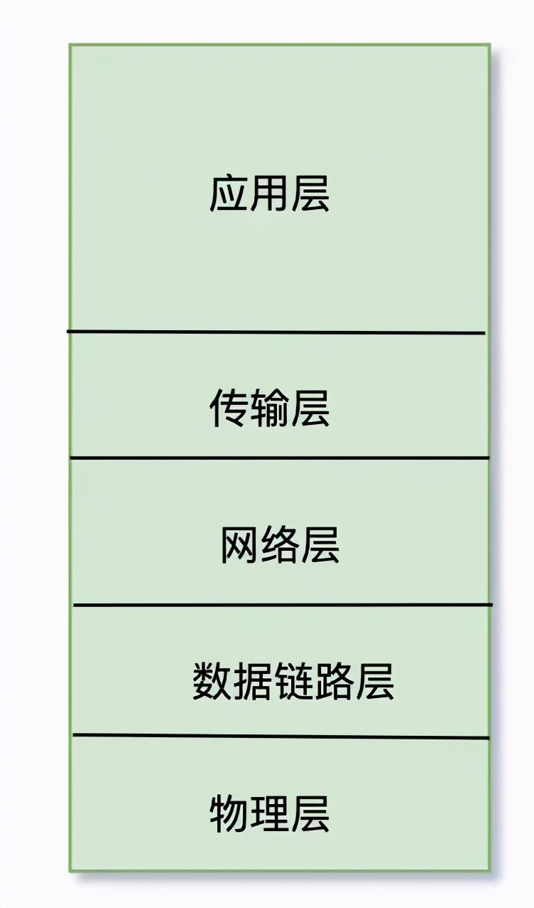
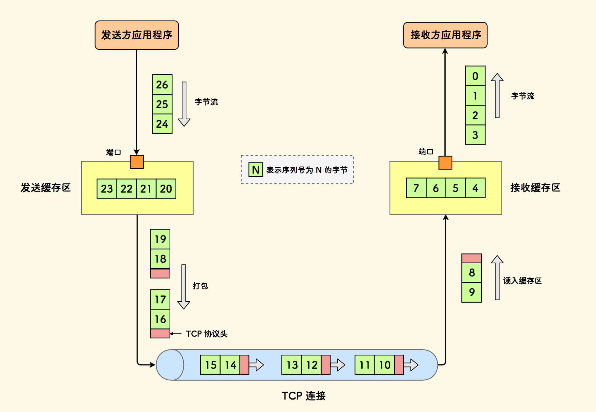
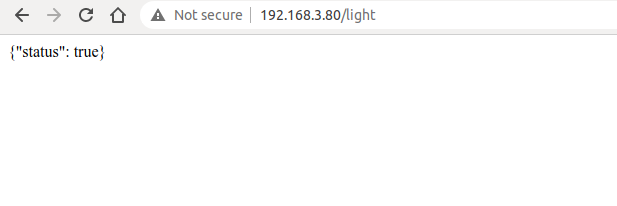
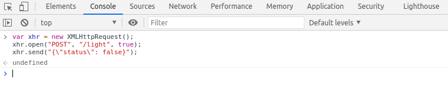
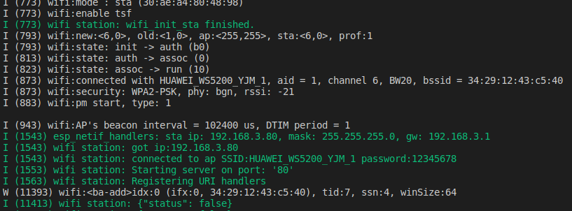
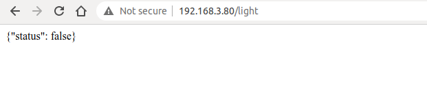
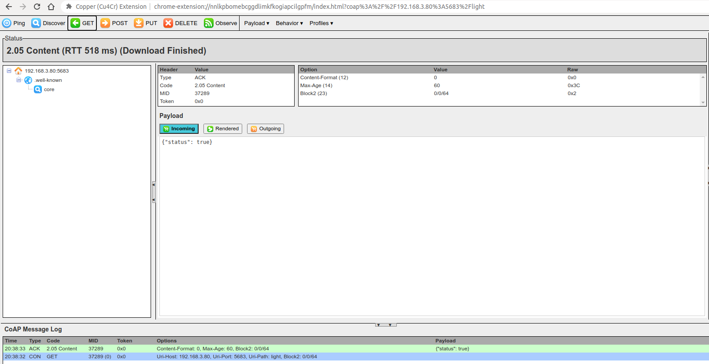
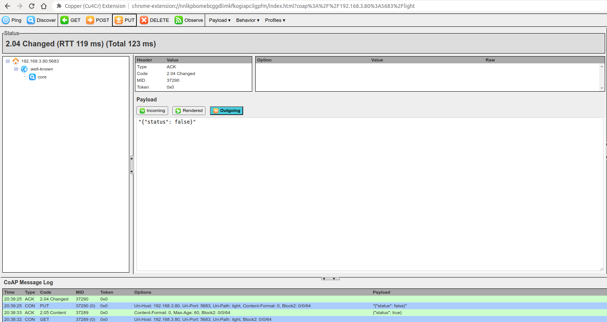
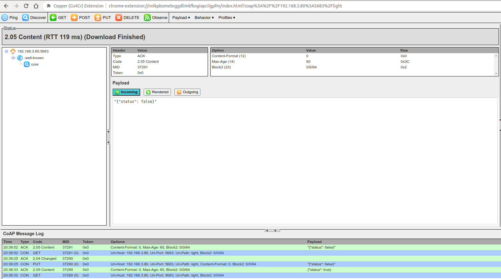

### 7.3 常见的本地数据通信协议

讲完了如何在局域网内发现智能照明灯，接下来我们介绍如何控制智能照明灯。最简单的灯的开关行为，对于软件层来说也就是 GPIO 引脚的上下拉。对于其他设备控制灯的开关，无非就是提供“指令”来进行 GPIO 操作。那么这种指令怎么通过其他设备发送给智能照明灯呢？这种指令到底是什么格式，什么协议呢？

#### 7.3.1 本地数据通信协议之 TCP

传输控制协议 (TCP, Transmission Control Protocol) 是 Internet 协议族的主要协议之一。在 TCP/IP 的模型中，TCP 作为传输层协议，给应用层协议提供了可靠的数据传输。我们常见的应用层协议如 `HTTP`, `MQTT`, `FTP`等等。

<div align="center">
   
</div>
<center>图 7-4 TCP/IP 模型 </center>

##### 7.3.1.1 TCP 协议介绍

TCP 是一种面向连接的、可靠的、基于字节流的传输层通信协议，由 IETF 的 RFC 793 定义。

   - 面向连接： TCP 发送数据前需要在发送方和接收方之间建立连接。
   - 可靠的： TCP 发送的数据可以保证接收方接收，如果数据有丢失，TCP 会重传丢失的数据。TCP 还保证接收方应用顺序的接收数据。
   - 字节流： TCP 发送数据时，是将应用层数据写入 TCP 缓冲区中，然后由 TCP 协议来控制发送这里面的数据，而发送的状态是按字节流的方式发送，跟应用层写下来的报文长度没有任何关系，所以说是流。

TCP 将上层应用数据发给接收端流程：

1. 上层应用程序将应用数据写入 TCP 缓冲区
2. TCP 缓冲区将数据打包成 TCP 报文发往网络层
3. 接收方接收到 TCP 报文，将其放入 TCP 缓冲区
4. 当收到一定数量的 TCP 数据后，对数据进行排序与重组后告知给应用层

<div align="center">
   
</div>
<center>图 7-5 TCP 数据发送与接收流程 </center>

##### 7.3.1.2 如何使用 socket 创建 TCP 服务端

```c
esp_err_t esp_create_tcp_server(void)
{
   int len;
   int keepAlive = 1;
   int keepIdle = 5;
   int keepInterval = 5;
   int keepCount = 3;
   char rx_buffer[128] = {0};
   char addr_str[32] = {0};
   esp_err_t err = ESP_FAIL;
   struct sockaddr_in server_addr;

   /* 创建 TCP 套接字 */
   int listenfd = socket(AF_INET, SOCK_STREAM, 0);
   if (listenfd < 0) {
      ESP_LOGE(TAG, "create socket error");
      return err;
   }

   ESP_LOGI(TAG, "create socket success, listenfd : %d", listenfd);

   /* 启用 SO_REUSEADDR 选项， 允许服务器绑定当前已经存在已建立连接的地址 */
   int opt = 1;
   int ret = setsockopt(listenfd, SOL_SOCKET, SO_REUSEADDR, &opt, sizeof(opt));
   if (ret < 0) {
      ESP_LOGE(TAG, "Failed to set SO_REUSEADDR. Error %d", errno);
      goto exit;
   }

   /* 服务器绑定 IP 全 0，端口 3333 的接口 */
   server_addr.sin_family = AF_INET;
   server_addr.sin_addr.s_addr = INADDR_ANY;
   server_addr.sin_port = htons(3333);
   ret = bind(listenfd, (struct sockaddr *) &server_addr, sizeof(server_addr));
   if (ret < 0) {
      ESP_LOGE(TAG, "bind socket failed, socketfd : %d, errno : %d", listenfd, errno);
      goto exit;
   }
   ESP_LOGI(TAG, "bind socket success");

   ret = listen(listenfd, 1);
   if (ret < 0) {
      ESP_LOGE(TAG, "listen socket failed, socketfd : %d, errno : %d", listenfd, errno);
      goto exit;
   }
   ESP_LOGI(TAG, "listen socket success");

   while (1) {
      struct sockaddr_in source_addr;
      socklen_t addr_len = sizeof(source_addr);
      /* 等待新的 TCP 连接建立成功，并返回与对端通信的套接字 */
      int sock = accept(listenfd, (struct sockaddr *)&source_addr, &addr_len);
      if (sock < 0) {
         ESP_LOGE(TAG, "Unable to accept connection: errno %d", errno);
         break;
      }

      /* 启动 TCP 保活 功能，防止僵尸客户端 */
      setsockopt(sock, SOL_SOCKET, SO_KEEPALIVE, &keepAlive, sizeof(int));
      setsockopt(sock, IPPROTO_TCP, TCP_KEEPIDLE, &keepIdle, sizeof(int));
      setsockopt(sock, IPPROTO_TCP, TCP_KEEPINTVL, &keepInterval, sizeof(int));
      setsockopt(sock, IPPROTO_TCP, TCP_KEEPCNT, &keepCount, sizeof(int));

      if (source_addr.sin_family == PF_INET) {
         inet_ntoa_r(((struct sockaddr_in *)&source_addr)->sin_addr, addr_str, sizeof(addr_str) - 1);
      }

      ESP_LOGI(TAG, "Socket accepted ip address: %s", addr_str);

      do {
         len = recv(sock, rx_buffer, sizeof(rx_buffer) - 1, 0);
         if (len < 0) {
            ESP_LOGE(TAG, "Error occurred during receiving: errno %d", errno);
         } else if (len == 0) {
            ESP_LOGW(TAG, "Connection closed");
         } else {
            rx_buffer[len] = 0;
            ESP_LOGI(TAG, "Received %d bytes: %s", len, rx_buffer);
         }
      } while (len > 0);

      shutdown(sock, 0);
      close(sock);
   }
exit:
   close(listenfd);
   return err;
}
```

创建 TCP 服务器并且监听端口 `3333` 的应用数据。代码中的套接字选项 `SO_REUSEADDR`，允许服务器绑定当前已经存在已建立连接的地址，对于服务器侧代码很有用。套接字选项 `SO_KEEPALIVE` 允许使能 TCP 保活机制，检测一些非正常断开的客户端，防止这些客户端占用服务器进程，套接字 `TCP_KEEPIDLE`，`TCP_KEEPINTVL` 和 `TCP_KEEPCNT` 分别对应距离对端上次发送数据的空闲时间，TCP 保活报文发送的间隔时间和报文发送的最大重试次数。

##### 7.3.1.3 如何使用 socket 创建 TCP 客户端

```c
#define HOST_IP "192.168.3.80"
#define PORT 3333

esp_err_t esp_create_tcp_client(void)
{
   esp_err_t err = ESP_FAIL;
   char *payload = "Open the light";
   struct sockaddr_in dest_addr;
   dest_addr.sin_addr.s_addr = inet_addr(HOST_IP);
   dest_addr.sin_family = AF_INET;
   dest_addr.sin_port = htons(PORT);

   int sock =  socket(AF_INET, SOCK_STREAM, 0);
   if (sock < 0) {
      ESP_LOGE(TAG, "Unable to create socket: errno %d", errno);
      return err;
   }
   ESP_LOGI(TAG, "Socket created, connecting to %s:%d", HOST_IP, PORT);

   int ret = connect(sock, (struct sockaddr *)&dest_addr, sizeof(dest_addr));
   if (ret != 0) {
      ESP_LOGE(TAG, "Socket unable to connect: errno %d", errno);
      close(sock);
      return err;
   }
   ESP_LOGI(TAG, "Successfully connected");

   ret = send(sock, payload, strlen(payload), 0);
   if (ret < 0) {
      ESP_LOGE(TAG, "Error occurred during sending: errno %d", errno);
      goto exit;
   }
   err = ESP_OK;

exit:
   shutdown(sock, 0);
   close(sock);
   return err;
}
```

客户端与服务端建立 TCP 连接后，客户端向服务端发送 TCP 数据 `Open the light`。客户端除了使用该套接字代码以外，可以使用 TCP 调试助手工具模拟客户端进行 TCP 连接。

#### 7.3.2 本地数据通信协议之 HTTP

超文本传输协议（HTTP，HyperText Transfer Protocol）是基于 TCP 传输层之上的应用协议。HTTP 是万维网（World Wide Web，WWW，Web）的数据通信的基础。它规定了客户端与服务器之间数据传输的格式与方式。客户端使用 HTTP 协议可以通过 HTTP 请求方式来获取灯的开关状态（GET）或者操作灯的亮灭（POST），并且每个操作都会有对端的响应回复。所以，HTTP 协议在应用上比单纯的 TCP 传输更加完善与合理。

##### 7.3.2.1 HTTP 协议介绍

HTTP 是一个客户端（用户）和服务端（网站）之间请求和应答的标准。客户端通过网页浏览器，网络爬虫或者其它的工具与服务端建立 TCP 连接，然后发送请求读取服务端数据、上传数据或者表单至服务端，并读取服务端响应状态，比如"HTTP/1.1 200 OK"，以及返回的内容，如请求的文件、错误消息、或者其它信息。通过 HTTP 协议请求的资源由统一资源标识符（Uniform Resource Identifiers，URI）来标识。

在 HTTP 0.9 和 1.0 协议版本中，TCP 连接在每一次请求和回应之后关闭。在 HTTP 1.1 版本协议中，引入了保持连线的机制，一个连接可以重复多个请求和回应，这样可以减少每次数据请求之前的 TCP 握手时间和网络开销。

常见的 HTTP 请求方法有：

1. GET： 请求指定的 URI 资源。
2. POST： 向指定 URI 资源提交数据，请求服务器进行处理（例如提交表单或者上传文件）。
3. DELETE： 请求服务器删除 URI 所标识的资源。

在智能照明灯的本地控制中，我们可以使用 GET 方法来获取灯的状态，使用 POST 方法来操作灯的行为。

##### 7.3.2.2 如何使用 IDF 组件创建 HTTP 服务端

```c
char buf[100] = "{\"status\": true}";
/* HTTP GET 请求回调处理函数 */
esp_err_t esp_light_get_handler(httpd_req_t *req)
{
    /* 发送含有灯的状态的 JSON 格式数据给客户端 */
    httpd_resp_send(req, buf, strlen(buf));
    return ESP_OK;
}

/* HTTP SET 请求回调处理函数 */
esp_err_t esp_light_set_handler(httpd_req_t *req)
{
    int ret, remaining = req->content_len;
    memset(buf, 0 ,sizeof(buf));
    while (remaining > 0) {
        /* 读取 http 请求数据 */
        if ((ret = httpd_req_recv(req, buf, remaining)) <= 0) {
            if (ret == HTTPD_SOCK_ERR_TIMEOUT) {
                continue;
            }
            return ESP_FAIL;
        }
        remaining -= ret;
    }
    ESP_LOGI(TAG, "%.*s", req->content_len, buf);
    /* TODO: 读到数据后解析并且操作灯 */
    return ESP_OK;
}

static const httpd_uri_t status = {
    .uri       = "/light",
    .method    = HTTP_GET,
    .handler   = esp_light_get_handler,
};

static const httpd_uri_t ctrl = {
    .uri       = "/light",
    .method    = HTTP_POST,
    .handler   = esp_light_set_handler,
};

esp_err_t esp_start_webserver()
{
    httpd_handle_t server = NULL;
    httpd_config_t config = HTTPD_DEFAULT_CONFIG();
    config.lru_purge_enable = true;

    /* 启动 http 服务器 */
    ESP_LOGI(TAG, "Starting server on port: '%d'", config.server_port);
    if (httpd_start(&server, &config) == ESP_OK) {
        /* 设置 HTTP URI 对应的回调处理函数 */
        ESP_LOGI(TAG, "Registering URI handlers");
        httpd_register_uri_handler(server, &status);
        httpd_register_uri_handler(server, &ctrl);
        return ESP_OK;
    }

    ESP_LOGI(TAG, "Error starting server!");
    return ESP_FAIL;
}
```

上述代码实现了 HTTP 服务器，用于查询灯的状态和设置灯的状态，当我们使用浏览器访问 `http://[ip]/light` 时，浏览器上会返回 `{"status": true}` JSON 格式数据，表示灯的状态是 `true`。当我们使用浏览器 POST 数据 `{"status": false}`，表示设置灯的状态是 `false`。

使用 Chroma 浏览器输入 URI 查询。

<div align="center">
   
</div>
<center>图 7-6 HTTP 获取灯状态 </center>

在当前页面按下 `F12`，进入 Console，输入如下代码后按下 `Enter` 键，发送 POST 请求。

```
var xhr = new XMLHttpRequest();
xhr.open("POST", "192.168.3.80/light", true);
xhr.send("{\"status\": false}");
```

<div align="center">
   
</div>
<center>图 7-7 HTTP 设置灯状态方法 </center>

此时服务器侧会收到 HTTP POST 请求数据 `{"status": false}`。

<div align="center">
   
</div>
<center>图 7-8 HTTP 设置灯状态日志 </center>

此时刷新当前界面继续查询智能照明灯的状态，会显示之前设置的状态。

<div align="center">
   
</div>
<center>图 7-9 HTTP 获取灯状态 </center>

#### 7.3.3 本地数据通信协议之 UDP

上述章节介绍了传输层协议 TCP 以及对应的应用层协议 HTTP。它们的主要特点就是传输可靠。接下来我们介绍同样是传输层协议的 UDP，它刚好与 TCP 相反，是一个不可靠的传输协议。常见的基于 UDP 传输的应用协议如 `DNS`，`TFTP`，`SNMP` 等等。

##### 7.3.3.1 UDP 协议介绍

用户数据报协议（UDP，User Datagram Protocol）是一个简单的面向数据报的通信协议，和 TCP 协议一样位于传输层。协议由 David P. Reed 在 1980 年设计且在 RFC 768 中被规范。UDP 是不可靠的传输协议，应用程序数据通过 UDP 协议发送出去后，底层不会负责保留应用数据来防止数据在传输过程中的丢失。UDP 不提供差错纠正、队列管理、重复消除和拥塞控制。UDP 包头的校验和提供差错检测。

UDP 是无连接的协议，发送应用数据前无需像 TCP 一样建立连接，直接将应用数据发送至对端。由于传输数据不需建立连接，因此也就不需要维护连接状态，包括收发状态等。

UDP 协议本身只负责传输，因此使用它的应用程序要做更多关于数据包如何发送和处理的控制，比如如何使数据正确且有序的让对端应用程序接收。

虽然看起来 UDP 协议对比 TCP 协议不能保证数据可靠安全的送达，我们可能会有疑问，为什么还要使用 UDP 呢？ UDP 的无连接特性，相比于 TCP 网络和时间开销更少；UDP 的不可靠传输（主要是 UDP 包丢弃后无法保证重传的特性）更适合那些流媒体，实时多人游戏和 IP 语音的应用，丢失几个包不会影响应用，反而如果使用 TCP 重传则会大大增加网络的延迟。

##### 7.3.3.2 如何使用 socket 创建 UDP 服务端

```c
esp_err_t esp_create_udp_server(void)
{
    char rx_buffer[128];
    char addr_str[32];
    esp_err_t err = ESP_FAIL;
    struct sockaddr_in server_addr;

    /* 创建 UDP 套接字 */
    int sock = socket(AF_INET, SOCK_DGRAM, 0);
    if (sock < 0) {
        ESP_LOGE(TAG, "create socket error");
        return err;
    }

    ESP_LOGI(TAG, "create socket success, sock : %d", sock);

    /* 启用 SO_REUSEADDR 选项， 允许服务器绑定当前已经存在已建立连接的地址 */
    int opt = 1;
    int ret = setsockopt(sock, SOL_SOCKET, SO_REUSEADDR, &opt, sizeof(opt));
    if (ret < 0) {
        ESP_LOGE(TAG, "Failed to set SO_REUSEADDR. Error %d", errno);
        goto exit;
    }

    /* 服务器绑定 IP 全 0，端口 3333 的接口 */
    server_addr.sin_family = AF_INET;
    server_addr.sin_addr.s_addr = INADDR_ANY;
    server_addr.sin_port = htons(3333);
    ret = bind(sock, (struct sockaddr *) &server_addr, sizeof(server_addr));
    if (ret < 0) {
        ESP_LOGE(TAG, "bind socket failed, socketfd : %d, errno : %d", sock, errno);
        goto exit;
    }
    ESP_LOGI(TAG, "bind socket success");

    while (1) {
        struct sockaddr_in source_addr;
        socklen_t addr_len = sizeof(source_addr);
        memset(rx_buffer, 0, sizeof(rx_buffer));
        int len = recvfrom(sock, rx_buffer, sizeof(rx_buffer) - 1, 0, (struct sockaddr *)&source_addr, &addr_len);

        /* 接收错误 */
        if (len < 0) {
            ESP_LOGE(TAG, "recvfrom failed: errno %d", errno);
            break;
        } else { /* 接收到数据 */
            if (source_addr.sin_family == PF_INET) {
                inet_ntoa_r(((struct sockaddr_in *)&source_addr)->sin_addr, addr_str, sizeof(addr_str) - 1);
            }
            /* 字符串以 NULL 结尾 */
            rx_buffer[len] = 0;
            ESP_LOGI(TAG, "Received %d bytes from %s:", len, addr_str);
            ESP_LOGI(TAG, "%s", rx_buffer);
        }
    }
exit:
   close(sock);
   return err;
}
```

##### 7.3.3.3 如何使用 socket 创建 UDP 客户端

```c
esp_err_t esp_create_udp_client(void)
{
    esp_err_t err = ESP_FAIL;
    char *payload = "Open the light";
    struct sockaddr_in dest_addr;
    dest_addr.sin_addr.s_addr = inet_addr("192.168.3.80");
    dest_addr.sin_family = AF_INET;
    dest_addr.sin_port = htons(3333);

    int sock =  socket(AF_INET, SOCK_DGRAM, 0);
    if (sock < 0) {
        ESP_LOGE(TAG, "Unable to create socket: errno %d", errno);
        return err;
    }

    int ret = sendto(sock, payload, strlen(payload), 0, (struct sockaddr *)&dest_addr, sizeof(dest_addr));
    if (ret < 0) {
        ESP_LOGE(TAG, "Error occurred during sending: errno %d", errno);
        goto exit;
    }
    ESP_LOGI(TAG, "Message send successfully");
    err = ESP_OK;

exit:
   close(sock);
   return err;
}
```

UDP 客户端无需与服务端建立连接，直接可以将数据发送至服务端。由于 UDP 是不可靠的连接，所以发送的数据 `Open the light` 可能会存在丢包，导致对端无法收到的问题。所以我们在设计客户端与服务端的代码时，需要在应用层代码加一些逻辑，确保数据没有丢失。比如当客户端发送 `Open the light` 给服务端，服务端接收成功后返回 `Open the light OK`，客户端如果 1 秒内收到该数据，则表明数据正确的发送至服务端，如果客户端超过 1 秒没有收到，就需要再次发送数据 `Open the light`。

#### 7.3.4 本地数据通信协议之 CoAP

随着物理网技术的飞速发展，诞生了一系列满足物联网设备的协议，物联网设备大都受资源限制，比如 RAM、Flash、CPU、网络带宽等。对于物联网设备，如果想要借助 TCP 和 HTTP 协议进行数据通信，往往需要更多的内存与网络带宽。如果能使用 UDP 协议作为传输层，有没有一个类似 HTTP 的应用协议呢？所以，CoAP 协议就被设计出来了。

##### 7.3.4.1 CoAP 协议介绍

受限制的应用协议（Constrained Application Protocol，CoAP ）是一种在物联网世界的类 web 应用协议，在 RFC 7252 中被规范定义，使用在资源受限的物联网设备上，使那些被称为“节点”的受约束设备能够使用类似的协议与更广泛的 Internet 进行通信。CoAP 被设计用于同一受限网络（例如，低功耗、有损网络）上的设备之间、设备和因特网上的一般节点之间以及由因特网连接的不同受限网络上的设备之间使用。

CoAP 是基于请求与相应模型，类似 HTTP 协议，这样可以弥补 UDP 不可靠传输的缺陷，保证数据不丢失乱序。服务端的资源用 URL 来标识（比如coap://[IP]/id/light_status 访问某个灯设备的状态）。客户端通过某个资源的 URL 来访问服务端资源，通过 4个 请求方法（GET,PUT,POST,DELETE）完成对服务器上资源的操作。

CoAP 还具有：

- 客户端和服务端双方都可以独立向对方发送请求
- 支持可靠的数据传输
- 支持 IP 多播与广播，可以实现一对多个设备之间的数据传输
- 低功耗，非长连接通信
- 相比于 HTTP 包头更轻量

##### 7.3.4.2 如何使用 IDF 组件创建 CoAP 服务端

```c
char buf[100] = "{\"status\": true}";
/* CoAP GET 方法回调处理函数 */
void esp_coap_get(coap_resource_t *resource, coap_session_t *session, const coap_pdu_t *request, const coap_string_t *query, coap_pdu_t *response)
{
    coap_pdu_set_code(response, COAP_RESPONSE_CODE_CONTENT);
    coap_add_data_large_response(resource, session, request, response, query, COAP_MEDIATYPE_TEXT_PLAIN, 60, 0, strlen(buf), (const u_char *)buf, NULL, NULL);
}

/* CoAP PUT 方法回调处理函数 */
void esp_coap_put(coap_resource_t *resource, coap_session_t *session, const coap_pdu_t *request, const coap_string_t *query, coap_pdu_t *response)
{
    size_t size;
    size_t offset;
    size_t total;
    const unsigned char *data;

    coap_resource_notify_observers(resource, NULL);

    /* 读取收到的 CoAP 数据 */
    (void)coap_get_data_large(request, &size, &data, &offset, &total);

    if (size) {
        if (strncmp((char *)data, buf, size)) {
            memcpy(buf, data, size);
            buf[size] = 0;
            coap_pdu_set_code(response, COAP_RESPONSE_CODE_CHANGED);
        } else {
            coap_pdu_set_code(response, COAP_RESPONSE_CODE_INTERNAL_ERROR);
        }
    } else { /* size 为 0 表示接收错误 */
        coap_pdu_set_code(response, COAP_RESPONSE_CODE_INTERNAL_ERROR);
    }
}

void esp_create_coap_server(void)
{
    coap_context_t *ctx = NULL;
    coap_address_t serv_addr;
    coap_resource_t *resource = NULL;

    while (1) {
        coap_endpoint_t *ep = NULL;
        unsigned wait_ms;

        /* 创建 CoAP 服务端套接字 */
        coap_address_init(&serv_addr);
        serv_addr.addr.sin6.sin6_family = AF_INET6;
        serv_addr.addr.sin6.sin6_port   = htons(COAP_DEFAULT_PORT);

        /* 创建 CoAP ctx */
        ctx = coap_new_context(NULL);
        if (!ctx) {
            ESP_LOGE(TAG, "coap_new_context() failed");
            continue;
        }
        coap_context_set_block_mode(ctx, COAP_BLOCK_USE_LIBCOAP| COAP_BLOCK_SINGLE_BODY);

        /* 设置 CoAP 节点 */
        ep = coap_new_endpoint(ctx, &serv_addr, COAP_PROTO_UDP);
        if (!ep) {
            ESP_LOGE(TAG, "udp: coap_new_endpoint() failed");
            goto clean_up;
        }

        /* 设置 CoAP 资源 URL */
        resource = coap_resource_init(coap_make_str_const("light"), 0);
        if (!resource) {
            ESP_LOGE(TAG, "coap_resource_init() failed");
            goto clean_up;
        }

        /* 注册 CoAP 资源 URL 对应的 GET 和 PUT 方法回调处理函数 */
        coap_register_handler(resource, COAP_REQUEST_GET, esp_coap_get);
        coap_register_handler(resource, COAP_REQUEST_PUT, esp_coap_put);

        /* 设置 CoAP get 资源可见 */
        coap_resource_set_get_observable(resource, 1);

        /* 添加资源至 CoAP ctx */
        coap_add_resource(ctx, resource);

        wait_ms = COAP_RESOURCE_CHECK_TIME * 1000;

        while (1) {
            /* 等待接收 CoAP 数据 */
            int result = coap_io_process(ctx, wait_ms);
            if (result < 0) {
                break;
            } else if (result && (unsigned)result < wait_ms) {
                /* 递减等待的时间 */
                wait_ms -= result;
            } else {
                /* 重置等待时间 */
                wait_ms = COAP_RESOURCE_CHECK_TIME * 1000;
            }
        }
    }
clean_up:
    coap_free_context(ctx);
    coap_cleanup();
}
```

上述代码实现了如何创建一个 CoAP 服务端，并且提供 `GET` 查询智能照明灯状态和 `PUT` 设置智能照明灯状态的方法。用户可以使用 Chrome 浏览器安装 CoAP 调试客户端 Copper 插件，模拟 CoAP 客户端。

打开 Chrome 插件 Copper，输入 URL `coap://192.168.3.80/light`，点击 `Enter` 连接服务端。

<div align="center">
   
</div>
<center>图 7-10 CoAP 插件连接 </center>

连接成功后，点击左上方 `GET` 按钮获取状态，显示 `"{"status": true}"`

<div align="center">
   
</div>
<center>图 7-11 CoAP 插件查询状态 </center>

点击左上方 `PUT` 按钮并且修改 Payload 的 Outgoing 里的数据为 `"{"status": false}"`，表示设置灯的状态为 false。

<div align="center">
   
</div>
<center>图 7-12 CoAP 插件设置状态 </center>

此时再点击左上方 `GET` 按钮获取状态，显示 `"{"status": false}"`

<div align="center">
   
</div>
<center>图 7-13 CoAP 插件查询设置的状态 </center>

#### 7.3.5 数据通信协议总结

对于传输层的两个协议 UDP 和 TCP，它们都可以直接用作应用数据的通信协议。但是它们有如下几个区别：

|  | TCP | UDP |
| :----: | :----: | :----: |
| 可靠性 | 可靠传输，支持重传，流量控制和拥塞控制 | 不可靠传输，不支持重传，流量控制和拥塞控制 |
| 连接特性 | 面向连接的，3 次握手建立连接和 4次握手断开连接，长连接| 无连接，直接进行数据传输，短连接 |
| 连接对象 | 一对一连接 | 支持一对一单播，一对所有广播和一对多组播传输 |
| 包头开销 | 包头最小 20 字节 | 包头只有 8 字节 |
| 传输速率 | 根据网络环境，出现丢包会重传导致传输速率降低 | 快，不受网络环境影响，只负责将数据传输到网络 |
| 适用场景 | 适用于可靠传输的应用，比如文件传输等 | 适用于实时传输应用，比如 VOIP 电话，视频电话，流媒体等 |

所以对于本地控制的数据通信，单纯从传输层来讲，我们会选择 TCP 协议，因为需要数据的准确性，如果使用 UDP 协议，手机 APP 侧发送开灯指令，可能该指令由于网络环境问题被丢弃了，智能照明灯可能就无法收到该指令，相比于 TCP 而言，就算数据包被丢弃了，手机 APP 底层还是会重新发送该指令。

但是使用单纯的传输层协议发送应用数据有个缺陷，上层应用业务逻辑就需要用户自行开发，所以我们又介绍了基于 TCP 和 UDP 的应用协议 HTTP 和 CoAP。

HTTP 和 CoAP 都是基于 REST 模型的网络传输协议，发送请求与响应请求，只是它们一个基于 TCP，一个基于 UDP，并且各自继承了传输层协议的相关特性。

|  | HTTP | CoAP |
| :----: | :----: | :----: |
| 传输层 | TCP | UDP |
| 包头开销 | 可能含有大量消息头数据，开销大 | 包头采用二进制压缩，开销小 |
| 功耗 | 长连接功耗高 | 短连接功耗低 |
| 资源发现 | 不支持 | 支持 |
| 请求方式 | 一般由客户端主动触发，服务器无法主动触发 | 虽然也有客户端与服务端之分，但是两者都可以主动触发 |
| 适用场景 | 适用于性能，内存比较多的设备 | 适用于性能，内存比较少的设备 |

相比较下来，CoAP 更适合一些资源少的物联网设备，如果设备资源多，性能好， HTTP 协议比 CoAP 协议功能更加健全。
