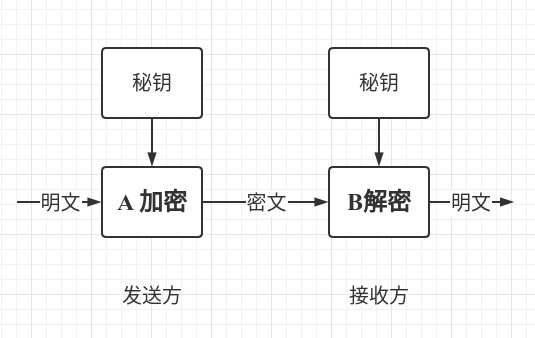
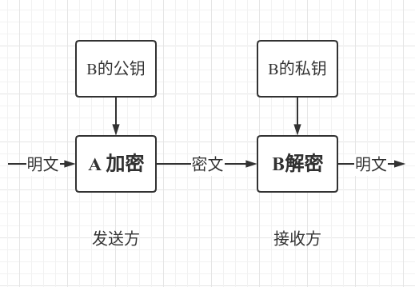
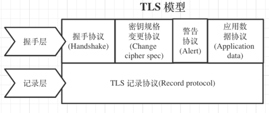
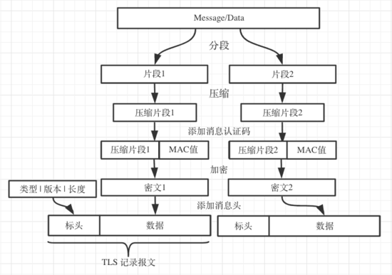
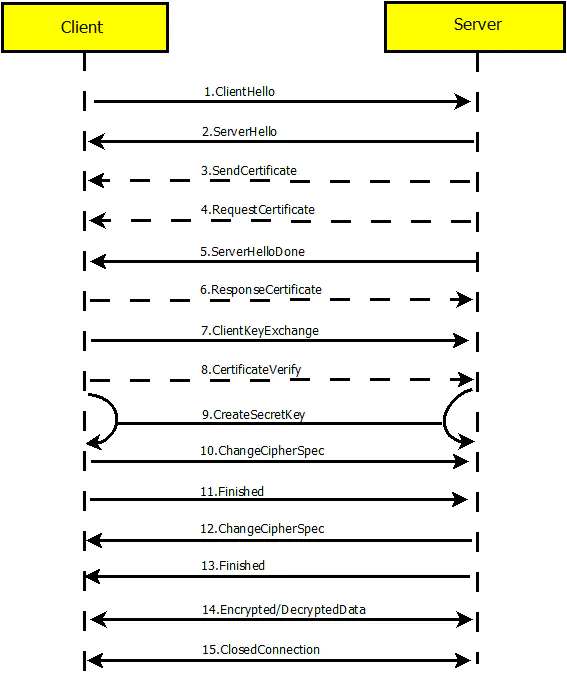
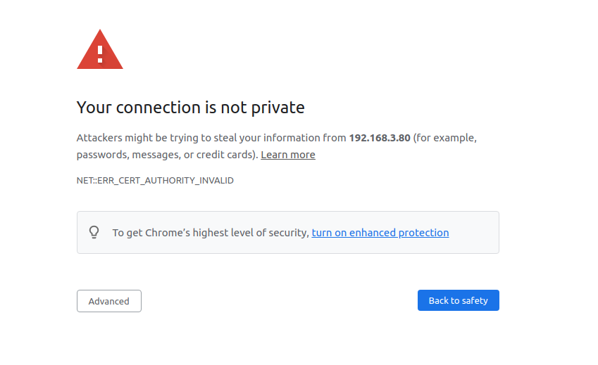
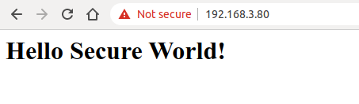
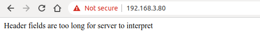

### 7.4 如何保证数据安全性

我们知道 TCP 和 UDP 甚至其之上的应用协议 HTTP 和 CoAP 都是明文传输数据，这样就会导致数据在网络传输的时候被窃取或者篡改，如果数据中含有密码，账号等敏感信息，这将会造成不可挽回的损失。所以我们需要对这些明文传输的数据进行加密。

加密是为了保证传输信息的加密性与完整性。过去我们常见的加密系统通常有对数据进行编码传输，比如抗战时候，发送的电报就是通过编码进行发送，接收方和发送方都有一本相同的密码本，密码本上的数字或者字母来替换电报中的单词，语句。这样就算电报内容被第三者窃听了，第三者也一时间也不容易获取到电报的真实内容。但是这种方式有个缺陷，就是报文的内容存在被破解的可能，而且为了防止被破解，接收与发送方需要定期更换密码本，更换密码本时也有可能密码本泄露，导致报文内容被破解。

上述的例子就是我们常见的加密算法——对称加密。在对称加密算法中，加密与解密的算法是一样的，所以它们的秘钥也都是一样的。它具有算法公开、计算量小、加密速度快、加密效率高的优点，但是在数据传送前，发送方和接收方必须商定好秘钥，这会使得密钥管理成为双方的负担。常见的对称加密算法有：AES、DES、RC4 等等。

<div align="center">
   
</div>
<center>图 7-14 对称加密流程 </center>

与对称加密相对算法——非对称加密。非对称加密双方都有一对公开密钥（public key）与私有密钥（private key），如果用公开密钥对数据进行加密，只有用对应的私有密钥才能解密；如果用私有密钥对数据进行加密，那么只有用对应的公开密钥才能解密。因为加密和解密使用的是两个不同的密钥，所以这种算法叫作非对称加密算法。它相比对称加密更加安全，因为它算法比对称加密更复杂，所以解密密文较慢，很难直接破译密文。常见的非对称加密算法有：RSA、Diffie-Hellman、DSA 等等。

非对称的优点是安全的，用户 A 可以保留 private key，通过网络将 public key 传递给 B。就算 public key 被 C 获取到了，因为 C 没有 A 的 private key，C 是无法破解数据的内容。这样 A 和 B 就可以大胆的通过网络传递各自的 public key。

<div align="center">
   
</div>
<center>图 7-15 非对称加密流程 </center>

非对称加密看起来似乎很安全，但是我们有没有想过这样一个问题：如果 C 将发往 A 和 B 的 public key 全部替换为自己对应 private key 的 public key 呢？ A 是不知道这个 public key 是不是 B 的，所以当 A 发送数据时，就会使用 C 的 public key 进行加密发送，这个时候，C 就可以窃取该密文数据，然后使用对应的 private key 进行解密。所以至关重要的是如何保证 public key 的合法性。现实中，通过 CA（Certificate Authority）来保证 public key 的真实性。CA 也是基于非对称加密算法来工作。有了 CA，B 会先把自己的 public key（和一些其他信息）交给 CA。CA 用自己的 private key 加密这些数据，加密完的数据称为 B 的数字证书。现在 B 要向 A 传递 public key，B 传递的是 CA 加密之后的数字证书。A 收到以后，会通过 CA 发布的 CA 证书（包含了 CA 的 public key），来解密 B 的数字证书，从而获得 B 的 public key。

#### 7.4.1 TLS 协议介绍

安全传输层（Transport Layer Security，TLS）是建立在 TCP 传输层协议之上的协议，服务于应用层，它的前身是安全套接字层（Secure Socket Layer，SSL），实现了将应用层的报文进行加密后再交由 TCP 层进行传输。

**TLS 的作用**

TLS 协议主要解决如下三个网络问题：

- 保证数据的机密性：所有应用数据采用加密传输，防止数据被第三方窃取
- 保证数据的完整性：所有应用数据采用校验机制，一旦被篡改，通信双方会立刻发现
- 保证数据通信双方身份：通信双方可以采取证书认证，防止身份被冒充

**TLS 的工作方式**

TLS 可以分为两部分：

- 记录层：通过使用客户端和服务端协商后的秘钥进行数据加密传输
- 握手层：客户端和服务端进行协商，确定一组用于数据传输加密的秘钥串。包含四个子协议：握手协议 (handshake protocol)、更改加密规范协议 (change cipher spec protocol)、应用数据协议 (application data protocol) 和警告协议 (alert protocol)

<div align="center">
   
</div>
<center>图 7-16 TLS 模型 </center>

记录层：

记录层负责在传输连接上交换的所有底层消息，并且可以配置加密。每一条 TLS 记录以一个短标头开始。标头包含记录内容的类型 (或子协议)、协议版本和长度。原始消息经过分段 (或者合并)、压缩、添加认证码、加密转为 TLS 记录的数据部分。

<div align="center">
   
</div>
<center>图 7-17 TLS 记录报文 </center>

握手层：

- 握手协议的职责是生成通信过程所需的共享密钥和进行身份认证。这部分使用无密码套件，为防止数据被窃听，通过公钥密码或 Diffie-Hellman 密钥交换技术通信。
- 密码规格变更协议，用于密码切换的同步，是在握手协议之后的协议。握手协议过程中使用的协议是“不加密”这一密码套件，握手协议完成后则使用协商好的密码套件。
- 警告协议，当发生错误时使用该协议通知通信对方，如握手过程中发生异常、消息认证码错误、数据无法解压缩等。
- 应用数据协议，通信双方真正进行应用数据传输的协议，传送过程通过 TLS 应用数据协议和 TLS 记录协议来进行传输。

TLS 加密所使用的算法：

- 散列函数 Hash：用于验证数据的完整性，常见的有 MD5，SHA
- 对称算法：用于应用数据的加密，常见的有 AES，RC4，DES
- 非对称算法：用于身份认证和密钥协商，常见的有 RSA，DH

TLS 的基本工作方式是，客户端与服务器采用非对称算法认证身份并且协商对称加密秘钥，然后使用对称加密加密数据和数据摘要进行数据通信。流程如下图所示：

<div align="center">
   
</div>
<center>图 7-18 TLS 握手流程 </center>

- ClientHello – 客户端发送所支持的 SSL/TLS 最高协议版本号和所支持的加密算法集合及压缩方法集合等信息给服务器端。
- ServerHello – 服务器端收到客户端信息后，选定双方都能够支持的 SSL/TLS 协议版本和加密方法及压缩方法，返回给客户端。
- （可选）SendCertificate – 服务器端发送服务端证书给客户端。
- （可选）RequestCertificate – 如果选择双向验证，服务器端向客户端请求客户端证书。
- ServerHelloDone – 服务器端通知客户端初始协商结束。
- （可选）ResponseCertificate – 如果选择双向验证，客户端向服务器端发送客户端证书。
- ClientKeyExchange – 客户端使用服务器端的公钥，对客户端公钥和密钥种子进行加密，再发送给服务器端。
- （可选）CertificateVerify – 如果选择双向验证，客户端用本地私钥生成数字签名，并发送给服务器端，让其通过收到的客户端公钥进行身份验证。
- CreateSecretKey – 通讯双方基于密钥种子等信息生成通讯密钥。
- ChangeCipherSpec – 客户端通知服务器端已将通讯方式切换到加密模式。
- Finished – 客户端做好加密通讯的准备。
- ChangeCipherSpec – 服务器端通知客户端已将通讯方式切换到加密模式。
- Finished – 服务器做好加密通讯的准备。
- Encrypted/DecryptedData – 双方使用客户端密钥，通过对称加密算法对通讯内容进行加密。
- ClosedConnection – 通讯结束后，任何一方发出断开 SSL 连接的消息。

#### 7.4.2 如何使用 IDF 创建 HTTPS 服务器

HTTPS 即 HTTP over SSL，通过 SSL/TLS 加密 HTTP 数据。相比于 HTTP 协议而言，HTTPS 防止数据在传输过程中被窃取、改变，确保数据的完整性。

```c
static esp_err_t root_get_handler(httpd_req_t *req)
{
    httpd_resp_set_type(req, "text/html");
    httpd_resp_send(req, "<h1>Hello Secure World!</h1>", HTTPD_RESP_USE_STRLEN);

    return ESP_OK;
}

static const httpd_uri_t root = {
    .uri       = "/",
    .method    = HTTP_GET,
    .handler   = root_get_handler
};

esp_err_t esp_create_https_server(void)
{
    httpd_handle_t server = NULL;

    ESP_LOGI(TAG, "Starting server");

    httpd_ssl_config_t conf = HTTPD_SSL_CONFIG_DEFAULT();

    extern const unsigned char cacert_pem_start[] asm("_binary_cacert_pem_start");
    extern const unsigned char cacert_pem_end[]   asm("_binary_cacert_pem_end");
    conf.cacert_pem = cacert_pem_start;
    conf.cacert_len = cacert_pem_end - cacert_pem_start;

    extern const unsigned char prvtkey_pem_start[] asm("_binary_prvtkey_pem_start");
    extern const unsigned char prvtkey_pem_end[]   asm("_binary_prvtkey_pem_end");
    conf.prvtkey_pem = prvtkey_pem_start;
    conf.prvtkey_len = prvtkey_pem_end - prvtkey_pem_start;

    esp_err_t ret = httpd_ssl_start(&server, &conf);
    if (ESP_OK != ret) {
        ESP_LOGI(TAG, "Error starting server!");
        return ESP_FAIL;
    }

    // Set URI handlers
    ESP_LOGI(TAG, "Registering URI handlers");
    httpd_register_uri_handler(server, &root);
    return ESP_OK;
}
```

上述代码提供了如何创建 HTTPS 服务器的示例。使用此代码之前，我们需要使用如下命令在 `main` 目录下手动创建一个 CA 证书和 private key。

```
openssl req -newkey rsa:2048 -nodes -keyout prvtkey.pem -x509 -days 3650 -out cacert.pem -subj "/CN=ESP32 HTTPS server example"
```

然后修改 CMake 文件将证书编译进代码。

```
idf_component_register(SRCS "station_example_main.c"
                    INCLUDE_DIRS "."
                    EMBED_TXTFILES "cacert.pem"
                                   "prvtkey.pem")
```

另外你还需要使能 `CONFIG_ESP_HTTPS_SERVER_ENABLE` 配置，通过 `idf.py menuconfig -> Component config -> ESP HTTPS server`。

使用 Chroma 浏览器输入 `https://[你的设备 ip]:443/`，由于服务器的 CA 证书不是专业机构签发的，所以是不受信任的。你会看到如下界面：

<div align="center">
   
</div>
<center>图 7-19 HTTPS 连接不受信任 </center>

你需要点击 `Advanced` 按钮来允许该非受信任的连接。

<div align="center">
   
</div>
<center>图 7-20 HTTPS 连接成功 </center>

如果出现 `Header fields are too long for server to interpret`，则表示需要增大 `HTTPD_MAX_REQ_HDR_LEN` 配置，通过 `idf.py menuconfig -> Component config -> HTTP Server -> Max HTTP Request Header Length`
<div align="center">
   
</div>
<center>图 7-21 HTTPS 连接失败 </center>
