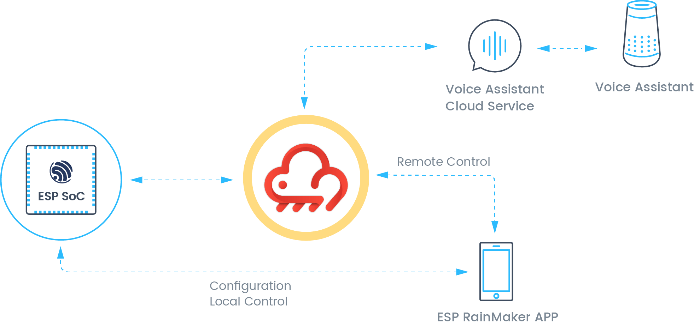

# 第8章、实现设备的云端控制

## 8.1 概述

本章主要介绍如何基于 ESP32-C3 实现远程控制功能。本章的目的是帮助读者了解什么是远程控制以及远程控制的流程与所使用的协议，最终指导读者如何本地搭建 MQTT 服务器。

### 8.1.1 远程控制的介绍

什么是远程控制？远程控制，顾名思义是指用户控制设备，例如手机，电脑灯网络设备通过广域网控制受控设备的行为。远程控制不受地域的限制，比如你在公司通过手机控制家中灯的开关。远程控制的控制设备和受控设备一般都需要连接到云服务器，控制设备发送的控制指令交由云服务器转发至受控设备上。

上一章节，我们介绍了什么是本地控制。其实本地控制和远程控制很类似，本地控制是局域网内的数据通信，而远程控制一般是广域网的数据通信。本地控制内的服务器可以是设备本身，也可以是局域网内的一台主机，用户的控制设备，例如手机，电脑都必须和服务器在一个局域网，这是一个受限条件。而远程控制的服务器一般都是云服务器，现在规模比较大的几家云服务器厂商，例如阿里云，亚马逊云，腾讯云等等，设备和用户的控制设备都需要连接到云服务器上，数据的转发交由云服务器处理。

远程控制的好处是控制灵活，突破空间的限制，但是它相比本地控制，远程控制需要云服务和网络流量的支持，成本相比本地控制要高，而且远程控制往往会比本地控制延迟高，数据的泄露风险更大。

   

图 8-1 远程控制拓扑 

从网络拓扑图我们可以看出，远程控制中无论是控制设备（手机）还是受控制设备（ESP 设备）都是直接与云进行连接，数据通信也是交由云进行转发。所以我们需要了解受控设备和控制设备与云是如何通信的。
