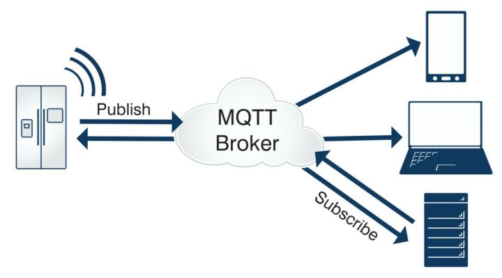
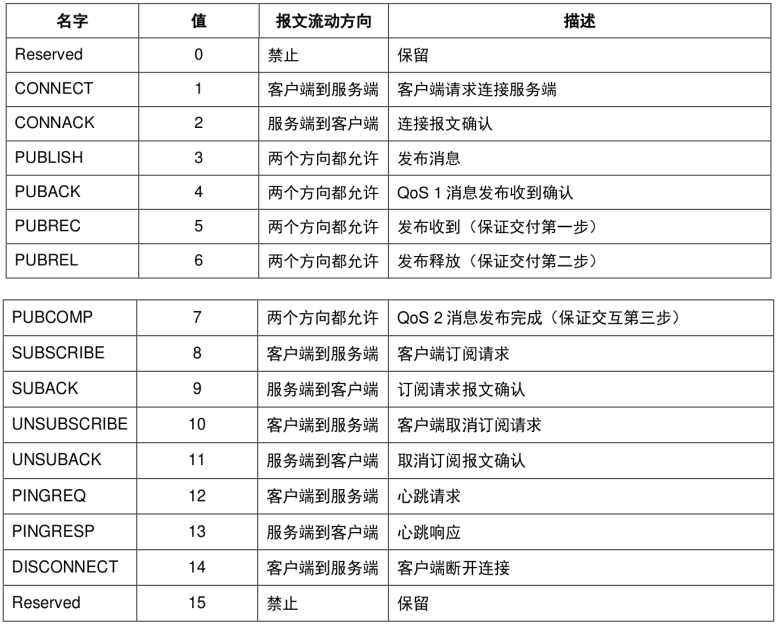
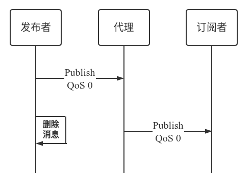
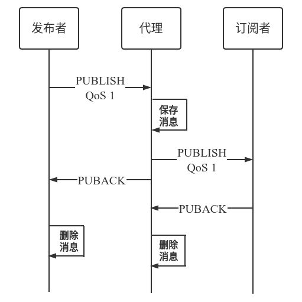
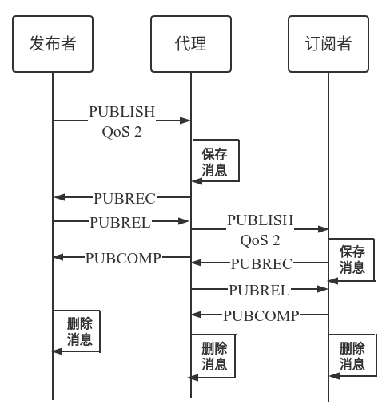

### 8.2 常见的云端控制数据通信协议

#### 8.2.1 MQTT 协议介绍

MQTT（Message Queue Telemetry Transport） 是一个客户端/服务端架构的发布/订阅模式的消息传输协议。该协议具有轻巧、开放、简单、规范和易于实现的特点，适合于受限环境（低带宽，高延迟，设备资源受限），属于物联网（Internet of Thing，IOT）的标准传输协议。该协议由 IBM 在 1999 年发布，目前最新版本为 v3.1.1。

MQTT 是运行于 TCP 传输协议之上。具有如下特点：

- 使用发布/订阅消息模式，提供了一对多的消息分发模式和应用之间的解耦
- 消息传输不需要知道负载内容
- 提供三种等级的服务质量（QoS）保证数据的传输
- 很小的传输消耗和协议数据交换，最大限度减少网络流量
- 支持“遗嘱消息”，异常连接断开发生时，能通知到相关各方

#### 8.2.2 MQTT 协议原理

MQTT 是基于客户端与服务器架构通信的。在 MQTT 协议中，有三个角色：发布者（Publish），代理服务器（Broker）和订阅者（Subscribe）。发布者和订阅者都属于客户端，并且客户端可以既是消息的发布者也可以是消息的订阅者，代理服务器是服务器。

<div align="center">
   
</div>
<center>图 8-2 MQTT 架构 </center>

**客户端**

使用 MQTT 的程序或设备。客户端总是通过网络连接到服务端。它可以

- 发布应用消息给其它相关的客户端
- 订阅以请求接受相关的应用消息
- 取消订阅以移除接受应用消息的请求
- 从服务端断开连接

**服务端**

一个程序或设备，作为发送消息的客户端和请求订阅的客户端之间的中介。服务端

- 接受来自客户端的网络连接
- 接受客户端发布的应用消息
- 处理客户端的订阅和取消订阅请求
- 转发应用消息给符合条件的客户端订阅

**订阅（Suscribe）**

订阅包含一个主题过滤器（Topic Filter）和一个最大的服务质量（QoS）等级。订阅与单个会话
（Session）关联。会话可以包含多于一个的订阅。会话的每个订阅都有一个不同的主题过滤器。

**主题（Topic）**

附加在应用消息上的一个标签，服务端已知且与订阅匹配。服务端发送应用消息的一个副本给每一个匹配的客户端订阅。

**主题过滤器（Topic Filter）**

订阅中包含的一个表达式，用于表示相关的一个或多个主题。主题过滤器可以使用通配符。

**会话（Session）**

客户端和服务端之间的状态交互。一些会话持续时长与网络连接一样，另一些可以在客户端和服务端的多个连续网络连接间扩展。

#### 8.2.3 MQTT 消息格式

在 MQTT 协议中，MQTT 控制报文由：固定头（Fixed header）、可变头（Variable header）和消息体（Payload）三部分组成。

- 固定头：存在于所有 MQTT 控制报文中，具体报头格式如下：

    <div align="center">
    
    </div>
    <center>图 8-3 MQTT 控制报文固定头 </center>

    控制报文的类型占 4 bit，一共有 14 种类型，详情见如下表：

    <div align="center">
    
    </div>
    <center>图 8-4 MQTT 控制报文类型 </center>

    MQTT 消息质量有三个等级，QoS 0，QoS 1 和 QoS 2。

    - QoS 0：最多分发一次。消息的传递完全依赖底层的 TCP/IP 网络，协议里没有定义应答和重试，消息要么只会到达服务端一次，要么根本没有到达。

    <div align="center">
    
    </div>
    <center>图 8-5 MQTT QoS 0 </center>

    - QoS 1：至少分发一次。服务器的消息接收由 PUBACK 消息进行确认，如果通信链路或发送设备异常，或者指定时间内没有收到确认消息，发送端会重发这条在消息头中设置了 DUP 位的消息。

    <div align="center">
    
    </div>
    <center>图 8-6 MQTT QoS 1 </center>

    - QoS 2：只分发一次。这是最高级别的消息传递，消息丢失和重复都是不可接受的，使用这个服务质量等级会有额外的开销。 

    <div align="center">
    
    </div>
    <center>图 8-7 MQTT QoS 2 </center>

    固定报头的 bit0 - bit3 为标志位，依照报文类型有不同的含义，事实上，除了 PUBLISH 类型报文以外，其他报文的标志位均为系统保留，在不使用标识位的消息类型中，标识位被作为保留位。如果收到无效的标志时，接收端必须关闭网络连接。PUBLISH 报文头 Byte 1 中 bits 3-0 组成如下：

    - DUP（bit3）：重发标志。如果 DUP 标志被设置为 0，表示这是客户端或服务端第一次请求发送这个 PUBLISH 报文。如果 DUP 标志被设置为 1，表示这可能是一个早前报文请求的重发。对于 QoS0 的消息,DUP 标志必须设置为 0。

    - QoS（bit2-bit1）：发布消息的服务质量，保证消息传递的次数。

    | QoS 值 | bit2 | bit1 | 描述 |
    | :----: | :----: | :----: | :----: |
    | 0 | 0 | 0 | 最多分发一次 |
    | 1 | 0 | 1 | 至少分发一次 |
    | 2 | 1 | 0 | 只分发一次 |
    | - | 1 | 1 | 保留 |

    - RETAIN（bit0）：保留标志。如果客户端发给服务端的 PUBLISH 报文的保留(RETAIN)标志被设置为 1，服务端必须存储这个应用消息和它的服务质量等级(QoS)，以便它可以被分发给未来的主题名匹配的订阅者。一个新的订阅建立时，对每个匹配的主题名，如果存在最近保留的消息，它必须被发送给这个订阅者。该标志位通常用作遗嘱消息。比如设备异常离线后，代理服务器会将遗嘱消息告知给手机端，手机端就会显示设备离线的状态。

    第 2 个字节表示剩余长度，表示当前报文剩余部分的字节数，包括可变报头和负载的数据。剩余长度字段使用一个变长度编码方案，对小于 128 的值它使用单字节编码。更大的值按下面的方式处理。低 7 位有效位用于编码数据，最高有效位用于指示是否有更多的字节。因此每个字节可以编码 128 个数值和一个延续位。剩余长度字段最大 4 个字节。

    | 字节数 | 最小值 | 最大值 |
    | :----: | :----: | :----: |
    | 1 | 0 (0x00) | 127 (0x7F) |
    | 2 | 128 (0x80, 0x01) | 16 383 (0xFF, 0x7F) |
    | 3 | 16 384 (0x80, 0x80, 0x01) | 2 097 151 (0xFF, 0xFF, 0x7F) |
    | 4 | 2 097 152 (0x80, 0x80, 0x80, 0x01) | 268 435 455 (0xFF, 0xFF, 0xFF, 0x7F) |

- 可变头：某些 MQTT 控制报文包含一个可变报头部分。它在固定报头和负载之间。可变报头的内容根据报文类型的不同而不同。可变报头的报文标识符(Packet Identifier)字段存在于在多个类型的报文里。这些报文是 PUBLISH(QoS>0 时), PUBACK, PUBREC, PUBREL, PUBCOMP, SUBSCRIBE, SUBACK, UNSUBSCIBE, UNSUBACK。

- 有效载荷：消息体位 MQTT 数据包的第三部分，包含 CONNECT、SUBSCRIBE、SUBACK、UNSUBSCRIBE 和 PUBLISH 五种类型的消息：

    - CONNECT：消息体内容主要是客户端的 ClientID、订阅的 Topic、Message 以及用户名和密码。
    - SUBSCRIBE：消息体内容是一系列的要订阅的主题以及 QoS。
    - SUBACK：消息体内容是服务器对于 SUBSCRIBE 所申请的主题及 QoS 进行确认和回复。
    - UNSUBSCRIBE：消息体内容是要取消订阅的主题。
    - PUBLISH：消息体内容是发布的应用消息，也可以是零长度。

#### 8.2.3 协议对比

我们在第 7 章本地控制介绍了 TCP、HTTP、UDP 和 CoAP 协议。它们除了可以用于本地控制协议外，还能用于远程控制。

**MQTT vs TCP**

MQTT 是基于 TCP 上的应用协议，这两者都是可以进行远程数据通信的。对于套接字 TCP，用户需要自行开发上层的应用协议，自行开发的协议使用场景很局限，不适合当下物联网万物互联的大环境。而 MQTT 是一个标准的物联网轻量级协议，目前大部分云服务器，像阿里云，亚马逊云都使用该协议，有利于产品的对接。

**MQTT vs HTTP**

HTTP 协议和 MQTT 协议一样，都是客户端、服务器模型，基于 TCP 上的应用协议。但是 HTTP 协议报文开销比 MQTT 大很多，而且 HTTP 一般很难实现服务器向客户端主动推送数据，无法满足物联网远程控制的需求。如果只是设备单纯的上报数据，可以使用 HTTP 协议。

**MQTT vs CoAP**

CoAP 协议与 HTTP 协议类似，其模仿 HTTP 的 REST 模型，服务端以 URI 方式创建资源，客户端可以通过 GET、PUT、POST、DELETE 方式访问这些资源，并且协议风格也和HTTP 极为相似，但是它比 HTTP 需要更少的设备资源与网络开销，非常适合物联网协议。但是 CoAP 不适合远程控制。如果手机端发命令远程控制设备，CoAP 可能需要这样的架构：CoAP + Web + DataBase + App，使用 CoAP 必须经过 DataBase 才能转给设备。而 MQTT 只需要 MQTT 客户端 + MQTT 服务器 + APP 就能实现，部署上 MQTT 更具优势。

#### 8.2.4 基于 Windows 或 Linux 如何搭建 MQTT Broker

常见的 MQTT Broker 有 Mosquitto、EMQTT 和 HiveMQ 等。HiveMQ 不是开源的，并且需要收费，不适合用于本地验证。EMQTT 是功能比较强大，用于大部分云服务器上的，有免费版本与收费定制版本，具有 WEB UI 界面查看数据流量等。

本书主要介绍如何使用 Mosquitto 基于 Windows 或者 Linux 搭建 MQTT Broker。Eclipse Mosquitto 是一个开源（EPL/EDL 许可）消息代理，它实现了 MQTT 协议版本 5.0、3.1.1 和 3.1。Mosquitto 属于轻量级开源开源软件。Mosquitto 项目还提供了一个用于实现 MQTT 客户端的 C 库，以及非常流行的 mosquitto_pub 和 mosquitto_sub 命令行 MQTT 客户端。同时它还支持用于 MQTT Broker。详细信息可以参考 [Mosquitto 官网](https://mosquitto.org/)。

#### 8.2.4.1 Linux 搭建 MQTT Broker

1. 下载 [`mosquitto-2.0.12`](https://mosquitto.org/files/source/mosquitto-2.0.12.tar.gz)。

2. 解压 mosquitto

    ```
    $ tar -zxvf mosquitto-2.0.12.tar.gz
    ```

    安装完可以使用 `mosquitto --help` 进行查看是否安装成功。

    ```
    $ cd mosquitto-2.0.12
    $ mosquitto --help
    mosquitto version 1.6.3

    mosquitto is an MQTT v3.1.1 broker.

    Usage: mosquitto [-c config_file] [-d] [-h] [-p port]

    -c : specify the broker config file.
    -d : put the broker into the background after starting.
    -h : display this help.
    -p : start the broker listening on the specified port.
        Not recommended in conjunction with the -c option.
    -v : verbose mode - enable all logging types. This overrides
        any logging options given in the config file.

    See http://mosquitto.org/ for more information.

    ```

3. 启动 MQTT Broker，MQTT 客户端调试。

    启动 MQTT

    ```
    $ mosquitto
    ```

    使用 `mosquitto_sub` 订阅主题 topic

    ```
    $ mosquitto_sub -t 'test/topic' -v
    ```

    使用 `mosquitto_pub` 发送数据

    ```
    $ mosquitto_pub -t 'test/topic' -m 'hello world'
    ```

    我们可以在订阅 topic 的窗口看到接收到的数据。

    ```
    $ mosquitto_sub -t 'test/topic' -v
    test/topic hello world
    ```

#### 8.2.4.2 Windows 搭建 MQTT Broker

1. 根据电脑位数下载 [32](https://mosquitto.org/files/binary/win32/mosquitto-2.0.12-install-windows-x86.exe) 位或者 [64](https://mosquitto.org/files/binary/win64/mosquitto-2.0.12-install-windows-x64.exe) 位 MQTT 安装包，双击安装。

2. 打开命令行窗口，进入第一步安装的 mosquitto 目录。启动 mosquitto broker。

    ```
    cd C:\Program Files\mosquitto\
    C:\Program Files\mosquitto>mosquitto
    ```

3. 使用 `mosquitto_sub.exe` 订阅主题 topic

    ```
    C:\Program Files\mosquitto>mosquitto_sub.exe -t 'test/topic' -v
    ```

    使用 `mosquitto_sub.exe` 发送数据

    ```
    C:\Program Files\mosquitto>mosquitto_pub.exe -t 'test/topic' -m 'hello_world'
    ```

##### 8.2.5 基于 IDF 如何创建 MQTT 客户端

ESP-IDF 中用于实现 MQTT 客户端的组件是 ESP-MQTT。它具有如下功能特征：

- 支持 MQTT, MQTT + TLS, MQTT over Websocket 和 MQTT over Websocket + TLS
- 轻松配置连接 Broker 的 URI
- 支持创建多个 MQTT 客户端
- 支持订阅、发布、身份验证、遗嘱消息、保活机制和 QoS 消息
- 支持 MQTT 3.1.1 和 MQTT 3.1 协议版本

创建 MQTT 客户端连接本地创建的 MQTT Broker

```c
/* MQTT 消息处理函数 */
static void mqtt_event_handler(void *handler_args, esp_event_base_t base, int32_t event_id, void *event_data)
{
    esp_mqtt_event_handle_t event = event_data;
    esp_mqtt_client_handle_t client = event->client;
    int msg_id;
    switch ((esp_mqtt_event_id_t)event_id) {
    case MQTT_EVENT_CONNECTED:
        ESP_LOGI(TAG, "MQTT_EVENT_CONNECTED");
        /* MQTT 订阅 topic 为 /topic/test 的消息 */
        msg_id = esp_mqtt_client_subscribe(client, "/topic/test", 0);
        ESP_LOGI(TAG, "sent subscribe successful, msg_id=%d", msg_id);
        break;
    case MQTT_EVENT_DISCONNECTED:
        ESP_LOGI(TAG, "MQTT_EVENT_DISCONNECTED");
        break;
    case MQTT_EVENT_SUBSCRIBED:
        ESP_LOGI(TAG, "MQTT_EVENT_SUBSCRIBED, msg_id=%d", event->msg_id);
        break;
    case MQTT_EVENT_UNSUBSCRIBED:
        ESP_LOGI(TAG, "MQTT_EVENT_UNSUBSCRIBED, msg_id=%d", event->msg_id);
        break;
    case MQTT_EVENT_PUBLISHED:
        ESP_LOGI(TAG, "MQTT_EVENT_PUBLISHED, msg_id=%d", event->msg_id);
        break;
    case MQTT_EVENT_DATA:
        ESP_LOGI(TAG, "MQTT_EVENT_DATA");
        ESP_LOGI(TAG, "TOPIC=%.*s\r\n", event->topic_len, event->topic);
        ESP_LOGI(TAG, "DATA=%.*s\r\n", event->data_len, event->data);
        break;
    case MQTT_EVENT_ERROR:
        ESP_LOGI(TAG, "MQTT_EVENT_ERROR");
        break;
    default:
        ESP_LOGI(TAG, "Other event id:%d", event->event_id);
        break;
    }
}

#define CONFIG_BROKER_URL "mqtt://192.168.3.4/"

static void esp_mqtt_start(void)
{
    /* 配置 MQTT URI */
    esp_mqtt_client_config_t mqtt_cfg = {
        .uri = CONFIG_BROKER_URL,
    };

    /* 初始化 MQTT 客户端 */
    esp_mqtt_client_handle_t client = esp_mqtt_client_init(&mqtt_cfg);
    
    /* 注册事件处理函数 */
    esp_mqtt_client_register_event(client, ESP_EVENT_ANY_ID, mqtt_event_handler, NULL);

    /* 启动 MQTT 客户端 */
    esp_mqtt_client_start(client);
}
```

如下是设备侧日志，设备连上 MQTT Broker 并且订阅 topic `/topic/test`，另外一个 MQTT 客户端发送 topic `/topic/test` 数据为 `hello world` 的消息。

```
I (2598) wifi station: MQTT_EVENT_CONNECTED
I (2598) wifi station: sent subscribe successful, msg_id=25677
I (2648) wifi station: MQTT_EVENT_SUBSCRIBED, msg_id=25677
I (314258) wifi station: MQTT_EVENT_DATA
I (314258) wifi station: TOPIC=/topic/test
I (314258) wifi station: DATA=hello world
```
